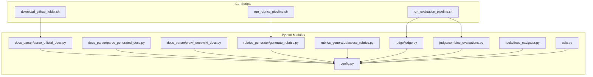
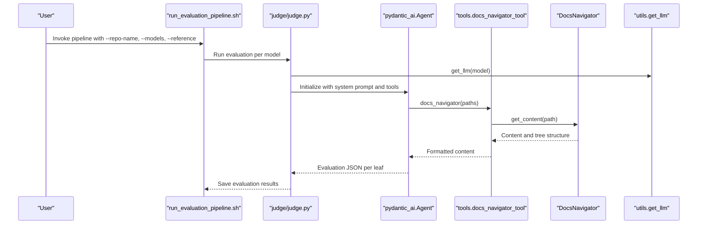
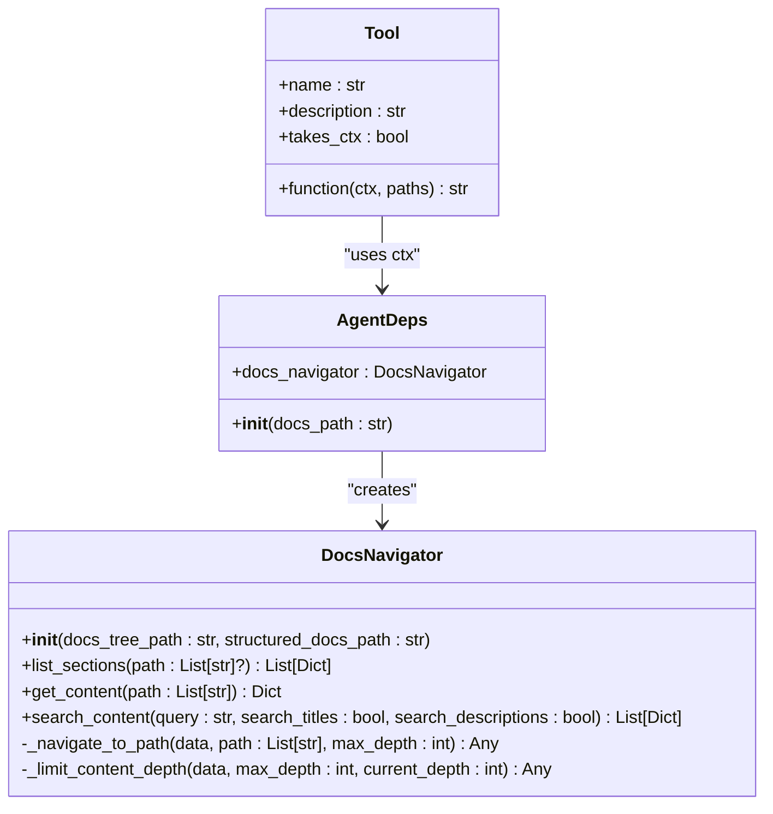
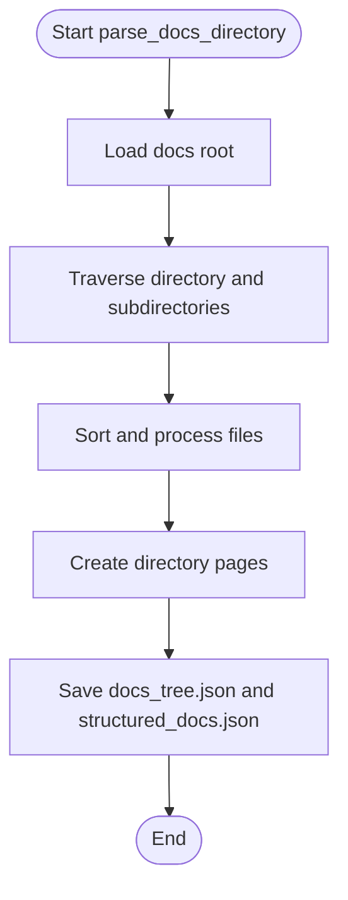
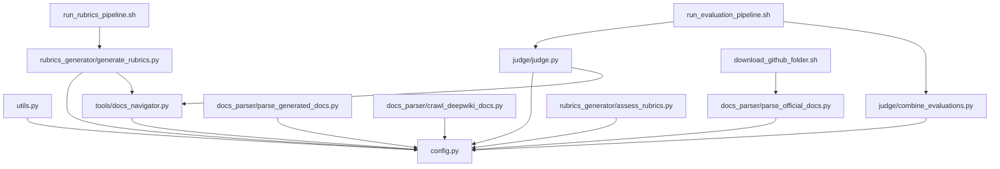

# API Reference

<cite>
**Referenced Files in This Document**
- [README.md](file://README.md)
- [config.py](file://src/config.py)
- [utils.py](file://src/utils.py)
- [tools/__init__.py](file://src/tools/__init__.py)
- [tools/docs_navigator.py](file://src/tools/docs_navigator.py)
- [docs_parser/parse_official_docs.py](file://src/docs_parser/parse_official_docs.py)
- [docs_parser/parse_generated_docs.py](file://src/docs_parser/parse_generated_docs.py)
- [docs_parser/crawl_deepwiki_docs.py](file://src/docs_parser/crawl_deepwiki_docs.py)
- [judge/judge.py](file://src/judge/judge.py)
- [judge/combine_evaluations.py](file://src/judge/combine_evaluations.py)
- [rubrics_generator/generate_rubrics.py](file://src/rubrics_generator/generate_rubrics.py)
- [rubrics_generator/assess_rubrics.py](file://src/rubrics_generator/assess_rubrics.py)
- [run_evaluation_pipeline.sh](file://src/run_evaluation_pipeline.sh)
- [run_rubrics_pipeline.sh](file://src/run_rubrics_pipeline.sh)
- [download_github_folder.sh](file://src/download_github_folder.sh)
</cite>

## Table of Contents
1. [Introduction](#introduction)
2. [Project Structure](#project-structure)
3. [Core Components](#core-components)
4. [Architecture Overview](#architecture-overview)
5. [Detailed Component Analysis](#detailed-component-analysis)
6. [Dependency Analysis](#dependency-analysis)
7. [Performance Considerations](#performance-considerations)
8. [Troubleshooting Guide](#troubleshooting-guide)
9. [Conclusion](#conclusion)
10. [Appendices](#appendices)

## Introduction
This API reference documents the public interfaces of CodeWikiBench, covering:
- Python modules and their functions, parameters, return values, exceptions, and usage
- Command-line interfaces for shell scripts and their arguments
- Data models and schemas for documentation trees, rubrics, and evaluation results
- Parameter validation rules, types, defaults, and environment configuration
- API versioning, backward compatibility, and migration guidance
- Integration interfaces, webhooks, and external system connections with authentication and security considerations

## Project Structure
The repository organizes functionality into modules for parsing documentation, generating rubrics, evaluating documentation quality, and orchestration via shell scripts. Configuration and shared utilities are centralized.

**Diagram sources**
- [download_github_folder.sh](file://src/download_github_folder.sh#L1-L155)
- [run_rubrics_pipeline.sh](file://src/run_rubrics_pipeline.sh#L1-L320)
- [run_evaluation_pipeline.sh](file://src/run_evaluation_pipeline.sh#L1-L331)
- [config.py](file://src/config.py#L1-L32)
- [utils.py](file://src/utils.py#L1-L86)
- [tools/docs_navigator.py](file://src/tools/docs_navigator.py#L1-L345)
- [docs_parser/parse_official_docs.py](file://src/docs_parser/parse_official_docs.py#L1-L367)
- [docs_parser/parse_generated_docs.py](file://src/docs_parser/parse_generated_docs.py#L1-L323)
- [docs_parser/crawl_deepwiki_docs.py](file://src/docs_parser/crawl_deepwiki_docs.py#L1-L335)
- [rubrics_generator/generate_rubrics.py](file://src/rubrics_generator/generate_rubrics.py#L1-L257)
- [rubrics_generator/assess_rubrics.py](file://src/rubrics_generator/assess_rubrics.py#L1-L308)
- [judge/judge.py](file://src/judge/judge.py#L1-L551)
- [judge/combine_evaluations.py](file://src/judge/combine_evaluations.py#L1-L375)

**Section sources**
- [README.md](file://README.md#L1-L136)
- [config.py](file://src/config.py#L1-L32)

## Core Components
This section summarizes the primary Python modules and their public interfaces.

- Configuration and Environment
  - Purpose: Centralized configuration, environment variables, and path helpers
  - Key exports: MODEL, BASE_URL, API_KEY, EMBEDDING_MODEL, MAX_TOKENS_PER_TOOL_RESPONSE, get_project_path(), get_data_path()
  - Defaults and behavior: Falls back to safe defaults if environment variables are not set
  - Validation: No runtime validation; relies on environment configuration

- Utilities
  - Purpose: LLM initialization, native async LLM calls, embeddings, and token truncation
  - Key functions:
    - get_llm(model: str = None) -> OpenAIChatModel
    - run_llm_natively(model: str = None, prompt: str = None, messages: list[dict] = None) -> str
    - get_embeddings(texts: list[str]) -> list[list[float]]
    - truncate_tokens(text: str) -> str

- Tools
  - Purpose: Documentation navigation tooling for agents
  - Public exports: AgentDeps, docs_navigator_tool
  - Tool function: run_docs_navigator(ctx, paths: List[List[Any]]) -> str
  - Data access: DocsNavigator with methods list_sections(), get_content(), search_content(), and internal navigation helpers

- Parser Modules
  - Official docs parser: parse_official_docs.py
    - Classes: DocPage (Pydantic model)
    - Functions: parse_docs_directory(path, project_name, output_dir) -> (DocPage, Dict)
    - CLI: ArgumentParser with --repo_name
  - Generated docs parser: parse_generated_docs.py
    - Classes: DocPage (Pydantic model)
    - Functions: parse_deepwiki(path, project_name, output_dir) -> (DocPage, Dict)
    - CLI: ArgumentParser with --input-dir, --output-dir
  - DeepWiki crawler: crawl_deepwiki_docs.py
    - Classes: MCPClient, GitHubRepoProcessor
    - Functions: pull_content_and_save(url, output_dir)
    - CLI: ArgumentParser with --url, --output-dir

- Judge Modules
  - Evaluation runner: judge.py
    - Functions: evaluate_leaf_requirements(), re_evaluate_error_leaves(), calculate_scores_bottom_up(), run(args)
    - CLI: ArgumentParser with --repo-name, --reference, --use-tools, --model, --rubrics-file, --batch-size, --enable-retry, --max-retries
  - Evaluation combiner: combine_evaluations.py
    - Functions: combine_leaf_evaluations(), calculate_scores_bottom_up(), load_evaluation_files(), main()
    - CLI: ArgumentParser with --repo-name, --reference, --output-file, --method, --weights, --confidence-threshold

- Rubrics Generator
  - Rubrics generator: generate_rubrics.py
    - Functions: run(args)
    - CLI: ArgumentParser with --repo-name, --use-tools, --model
  - Rubrics reliability assessor: assess_rubrics.py
    - Classes: RubricReliabilityAssessor
    - Functions: assess_reliability(), _assess_inter_model_consistency(), _calculate_semantic_similarity(), _calculate_structural_similarity(), _calculate_overall_score()

- Shell Scripts
  - download_github_folder.sh: Downloads a folder from a GitHub repository using sparse-checkout
  - run_rubrics_pipeline.sh: Orchestrates rubrics generation and combination
  - run_evaluation_pipeline.sh: Orchestrates evaluation, combination, and optional visualization

**Section sources**
- [config.py](file://src/config.py#L1-L32)
- [utils.py](file://src/utils.py#L1-L86)
- [tools/__init__.py](file://src/tools/__init__.py#L1-L3)
- [tools/docs_navigator.py](file://src/tools/docs_navigator.py#L1-L345)
- [docs_parser/parse_official_docs.py](file://src/docs_parser/parse_official_docs.py#L1-L367)
- [docs_parser/parse_generated_docs.py](file://src/docs_parser/parse_generated_docs.py#L1-L323)
- [docs_parser/crawl_deepwiki_docs.py](file://src/docs_parser/crawl_deepwiki_docs.py#L1-L335)
- [judge/judge.py](file://src/judge/judge.py#L1-L551)
- [judge/combine_evaluations.py](file://src/judge/combine_evaluations.py#L1-L375)
- [rubrics_generator/generate_rubrics.py](file://src/rubrics_generator/generate_rubrics.py#L1-L257)
- [rubrics_generator/assess_rubrics.py](file://src/rubrics_generator/assess_rubrics.py#L1-L308)
- [run_rubrics_pipeline.sh](file://src/run_rubrics_pipeline.sh#L1-L320)
- [run_evaluation_pipeline.sh](file://src/run_evaluation_pipeline.sh#L1-L331)
- [download_github_folder.sh](file://src/download_github_folder.sh#L1-L155)

## Architecture Overview
The system integrates parsers, rubrics generation, evaluation, and visualization through a layered architecture. Agents use tools to navigate documentation trees and evaluate rubrics hierarchies.

**Diagram sources**
- [run_evaluation_pipeline.sh](file://src/run_evaluation_pipeline.sh#L196-L242)
- [judge/judge.py](file://src/judge/judge.py#L477-L491)
- [tools/docs_navigator.py](file://src/tools/docs_navigator.py#L261-L277)
- [utils.py](file://src/utils.py#L28-L46)

## Detailed Component Analysis

### Configuration and Environment (config.py)
- Purpose: Provide environment-driven configuration and path utilities
- Exports:
  - API_KEY, MODEL, EMBEDDING_MODEL, BASE_URL
  - get_project_path(*paths), get_data_path(*paths)
- Defaults:
  - API_KEY defaults to a placeholder value
  - MODEL defaults to a specific model identifier
  - EMBEDDING_MODEL defaults to a known embedding model
  - BASE_URL defaults to a localhost endpoint
- Behavior:
  - Loads environment variables via python-dotenv
  - Provides path helpers for project root and data directories
- Validation:
  - No explicit validation; consumers should validate inputs downstream

**Section sources**
- [config.py](file://src/config.py#L1-L32)

### Utilities (utils.py)
- Purpose: Shared LLM and embedding utilities
- Functions:
  - get_llm(model: str = None) -> OpenAIChatModel
    - Parameters: model (optional)
    - Returns: Initialized OpenAIChatModel configured with provider and settings
    - Settings: temperature=0.0, max_tokens=36000, timeout=300
  - run_llm_natively(model: str = None, prompt: str = None, messages: list[dict] = None) -> str
    - Parameters: model, prompt, messages
    - Returns: Text content from chat completion
  - get_embeddings(texts: list[str]) -> list[list[float]]
    - Parameters: texts
    - Returns: Embedding vectors
  - truncate_tokens(text: str) -> str
    - Parameters: text
    - Returns: Truncated text respecting MAX_TOKENS_PER_TOOL_RESPONSE

**Section sources**
- [utils.py](file://src/utils.py#L28-L82)

### Tools: DocsNavigator and Navigation Tool (tools/docs_navigator.py)
- Purpose: Provide navigation and retrieval over structured documentation trees
- Classes:
  - DocsNavigator
    - Methods:
      - list_sections(path: Optional[List[str]] = None) -> List[Dict[str, str]]
      - get_content(path: List[str]) -> Dict[str, Any]
      - search_content(query: str, search_titles: bool = True, search_descriptions: bool = True) -> List[Dict[str, Any]]
      - Internal: _navigate_to_path(), _limit_content_depth()
  - AgentDeps
    - Constructor validates presence of docs_tree.json and structured_docs.json
- Tool:
  - docs_navigator_tool: Tool with name "docs_navigator", description, function run_docs_navigator, takes_ctx=True
- Exceptions:
  - FileNotFoundError raised when required JSON files are missing
  - ValueError raised on invalid JSON decoding
  - KeyError/IndexError raised on invalid navigation paths

**Diagram sources**
- [tools/docs_navigator.py](file://src/tools/docs_navigator.py#L11-L345)

**Section sources**
- [tools/docs_navigator.py](file://src/tools/docs_navigator.py#L11-L345)

### Parser: Official Documentation (docs_parser/parse_official_docs.py)
- Purpose: Parse official markdown documentation into structured trees
- Classes:
  - DocPage (Pydantic model) with fields: title, description, content, metadata, subpages
- Functions:
  - parse_docs_directory(path, project_name, output_dir) -> (DocPage, Dict)
  - generate_detailed_keys_tree(obj, path=None)
  - parse_markdown_file(file_path, docs_root) -> DocPage
  - replace_svg_references(content, docs_root) -> str
  - parse_frontmatter(content) -> (Dict, str)
- CLI:
  - ArgumentParser with --repo_name

**Diagram sources**
- [docs_parser/parse_official_docs.py](file://src/docs_parser/parse_official_docs.py#L230-L327)

**Section sources**
- [docs_parser/parse_official_docs.py](file://src/docs_parser/parse_official_docs.py#L1-L367)

### Parser: Generated Documentation (docs_parser/parse_generated_docs.py)
- Purpose: Parse generated documentation (DeepWiki-style) into structured trees
- Classes:
  - DocPage (Pydantic model) with fields: title, description, content, metadata, subpages
- Functions:
  - parse_deepwiki(path, project_name, output_dir) -> (DocPage, Dict)
  - process_markdown_file(file_path, title_index) -> (str, Dict[str, Any], list)
  - generate_detailed_keys_tree(obj, path=None)
- CLI:
  - ArgumentParser with --input-dir, --output-dir

**Section sources**
- [docs_parser/parse_generated_docs.py](file://src/docs_parser/parse_generated_docs.py#L1-L323)

### Parser: DeepWiki Crawler (docs_parser/crawl_deepwiki_docs.py)
- Purpose: Pull DeepWiki content via MCP and save as markdown files
- Classes:
  - MCPClient: Manages SSE connection, tool registration, and tool calls
  - GitHubRepoProcessor: Validates GitHub URLs and extracts repo info
- Functions:
  - pull_content_and_save(url, output_dir)
- CLI:
  - ArgumentParser with --url, --output-dir

**Section sources**
- [docs_parser/crawl_deepwiki_docs.py](file://src/docs_parser/crawl_deepwiki_docs.py#L1-L335)

### Judge: Evaluation Runner (judge/judge.py)
- Purpose: Evaluate documentation against rubrics using an agent with optional tools
- Functions:
  - evaluate_leaf_requirements(leaf_requirements, docs_tree, agent, deps, batch_size, enable_retry, max_retries, model, system_prompt) -> Dict
  - re_evaluate_error_leaves(leaf_requirements, docs_tree, agent, deps, initial_evaluations, max_retries, model, system_prompt) -> Dict
  - calculate_scores_bottom_up(rubrics, leaf_evaluations) -> scored_rubrics
  - run(args)
- CLI:
  - ArgumentParser with --repo-name, --reference, --use-tools, --model, --rubrics-file, --batch-size, --enable-retry, --max-retries

**Section sources**
- [judge/judge.py](file://src/judge/judge.py#L21-L544)

### Judge: Evaluation Combiner (judge/combine_evaluations.py)
- Purpose: Combine multiple evaluation results using various aggregation methods
- Functions:
  - combine_leaf_evaluations(all_leaf_evaluations, method, weights) -> Dict
  - calculate_scores_bottom_up(rubrics, leaf_evaluations) -> scored_rubrics
  - load_evaluation_files(repo_name, reference) -> List[Dict]
  - main()
- CLI:
  - ArgumentParser with --repo-name, --reference, --output-file, --method, --weights, --confidence-threshold

**Section sources**
- [judge/combine_evaluations.py](file://src/judge/combine_evaluations.py#L12-L374)

### Rubrics Generator (rubrics_generator/generate_rubrics.py)
- Purpose: Generate hierarchical rubrics from documentation trees
- Functions:
  - run(args)
- CLI:
  - ArgumentParser with --repo-name, --use-tools, --model

**Section sources**
- [rubrics_generator/generate_rubrics.py](file://src/rubrics_generator/generate_rubrics.py#L14-L254)

### Rubrics Reliability Assessor (rubrics_generator/assess_rubrics.py)
- Purpose: Assess inter-model consistency and structural similarity of rubrics
- Classes:
  - RubricReliabilityAssessor
    - Methods: assess_reliability(), _assess_inter_model_consistency(), _calculate_semantic_similarity(), _calculate_structural_similarity(), _calculate_overall_score()
- CLI:
  - ArgumentParser with --repo-name, --rubrics-file

**Section sources**
- [rubrics_generator/assess_rubrics.py](file://src/rubrics_generator/assess_rubrics.py#L14-L307)

### Shell Scripts
- download_github_folder.sh
  - Purpose: Sparse-checkout and download a folder from a GitHub repository
  - Arguments: --github_repo_url, --folder_path, --commit_id
  - Behavior: Initializes git repo, enables sparse-checkout, pulls content, and validates folder presence
- run_rubrics_pipeline.sh
  - Purpose: Orchestrates rubrics generation and combination
  - Arguments: --repo-name, --models, --temperature, --max-retries, --skip-generation, --skip-combination, --no-tools, --visualize
  - Behavior: Iterates models, invokes generate_rubrics.py, then combine_rubrics.py, optionally visualizes
- run_evaluation_pipeline.sh
  - Purpose: Orchestrates evaluation, combination, and optional visualization
  - Arguments: --repo-name, --reference, --models, --batch-size, --combination-method, --weights, --skip-evaluation, --skip-combination, --no-tools, --no-retry, --max-retries, --visualize
  - Behavior: Iterates models, invokes judge/judge.py, then combine_evaluations.py, optionally visualizes

**Section sources**
- [download_github_folder.sh](file://src/download_github_folder.sh#L1-L155)
- [run_rubrics_pipeline.sh](file://src/run_rubrics_pipeline.sh#L1-L320)
- [run_evaluation_pipeline.sh](file://src/run_evaluation_pipeline.sh#L1-L331)

## Dependency Analysis
This section maps dependencies among modules and highlights coupling and cohesion.

**Diagram sources**
- [config.py](file://src/config.py#L1-L32)
- [utils.py](file://src/utils.py#L1-L86)
- [tools/docs_navigator.py](file://src/tools/docs_navigator.py#L1-L345)
- [docs_parser/parse_official_docs.py](file://src/docs_parser/parse_official_docs.py#L1-L367)
- [docs_parser/parse_generated_docs.py](file://src/docs_parser/parse_generated_docs.py#L1-L323)
- [docs_parser/crawl_deepwiki_docs.py](file://src/docs_parser/crawl_deepwiki_docs.py#L1-L335)
- [judge/judge.py](file://src/judge/judge.py#L1-L551)
- [judge/combine_evaluations.py](file://src/judge/combine_evaluations.py#L1-L375)
- [rubrics_generator/generate_rubrics.py](file://src/rubrics_generator/generate_rubrics.py#L1-L257)
- [rubrics_generator/assess_rubrics.py](file://src/rubrics_generator/assess_rubrics.py#L1-L308)
- [download_github_folder.sh](file://src/download_github_folder.sh#L1-L155)
- [run_rubrics_pipeline.sh](file://src/run_rubrics_pipeline.sh#L1-L320)
- [run_evaluation_pipeline.sh](file://src/run_evaluation_pipeline.sh#L1-L331)

**Section sources**
- [config.py](file://src/config.py#L1-L32)
- [utils.py](file://src/utils.py#L1-L86)
- [tools/docs_navigator.py](file://src/tools/docs_navigator.py#L1-L345)
- [judge/judge.py](file://src/judge/judge.py#L1-L551)
- [judge/combine_evaluations.py](file://src/judge/combine_evaluations.py#L1-L375)
- [rubrics_generator/generate_rubrics.py](file://src/rubrics_generator/generate_rubrics.py#L1-L257)
- [rubrics_generator/assess_rubrics.py](file://src/rubrics_generator/assess_rubrics.py#L1-L308)
- [docs_parser/parse_official_docs.py](file://src/docs_parser/parse_official_docs.py#L1-L367)
- [docs_parser/parse_generated_docs.py](file://src/docs_parser/parse_generated_docs.py#L1-L323)
- [docs_parser/crawl_deepwiki_docs.py](file://src/docs_parser/crawl_deepwiki_docs.py#L1-L335)
- [download_github_folder.sh](file://src/download_github_folder.sh#L1-L155)
- [run_rubrics_pipeline.sh](file://src/run_rubrics_pipeline.sh#L1-L320)
- [run_evaluation_pipeline.sh](file://src/run_evaluation_pipeline.sh#L1-L331)

## Performance Considerations
- Token limits: Responses are truncated to respect MAX_TOKENS_PER_TOOL_RESPONSE to prevent oversized outputs.
- Batch processing: Evaluation supports batching to reduce overhead and respect API rate limits.
- Retry logic: Automatic retries with backoff for error cases to improve robustness.
- Embeddings: Semantic similarity assessments leverage vector embeddings; consider caching and batching for repeated computations.
- Parallelism: Pipelines iterate models sequentially; consider parallelization at the script level for multiple models.

[No sources needed since this section provides general guidance]

## Troubleshooting Guide
- Missing environment variables:
  - Symptom: Unexpected defaults or connection failures
  - Resolution: Set API_KEY, MODEL, EMBEDDING_MODEL, BASE_URL appropriately
- Missing documentation files:
  - Symptom: FileNotFoundError when initializing DocsNavigator
  - Resolution: Ensure docs_tree.json and structured_docs.json exist in the specified path
- JSON decode errors:
  - Symptom: ValueError during parsing
  - Resolution: Verify JSON validity and encoding
- Rate limiting:
  - Symptom: 429 errors or timeouts
  - Resolution: Increase delays between batches or reduce concurrency
- Pipeline prerequisites:
  - Symptom: Errors indicating missing docs_tree.json
  - Resolution: Run parsing steps before evaluation or rubrics generation

**Section sources**
- [tools/docs_navigator.py](file://src/tools/docs_navigator.py#L39-L42)
- [judge/judge.py](file://src/judge/judge.py#L322-L326)
- [run_evaluation_pipeline.sh](file://src/run_evaluation_pipeline.sh#L179-L185)
- [run_rubrics_pipeline.sh](file://src/run_rubrics_pipeline.sh#L152-L158)

## Conclusion
This API reference documents the public interfaces of CodeWikiBench, including Python modules, command-line tools, and data schemas. It provides parameter specifications, return types, exceptions, and usage guidance. The system’s architecture emphasizes modular components, tool-based navigation, and reproducible pipelines for documentation parsing, rubrics generation, and evaluation.

[No sources needed since this section summarizes without analyzing specific files]

## Appendices

### Data Models and Schemas
- Documentation Tree (docs_tree.json)
  - Structure: Hierarchical tree with sections and content references
  - Fields: title, description, content (structured), subpages (list), metadata (dict)
  - Notes: Keys are pruned to indicate content presence; primitive values are represented as placeholders
- Structured Docs (structured_docs.json)
  - Structure: Full parsed documentation tree with DocPage instances
  - Fields: title, description, content (dict/list/primitive), metadata, subpages
- Rubrics
  - Structure: Nested list with name, description, weight, and optional children/sub_tasks
  - Leaf rubrics include reference paths; parent rubrics aggregate weighted averages
- Evaluation Results
  - Structure: Hierarchical rubrics with computed scores and standard deviations
  - Fields: score, std, evaluation metadata, tokens usage, retry counts

**Section sources**
- [docs_parser/parse_official_docs.py](file://src/docs_parser/parse_official_docs.py#L38-L91)
- [docs_parser/parse_generated_docs.py](file://src/docs_parser/parse_generated_docs.py#L26-L87)
- [judge/judge.py](file://src/judge/judge.py#L386-L432)
- [judge/combine_evaluations.py](file://src/judge/combine_evaluations.py#L178-L214)

### Parameter Validation Rules and Defaults
- Configuration
  - API_KEY: Defaults to a placeholder if unset
  - MODEL: Defaults to a specific model identifier if unset
  - EMBEDDING_MODEL: Defaults to a known embedding model if unset
  - BASE_URL: Defaults to a localhost endpoint if unset
- Utilities
  - get_llm(): Uses MODEL from config if not provided
  - truncate_tokens(): Enforces MAX_TOKENS_PER_TOOL_RESPONSE
- CLI Defaults
  - run_rubrics_pipeline.sh: DEFAULT_MODELS, DEFAULT_USE_TOOLS, DEFAULT_TEMPERATURE, DEFAULT_MAX_RETRIES
  - run_evaluation_pipeline.sh: DEFAULT_REPO_NAME, DEFAULT_REFERENCE, DEFAULT_MODELS, DEFAULT_BATCH_SIZE, DEFAULT_COMBINATION_METHOD, DEFAULT_USE_TOOLS, DEFAULT_ENABLE_RETRY, DEFAULT_MAX_RETRIES

**Section sources**
- [config.py](file://src/config.py#L14-L17)
- [utils.py](file://src/utils.py#L28-L46)
- [run_rubrics_pipeline.sh](file://src/run_rubrics_pipeline.sh#L18-L24)
- [run_evaluation_pipeline.sh](file://src/run_evaluation_pipeline.sh#L18-L27)

### API Versioning, Backward Compatibility, and Migration
- Versioning: No explicit version markers were identified in the codebase
- Backward compatibility: CLI argument names and behaviors appear stable; ensure scripts remain compatible with future updates
- Migration guidance:
  - Maintain consistent directory layouts for data and rubrics
  - Preserve docs_tree.json and structured_docs.json formats for evaluation pipelines
  - Keep rubrics JSON structure aligned with expected nested format for scoring

[No sources needed since this section provides general guidance]

### Integration Interfaces, Webhooks, and External Systems
- External systems:
  - LLM providers via OpenAI-compatible clients (AsyncOpenAI)
  - MCP server for DeepWiki content retrieval
- Authentication:
  - API_KEY environment variable supplies credentials for LLM providers
  - BASE_URL configures provider endpoints
- Security considerations:
  - Store API keys securely and avoid committing secrets
  - Validate and sanitize inputs for CLI and parsers
  - Limit content depth and apply truncation to mitigate oversized payloads

**Section sources**
- [utils.py](file://src/utils.py#L48-L62)
- [docs_parser/crawl_deepwiki_docs.py](file://src/docs_parser/crawl_deepwiki_docs.py#L291-L316)
- [config.py](file://src/config.py#L14-L17)