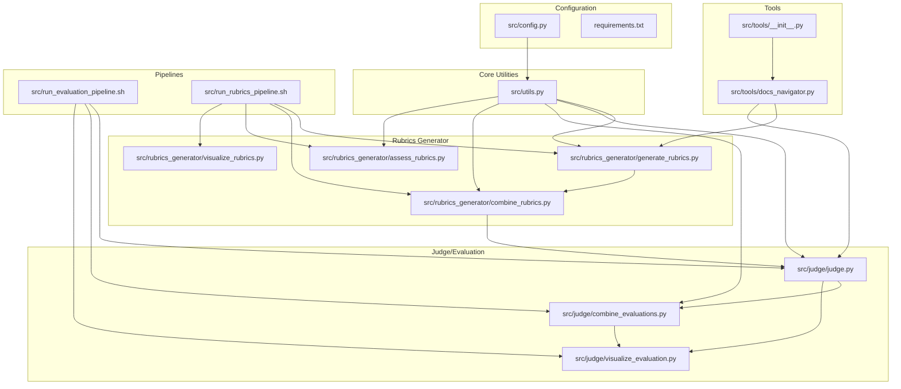
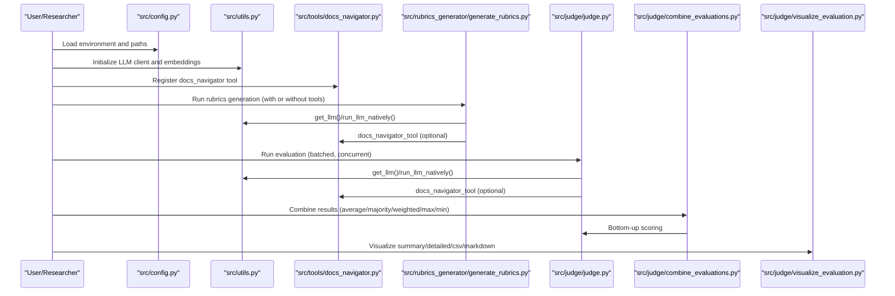
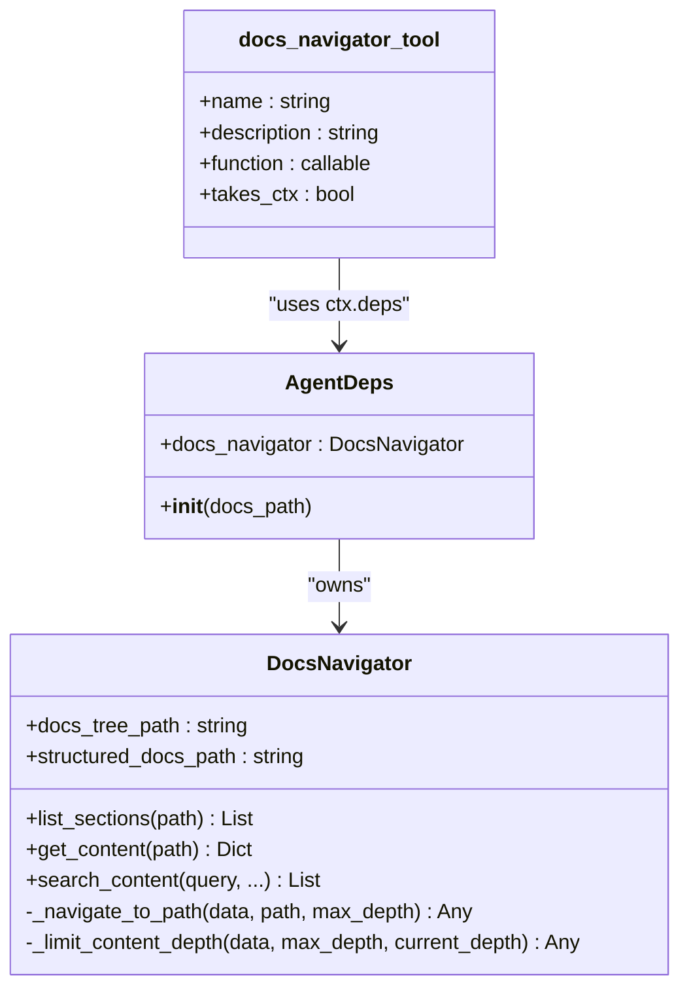
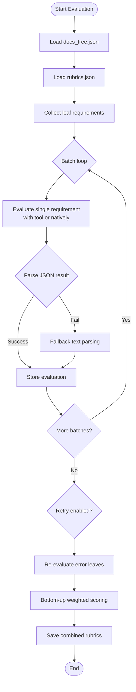
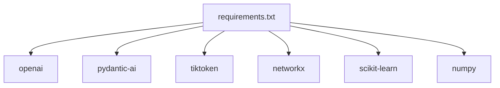

# Advanced Usage and Integration

<cite>
**Referenced Files in This Document**
- [README.md](file://README.md)
- [requirements.txt](file://requirements.txt)
- [src/config.py](file://src/config.py)
- [src/utils.py](file://src/utils.py)
- [src/tools/__init__.py](file://src/tools/__init__.py)
- [src/tools/docs_navigator.py](file://src/tools/docs_navigator.py)
- [src/rubrics_generator/generate_rubrics.py](file://src/rubrics_generator/generate_rubrics.py)
- [src/rubrics_generator/combine_rubrics.py](file://src/rubrics_generator/combine_rubrics.py)
- [src/rubrics_generator/assess_rubrics.py](file://src/rubrics_generator/assess_rubrics.py)
- [src/rubrics_generator/visualize_rubrics.py](file://src/rubrics_generator/visualize_rubrics.py)
- [src/judge/judge.py](file://src/judge/judge.py)
- [src/judge/combine_evaluations.py](file://src/judge/combine_evaluations.py)
- [src/judge/visualize_evaluation.py](file://src/judge/visualize_evaluation.py)
- [src/run_evaluation_pipeline.sh](file://src/run_evaluation_pipeline.sh)
- [src/run_rubrics_pipeline.sh](file://src/run_rubrics_pipeline.sh)
</cite>

## Table of Contents
1. [Introduction](#introduction)
2. [Project Structure](#project-structure)
3. [Core Components](#core-components)
4. [Architecture Overview](#architecture-overview)
5. [Detailed Component Analysis](#detailed-component-analysis)
6. [Dependency Analysis](#dependency-analysis)
7. [Performance Considerations](#performance-considerations)
8. [Troubleshooting Guide](#troubleshooting-guide)
9. [Conclusion](#conclusion)
10. [Appendices](#appendices)

## Introduction
This document provides advanced usage and integration guidance for CodeWikiBench, focusing on programmatic API usage, custom evaluation methods, and integration with external research workflows. It explains Python module APIs for programmatic access, custom evaluation pipelines, and extension mechanisms for new evaluation methods. It also documents advanced configuration options, custom tool development, and integration patterns with research frameworks, CI/CD pipelines, and automated evaluation systems. Practical examples illustrate plugin development, system extension, performance optimization, memory management, and scalability considerations for large-scale deployments.

## Project Structure
CodeWikiBench is organized around modular pipelines for rubrics generation and documentation evaluation, with shared configuration, utilities, and tools. The repository includes:
- src/config.py: Centralized configuration and path helpers
- src/utils.py: LLM initialization, async completions, embeddings, and token truncation
- src/tools/: Navigation tooling for documentation trees and structured docs
- src/rubrics_generator/: Rubrics generation, combination, assessment, and visualization
- src/judge/: Evaluation orchestration, batch processing, retry logic, and visualization
- Shell scripts for end-to-end pipelines
- Examples under examples/ demonstrating real-world usage

**Diagram sources**
- [src/config.py](file://src/config.py#L1-L32)
- [src/utils.py](file://src/utils.py#L1-L86)
- [src/tools/__init__.py](file://src/tools/__init__.py#L1-L3)
- [src/tools/docs_navigator.py](file://src/tools/docs_navigator.py#L1-L345)
- [src/rubrics_generator/generate_rubrics.py](file://src/rubrics_generator/generate_rubrics.py#L1-L257)
- [src/rubrics_generator/combine_rubrics.py](file://src/rubrics_generator/combine_rubrics.py#L1-L306)
- [src/rubrics_generator/assess_rubrics.py](file://src/rubrics_generator/assess_rubrics.py#L1-L308)
- [src/rubrics_generator/visualize_rubrics.py](file://src/rubrics_generator/visualize_rubrics.py#L1-L168)
- [src/judge/judge.py](file://src/judge/judge.py#L1-L551)
- [src/judge/combine_evaluations.py](file://src/judge/combine_evaluations.py#L1-L375)
- [src/judge/visualize_evaluation.py](file://src/judge/visualize_evaluation.py#L1-L250)
- [src/run_evaluation_pipeline.sh](file://src/run_evaluation_pipeline.sh#L1-L331)
- [src/run_rubrics_pipeline.sh](file://src/run_rubrics_pipeline.sh#L1-L320)

**Section sources**
- [README.md](file://README.md#L1-L136)
- [requirements.txt](file://requirements.txt#L1-L107)

## Core Components
- Configuration and Paths: Centralized environment variables and path helpers for project and data directories
- LLM Utilities: Async LLM clients, chat completions, embeddings, and token truncation
- Docs Navigator Tool: Structured navigation and content retrieval from documentation trees
- Rubrics Generation: Hierarchical rubrics creation via LLM agents with optional tool usage
- Rubrics Combination and Assessment: Semantic combination and reliability assessment of rubrics
- Evaluation Engine: Batched, concurrent evaluation with retry logic and bottom-up scoring
- Result Combination and Visualization: Aggregation of multiple model results and export formats
- Pipelines: End-to-end shell scripts orchestrating generation, evaluation, combination, and visualization

**Section sources**
- [src/config.py](file://src/config.py#L1-L32)
- [src/utils.py](file://src/utils.py#L1-L86)
- [src/tools/docs_navigator.py](file://src/tools/docs_navigator.py#L1-L345)
- [src/rubrics_generator/generate_rubrics.py](file://src/rubrics_generator/generate_rubrics.py#L1-L257)
- [src/rubrics_generator/combine_rubrics.py](file://src/rubrics_generator/combine_rubrics.py#L1-L306)
- [src/rubrics_generator/assess_rubrics.py](file://src/rubrics_generator/assess_rubrics.py#L1-L308)
- [src/judge/judge.py](file://src/judge/judge.py#L1-L551)
- [src/judge/combine_evaluations.py](file://src/judge/combine_evaluations.py#L1-L375)
- [src/judge/visualize_evaluation.py](file://src/judge/visualize_evaluation.py#L1-L250)
- [src/run_evaluation_pipeline.sh](file://src/run_evaluation_pipeline.sh#L1-L331)
- [src/run_rubrics_pipeline.sh](file://src/run_rubrics_pipeline.sh#L1-L320)

## Architecture Overview
The system is built around:
- Shared configuration and utilities
- Tools enabling agents to navigate documentation
- LLM agents driving rubrics generation and evaluation
- Pipelines orchestrating multi-model workflows
- Visualization and export utilities

**Diagram sources**
- [src/config.py](file://src/config.py#L1-L32)
- [src/utils.py](file://src/utils.py#L1-L86)
- [src/tools/docs_navigator.py](file://src/tools/docs_navigator.py#L1-L345)
- [src/rubrics_generator/generate_rubrics.py](file://src/rubrics_generator/generate_rubrics.py#L1-L257)
- [src/judge/judge.py](file://src/judge/judge.py#L1-L551)
- [src/judge/combine_evaluations.py](file://src/judge/combine_evaluations.py#L1-L375)
- [src/judge/visualize_evaluation.py](file://src/judge/visualize_evaluation.py#L1-L250)

## Detailed Component Analysis

### Configuration and Environment
- Centralized environment variables for API keys, model selection, base URLs, and token limits
- Path helpers for project root and data directories
- Recommended environment variables include API_KEY, MODEL, EMBEDDING_MODEL, BASE_URL

Best practices:
- Set environment variables before running pipelines
- Use BASE_URL to target local or hosted LLM providers
- Tune MAX_TOKENS_PER_TOOL_RESPONSE to balance context size and cost

**Section sources**
- [src/config.py](file://src/config.py#L1-L32)

### LLM Utilities and Embeddings
- Async LLM initialization with configurable model, temperature, max tokens, and timeouts
- Native async chat completions for fallback or direct prompts
- Embedding generation for semantic similarity and rubric assessment
- Token truncation to prevent oversized requests

Integration tips:
- Use get_llm() for agent-based workflows
- Use run_llm_natively() for quick prompts without agents
- Use get_embeddings() for semantic operations

**Section sources**
- [src/utils.py](file://src/utils.py#L1-L86)

### Docs Navigator Tool
- Provides navigation over structured documentation trees and content retrieval
- Supports listing sections, retrieving content by path, and searching content
- Includes depth-limited content projection to manage token budgets
- Exposes a Tool-compatible function for agent integration

Extensibility:
- Extend search_content() to add domain-specific filters
- Add content preprocessing hooks for richer context windows
- Integrate with external parsers to enrich structured_docs

**Diagram sources**
- [src/tools/docs_navigator.py](file://src/tools/docs_navigator.py#L1-L345)

**Section sources**
- [src/tools/docs_navigator.py](file://src/tools/docs_navigator.py#L1-L345)
- [src/tools/__init__.py](file://src/tools/__init__.py#L1-L3)

### Rubrics Generation
- Hierarchical rubrics generation via LLM agents
- Two modes: with tools (navigation) and without tools (pure JSON parsing)
- Robust JSON extraction and fallback handling
- Optional visualization post-generation

Customization:
- Modify SYSTEM_PROMPT or SYSTEM_PROMPT_WO_TOOLS to tailor rubric structure
- Adjust model selection via CLI or environment
- Enable/disable tools via flags

**Section sources**
- [src/rubrics_generator/generate_rubrics.py](file://src/rubrics_generator/generate_rubrics.py#L1-L257)

### Rubrics Combination and Assessment
- Semantic combination of rubrics from multiple models using LLM prompting
- Fallback merging when LLM calls fail
- Reliability assessment via semantic and structural similarity
- Visualization of rubric trees

Use cases:
- Combine rubrics from multiple providers for robustness
- Assess inter-model consistency and produce an overall reliability score

**Section sources**
- [src/rubrics_generator/combine_rubrics.py](file://src/rubrics_generator/combine_rubrics.py#L1-L306)
- [src/rubrics_generator/assess_rubrics.py](file://src/rubrics_generator/assess_rubrics.py#L1-L308)
- [src/rubrics_generator/visualize_rubrics.py](file://src/rubrics_generator/visualize_rubrics.py#L1-L168)

### Evaluation Engine
- Batched, concurrent evaluation of leaf rubric requirements
- Retry logic for parsing and runtime errors
- Bottom-up weighted scoring aggregation
- Cost estimation and token accounting placeholders

Advanced options:
- Configure batch size for throughput vs. rate-limiting
- Enable retries with max retries for resilience
- Use tools for precise content retrieval

**Diagram sources**
- [src/judge/judge.py](file://src/judge/judge.py#L1-L551)

**Section sources**
- [src/judge/judge.py](file://src/judge/judge.py#L1-L551)

### Result Combination and Visualization
- Combine multiple model results using average, majority vote, weighted average, max, or min
- Propagate standard deviations and metadata for uncertainty quantification
- Export to CSV or Markdown, or print detailed summaries

**Section sources**
- [src/judge/combine_evaluations.py](file://src/judge/combine_evaluations.py#L1-L375)
- [src/judge/visualize_evaluation.py](file://src/judge/visualize_evaluation.py#L1-L250)

### Pipelines
- run_rubrics_pipeline.sh: Orchestrates rubrics generation, combination, and optional visualization
- run_evaluation_pipeline.sh: Orchestrates evaluation, combination, and optional visualization

Operational guidance:
- Use --models to specify multiple LLMs
- Use --combination-method and --weights for result aggregation
- Use --batch-size to tune concurrency and rate limits
- Use --no-tools and --no-retry to adjust behavior

**Section sources**
- [src/run_rubrics_pipeline.sh](file://src/run_rubrics_pipeline.sh#L1-L320)
- [src/run_evaluation_pipeline.sh](file://src/run_evaluation_pipeline.sh#L1-L331)

## Dependency Analysis
External dependencies include LLM SDKs, Pydantic AI, tokenization, and visualization libraries. These are declared in requirements.txt.

**Diagram sources**
- [requirements.txt](file://requirements.txt#L1-L107)

**Section sources**
- [requirements.txt](file://requirements.txt#L1-L107)

## Performance Considerations
- Concurrency and batching: Tune batch_size in evaluation to balance throughput and rate limits
- Token budgeting: Use token truncation and depth-limited content retrieval to stay within context limits
- Retry and resilience: Enable retries with bounded max retries to handle transient failures
- Cost control: Monitor token usage and set timeouts; consider lower temperatures for deterministic prompts
- Scalability: Use multiple models and combination methods to improve robustness; leverage async I/O for LLM calls

[No sources needed since this section provides general guidance]

## Troubleshooting Guide
Common issues and remedies:
- Missing data files: Ensure docs_tree.json and structured_docs.json exist in the expected paths
- Rate limiting: The evaluation engine detects rate limit errors and sleeps; reduce batch size or add delays
- JSON parsing failures: The engine falls back to text parsing; verify prompt formats and tool outputs
- Model availability: Confirm API keys and BASE_URL; verify model names and permissions
- Pipeline prerequisites: Run documentation parsing before rubrics generation and evaluation

**Section sources**
- [src/judge/judge.py](file://src/judge/judge.py#L320-L332)
- [src/judge/judge.py](file://src/judge/judge.py#L308-L316)
- [src/rubrics_generator/generate_rubrics.py](file://src/rubrics_generator/generate_rubrics.py#L236-L250)

## Conclusion
CodeWikiBench offers a flexible, extensible framework for generating and evaluating documentation rubrics at scale. Its modular design enables programmatic integration, custom evaluation methods, and seamless pipeline automation. By leveraging configuration, tools, and utilities, researchers and engineers can adapt the system to diverse workflows, integrate with CI/CD, and achieve scalable, reproducible documentation assessments.

[No sources needed since this section summarizes without analyzing specific files]

## Appendices

### Programmatic API Usage Patterns
- Initialize configuration and utilities
  - Load environment variables and path helpers
  - Initialize LLM clients and embeddings
- Build custom rubrics generation
  - Use generate_rubrics.py as a blueprint for custom prompts and tool usage
- Develop custom evaluation workflows
  - Use judge.py’s batch and retry patterns for robust evaluation
- Combine and visualize results
  - Use combine_evaluations.py and visualize_evaluation.py for reporting

**Section sources**
- [src/config.py](file://src/config.py#L1-L32)
- [src/utils.py](file://src/utils.py#L1-L86)
- [src/rubrics_generator/generate_rubrics.py](file://src/rubrics_generator/generate_rubrics.py#L1-L257)
- [src/judge/judge.py](file://src/judge/judge.py#L1-L551)
- [src/judge/combine_evaluations.py](file://src/judge/combine_evaluations.py#L1-L375)
- [src/judge/visualize_evaluation.py](file://src/judge/visualize_evaluation.py#L1-L250)

### Extending the System
- New evaluation methods
  - Add new evaluation prompts and scoring logic similar to judge.py
  - Integrate custom tools via the tools module
- Custom tool development
  - Follow docs_navigator.py patterns for tool registration and context handling
- Integration with research frameworks
  - Use visualize_evaluation.py outputs for dashboards and reports
  - Export CSV/Markdown for downstream analysis

**Section sources**
- [src/tools/docs_navigator.py](file://src/tools/docs_navigator.py#L1-L345)
- [src/judge/visualize_evaluation.py](file://src/judge/visualize_evaluation.py#L1-L250)

### CI/CD and Automated Systems
- Orchestrate pipelines with shell scripts
  - run_rubrics_pipeline.sh for rubrics workflows
  - run_evaluation_pipeline.sh for evaluation workflows
- Parameterize models, batch sizes, and combination methods
- Automate artifact publishing and reporting

**Section sources**
- [src/run_rubrics_pipeline.sh](file://src/run_rubrics_pipeline.sh#L1-L320)
- [src/run_evaluation_pipeline.sh](file://src/run_evaluation_pipeline.sh#L1-L331)