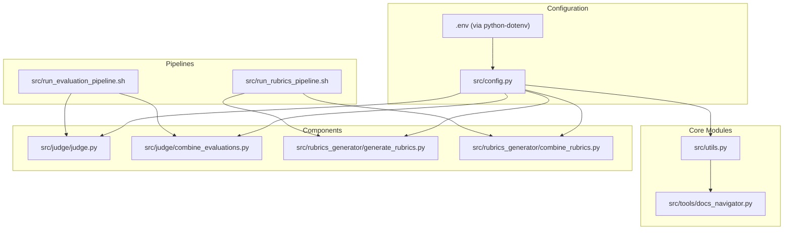
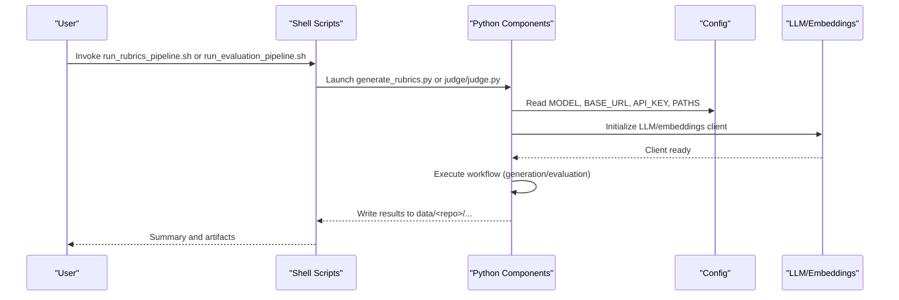
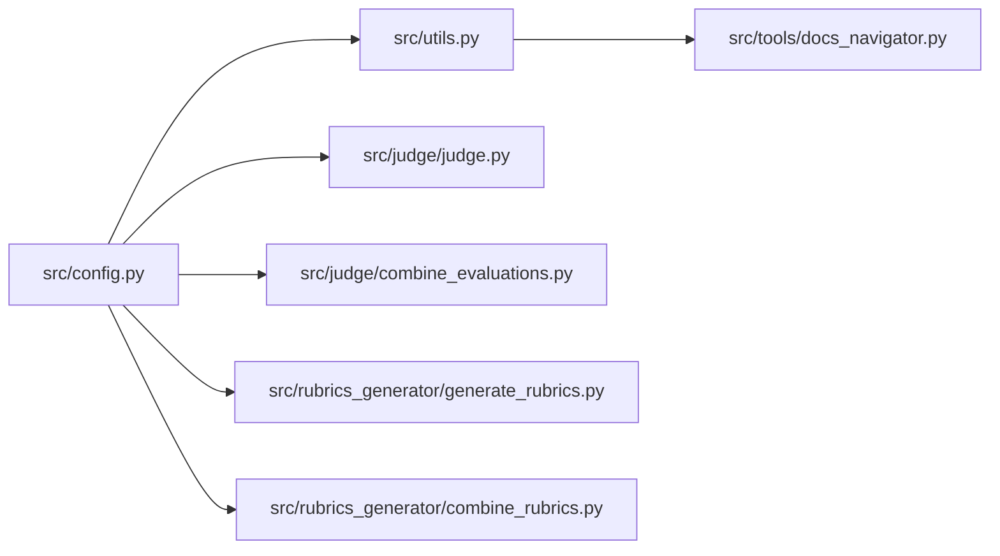

# Configuration and Customization

<cite>
**Referenced Files in This Document**
- [config.py](file://src/config.py)
- [utils.py](file://src/utils.py)
- [run_evaluation_pipeline.sh](file://src/run_evaluation_pipeline.sh)
- [run_rubrics_pipeline.sh](file://src/run_rubrics_pipeline.sh)
- [judge.py](file://src/judge/judge.py)
- [combine_evaluations.py](file://src/judge/combine_evaluations.py)
- [generate_rubrics.py](file://src/rubrics_generator/generate_rubrics.py)
- [combine_rubrics.py](file://src/rubrics_generator/combine_rubrics.py)
- [docs_navigator.py](file://src/tools/docs_navigator.py)
- [download_github_folder.sh](file://src/download_github_folder.sh)
- [README.md](file://README.md)
- [requirements.txt](file://requirements.txt)
</cite>

## Table of Contents
1. [Introduction](#introduction)
2. [Project Structure](#project-structure)
3. [Core Components](#core-components)
4. [Architecture Overview](#architecture-overview)
5. [Detailed Component Analysis](#detailed-component-analysis)
6. [Dependency Analysis](#dependency-analysis)
7. [Performance Considerations](#performance-considerations)
8. [Troubleshooting Guide](#troubleshooting-guide)
9. [Conclusion](#conclusion)
10. [Appendices](#appendices)

## Introduction
This document explains how to configure and customize CodeWikiBench for environment setup, parameter tuning, and workflow customization. It focuses on centralized configuration management via config.py, pipeline customization options, and shell script interfaces for execution. You will learn how environment variables and configuration constants influence model selection, API access, path resolution, token limits, and evaluation/visualization workflows. Practical examples demonstrate how to modify configuration, create custom workflows, integrate external systems, optimize performance, and troubleshoot common configuration issues.

## Project Structure
CodeWikiBench organizes configuration, pipelines, and utilities into focused modules:
- Centralized configuration: src/config.py
- Utilities and LLM/embedding clients: src/utils.py
- Shell pipelines: src/run_evaluation_pipeline.sh, src/run_rubrics_pipeline.sh
- Evaluation and rubrics generation: src/judge/, src/rubrics_generator/
- Tools and navigation: src/tools/docs_navigator.py
- Supporting scripts and documentation: src/download_github_folder.sh, README.md, requirements.txt

**Diagram sources**
- [config.py](file://src/config.py#L1-L32)
- [utils.py](file://src/utils.py#L1-L86)
- [run_evaluation_pipeline.sh](file://src/run_evaluation_pipeline.sh#L1-L331)
- [run_rubrics_pipeline.sh](file://src/run_rubrics_pipeline.sh#L1-L320)
- [judge.py](file://src/judge/judge.py#L1-L551)
- [combine_evaluations.py](file://src/judge/combine_evaluations.py#L1-L375)
- [generate_rubrics.py](file://src/rubrics_generator/generate_rubrics.py#L1-L257)
- [combine_rubrics.py](file://src/rubrics_generator/combine_rubrics.py#L1-L306)
- [docs_navigator.py](file://src/tools/docs_navigator.py#L1-L345)

**Section sources**
- [config.py](file://src/config.py#L1-L32)
- [README.md](file://README.md#L1-L136)

## Core Components
This section documents the central configuration and its impact on the system.

- Environment variables and defaults
  - API key, model, embedding model, base URL, and token limits are loaded from environment variables with safe defaults.
  - Project root and derived paths (data, src) are computed for consistent path resolution.

- Centralized configuration constants
  - API_KEY, MODEL, EMBEDDING_MODEL, BASE_URL define runtime behavior for LLM and embeddings.
  - MAX_TOKENS_PER_TOOL_RESPONSE enforces output truncation limits for tool responses.

- Path helpers
  - get_project_path and get_data_path resolve absolute paths relative to project root and data directory respectively.

- Impact on downstream modules
  - LLM initialization and native LLM calls use MODEL and BASE_URL/API_KEY.
  - Embeddings use EMBEDDING_MODEL and BASE_URL/API_KEY.
  - Truncation logic uses MAX_TOKENS_PER_TOOL_RESPONSE.

Practical configuration steps:
- Set environment variables for API_KEY, MODEL, EMBEDDING_MODEL, BASE_URL before running pipelines.
- Adjust MAX_TOKENS_PER_TOOL_RESPONSE if tool outputs exceed typical limits.
- Use get_project_path/get_data_path to ensure consistent data locations across modules.

**Section sources**
- [config.py](file://src/config.py#L1-L32)
- [utils.py](file://src/utils.py#L28-L82)

## Architecture Overview
The configuration system influences three major workflows:
- Rubrics generation pipeline: generates rubrics with multiple models, combines them, and optionally visualizes.
- Evaluation pipeline: evaluates documentation against rubrics using multiple models, batches requests, retries on errors, and combines results.
- Tool-based navigation: provides a DocsNavigator tool to retrieve structured content for evaluation.

**Diagram sources**
- [run_rubrics_pipeline.sh](file://src/run_rubrics_pipeline.sh#L168-L214)
- [run_evaluation_pipeline.sh](file://src/run_evaluation_pipeline.sh#L196-L245)
- [generate_rubrics.py](file://src/rubrics_generator/generate_rubrics.py#L170-L216)
- [judge.py](file://src/judge/judge.py#L435-L519)
- [utils.py](file://src/utils.py#L28-L82)
- [config.py](file://src/config.py#L14-L28)

## Detailed Component Analysis

### Centralized Configuration Management (config.py)
- Purpose: Provide a single source of truth for environment-dependent settings and path resolution.
- Key elements:
  - Environment loading via python-dotenv.
  - Project root detection and derived paths.
  - API credentials, model identifiers, base URL, and embedding model.
  - Token limit constant for tool output truncation.
  - Helper functions for path construction.

Customization tips:
- Override defaults by setting environment variables prior to execution.
- Modify path helpers to adapt to alternate filesystem layouts.

**Section sources**
- [config.py](file://src/config.py#L1-L32)

### LLM and Embedding Clients (utils.py)
- Purpose: Encapsulate LLM initialization and native LLM/embedding calls.
- Key elements:
  - get_llm constructs a model with MODEL, BASE_URL, and API_KEY.
  - run_llm_natively performs chat completions with optional model override.
  - get_embeddings creates embeddings using EMBEDDING_MODEL and BASE_URL/API_KEY.
  - truncate_tokens enforces MAX_TOKENS_PER_TOOL_RESPONSE.

Customization tips:
- Tune temperature and max tokens in get_llm for different evaluation styles.
- Adjust BASE_URL and API_KEY for alternative providers or local endpoints.

**Section sources**
- [utils.py](file://src/utils.py#L28-L82)

### Rubrics Generation Pipeline (run_rubrics_pipeline.sh)
- Purpose: Orchestrates rubrics generation across multiple models, optional combination, and visualization.
- Key options:
  - --repo-name, --models, --temperature, --max-retries, --no-tools, --skip-generation, --skip-combination, --visualize.
- Execution flow:
  - Validates data directory and docs tree presence.
  - Iterates models individually, invoking generate_rubrics.py per model.
  - Optionally runs combine_rubrics.py and visualization.

Customization tips:
- Use --models to specify multiple models for robustness.
- Disable tools (--no-tools) for pure text-based rubric synthesis.
- Adjust --temperature and --max-retries for stability vs. speed.

**Section sources**
- [run_rubrics_pipeline.sh](file://src/run_rubrics_pipeline.sh#L1-L320)
- [generate_rubrics.py](file://src/rubrics_generator/generate_rubrics.py#L170-L216)
- [combine_rubrics.py](file://src/rubrics_generator/combine_rubrics.py#L232-L303)

### Evaluation Pipeline (run_evaluation_pipeline.sh)
- Purpose: Runs evaluation across multiple models, batches requests, retries on failures, and combines results.
- Key options:
  - --repo-name, --reference, --models, --batch-size, --combination-method, --weights, --skip-evaluation, --skip-combination, --no-tools, --no-retry, --max-retries, --visualize.
- Execution flow:
  - Validates data directory and docs tree presence.
  - Iterates models individually, invoking judge/judge.py per model.
  - Optionally runs combine_evaluations.py and visualization.

Customization tips:
- Use --combination-method and --weights to fuse results from multiple models.
- Increase --batch-size for throughput; tune --max-retries for resilience.
- Disable tools (--no-tools) to remove navigation overhead.

**Section sources**
- [run_evaluation_pipeline.sh](file://src/run_evaluation_pipeline.sh#L1-L331)
- [judge.py](file://src/judge/judge.py#L435-L519)
- [combine_evaluations.py](file://src/judge/combine_evaluations.py#L244-L375)

### Tool-Based Navigation (docs_navigator.py)
- Purpose: Provides a DocsNavigator tool to retrieve content from structured documentation trees.
- Key elements:
  - Navigation by path, listing sections, searching content, and depth-limited retrieval.
  - Integration with evaluation agent via run_docs_navigator.

Customization tips:
- Use tools during evaluation to improve accuracy by grounding prompts in actual content.
- Adjust depth limits and content truncation for performance.

**Section sources**
- [docs_navigator.py](file://src/tools/docs_navigator.py#L11-L345)

### Utility Workflows and Examples
- GitHub folder download: download_github_folder.sh automates fetching repository folders for parsing.
- README examples: show how to run rubrics and evaluation pipelines end-to-end.

**Section sources**
- [download_github_folder.sh](file://src/download_github_folder.sh#L1-L155)
- [README.md](file://README.md#L46-L108)

## Dependency Analysis
Configuration dependencies across modules:

**Diagram sources**
- [config.py](file://src/config.py#L14-L28)
- [utils.py](file://src/utils.py#L28-L82)
- [judge.py](file://src/judge/judge.py#L18-L19)
- [combine_evaluations.py](file://src/judge/combine_evaluations.py#L10-L10)
- [generate_rubrics.py](file://src/rubrics_generator/generate_rubrics.py#L9-L11)
- [combine_rubrics.py](file://src/rubrics_generator/combine_rubrics.py#L8-L9)
- [docs_navigator.py](file://src/tools/docs_navigator.py#L6-L8)

**Section sources**
- [config.py](file://src/config.py#L14-L28)
- [utils.py](file://src/utils.py#L28-L82)
- [judge.py](file://src/judge/judge.py#L18-L19)
- [combine_evaluations.py](file://src/judge/combine_evaluations.py#L10-L10)
- [generate_rubrics.py](file://src/rubrics_generator/generate_rubrics.py#L9-L11)
- [combine_rubrics.py](file://src/rubrics_generator/combine_rubrics.py#L8-L9)
- [docs_navigator.py](file://src/tools/docs_navigator.py#L6-L8)

## Performance Considerations
- Model selection and base URL
  - Choose models aligned with latency and cost targets; adjust BASE_URL for local or hosted providers.
- Batch sizing
  - Increase --batch-size in evaluation to improve throughput; monitor rate limits and adjust delays accordingly.
- Retries and resilience
  - Enable --enable-retry and increase --max-retries to mitigate transient failures; note exponential backoff in evaluation logic.
- Token limits
  - MAX_TOKENS_PER_TOOL_RESPONSE prevents oversized tool outputs; tune based on content density and evaluation needs.
- Tool usage
  - Enabling tools improves accuracy but adds latency; disable (--no-tools) for speed-sensitive runs.

[No sources needed since this section provides general guidance]

## Troubleshooting Guide
Common configuration and execution issues:

- Missing or invalid data directory
  - Ensure data/<repo> exists and contains the expected docs tree; scripts validate presence before proceeding.
- Missing docs tree
  - The docs tree must exist under the reference path; otherwise, scripts exit with an error.
- API errors and rate limiting
  - Evaluation handles rate limit errors with a delay; consider reducing batch size or increasing max retries.
- JSON parsing failures
  - Evaluation falls back to text parsing when JSON extraction fails; review raw outputs for debugging.
- Combination method and weights
  - Ensure --weights match the number of models when using weighted averaging; otherwise, script falls back to simple average.
- Tool availability
  - Tools require docs_tree.json and structured_docs.json; verify their presence in the data directory.

**Section sources**
- [run_evaluation_pipeline.sh](file://src/run_evaluation_pipeline.sh#L169-L185)
- [run_rubrics_pipeline.sh](file://src/run_rubrics_pipeline.sh#L142-L158)
- [judge.py](file://src/judge/judge.py#L317-L332)
- [combine_evaluations.py](file://src/judge/combine_evaluations.py#L257-L267)
- [docs_navigator.py](file://src/tools/docs_navigator.py#L250-L258)

## Conclusion
CodeWikiBench’s configuration system centralizes environment-dependent settings and path resolution, enabling flexible model selection, API configuration, and output formatting. Shell pipelines expose rich customization options for batching, retries, combination strategies, and tool usage. By tuning environment variables, pipeline parameters, and tool behavior, users can optimize workflows for accuracy, speed, and cost while maintaining reproducible evaluation outcomes.

[No sources needed since this section summarizes without analyzing specific files]

## Appendices

### Environment Variables and Defaults
- API_KEY: LLM API key; defaults to a placeholder if unset.
- MODEL: Default model identifier for evaluation and rubrics generation.
- EMBEDDING_MODEL: Embedding model identifier.
- BASE_URL: Base URL for LLM and embeddings clients.

**Section sources**
- [config.py](file://src/config.py#L14-L17)

### Pipeline Customization Reference
- Rubrics pipeline
  - Options: --models, --temperature, --max-retries, --no-tools, --skip-generation, --skip-combination, --visualize.
- Evaluation pipeline
  - Options: --models, --batch-size, --combination-method, --weights, --skip-evaluation, --skip-combination, --no-tools, --no-retry, --max-retries, --visualize.

**Section sources**
- [run_rubrics_pipeline.sh](file://src/run_rubrics_pipeline.sh#L42-L74)
- [run_evaluation_pipeline.sh](file://src/run_evaluation_pipeline.sh#L45-L81)

### Practical Examples
- Run rubrics generation with multiple models and visualization:
  - bash ./run_rubrics_pipeline.sh --repo-name <repo> --models claude-sonnet-4,kimi-k2-instruct --visualize
- Run evaluation with multiple models, batching, and visualization:
  - bash ./run_evaluation_pipeline.sh --repo-name <repo> --reference deepwiki --models kimi-k2-instruct,gpt-oss-120b --batch-size 4 --visualize
- Combine evaluation results with weighted averaging:
  - bash ./run_evaluation_pipeline.sh --repo-name <repo> --skip-evaluation --combination-method weighted_average --weights 0.6,0.4

**Section sources**
- [README.md](file://README.md#L73-L108)
- [run_evaluation_pipeline.sh](file://src/run_evaluation_pipeline.sh#L70-L79)

### Integration with External Systems
- Local or hosted providers
  - Set BASE_URL to point to your endpoint; ensure API_KEY matches provider requirements.
- Alternative models
  - Switch MODEL and EMBEDDING_MODEL to match your provider’s supported models.
- Data ingestion
  - Use download_github_folder.sh to populate data/<repo>/original with repository documentation for parsing and evaluation.

**Section sources**
- [config.py](file://src/config.py#L14-L17)
- [download_github_folder.sh](file://src/download_github_folder.sh#L1-L155)

### Relationship Between Configuration and Outcomes
- Model selection affects evaluation quality and cost; choose models aligned with domain expertise.
- Combination methods and weights shape aggregated scores; weighted averages require matching weights.
- Tool usage improves accuracy by grounding prompts in actual content; disabling tools reduces latency.
- Batch size and retries balance throughput and reliability; tune based on provider rate limits and stability.

**Section sources**
- [combine_evaluations.py](file://src/judge/combine_evaluations.py#L107-L176)
- [judge.py](file://src/judge/judge.py#L497-L509)
- [docs_navigator.py](file://src/tools/docs_navigator.py#L261-L285)