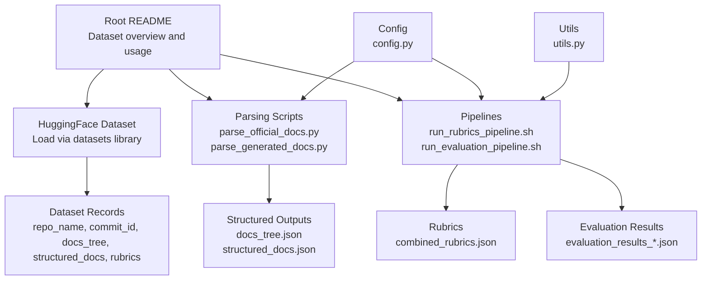
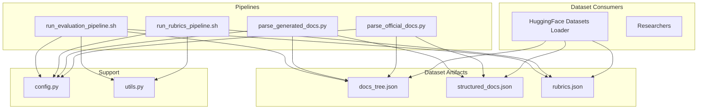
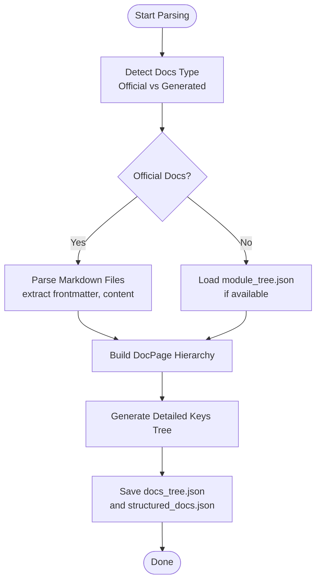
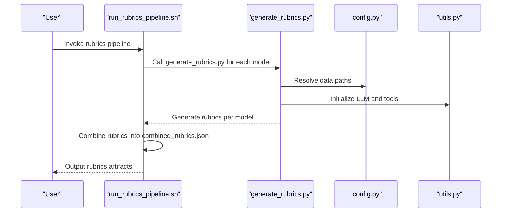
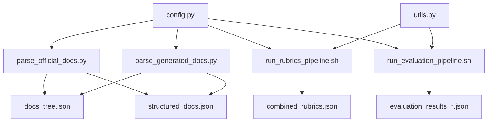

# Benchmark Dataset Overview

<cite>
**Referenced Files in This Document**
- [README.md](file://README.md)
- [config.py](file://src/config.py)
- [count_lines_of_code.py](file://count_lines_of_code.py)
- [docs_tree.json](file://examples/OpenHands/codewiki/docs_tree.json)
- [structured_docs.json](file://examples/OpenHands/codewiki/structured_docs.json)
- [combined_rubrics.json](file://examples/OpenHands/rubrics/combined_rubrics.json)
- [parse_official_docs.py](file://src/docs_parser/parse_official_docs.py)
- [parse_generated_docs.py](file://src/docs_parser/parse_generated_docs.py)
- [run_evaluation_pipeline.sh](file://src/run_evaluation_pipeline.sh)
- [run_rubrics_pipeline.sh](file://src/run_rubrics_pipeline.sh)
- [generate_rubrics.py](file://src/rubrics_generator/generate_rubrics.py)
- [judge.py](file://src/judge/judge.py)
- [utils.py](file://src/utils.py)
</cite>

## Table of Contents
1. [Introduction](#introduction)
2. [Project Structure](#project-structure)
3. [Core Components](#core-components)
4. [Architecture Overview](#architecture-overview)
5. [Detailed Component Analysis](#detailed-component-analysis)
6. [Dependency Analysis](#dependency-analysis)
7. [Performance Considerations](#performance-considerations)
8. [Troubleshooting Guide](#troubleshooting-guide)
9. [Conclusion](#conclusion)
10. [Appendices](#appendices)

## Introduction
This document provides a comprehensive overview of the CodeWikiBench benchmark dataset, focusing on dataset composition, structure, and integration. It explains the 22 open-source repositories spanning JS/TS, Python, C, C++, C#, and Java ecosystems, and documents the dataset metadata fields: repo_name, commit_id, docs_tree, structured_docs, and rubrics. It also describes how to load and parse the dataset via Hugging Face, how documentation is parsed into structured forms, and how rubrics and evaluations are generated and combined. Practical examples illustrate accessing dataset records, repository selection criteria, and data exploration workflows. Finally, it addresses dataset versioning through commit-based evaluation, reproducibility considerations, and research application guidelines.

## Project Structure
The repository is organized around:
- Dataset usage and examples in the root README
- Documentation parsing utilities under src/docs_parser
- Rubrics generation and evaluation pipelines under src/rubrics_generator and src/judge
- Shared configuration and utilities under src/config.py and src/utils.py
- Example dataset artifacts under examples/<repo>

**Diagram sources**
- [README.md](file://README.md#L1-L136)
- [parse_official_docs.py](file://src/docs_parser/parse_official_docs.py#L1-L367)
- [parse_generated_docs.py](file://src/docs_parser/parse_generated_docs.py#L1-L323)
- [run_rubrics_pipeline.sh](file://src/run_rubrics_pipeline.sh#L1-L320)
- [run_evaluation_pipeline.sh](file://src/run_evaluation_pipeline.sh#L1-L331)
- [config.py](file://src/config.py#L1-L32)
- [utils.py](file://src/utils.py#L1-L86)

**Section sources**
- [README.md](file://README.md#L1-L136)
- [config.py](file://src/config.py#L1-L32)

## Core Components
- Dataset metadata fields:
  - repo_name: Repository identifier
  - commit_id: Commit hash used for evaluation
  - docs_tree: Hierarchical documentation tree (JSON)
  - structured_docs: Parsed and structured documentation (JSON)
  - rubrics: Evaluation rubrics (JSON)
- Hugging Face integration:
  - Load dataset via the datasets library
  - Access records and parse JSON fields (docs_tree, structured_docs, rubrics)
- Documentation parsing:
  - parse_official_docs.py: Converts official docs into structured_docs.json and docs_tree.json
  - parse_generated_docs.py: Converts generated docs (DeepWiki) into structured_docs.json and docs_tree.json
- Pipelines:
  - run_rubrics_pipeline.sh: Generates rubrics with multiple models and combines results
  - run_evaluation_pipeline.sh: Evaluates documentation against rubrics and combines results
- Utilities:
  - config.py: Project root, data paths, and environment configuration
  - utils.py: LLM initialization, token truncation, embeddings

**Section sources**
- [README.md](file://README.md#L25-L44)
- [parse_official_docs.py](file://src/docs_parser/parse_official_docs.py#L1-L367)
- [parse_generated_docs.py](file://src/docs_parser/parse_generated_docs.py#L1-L323)
- [run_rubrics_pipeline.sh](file://src/run_rubrics_pipeline.sh#L1-L320)
- [run_evaluation_pipeline.sh](file://src/run_evaluation_pipeline.sh#L1-L331)
- [config.py](file://src/config.py#L1-L32)
- [utils.py](file://src/utils.py#L1-L86)

## Architecture Overview
The dataset architecture centers on structured documentation and rubrics derived from official and generated sources. The pipeline integrates parsing, rubrics generation, and evaluation to produce standardized JSON artifacts consumed by researchers.

**Diagram sources**
- [README.md](file://README.md#L25-L108)
- [parse_official_docs.py](file://src/docs_parser/parse_official_docs.py#L1-L367)
- [parse_generated_docs.py](file://src/docs_parser/parse_generated_docs.py#L1-L323)
- [run_rubrics_pipeline.sh](file://src/run_rubrics_pipeline.sh#L1-L320)
- [run_evaluation_pipeline.sh](file://src/run_evaluation_pipeline.sh#L1-L331)
- [config.py](file://src/config.py#L1-L32)
- [utils.py](file://src/utils.py#L1-L86)

## Detailed Component Analysis

### Dataset Composition and Structure
- Repositories covered across ecosystems:
  - JS/TS: Chart.js, marktext, puppeteer, storybook, mermaid, svelte
  - Python: graphrag, rasa, OpenHands
  - C: qmk_firmware, libsql, sumatrapdf, wazuh
  - C++: electron, x64dbg, json
  - C#: FluentValidation, git-credential-manager, ml-agents
  - Java: logstash, material-components-android, trino
- Dataset metadata fields:
  - repo_name: Repository identifier
  - commit_id: Specific commit used for evaluation
  - docs_tree: Hierarchical documentation tree
  - structured_docs: Structured documentation content
  - rubrics: Hierarchical rubrics for evaluation
- Hugging Face integration:
  - Load dataset and access records
  - Parse JSON fields for downstream analysis

**Section sources**
- [README.md](file://README.md#L11-L24)
- [README.md](file://README.md#L25-L44)

### Documentation Parsing Components
- parse_official_docs.py
  - Converts official markdown documentation into structured_docs.json and docs_tree.json
  - Builds hierarchical DocPage structures and generates detailed key trees
  - Handles frontmatter, SVG references, and markdown-to-JSON conversion
- parse_generated_docs.py
  - Converts generated documentation (DeepWiki) into structured_docs.json and docs_tree.json
  - Uses module_tree.json to reconstruct hierarchical structure when available
  - Processes markdown content and builds nested DocPage hierarchy

**Diagram sources**
- [parse_official_docs.py](file://src/docs_parser/parse_official_docs.py#L186-L327)
- [parse_generated_docs.py](file://src/docs_parser/parse_generated_docs.py#L155-L312)

**Section sources**
- [parse_official_docs.py](file://src/docs_parser/parse_official_docs.py#L1-L367)
- [parse_generated_docs.py](file://src/docs_parser/parse_generated_docs.py#L1-L323)

### Rubrics Generation and Evaluation Pipelines
- run_rubrics_pipeline.sh
  - Orchestrates rubrics generation across multiple models
  - Generates rubrics per model and combines them into combined_rubrics.json
  - Supports optional visualization
- run_evaluation_pipeline.sh
  - Runs evaluation against rubrics using multiple models
  - Combines results and supports visualization
- generate_rubrics.py
  - Implements rubrics generation prompts and tool usage
  - Loads docs_tree.json and produces model-specific rubrics
- judge.py
  - Evaluates documentation against rubrics
  - Collects leaf requirements, evaluates in batches, and handles retries
  - Produces evaluation_results_*.json files

**Diagram sources**
- [run_rubrics_pipeline.sh](file://src/run_rubrics_pipeline.sh#L167-L242)
- [generate_rubrics.py](file://src/rubrics_generator/generate_rubrics.py#L170-L200)
- [config.py](file://src/config.py#L1-L32)
- [utils.py](file://src/utils.py#L1-L86)

**Section sources**
- [run_rubrics_pipeline.sh](file://src/run_rubrics_pipeline.sh#L1-L320)
- [generate_rubrics.py](file://src/rubrics_generator/generate_rubrics.py#L1-L200)
- [judge.py](file://src/judge/judge.py#L1-L200)

### JSON Field Parsing Methods
- docs_tree.json
  - Hierarchical documentation tree with titles, paths, and content keys
  - Used for navigation and evaluation
- structured_docs.json
  - Structured documentation content with metadata and subpages
  - Used for detailed analysis and visualization
- rubrics.json
  - Hierarchical rubrics with weights and sub-tasks
  - Used for evaluation scoring

Practical parsing steps:
- Load dataset via Hugging Face
- Access record fields: repo_name, commit_id, docs_tree, structured_docs, rubrics
- Parse JSON fields using standard JSON libraries

**Section sources**
- [README.md](file://README.md#L39-L43)
- [docs_tree.json](file://examples/OpenHands/codewiki/docs_tree.json#L1-L200)
- [structured_docs.json](file://examples/OpenHands/codewiki/structured_docs.json#L1-L200)
- [combined_rubrics.json](file://examples/OpenHands/rubrics/combined_rubrics.json#L1-L200)

### Practical Examples
- Accessing dataset records:
  - Load dataset and select a record by index
  - Parse JSON fields for docs_tree, structured_docs, and rubrics
- Repository selection criteria:
  - Choose repositories based on ecosystem and language distribution
  - Ensure commit_id availability for reproducible evaluation
- Data exploration workflows:
  - Inspect docs_tree for structure and navigation
  - Explore structured_docs for content and metadata
  - Review rubrics for evaluation requirements and weights

**Section sources**
- [README.md](file://README.md#L25-L44)

### Dataset Versioning and Reproducibility
- Versioning via commit-based evaluation:
  - Each record includes commit_id to anchor evaluation to a specific repository state
  - Use commit_id to reproduce results consistently
- Reproducibility considerations:
  - Use the same commit_id across experiments
  - Maintain consistent environment variables and model settings
  - Utilize config.py for consistent paths and settings

**Section sources**
- [README.md](file://README.md#L19-L24)
- [config.py](file://src/config.py#L1-L32)

### Research Application Guidelines
- Citation:
  - Use the provided BibTeX citation when publishing research using the dataset
- Evaluation guidelines:
  - Follow the pipelines and prompts provided for rubrics generation and evaluation
  - Ensure consistent use of commit_id and model settings
- Data usage:
  - Respect repository licenses and terms
  - Acknowledge the dataset and associated paper

**Section sources**
- [README.md](file://README.md#L122-L136)

## Dependency Analysis
The dataset and pipelines depend on shared configuration and utilities, and on parsing scripts that generate structured artifacts.

**Diagram sources**
- [config.py](file://src/config.py#L1-L32)
- [utils.py](file://src/utils.py#L1-L86)
- [parse_official_docs.py](file://src/docs_parser/parse_official_docs.py#L1-L367)
- [parse_generated_docs.py](file://src/docs_parser/parse_generated_docs.py#L1-L323)
- [run_rubrics_pipeline.sh](file://src/run_rubrics_pipeline.sh#L1-L320)
- [run_evaluation_pipeline.sh](file://src/run_evaluation_pipeline.sh#L1-L331)

**Section sources**
- [config.py](file://src/config.py#L1-L32)
- [utils.py](file://src/utils.py#L1-L86)

## Performance Considerations
- Token limits and truncation:
  - Token counting and truncation are handled to fit within model limits
- Batch processing:
  - Evaluation and rubrics generation support batching and retries to improve throughput and reliability
- File processing:
  - Documentation parsing scripts traverse directories and process files efficiently

**Section sources**
- [utils.py](file://src/utils.py#L12-L26)
- [run_evaluation_pipeline.sh](file://src/run_evaluation_pipeline.sh#L247-L285)
- [run_rubrics_pipeline.sh](file://src/run_rubrics_pipeline.sh#L216-L242)

## Troubleshooting Guide
- Missing data directory:
  - Ensure the data directory exists for the repository name before running pipelines
- Missing docs_tree:
  - Run documentation parsing scripts before evaluation or rubrics generation
- Evaluation failures:
  - Enable retry and adjust max retries for error cases
  - Use re-evaluation logic for problematic leaf nodes
- Visualization issues:
  - Verify that combined rubrics and evaluation results exist before generating visualizations

**Section sources**
- [run_evaluation_pipeline.sh](file://src/run_evaluation_pipeline.sh#L169-L185)
- [run_rubrics_pipeline.sh](file://src/run_rubrics_pipeline.sh#L142-L158)
- [judge.py](file://src/judge/judge.py#L89-L200)

## Conclusion
CodeWikiBench provides a structured, commit-versioned benchmark dataset across multiple programming ecosystems. Its metadata fields and JSON artifacts enable robust documentation evaluation and rubric-based assessment. The provided parsing, rubrics generation, and evaluation pipelines, along with configuration and utilities, offer a reproducible and extensible framework for researchers to explore, compare, and evaluate documentation quality across diverse codebases.

## Appendices

### Appendix A: Example JSON Artifacts
- docs_tree.json: Hierarchical documentation tree
- structured_docs.json: Structured documentation content
- combined_rubrics.json: Combined rubrics across models

**Section sources**
- [docs_tree.json](file://examples/OpenHands/codewiki/docs_tree.json#L1-L200)
- [structured_docs.json](file://examples/OpenHands/codewiki/structured_docs.json#L1-L200)
- [combined_rubrics.json](file://examples/OpenHands/rubrics/combined_rubrics.json#L1-L200)