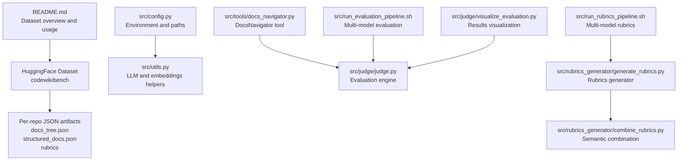
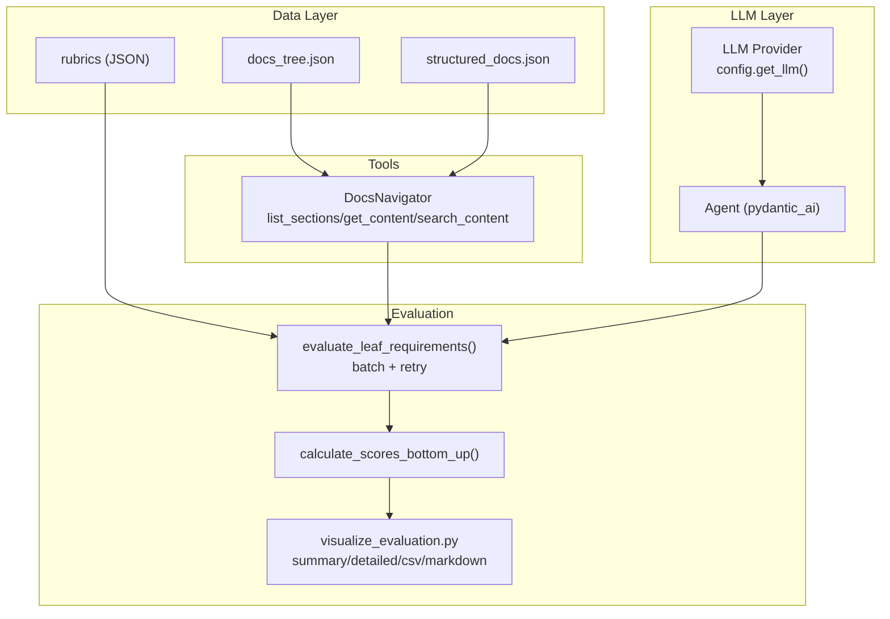
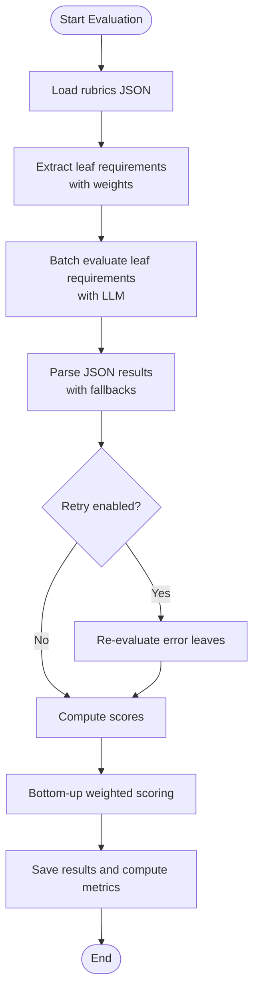
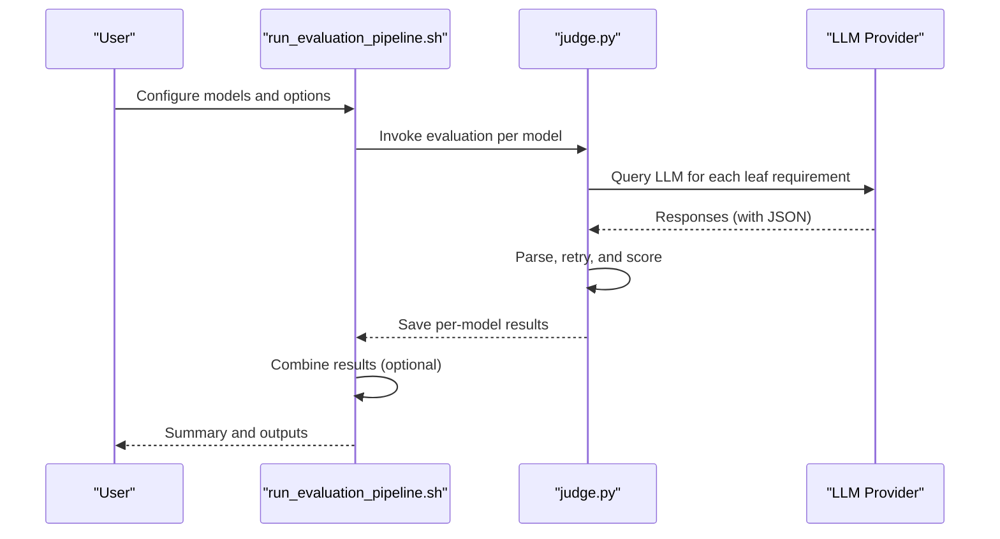
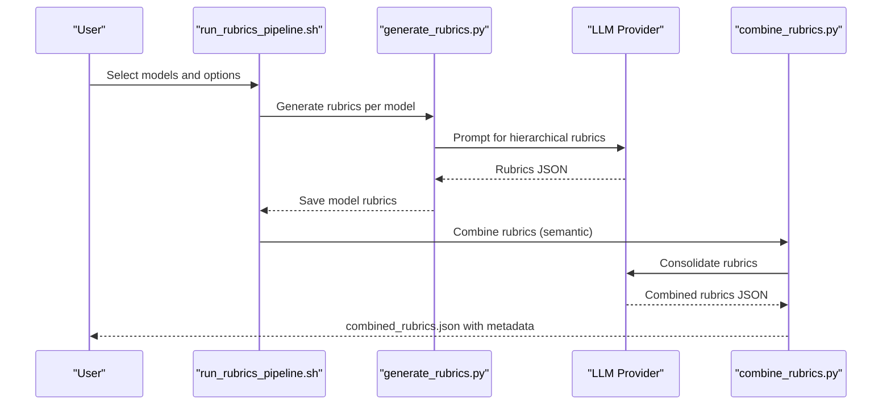
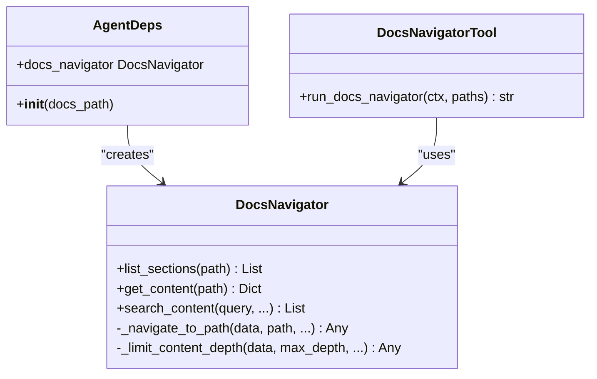
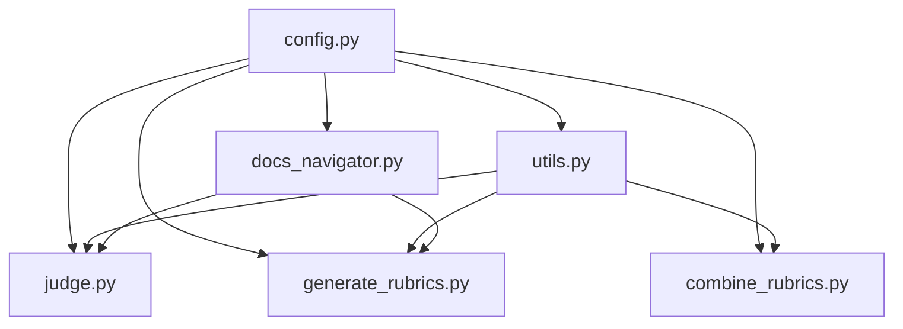

# Dataset and Benchmarking

<cite>
**Referenced Files in This Document**
- [README.md](file://README.md)
- [config.py](file://src/config.py)
- [utils.py](file://src/utils.py)
- [docs_navigator.py](file://src/tools/docs_navigator.py)
- [judge.py](file://src/judge/judge.py)
- [visualize_evaluation.py](file://src/judge/visualize_evaluation.py)
- [generate_rubrics.py](file://src/rubrics_generator/generate_rubrics.py)
- [combine_rubrics.py](file://src/rubrics_generator/combine_rubrics.py)
- [run_evaluation_pipeline.sh](file://src/run_evaluation_pipeline.sh)
- [run_rubrics_pipeline.sh](file://src/run_rubrics_pipeline.sh)
- [combined_rubrics.json](file://examples/OpenHands/rubrics/combined_rubrics.json)
- [docs_tree.json](file://examples/OpenHands/codewiki/docs_tree.json)
</cite>

## Table of Contents
1. [Introduction](#introduction)
2. [Project Structure](#project-structure)
3. [Core Components](#core-components)
4. [Architecture Overview](#architecture-overview)
5. [Detailed Component Analysis](#detailed-component-analysis)
6. [Dependency Analysis](#dependency-analysis)
7. [Performance Considerations](#performance-considerations)
8. [Troubleshooting Guide](#troubleshooting-guide)
9. [Conclusion](#conclusion)
10. [Appendices](#appendices)

## Introduction
This document explains the CodeWikiBench benchmark dataset and evaluation framework. It covers the dataset composition across 22 open-source repositories spanning JS/TS, Python, C, C++, C#, and Java ecosystems, and documents the data fields (repo_name, commit_id, docs_tree, structured_docs, rubrics). It also describes how to load and explore the dataset via HuggingFace, how to parse JSON fields, and how to access repository-specific data. The evaluation framework is centered on rubric-based assessment, multi-model comparisons, and statistical analysis. Practical workflows for dataset exploration, repository selection, and benchmarking are included, along with guidance on data versioning, commit-based evaluation, and reproducibility.

## Project Structure
The repository organizes dataset-related artifacts and evaluation tooling into a clear layout:
- Dataset access and usage instructions are documented in the top-level README.
- The dataset itself is distributed via HuggingFace and includes per-repository JSON artifacts (docs_tree.json, structured_docs.json, rubrics).
- Evaluation and rubrics generation are implemented in Python modules under src/, with shell pipelines orchestrating multi-model workflows.

**Diagram sources**
- [README.md](file://README.md#L1-L136)
- [config.py](file://src/config.py#L1-L32)
- [utils.py](file://src/utils.py#L1-L86)
- [docs_navigator.py](file://src/tools/docs_navigator.py#L1-L345)
- [judge.py](file://src/judge/judge.py#L1-L551)
- [generate_rubrics.py](file://src/rubrics_generator/generate_rubrics.py#L1-L257)
- [combine_rubrics.py](file://src/rubrics_generator/combine_rubrics.py#L1-L306)
- [run_evaluation_pipeline.sh](file://src/run_evaluation_pipeline.sh#L1-L331)
- [run_rubrics_pipeline.sh](file://src/run_rubrics_pipeline.sh#L1-L320)
- [visualize_evaluation.py](file://src/judge/visualize_evaluation.py#L1-L250)

**Section sources**
- [README.md](file://README.md#L1-L136)
- [config.py](file://src/config.py#L1-L32)

## Core Components
- Dataset fields and repository structure:
  - Each repository record includes metadata (repo_name, commit_id), docs_tree (original documentation tree), structured_docs (parsed and structured documentation), and rubrics (evaluation rubrics).
  - Example repository artifacts are provided under examples/<repo> for OpenHands, including docs_tree.json and rubrics/combined_rubrics.json.

- Data loading and parsing:
  - Use HuggingFace datasets to load the codewikibench dataset.
  - Access individual records and parse JSON fields (docs_tree, structured_docs, rubrics) for downstream processing.

- Evaluation framework:
  - Rubric-based scoring with hierarchical weights and leaf-level requirements.
  - Multi-model evaluation with configurable batching, retries, and tool-assisted navigation.
  - Statistical summaries and export formats (CSV, Markdown) for analysis.

- Rubrics generation:
  - Hierarchical rubrics produced by multiple LLMs and combined via semantic analysis to form a consensus rubric.

**Section sources**
- [README.md](file://README.md#L9-L44)
- [judge.py](file://src/judge/judge.py#L65-L87)
- [judge.py](file://src/judge/judge.py#L386-L432)
- [visualize_evaluation.py](file://src/judge/visualize_evaluation.py#L32-L63)
- [generate_rubrics.py](file://src/rubrics_generator/generate_rubrics.py#L24-L98)
- [combine_rubrics.py](file://src/rubrics_generator/combine_rubrics.py#L22-L151)

## Architecture Overview
The evaluation architecture integrates LLM agents, tool-based navigation, rubric scoring, and statistical reporting.

**Diagram sources**
- [docs_navigator.py](file://src/tools/docs_navigator.py#L11-L345)
- [judge.py](file://src/judge/judge.py#L242-L384)
- [judge.py](file://src/judge/judge.py#L386-L432)
- [visualize_evaluation.py](file://src/judge/visualize_evaluation.py#L65-L121)
- [utils.py](file://src/utils.py#L28-L46)

## Detailed Component Analysis

### Dataset Composition and Fields
- Repositories: 22 open-source projects across JS/TS, Python, C, C++, C#, Java.
- Per-repository artifacts:
  - docs_tree.json: hierarchical documentation tree with sections and content placeholders.
  - structured_docs.json: parsed content backing the docs_tree.
  - rubrics: evaluation rubrics (hierarchical requirements with weights).
- Access pattern:
  - Load dataset via HuggingFace.
  - Select a repository record and parse JSON fields for evaluation.

Practical example paths:
- Dataset loading and JSON parsing: [README.md](file://README.md#L25-L44)
- Example docs_tree structure: [docs_tree.json](file://examples/OpenHands/codewiki/docs_tree.json#L1-L200)
- Example rubrics structure: [combined_rubrics.json](file://examples/OpenHands/rubrics/combined_rubrics.json#L1-L494)

**Section sources**
- [README.md](file://README.md#L9-L44)
- [docs_tree.json](file://examples/OpenHands/codewiki/docs_tree.json#L1-L200)
- [combined_rubrics.json](file://examples/OpenHands/rubrics/combined_rubrics.json#L1-L494)

### Data Loading and Repository-Specific Access
- HuggingFace datasets usage:
  - Load dataset and access a training example by index.
  - Parse JSON fields for docs_tree, structured_docs, and rubrics.
- Repository-specific data access:
  - Use data paths configured in config.py to locate per-repo folders.
  - Tool-based navigation via DocsNavigator to retrieve content by path.

Example paths:
- Dataset usage: [README.md](file://README.md#L25-L44)
- Data path helpers: [config.py](file://src/config.py#L19-L26)
- Tool navigation: [docs_navigator.py](file://src/tools/docs_navigator.py#L11-L345)

**Section sources**
- [README.md](file://README.md#L25-L44)
- [config.py](file://src/config.py#L19-L26)
- [docs_navigator.py](file://src/tools/docs_navigator.py#L11-L345)

### Evaluation Framework: Rubric-Based Assessment
- Leaf requirement extraction:
  - Traverse rubrics to collect leaf-level requirements with weights.
- Scoring pipeline:
  - Batch evaluation of leaf requirements with an LLM agent.
  - Robust JSON parsing with fallbacks and retry logic for error cases.
- Bottom-up scoring:
  - Compute scores for parent rubrics as weighted averages of children.
- Metrics:
  - Overall weighted score, average leaf score, documented leaf percentage.

**Diagram sources**
- [judge.py](file://src/judge/judge.py#L69-L87)
- [judge.py](file://src/judge/judge.py#L242-L384)
- [judge.py](file://src/judge/judge.py#L386-L432)

**Section sources**
- [judge.py](file://src/judge/judge.py#L65-L87)
- [judge.py](file://src/judge/judge.py#L242-L384)
- [judge.py](file://src/judge/judge.py#L386-L432)

### Multi-Model Comparison and Statistical Analysis
- Multi-model evaluation:
  - Shell pipeline executes evaluation across multiple LLMs.
  - Results saved per model and optionally combined.
- Statistical analysis:
  - Summary metrics include overall score, average leaf score, documented leaf percentage.
  - Export formats: CSV and Markdown for external analysis.

**Diagram sources**
- [run_evaluation_pipeline.sh](file://src/run_evaluation_pipeline.sh#L195-L245)
- [judge.py](file://src/judge/judge.py#L435-L544)

**Section sources**
- [run_evaluation_pipeline.sh](file://src/run_evaluation_pipeline.sh#L1-L331)
- [judge.py](file://src/judge/judge.py#L435-L544)
- [visualize_evaluation.py](file://src/judge/visualize_evaluation.py#L32-L63)

### Rubrics Generation and Combination
- Generation:
  - Hierarchical rubrics produced by multiple LLMs using a structured prompt.
  - Tool-assisted or tool-free modes depending on configuration.
- Combination:
  - Semantic LLM-based consolidation of rubrics from multiple models.
  - Fallback merging when API calls fail.
  - Statistics tracked (total items, depth, weight distribution).

**Diagram sources**
- [run_rubrics_pipeline.sh](file://src/run_rubrics_pipeline.sh#L167-L242)
- [generate_rubrics.py](file://src/rubrics_generator/generate_rubrics.py#L169-L251)
- [combine_rubrics.py](file://src/rubrics_generator/combine_rubrics.py#L22-L151)

**Section sources**
- [generate_rubrics.py](file://src/rubrics_generator/generate_rubrics.py#L24-L98)
- [generate_rubrics.py](file://src/rubrics_generator/generate_rubrics.py#L169-L251)
- [combine_rubrics.py](file://src/rubrics_generator/combine_rubrics.py#L22-L151)
- [combine_rubrics.py](file://src/rubrics_generator/combine_rubrics.py#L232-L303)

### Tool-Assisted Navigation
- DocsNavigator enables:
  - Listing sections at a given path.
  - Retrieving content for a path with tree context.
  - Searching content across the structured docs.
- Integrated as a tool for agents to fetch relevant documentation during evaluation.

**Diagram sources**
- [docs_navigator.py](file://src/tools/docs_navigator.py#L11-L345)

**Section sources**
- [docs_navigator.py](file://src/tools/docs_navigator.py#L11-L345)

### Practical Workflows and Examples
- Dataset exploration:
  - Load dataset and iterate through records; parse JSON fields for docs_tree and rubrics.
  - Example paths: [README.md](file://README.md#L25-L44), [docs_tree.json](file://examples/OpenHands/codewiki/docs_tree.json#L1-L200).
- Repository selection criteria:
  - Choose repositories aligned with target ecosystems (JS/TS, Python, C, C++, C#, Java).
  - Ensure docs_tree.json and structured_docs.json are available for parsing.
- Benchmarking workflows:
  - Rubrics generation: [run_rubrics_pipeline.sh](file://src/run_rubrics_pipeline.sh#L167-L242), [generate_rubrics.py](file://src/rubrics_generator/generate_rubrics.py#L169-L251).
  - Evaluation: [run_evaluation_pipeline.sh](file://src/run_evaluation_pipeline.sh#L195-L245), [judge.py](file://src/judge/judge.py#L435-L544).
  - Visualization: [visualize_evaluation.py](file://src/judge/visualize_evaluation.py#L198-L248).

**Section sources**
- [README.md](file://README.md#L25-L44)
- [run_rubrics_pipeline.sh](file://src/run_rubrics_pipeline.sh#L167-L242)
- [generate_rubrics.py](file://src/rubrics_generator/generate_rubrics.py#L169-L251)
- [run_evaluation_pipeline.sh](file://src/run_evaluation_pipeline.sh#L195-L245)
- [judge.py](file://src/judge/judge.py#L435-L544)
- [visualize_evaluation.py](file://src/judge/visualize_evaluation.py#L198-L248)

## Dependency Analysis
The evaluation pipeline depends on configuration, LLM utilities, and tooling for navigation.

**Diagram sources**
- [config.py](file://src/config.py#L1-L32)
- [utils.py](file://src/utils.py#L1-L86)
- [judge.py](file://src/judge/judge.py#L1-L551)
- [generate_rubrics.py](file://src/rubrics_generator/generate_rubrics.py#L1-L257)
- [combine_rubrics.py](file://src/rubrics_generator/combine_rubrics.py#L1-L306)
- [docs_navigator.py](file://src/tools/docs_navigator.py#L1-L345)

**Section sources**
- [config.py](file://src/config.py#L1-L32)
- [utils.py](file://src/utils.py#L1-L86)
- [judge.py](file://src/judge/judge.py#L1-L551)
- [generate_rubrics.py](file://src/rubrics_generator/generate_rubrics.py#L1-L257)
- [combine_rubrics.py](file://src/rubrics_generator/combine_rubrics.py#L1-L306)
- [docs_navigator.py](file://src/tools/docs_navigator.py#L1-L345)

## Performance Considerations
- Token limits and truncation:
  - Responses are truncated to a configured maximum to prevent oversized outputs.
- Batching and concurrency:
  - Batch processing reduces API overhead; concurrent evaluation improves throughput.
- Retry and resilience:
  - Automatic retry for error cases with capped attempts; fallback parsing strategies.
- Cost estimation:
  - Token usage and estimated cost are computed per evaluation for budget awareness.

**Section sources**
- [utils.py](file://src/utils.py#L12-L26)
- [judge.py](file://src/judge/judge.py#L242-L384)
- [judge.py](file://src/judge/judge.py#L521-L543)

## Troubleshooting Guide
- Missing or malformed JSON:
  - Verify docs_tree.json and rubrics JSON are valid; fallback parsing handles missing or malformed responses.
- Rate limits and errors:
  - The evaluator detects rate-limit scenarios and pauses to respect quotas.
- Tool availability:
  - Ensure docs_tree.json and structured_docs.json exist for the selected repository; otherwise, run parsing steps first.
- Pipeline failures:
  - Use verbose logs and per-model result files to isolate failing steps.

**Section sources**
- [judge.py](file://src/judge/judge.py#L317-L332)
- [judge.py](file://src/judge/judge.py#L322-L326)
- [docs_navigator.py](file://src/tools/docs_navigator.py#L31-L43)

## Conclusion
CodeWikiBench provides a structured, multi-model benchmark for evaluating documentation quality across diverse codebases. The dataset offers standardized JSON artifacts and a robust evaluation pipeline with rubric-based scoring, tool-assisted navigation, and statistical reporting. Researchers can reproduce results, compare models, and analyze outcomes using the provided scripts and visualization tools.

## Appendices

### Data Versioning and Commit-Based Evaluation
- Each repository record includes a commit identifier to anchor the documentation snapshot used for evaluation.
- For reproducibility, run parsing and evaluation against the exact commit referenced in the dataset.

**Section sources**
- [README.md](file://README.md#L19-L23)

### Example Paths for Quick Reference
- Dataset usage and JSON parsing: [README.md](file://README.md#L25-L44)
- Rubrics generation and combination: [run_rubrics_pipeline.sh](file://src/run_rubrics_pipeline.sh#L167-L242), [generate_rubrics.py](file://src/rubrics_generator/generate_rubrics.py#L169-L251), [combine_rubrics.py](file://src/rubrics_generator/combine_rubrics.py#L232-L303)
- Evaluation pipeline and visualization: [run_evaluation_pipeline.sh](file://src/run_evaluation_pipeline.sh#L195-L245), [judge.py](file://src/judge/judge.py#L435-L544), [visualize_evaluation.py](file://src/judge/visualize_evaluation.py#L198-L248)