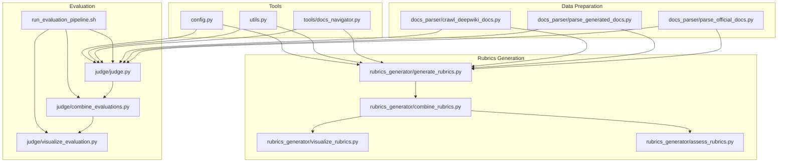
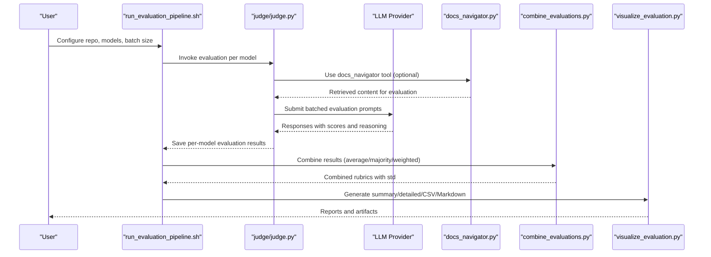
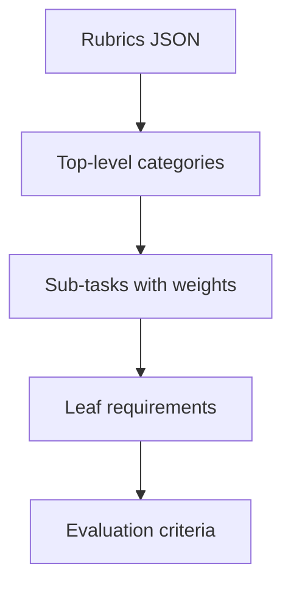
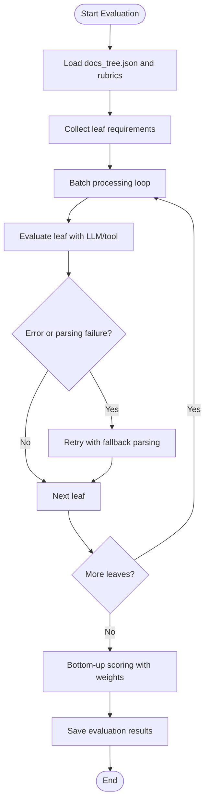
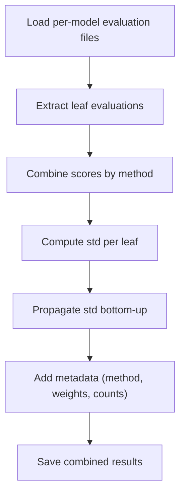
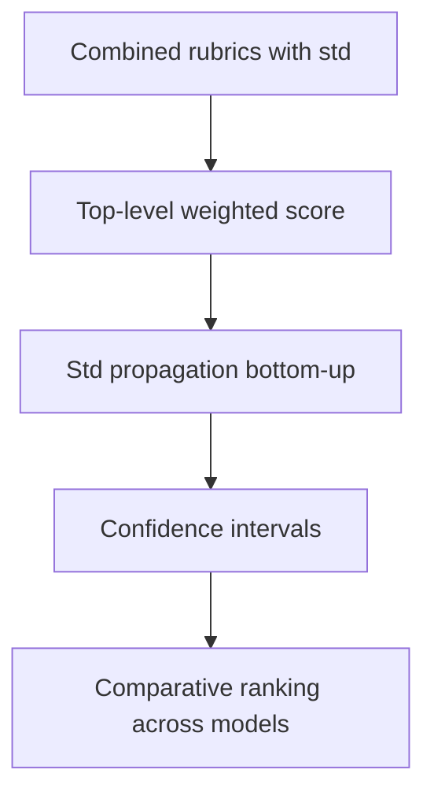
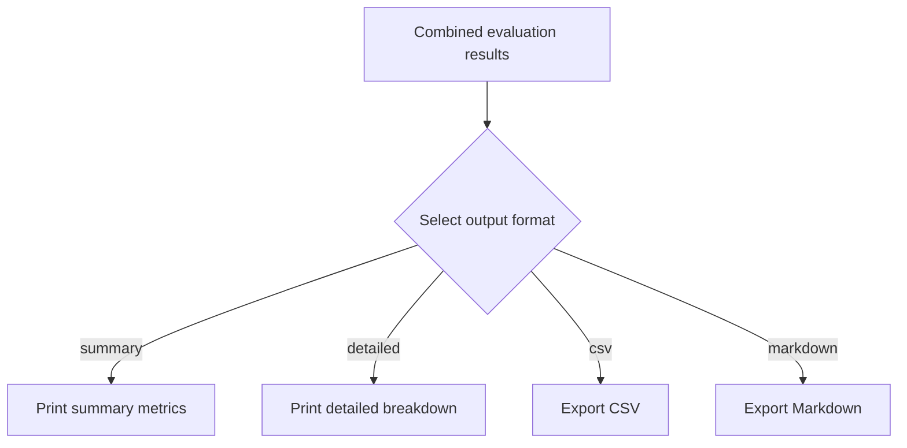
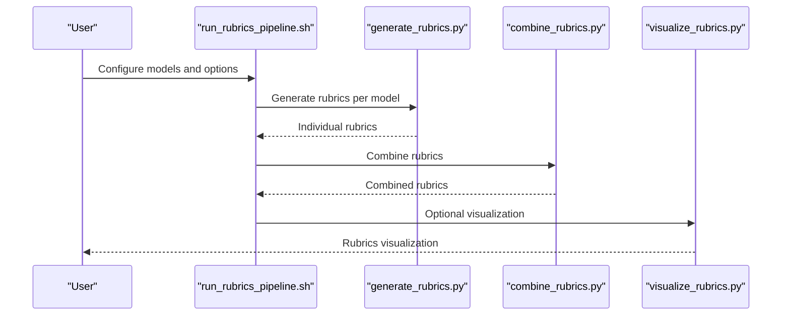
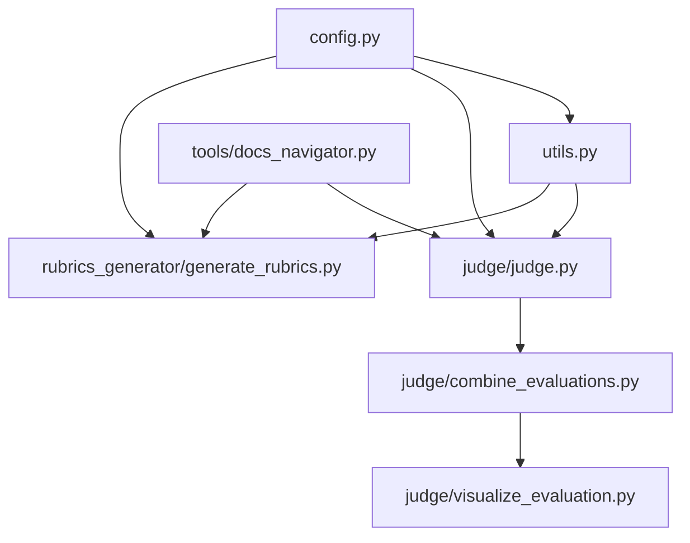

# Evaluation Framework

<cite>
**Referenced Files in This Document**
- [README.md](file://README.md)
- [config.py](file://src/config.py)
- [utils.py](file://src/utils.py)
- [docs_navigator.py](file://src/tools/docs_navigator.py)
- [judge.py](file://src/judge/judge.py)
- [combine_evaluations.py](file://src/judge/combine_evaluations.py)
- [visualize_evaluation.py](file://src/judge/visualize_evaluation.py)
- [run_evaluation_pipeline.sh](file://src/run_evaluation_pipeline.sh)
- [generate_rubrics.py](file://src/rubrics_generator/generate_rubrics.py)
- [assess_rubrics.py](file://src/rubrics_generator/assess_rubrics.py)
- [run_rubrics_pipeline.sh](file://src/run_rubrics_pipeline.sh)
- [combined_rubrics.json](file://examples/OpenHands/rubrics/combined_rubrics.json)
- [combined_evaluation_results.json](file://examples/OpenHands/deepwiki/evaluation_results/combined_evaluation_results.json)
</cite>

## Table of Contents
1. [Introduction](#introduction)
2. [Project Structure](#project-structure)
3. [Core Components](#core-components)
4. [Architecture Overview](#architecture-overview)
5. [Detailed Component Analysis](#detailed-component-analysis)
6. [Dependency Analysis](#dependency-analysis)
7. [Performance Considerations](#performance-considerations)
8. [Troubleshooting Guide](#troubleshooting-guide)
9. [Conclusion](#conclusion)
10. [Appendices](#appendices)

## Introduction
This document describes the CodeWikiBench evaluation framework for multi-model assessment of documentation quality. It explains the hierarchical rubric-based evaluation methodology, batch processing and error handling, result combination strategies, statistical analysis, comparative assessment across LLM providers, and visualization/reporting options. Practical examples and guidance for parameter tuning and result interpretation are included.

## Project Structure
The repository organizes evaluation and rubrics generation into modular components:
- Data parsing and preparation (docs parser)
- Rubrics generation (multi-model)
- Evaluation pipeline (multi-model)
- Combination and visualization/reporting
- Example outputs demonstrating rubrics and evaluation results

**Diagram sources**
- [generate_rubrics.py](file://src/rubrics_generator/generate_rubrics.py#L1-L257)
- [judge.py](file://src/judge/judge.py#L1-L551)
- [combine_evaluations.py](file://src/judge/combine_evaluations.py#L1-L375)
- [visualize_evaluation.py](file://src/judge/visualize_evaluation.py#L1-L250)
- [run_evaluation_pipeline.sh](file://src/run_evaluation_pipeline.sh#L1-L331)
- [docs_navigator.py](file://src/tools/docs_navigator.py#L1-L345)
- [utils.py](file://src/utils.py#L1-L86)
- [config.py](file://src/config.py#L1-L32)

**Section sources**
- [README.md](file://README.md#L1-L136)
- [run_rubrics_pipeline.sh](file://src/run_rubrics_pipeline.sh#L1-L320)
- [run_evaluation_pipeline.sh](file://src/run_evaluation_pipeline.sh#L1-L331)

## Core Components
- Configuration and environment: centralized configuration for API keys, model selection, and token limits.
- LLM utilities: unified LLM initialization and native LLM invocation for fallbacks.
- Documentation navigator tool: navigates and retrieves content from structured docs and docs tree for evaluation.
- Evaluation engine: rubric traversal, leaf evaluation, batch processing, retry/error handling, and bottom-up scoring.
- Combination engine: combines multiple LLM evaluation results using configurable methods and computes standard deviations.
- Visualization/reporting: summary, detailed, CSV export, and Markdown report generation.
- Pipelines: end-to-end rubrics generation and evaluation pipelines with batch size and retry controls.

**Section sources**
- [config.py](file://src/config.py#L1-L32)
- [utils.py](file://src/utils.py#L1-L86)
- [docs_navigator.py](file://src/tools/docs_navigator.py#L1-L345)
- [judge.py](file://src/judge/judge.py#L1-L551)
- [combine_evaluations.py](file://src/judge/combine_evaluations.py#L1-L375)
- [visualize_evaluation.py](file://src/judge/visualize_evaluation.py#L1-L250)
- [run_evaluation_pipeline.sh](file://src/run_evaluation_pipeline.sh#L1-L331)
- [run_rubrics_pipeline.sh](file://src/run_rubrics_pipeline.sh#L1-L320)

## Architecture Overview
The evaluation framework follows a hierarchical rubric system:
- Rubrics are generated by multiple LLMs and combined into a consensus structure.
- Documentation is parsed into a docs tree and structured docs.
- Evaluation compares documentation against rubric requirements using batched LLM calls.
- Results are combined across models with statistical aggregation and standard deviation computation.
- Visualization and reporting provide summary and detailed views, plus CSV and Markdown exports.

**Diagram sources**
- [run_evaluation_pipeline.sh](file://src/run_evaluation_pipeline.sh#L1-L331)
- [judge.py](file://src/judge/judge.py#L1-L551)
- [docs_navigator.py](file://src/tools/docs_navigator.py#L1-L345)
- [combine_evaluations.py](file://src/judge/combine_evaluations.py#L1-L375)
- [visualize_evaluation.py](file://src/judge/visualize_evaluation.py#L1-L250)

## Detailed Component Analysis

### Hierarchical Rubric System
- Rubrics are hierarchical JSON structures with weights and nested sub-tasks.
- Leaf-level requirements carry the actual evaluation criteria.
- Rubrics are generated by multiple LLMs and combined into a consensus structure with metadata.

**Diagram sources**
- [generate_rubrics.py](file://src/rubrics_generator/generate_rubrics.py#L1-L257)
- [combined_rubrics.json](file://examples/OpenHands/rubrics/combined_rubrics.json#L1-L494)

**Section sources**
- [generate_rubrics.py](file://src/rubrics_generator/generate_rubrics.py#L1-L257)
- [combined_rubrics.json](file://examples/OpenHands/rubrics/combined_rubrics.json#L1-L494)

### Evaluation Engine
- Traverses rubrics to collect leaf requirements.
- Supports batched asynchronous evaluation with configurable batch size.
- Implements robust retry and error handling for parsing failures and rate limits.
- Calculates scores bottom-up using weighted averages.
- Saves per-model evaluation results and prints summary statistics.

**Diagram sources**
- [judge.py](file://src/judge/judge.py#L1-L551)

**Section sources**
- [judge.py](file://src/judge/judge.py#L1-L551)

### Result Combination Strategies
- Supports multiple combination methods: average, majority vote, weighted average, max, min.
- Computes standard deviation per leaf and propagates std bottom-up.
- Adds metadata including combination method, number of evaluations, weights, and overall score range.

**Diagram sources**
- [combine_evaluations.py](file://src/judge/combine_evaluations.py#L1-L375)

**Section sources**
- [combine_evaluations.py](file://src/judge/combine_evaluations.py#L1-L375)

### Statistical Analysis and Comparative Assessment
- Overall score computed as weighted average across top-level rubrics.
- Standard deviation propagated from leaf-level to top-level rubrics.
- Comparative assessment across models via per-model evaluation files and combined results.
- Reliability assessment module computes inter-model consistency using semantic and structural similarity.

**Diagram sources**
- [combine_evaluations.py](file://src/judge/combine_evaluations.py#L178-L214)
- [assess_rubrics.py](file://src/rubrics_generator/assess_rubrics.py#L1-L308)

**Section sources**
- [combine_evaluations.py](file://src/judge/combine_evaluations.py#L178-L214)
- [assess_rubrics.py](file://src/rubrics_generator/assess_rubrics.py#L1-L308)

### Visualization and Reporting
- Summary view: overall score, average leaf score, coverage percentage.
- Detailed view: per-requirement scores with reasoning and evidence.
- CSV export: flattened rubric items with path, requirement, score, weight, and evaluation details.
- Markdown report: hierarchical markdown with emoji indicators and evaluation metadata.

**Diagram sources**
- [visualize_evaluation.py](file://src/judge/visualize_evaluation.py#L1-L250)

**Section sources**
- [visualize_evaluation.py](file://src/judge/visualize_evaluation.py#L1-L250)

### End-to-End Pipelines
- Rubrics generation pipeline: multi-model rubrics generation, combination, optional visualization.
- Evaluation pipeline: multi-model evaluation, optional combination, optional visualization.

**Diagram sources**
- [run_rubrics_pipeline.sh](file://src/run_rubrics_pipeline.sh#L1-L320)
- [generate_rubrics.py](file://src/rubrics_generator/generate_rubrics.py#L1-L257)

**Section sources**
- [run_rubrics_pipeline.sh](file://src/run_rubrics_pipeline.sh#L1-L320)
- [run_evaluation_pipeline.sh](file://src/run_evaluation_pipeline.sh#L1-L331)

## Dependency Analysis
- Configuration and environment:
  - Centralized API keys, model names, base URLs, and token limits.
- LLM utilities:
  - Unified LLM initialization and native fallback invocation.
- Tools:
  - DocsNavigator integrates with structured docs and docs tree for targeted retrieval.
- Evaluation and combination:
  - Evaluation depends on rubrics, docs tree, and tools; combination depends on evaluation outputs.
- Visualization:
  - Reads combined or individual evaluation results and produces multiple output formats.

**Diagram sources**
- [config.py](file://src/config.py#L1-L32)
- [utils.py](file://src/utils.py#L1-L86)
- [docs_navigator.py](file://src/tools/docs_navigator.py#L1-L345)
- [judge.py](file://src/judge/judge.py#L1-L551)
- [combine_evaluations.py](file://src/judge/combine_evaluations.py#L1-L375)
- [visualize_evaluation.py](file://src/judge/visualize_evaluation.py#L1-L250)

**Section sources**
- [config.py](file://src/config.py#L1-L32)
- [utils.py](file://src/utils.py#L1-L86)
- [docs_navigator.py](file://src/tools/docs_navigator.py#L1-L345)
- [judge.py](file://src/judge/judge.py#L1-L551)
- [combine_evaluations.py](file://src/judge/combine_evaluations.py#L1-L375)
- [visualize_evaluation.py](file://src/judge/visualize_evaluation.py#L1-L250)

## Performance Considerations
- Batch size optimization:
  - Larger batches increase throughput but risk rate limits; tune based on provider quotas and latency.
  - Use the pipeline’s batch size parameter to balance speed and stability.
- Token limits:
  - Content is truncated to configured token limits to prevent oversized requests.
- Retry and resilience:
  - Automatic retries for parsing failures and rate-limit errors; adjust max retries for stability vs. runtime.
- Cost estimation:
  - The evaluation prints total tokens and estimated cost; monitor and budget accordingly.

[No sources needed since this section provides general guidance]

## Troubleshooting Guide
- Rate limit errors:
  - The evaluation detects rate limit indicators and adds delays; reduce batch size or increase delays.
- Parsing failures:
  - Automatic fallback parsing attempts; enable retries to improve robustness.
- Missing files:
  - Ensure docs_tree.json and rubrics files exist; the pipeline validates inputs and exits with clear errors if missing.
- Tool availability:
  - When using tools, confirm docs_tree.json and structured_docs.json exist in the reference directory.

**Section sources**
- [judge.py](file://src/judge/judge.py#L317-L332)
- [run_evaluation_pipeline.sh](file://src/run_evaluation_pipeline.sh#L169-L185)

## Conclusion
CodeWikiBench provides a robust, multi-model evaluation framework that leverages hierarchical rubrics, batched asynchronous evaluation, resilient error handling, and comprehensive result combination with statistical analysis. The pipelines and visualization tools enable practitioners to compare LLM providers, interpret assessment scores, and generate actionable reports.

[No sources needed since this section summarizes without analyzing specific files]

## Appendices

### Practical Examples and Interpretation Guidelines
- Running evaluations with multiple models:
  - Use the evaluation pipeline script with multiple models and batch sizes; optionally enable tools and retries.
  - Example invocation patterns are provided in the repository README.
- Interpreting assessment scores:
  - Overall score is a weighted average across top-level rubrics; higher scores indicate better documentation coverage.
  - Leaf-level scores near 1.0 indicate clear coverage; scores below 0.5 suggest missing or weak coverage.
  - Standard deviations quantify variability across models; lower std indicates more consistent assessments.
- Generating comprehensive reports:
  - Use visualization options to produce summary, detailed, CSV, and Markdown outputs.
  - Combined results include metadata such as combination method and overall score range.

**Section sources**
- [README.md](file://README.md#L79-L108)
- [run_evaluation_pipeline.sh](file://src/run_evaluation_pipeline.sh#L1-L331)
- [visualize_evaluation.py](file://src/judge/visualize_evaluation.py#L1-L250)
- [combined_evaluation_results.json](file://examples/OpenHands/deepwiki/evaluation_results/combined_evaluation_results.json#L1-L782)