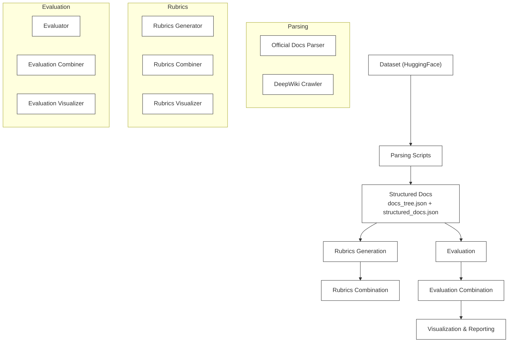
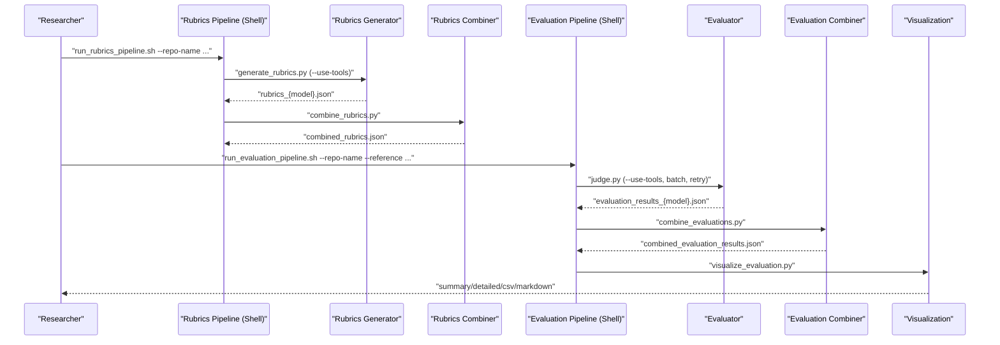
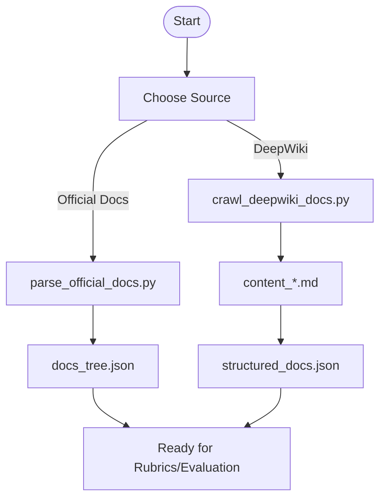
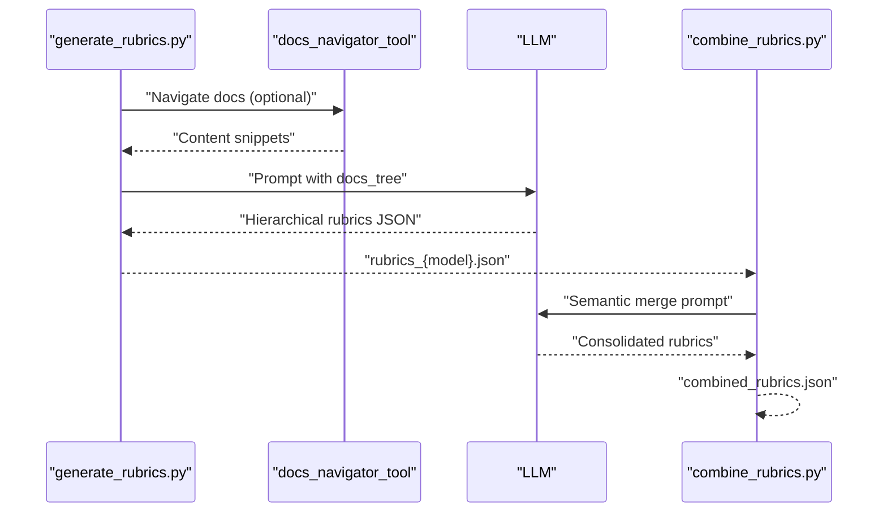
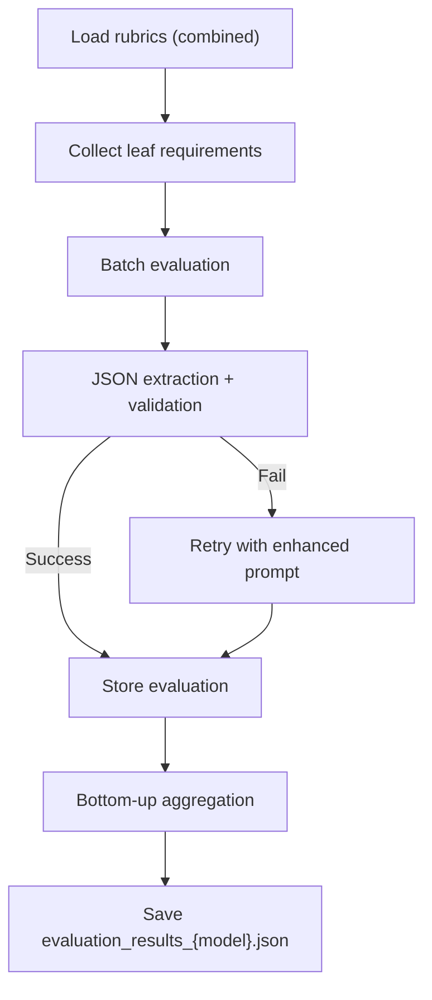
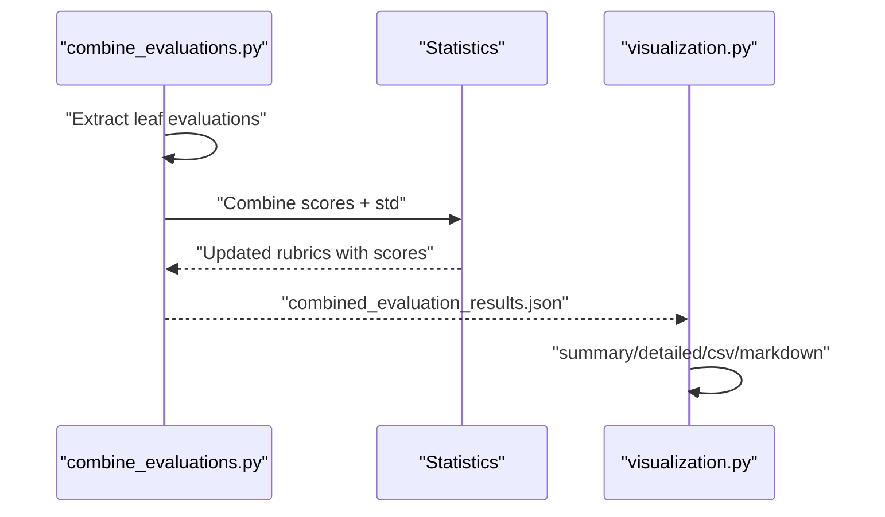
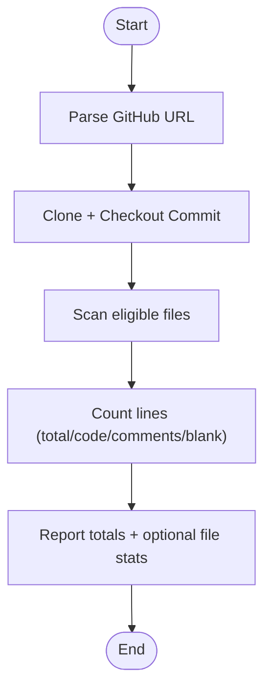
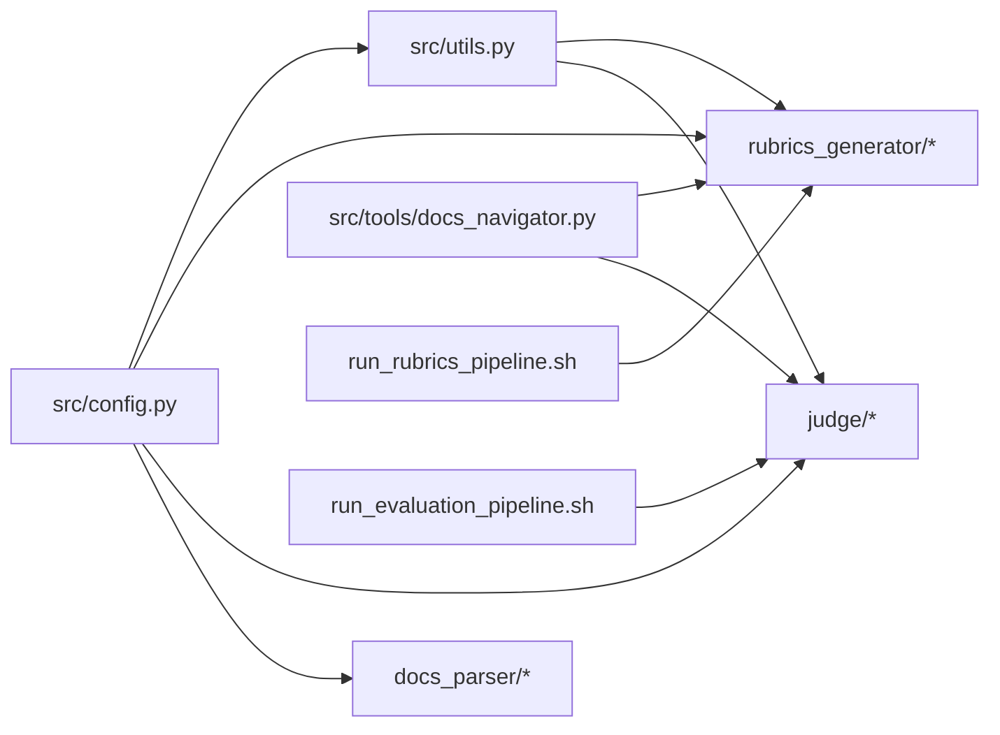

# Research Workflows

<cite>
**Referenced Files in This Document**
- [README.md](file://README.md)
- [count_lines_of_code.py](file://count_lines_of_code.py)
- [src/config.py](file://src/config.py)
- [src/utils.py](file://src/utils.py)
- [src/run_rubrics_pipeline.sh](file://src/run_rubrics_pipeline.sh)
- [src/run_evaluation_pipeline.sh](file://src/run_evaluation_pipeline.sh)
- [src/rubrics_generator/generate_rubrics.py](file://src/rubrics_generator/generate_rubrics.py)
- [src/rubrics_generator/combine_rubrics.py](file://src/rubrics_generator/combine_rubrics.py)
- [src/rubrics_generator/visualize_rubrics.py](file://src/rubrics_generator/visualize_rubrics.py)
- [src/judge/judge.py](file://src/judge/judge.py)
- [src/judge/combine_evaluations.py](file://src/judge/combine_evaluations.py)
- [src/judge/visualize_evaluation.py](file://src/judge/visualize_evaluation.py)
- [src/docs_parser/crawl_deepwiki_docs.py](file://src/docs_parser/crawl_deepwiki_docs.py)
- [src/docs_parser/parse_official_docs.py](file://src/docs_parser/parse_official_docs.py)
- [src/tools/docs_navigator.py](file://src/tools/docs_navigator.py)
- [src/download_github_folder.sh](file://src/download_github_folder.sh)
</cite>

## Table of Contents
1. [Introduction](#introduction)
2. [Project Structure](#project-structure)
3. [Core Components](#core-components)
4. [Architecture Overview](#architecture-overview)
5. [Detailed Component Analysis](#detailed-component-analysis)
6. [Dependency Analysis](#dependency-analysis)
7. [Performance Considerations](#performance-considerations)
8. [Troubleshooting Guide](#troubleshooting-guide)
9. [Conclusion](#conclusion)
10. [Appendices](#appendices)

## Introduction
This document describes research workflows for CodeWikiBench, focusing on reproducible, systematic methodologies for preparing datasets, generating rubrics, parsing documentation, evaluating documentation quality, and analyzing results. It documents the end-to-end pipeline from dataset consumption to publication-ready analysis, including line-of-code counting, commit-based evaluation tracking, and comparative benchmarking. The guide emphasizes best practices for experimental design, version control integration, and statistical analysis.

## Project Structure
The repository organizes research workflows around three pillars:
- Documentation parsing and preparation
- Rubrics generation and combination
- Evaluation and comparative analysis

**Diagram sources**
- [README.md](file://README.md#L3-L44)
- [src/docs_parser/parse_official_docs.py](file://src/docs_parser/parse_official_docs.py#L230-L327)
- [src/docs_parser/crawl_deepwiki_docs.py](file://src/docs_parser/crawl_deepwiki_docs.py#L291-L334)
- [src/rubrics_generator/generate_rubrics.py](file://src/rubrics_generator/generate_rubrics.py#L170-L256)
- [src/rubrics_generator/combine_rubrics.py](file://src/rubrics_generator/combine_rubrics.py#L232-L304)
- [src/judge/judge.py](file://src/judge/judge.py#L435-L548)
- [src/judge/combine_evaluations.py](file://src/judge/combine_evaluations.py#L244-L374)
- [src/judge/visualize_evaluation.py](file://src/judge/visualize_evaluation.py#L198-L248)

**Section sources**
- [README.md](file://README.md#L3-L44)

## Core Components
- Configuration and environment: centralizes project paths, API keys, and model settings.
- Utilities: LLM initialization, token truncation, and embeddings.
- Documentation parsers: official docs and DeepWiki crawler.
- Tools: documentation navigator for LLM agents.
- Rubrics generation and combination: hierarchical rubrics with semantic consolidation.
- Evaluation engine: leaf-level scoring with retry and bottom-up aggregation.
- Evaluation combination: multiple methods (average, majority vote, weighted average, min/max).
- Visualization: summary, detailed, CSV, and Markdown exports.
- Line-of-code counting: repository-wide code/comment/blank line counting at commit level.

**Section sources**
- [src/config.py](file://src/config.py#L1-L32)
- [src/utils.py](file://src/utils.py#L10-L86)
- [src/docs_parser/parse_official_docs.py](file://src/docs_parser/parse_official_docs.py#L16-L37)
- [src/docs_parser/crawl_deepwiki_docs.py](file://src/docs_parser/crawl_deepwiki_docs.py#L1-L335)
- [src/tools/docs_navigator.py](file://src/tools/docs_navigator.py#L11-L285)
- [src/rubrics_generator/generate_rubrics.py](file://src/rubrics_generator/generate_rubrics.py#L170-L256)
- [src/rubrics_generator/combine_rubrics.py](file://src/rubrics_generator/combine_rubrics.py#L232-L304)
- [src/judge/judge.py](file://src/judge/judge.py#L242-L548)
- [src/judge/combine_evaluations.py](file://src/judge/combine_evaluations.py#L107-L374)
- [src/judge/visualize_evaluation.py](file://src/judge/visualize_evaluation.py#L65-L248)
- [count_lines_of_code.py](file://count_lines_of_code.py#L18-L331)

## Architecture Overview
The research workflow is a multi-stage pipeline orchestrated by shell scripts and Python modules. It supports:
- Commit-level reproducibility via repository cloning and checkout
- Hierarchical rubrics generation with optional tool-assisted navigation
- Multi-model evaluation with retry and batch processing
- Statistical combination and visualization

**Diagram sources**
- [src/run_rubrics_pipeline.sh](file://src/run_rubrics_pipeline.sh#L167-L265)
- [src/rubrics_generator/generate_rubrics.py](file://src/rubrics_generator/generate_rubrics.py#L170-L256)
- [src/rubrics_generator/combine_rubrics.py](file://src/rubrics_generator/combine_rubrics.py#L232-L304)
- [src/run_evaluation_pipeline.sh](file://src/run_evaluation_pipeline.sh#L195-L302)
- [src/judge/judge.py](file://src/judge/judge.py#L435-L548)
- [src/judge/combine_evaluations.py](file://src/judge/combine_evaluations.py#L244-L374)
- [src/judge/visualize_evaluation.py](file://src/judge/visualize_evaluation.py#L198-L248)

## Detailed Component Analysis

### Documentation Parsing
- Official docs parser: converts markdown/MDX to structured JSON and a concise docs tree for navigation.
- DeepWiki crawler: pulls wiki content via MCP and writes per-page markdown files.
- GitHub folder downloader: sparse-checkouts a specific folder at a commit for reproducibility.

**Diagram sources**
- [src/docs_parser/parse_official_docs.py](file://src/docs_parser/parse_official_docs.py#L230-L327)
- [src/docs_parser/crawl_deepwiki_docs.py](file://src/docs_parser/crawl_deepwiki_docs.py#L291-L334)
- [src/download_github_folder.sh](file://src/download_github_folder.sh#L104-L138)

**Section sources**
- [src/docs_parser/parse_official_docs.py](file://src/docs_parser/parse_official_docs.py#L169-L327)
- [src/docs_parser/crawl_deepwiki_docs.py](file://src/docs_parser/crawl_deepwiki_docs.py#L291-L334)
- [src/download_github_folder.sh](file://src/download_github_folder.sh#L104-L138)

### Rubrics Generation and Combination
- Hierarchical rubrics are generated from the documentation tree using an LLM agent with optional tool-assisted navigation.
- Rubrics are combined using semantic consolidation with an LLM fallback to simple merging when needed.
- Visualization displays rubric trees and statistics.

**Diagram sources**
- [src/rubrics_generator/generate_rubrics.py](file://src/rubrics_generator/generate_rubrics.py#L170-L256)
- [src/tools/docs_navigator.py](file://src/tools/docs_navigator.py#L261-L285)
- [src/rubrics_generator/combine_rubrics.py](file://src/rubrics_generator/combine_rubrics.py#L22-L151)

**Section sources**
- [src/rubrics_generator/generate_rubrics.py](file://src/rubrics_generator/generate_rubrics.py#L170-L256)
- [src/rubrics_generator/combine_rubrics.py](file://src/rubrics_generator/combine_rubrics.py#L232-L304)
- [src/rubrics_generator/visualize_rubrics.py](file://src/rubrics_generator/visualize_rubrics.py#L129-L167)

### Evaluation Engine
- The evaluator collects leaf rubrics, evaluates each against the documentation tree with batch processing and retry logic, and aggregates scores bottom-up.
- It supports tool-assisted navigation and robust JSON extraction with fallbacks.

**Diagram sources**
- [src/judge/judge.py](file://src/judge/judge.py#L69-L87)
- [src/judge/judge.py](file://src/judge/judge.py#L242-L384)
- [src/judge/judge.py](file://src/judge/judge.py#L386-L432)

**Section sources**
- [src/judge/judge.py](file://src/judge/judge.py#L242-L548)

### Evaluation Combination and Visualization
- Multiple evaluation results are combined using configurable methods (average, majority vote, weighted average, min, max) with standard deviation propagation.
- Visualization provides summary, detailed, CSV, and Markdown outputs.

**Diagram sources**
- [src/judge/combine_evaluations.py](file://src/judge/combine_evaluations.py#L107-L176)
- [src/judge/combine_evaluations.py](file://src/judge/combine_evaluations.py#L178-L214)
- [src/judge/visualize_evaluation.py](file://src/judge/visualize_evaluation.py#L65-L248)

**Section sources**
- [src/judge/combine_evaluations.py](file://src/judge/combine_evaluations.py#L244-L374)
- [src/judge/visualize_evaluation.py](file://src/judge/visualize_evaluation.py#L198-L248)

### Line-of-Code Counting
- Clones a repository at a specific commit and counts lines of code, excluding binaries and common directories. Provides totals and per-file breakdowns.

**Diagram sources**
- [count_lines_of_code.py](file://count_lines_of_code.py#L49-L282)

**Section sources**
- [count_lines_of_code.py](file://count_lines_of_code.py#L18-L331)

## Dependency Analysis
- Centralized configuration: environment variables and project paths.
- LLM utilities: unified model initialization and token handling.
- Tooling: documentation navigator integrates with LLM agents.
- Pipelines: shell orchestrators coordinate Python modules and enforce reproducibility.

**Diagram sources**
- [src/config.py](file://src/config.py#L1-L32)
- [src/utils.py](file://src/utils.py#L28-L62)
- [src/tools/docs_navigator.py](file://src/tools/docs_navigator.py#L244-L285)
- [src/run_rubrics_pipeline.sh](file://src/run_rubrics_pipeline.sh#L167-L265)
- [src/run_evaluation_pipeline.sh](file://src/run_evaluation_pipeline.sh#L195-L302)

**Section sources**
- [src/config.py](file://src/config.py#L1-L32)
- [src/utils.py](file://src/utils.py#L28-L62)
- [src/tools/docs_navigator.py](file://src/tools/docs_navigator.py#L244-L285)
- [src/run_rubrics_pipeline.sh](file://src/run_rubrics_pipeline.sh#L167-L265)
- [src/run_evaluation_pipeline.sh](file://src/run_evaluation_pipeline.sh#L195-L302)

## Performance Considerations
- Batch processing: evaluation batches reduce overhead and respect API rate limits.
- Retry logic: automatic retries with exponential backoff improve robustness.
- Token limits: truncation prevents oversized prompts; embeddings support semantic tasks.
- Sparse-checkout: reduces bandwidth and disk usage for documentation retrieval.
- Standard deviation propagation: quantifies uncertainty across model evaluations.

[No sources needed since this section provides general guidance]

## Troubleshooting Guide
Common issues and remedies:
- Missing data directory or docs tree: ensure parsing steps precede rubrics/evaluation.
- API failures or rate limits: enable retry and adjust batch sizes; monitor token usage.
- JSON parsing errors: rely on fallback extraction and inspect raw outputs.
- Combined rubrics not found: run combination step or select a single model result.
- Visualization errors: confirm presence of combined results or individual files.

**Section sources**
- [src/run_rubrics_pipeline.sh](file://src/run_rubrics_pipeline.sh#L142-L158)
- [src/run_evaluation_pipeline.sh](file://src/run_evaluation_pipeline.sh#L169-L185)
- [src/judge/judge.py](file://src/judge/judge.py#L317-L332)
- [src/judge/visualize_evaluation.py](file://src/judge/visualize_evaluation.py#L201-L217)

## Conclusion
CodeWikiBench provides a complete, reproducible research framework for documentation quality evaluation. By integrating commit-level provenance, hierarchical rubrics, multi-model evaluation, and statistical combination, researchers can design robust experiments, track changes across commits, and produce publication-ready analyses. The modular architecture and shell orchestration facilitate scalable benchmarking across repositories and languages.

[No sources needed since this section summarizes without analyzing specific files]

## Appendices

### Practical Research Workflow Recipes
- Dataset ingestion: load dataset and inspect metadata; prepare repository-specific data directories.
- Documentation preparation: download official docs and/or crawl DeepWiki; generate docs_tree.json and structured_docs.json.
- Rubrics generation: run rubrics pipeline with multiple models; optionally visualize rubrics.
- Evaluation: run evaluation pipeline with chosen reference; combine results with selected method.
- Reporting: export summary, detailed, CSV, or Markdown reports; include commit-level provenance.

**Section sources**
- [README.md](file://README.md#L25-L108)
- [src/run_rubrics_pipeline.sh](file://src/run_rubrics_pipeline.sh#L167-L265)
- [src/run_evaluation_pipeline.sh](file://src/run_evaluation_pipeline.sh#L195-L302)
- [src/judge/visualize_evaluation.py](file://src/judge/visualize_evaluation.py#L198-L248)

### Experimental Design Patterns
- Comparative benchmarking: vary models, combination methods, and batch sizes; track overall scores and leaf coverage.
- Commit-based tracking: fix commit IDs per repository; compare rubrics and evaluation results across versions.
- Robustness checks: enable retry and majority vote to mitigate noise; report standard deviations.
- Reproducibility: pin environment variables, model names, and commit IDs; document sparse-checkout and line counts.

**Section sources**
- [src/run_evaluation_pipeline.sh](file://src/run_evaluation_pipeline.sh#L56-L80)
- [src/judge/combine_evaluations.py](file://src/judge/combine_evaluations.py#L17-L22)
- [count_lines_of_code.py](file://count_lines_of_code.py#L249-L282)

### Statistical Analysis Approaches
- Aggregation: weighted averages for top-level scores; propagate standard deviations for uncertainty.
- Methods: average, majority vote, weighted average, min, max; choose based on data characteristics.
- Coverage: compute documented leaf percentage to assess comprehensiveness.

**Section sources**
- [src/judge/combine_evaluations.py](file://src/judge/combine_evaluations.py#L61-L84)
- [src/judge/combine_evaluations.py](file://src/judge/combine_evaluations.py#L178-L214)
- [src/judge/visualize_evaluation.py](file://src/judge/visualize_evaluation.py#L32-L63)