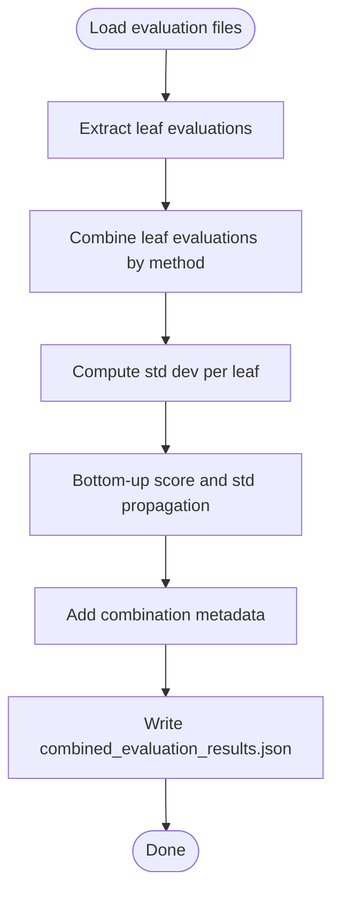

# Documentation Evaluation System

<cite>
**Referenced Files in This Document**
- [README.md](file://README.md)
- [config.py](file://src/config.py)
- [utils.py](file://src/utils.py)
- [run_evaluation_pipeline.sh](file://src/run_evaluation_pipeline.sh)
- [run_rubrics_pipeline.sh](file://src/run_rubrics_pipeline.sh)
- [judge.py](file://src/judge/judge.py)
- [combine_evaluations.py](file://src/judge/combine_evaluations.py)
- [visualize_evaluation.py](file://src/judge/visualize_evaluation.py)
- [generate_rubrics.py](file://src/rubrics_generator/generate_rubrics.py)
- [combine_rubrics.py](file://src/rubrics_generator/combine_rubrics.py)
- [visualize_rubrics.py](file://src/rubrics_generator/visualize_rubrics.py)
- [docs_navigator.py](file://src/tools/docs_navigator.py)
- [combined_rubrics.json](file://examples/OpenHands/rubrics/combined_rubrics.json)
- [reliability_assessment.json](file://examples/OpenHands/rubrics/reliability_assessment.json)
- [requirements.txt](file://requirements.txt)
</cite>

## Table of Contents
1. [Introduction](#introduction)
2. [Project Structure](#project-structure)
3. [Core Components](#core-components)
4. [Architecture Overview](#architecture-overview)
5. [Detailed Component Analysis](#detailed-component-analysis)
6. [Dependency Analysis](#dependency-analysis)
7. [Performance Considerations](#performance-considerations)
8. [Troubleshooting Guide](#troubleshooting-guide)
9. [Conclusion](#conclusion)
10. [Appendices](#appendices)

## Introduction
This document describes the CodeWikiBench evaluation system for multi-model documentation assessment and comparative analysis. It explains the evaluation engine architecture, batch processing capabilities, error handling mechanisms, and the multi-model evaluation approach including model selection, scoring methodologies, and comparative analysis frameworks. It also documents evaluation combination strategies, weighted averaging techniques, and statistical analysis methods, along with practical examples of pipeline execution, result interpretation, and visualization options. Finally, it addresses batch size optimization, performance considerations, and cost management for large-scale evaluations, and defines the evaluation metrics, scoring scales, and quality assessment criteria used across different documentation types and repositories.

## Project Structure
The repository is organized around two primary pipelines:
- Rubrics generation pipeline: Generates hierarchical rubrics from official documentation using multiple LLMs and combines them.
- Evaluation pipeline: Evaluates documentation against rubrics using multiple LLMs, aggregates results, and visualizes outcomes.

**Diagram sources**
- [run_rubrics_pipeline.sh](file://src/run_rubrics_pipeline.sh#L1-L320)
- [run_evaluation_pipeline.sh](file://src/run_evaluation_pipeline.sh#L1-L331)
- [generate_rubrics.py](file://src/rubrics_generator/generate_rubrics.py#L1-L257)
- [combine_rubrics.py](file://src/rubrics_generator/combine_rubrics.py#L1-L306)
- [visualize_rubrics.py](file://src/rubrics_generator/visualize_rubrics.py#L1-L168)
- [judge.py](file://src/judge/judge.py#L1-L551)
- [combine_evaluations.py](file://src/judge/combine_evaluations.py#L1-L375)
- [visualize_evaluation.py](file://src/judge/visualize_evaluation.py#L1-L250)
- [docs_navigator.py](file://src/tools/docs_navigator.py#L1-L345)
- [config.py](file://src/config.py#L1-L32)
- [utils.py](file://src/utils.py#L1-L86)

**Section sources**
- [README.md](file://README.md#L1-L136)
- [run_rubrics_pipeline.sh](file://src/run_rubrics_pipeline.sh#L1-L320)
- [run_evaluation_pipeline.sh](file://src/run_evaluation_pipeline.sh#L1-L331)

## Core Components
- Configuration and environment:
  - Centralized configuration for API keys, model selection, base URLs, and token limits.
- LLM utilities:
  - Unified LLM initialization and native async LLM invocation with token truncation safeguards.
- Documentation navigator:
  - Tool to traverse and retrieve content from structured documentation trees, enabling precise evaluation contexts.
- Rubrics generation:
  - Hierarchical rubrics creation from official documentation using multiple models, with optional tool-assisted navigation.
- Evaluation engine:
  - Multi-model evaluation against rubrics with batch processing, retry logic, and bottom-up scoring.
- Combination and visualization:
  - Statistical combination of multiple evaluation results and rubrics, plus multiple visualization formats.

**Section sources**
- [config.py](file://src/config.py#L1-L32)
- [utils.py](file://src/utils.py#L1-L86)
- [docs_navigator.py](file://src/tools/docs_navigator.py#L1-L345)
- [generate_rubrics.py](file://src/rubrics_generator/generate_rubrics.py#L1-L257)
- [judge.py](file://src/judge/judge.py#L1-L551)
- [combine_evaluations.py](file://src/judge/combine_evaluations.py#L1-L375)
- [visualize_evaluation.py](file://src/judge/visualize_evaluation.py#L1-L250)

## Architecture Overview
The system orchestrates multi-model evaluation and rubrics generation through shell pipelines that invoke Python modules. The evaluation pipeline:
- Runs evaluations for each model in sequence with configurable batch sizes.
- Optionally enables tool-assisted navigation for precise content retrieval.
- Performs post-hoc retry for error cases.
- Combines results using configurable aggregation methods (average, majority vote, weighted average, max, min).
- Produces standardized visualization outputs.

**Diagram sources**
- [run_evaluation_pipeline.sh](file://src/run_evaluation_pipeline.sh#L195-L285)
- [judge.py](file://src/judge/judge.py#L497-L519)
- [combine_evaluations.py](file://src/judge/combine_evaluations.py#L244-L374)
- [visualize_evaluation.py](file://src/judge/visualize_evaluation.py#L198-L248)
- [docs_navigator.py](file://src/tools/docs_navigator.py#L261-L285)
- [utils.py](file://src/utils.py#L28-L62)

## Detailed Component Analysis

### Evaluation Engine (judge.py)
- Multi-model evaluation:
  - Loads rubrics and documentation tree, collects leaf requirements, and evaluates them in batches.
  - Supports tool-assisted navigation for precise content retrieval.
- Batch processing:
  - Processes leaf requirements in configurable batches with concurrency and inter-batch delays.
- Error handling:
  - Robust JSON extraction with fallback text parsing.
  - Automatic retry for error cases with configurable max retries.
  - Special handling for rate-limit errors with backoff.
- Scoring:
  - Bottom-up weighted averaging for parent rubrics.
  - Per-requirement evaluation includes score, reasoning, and evidence.

**Diagram sources**
- [judge.py](file://src/judge/judge.py#L242-L384)
- [judge.py](file://src/judge/judge.py#L386-L432)

**Section sources**
- [judge.py](file://src/judge/judge.py#L21-L31)
- [judge.py](file://src/judge/judge.py#L65-L87)
- [judge.py](file://src/judge/judge.py#L242-L384)
- [judge.py](file://src/judge/judge.py#L386-L432)
- [judge.py](file://src/judge/judge.py#L434-L544)

### Evaluation Combination (combine_evaluations.py)
- Methods:
  - Average, majority vote, weighted average, max, min.
- Statistics:
  - Computes per-leaf combined score and standard deviation.
  - Bottom-up propagation of scores and standard deviations.
- Metadata:
  - Records combination method, number of evaluations, weights, and overall score with confidence range.

**Diagram sources**
- [combine_evaluations.py](file://src/judge/combine_evaluations.py#L216-L242)
- [combine_evaluations.py](file://src/judge/combine_evaluations.py#L107-L176)
- [combine_evaluations.py](file://src/judge/combine_evaluations.py#L178-L214)
- [combine_evaluations.py](file://src/judge/combine_evaluations.py#L244-L374)

**Section sources**
- [combine_evaluations.py](file://src/judge/combine_evaluations.py#L12-L22)
- [combine_evaluations.py](file://src/judge/combine_evaluations.py#L61-L84)
- [combine_evaluations.py](file://src/judge/combine_evaluations.py#L107-L176)
- [combine_evaluations.py](file://src/judge/combine_evaluations.py#L178-L214)
- [combine_evaluations.py](file://src/judge/combine_evaluations.py#L244-L374)

### Visualization (visualize_evaluation.py)
- Formats:
  - Summary, detailed, CSV, Markdown.
- Filters:
  - Min/max score thresholds for detailed views.
- Metrics:
  - Overall score, average leaf score, documented leaf percentage.

**Diagram sources**
- [visualize_evaluation.py](file://src/judge/visualize_evaluation.py#L198-L248)

**Section sources**
- [visualize_evaluation.py](file://src/judge/visualize_evaluation.py#L19-L30)
- [visualize_evaluation.py](file://src/judge/visualize_evaluation.py#L65-L84)
- [visualize_evaluation.py](file://src/judge/visualize_evaluation.py#L86-L121)
- [visualize_evaluation.py](file://src/judge/visualize_evaluation.py#L122-L162)
- [visualize_evaluation.py](file://src/judge/visualize_evaluation.py#L164-L196)
- [visualize_evaluation.py](file://src/judge/visualize_evaluation.py#L198-L248)

### Rubrics Generation and Combination
- Generation:
  - Uses LLMs to produce hierarchical rubrics from official documentation, optionally with tool navigation.
- Combination:
  - Uses semantic LLM analysis to merge rubrics from multiple models, with fallback merging if API calls fail.
- Visualization:
  - Converts rubrics to a graph and prints ASCII tree art.

**Diagram sources**
- [run_rubrics_pipeline.sh](file://src/run_rubrics_pipeline.sh#L167-L211)
- [generate_rubrics.py](file://src/rubrics_generator/generate_rubrics.py#L170-L254)
- [combine_rubrics.py](file://src/rubrics_generator/combine_rubrics.py#L232-L305)
- [visualize_rubrics.py](file://src/rubrics_generator/visualize_rubrics.py#L129-L167)
- [docs_navigator.py](file://src/tools/docs_navigator.py#L261-L285)
- [utils.py](file://src/utils.py#L28-L62)

**Section sources**
- [generate_rubrics.py](file://src/rubrics_generator/generate_rubrics.py#L14-L20)
- [generate_rubrics.py](file://src/rubrics_generator/generate_rubrics.py#L24-L98)
- [generate_rubrics.py](file://src/rubrics_generator/generate_rubrics.py#L170-L254)
- [combine_rubrics.py](file://src/rubrics_generator/combine_rubrics.py#L22-L151)
- [combine_rubrics.py](file://src/rubrics_generator/combine_rubrics.py#L153-L171)
- [combine_rubrics.py](file://src/rubrics_generator/combine_rubrics.py#L173-L200)
- [combine_rubrics.py](file://src/rubrics_generator/combine_rubrics.py#L202-L230)
- [combine_rubrics.py](file://src/rubrics_generator/combine_rubrics.py#L232-L305)
- [visualize_rubrics.py](file://src/rubrics_generator/visualize_rubrics.py#L53-L91)
- [visualize_rubrics.py](file://src/rubrics_generator/visualize_rubrics.py#L93-L127)
- [visualize_rubrics.py](file://src/rubrics_generator/visualize_rubrics.py#L129-L167)

### Documentation Navigator Tool
- Traverses structured documentation trees and retrieves content for evaluation prompts.
- Provides search capabilities and safe content depth limiting.

**Diagram sources**
- [docs_navigator.py](file://src/tools/docs_navigator.py#L11-L242)
- [docs_navigator.py](file://src/tools/docs_navigator.py#L244-L285)

**Section sources**
- [docs_navigator.py](file://src/tools/docs_navigator.py#L11-L43)
- [docs_navigator.py](file://src/tools/docs_navigator.py#L44-L81)
- [docs_navigator.py](file://src/tools/docs_navigator.py#L83-L112)
- [docs_navigator.py](file://src/tools/docs_navigator.py#L114-L180)
- [docs_navigator.py](file://src/tools/docs_navigator.py#L182-L241)
- [docs_navigator.py](file://src/tools/docs_navigator.py#L244-L285)

## Dependency Analysis
- External libraries:
  - LLM clients (OpenAI, Anthropic), Pydantic AI, NetworkX, TQDM, and others are declared in requirements.
- Internal dependencies:
  - All modules depend on shared configuration and utilities for model initialization and token handling.
- Coupling:
  - Pipelines orchestrate modules; modules are cohesive around specific responsibilities (generation, evaluation, combination, visualization).

**Diagram sources**
- [requirements.txt](file://requirements.txt#L1-L107)
- [utils.py](file://src/utils.py#L1-L86)
- [config.py](file://src/config.py#L1-L32)
- [judge.py](file://src/judge/judge.py#L1-L551)
- [combine_evaluations.py](file://src/judge/combine_evaluations.py#L1-L375)
- [visualize_evaluation.py](file://src/judge/visualize_evaluation.py#L1-L250)
- [generate_rubrics.py](file://src/rubrics_generator/generate_rubrics.py#L1-L257)
- [combine_rubrics.py](file://src/rubrics_generator/combine_rubrics.py#L1-L306)
- [docs_navigator.py](file://src/tools/docs_navigator.py#L1-L345)

**Section sources**
- [requirements.txt](file://requirements.txt#L1-L107)
- [config.py](file://src/config.py#L1-L32)
- [utils.py](file://src/utils.py#L1-L86)

## Performance Considerations
- Batch sizing:
  - Larger batches increase throughput but risk rate limits; smaller batches reduce latency per batch but increase overhead.
  - Recommended tuning: Start with default batch size and adjust based on observed rate limit events and token budget.
- Token limits:
  - Responses are truncated to configured maximum tokens to prevent oversized outputs.
- Cost estimation:
  - The evaluation logs token usage and estimates cost based on input/output token rates.
- Retry strategy:
  - Configurable retries with exponential backoff for transient failures and rate limit handling.
- Concurrency:
  - Batch-level concurrency maximizes throughput; inter-batch delays mitigate API throttling.

[No sources needed since this section provides general guidance]

## Troubleshooting Guide
- Rate limit handling:
  - The evaluation engine detects rate limit errors and applies a delay before continuing.
- JSON parsing fallback:
  - When LLM output is not valid JSON, the system falls back to text-based parsing and marks the result accordingly.
- Error leaves re-evaluation:
  - Leaves marked with specific error keywords are retried with enhanced prompts and capped retry counts.
- Missing files:
  - Pipelines validate presence of required directories and files (e.g., docs_tree.json) and exit with informative messages.
- Visualization issues:
  - If combined results are not found, the visualization script can fall back to individual model results or prompt for specifying a results file.

**Section sources**
- [judge.py](file://src/judge/judge.py#L322-L332)
- [judge.py](file://src/judge/judge.py#L307-L316)
- [judge.py](file://src/judge/judge.py#L98-L240)
- [run_evaluation_pipeline.sh](file://src/run_evaluation_pipeline.sh#L169-L185)
- [visualize_evaluation.py](file://src/judge/visualize_evaluation.py#L201-L217)

## Conclusion
CodeWikiBench provides a robust, multi-model evaluation framework for documentation quality assessment. Its architecture separates concerns across generation, evaluation, combination, and visualization, enabling scalable, reproducible, and statistically grounded comparative analyses. With configurable batch processing, resilient error handling, and flexible combination strategies, it supports large-scale evaluations across diverse documentation types and repositories.

[No sources needed since this section summarizes without analyzing specific files]

## Appendices

### Practical Examples

- Complete evaluation pipeline execution:
  - Run evaluation with multiple models and batch size:
    - bash ./run_evaluation_pipeline.sh --repo-name OpenHands --reference deepwiki-agent --models kimi-k2-instruct,gpt-oss-120b,gemini-2.5-flash --visualize --batch-size 4
  - Combine results with weighted average:
    - bash ./run_evaluation_pipeline.sh --repo-name OpenHands --reference deepwiki-agent --models kimi-k2-instruct --combination-method weighted_average --weights 0.4,0.6 --visualize
- Rubrics generation pipeline:
  - Generate rubrics with multiple models and visualize:
    - bash ./run_rubrics_pipeline.sh --repo-name OpenHands --models claude-sonnet-4,kimi-k2-instruct --visualize
- Visualization:
  - Summary view:
    - python judge/visualize_evaluation.py --repo-name OpenHands --reference deepwiki --format summary
  - Detailed view with filtered scores:
    - python judge/visualize_evaluation.py --repo-name OpenHands --reference deepwiki --format detailed --max-score 0.5
  - Export to CSV and Markdown:
    - python judge/visualize_evaluation.py --repo-name OpenHands --reference deepwiki --format csv
    - python judge/visualize_evaluation.py --repo-name OpenHands --reference deepwiki --format markdown

**Section sources**
- [README.md](file://README.md#L80-L108)
- [run_evaluation_pipeline.sh](file://src/run_evaluation_pipeline.sh#L70-L80)
- [run_rubrics_pipeline.sh](file://src/run_rubrics_pipeline.sh#L61-L73)

### Evaluation Metrics, Scoring Scales, and Quality Criteria
- Scoring scale:
  - Binary scoring for leaf-level requirements: 1 if documented, 0 if not.
  - Weighted averages propagate scores upward to parent rubrics.
- Reliability assessment:
  - Inter-model consistency metrics (semantic and structural) and overall reliability scores are computed and stored alongside rubrics.
- Quality criteria:
  - Rubrics define requirements with weights (Essential, Important, Supportive) and sub-tasks to ensure comprehensive coverage of documentation structure and content.

**Section sources**
- [judge.py](file://src/judge/judge.py#L36-L62)
- [combine_evaluations.py](file://src/judge/combine_evaluations.py#L178-L214)
- [combined_rubrics.json](file://examples/OpenHands/rubrics/combined_rubrics.json#L476-L493)
- [reliability_assessment.json](file://examples/OpenHands/rubrics/reliability_assessment.json#L1-L19)

### Batch Size Optimization and Cost Management
- Optimize batch size by monitoring rate limit events and adjusting to balance throughput and stability.
- Estimate costs using token usage reported by the evaluation engine and apply budget caps.
- Use combination methods (average, majority vote, weighted average) to improve robustness and reduce variance.

[No sources needed since this section provides general guidance]