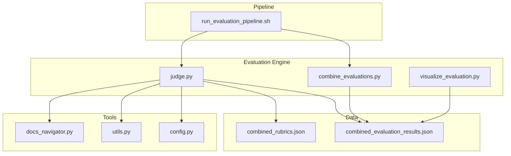
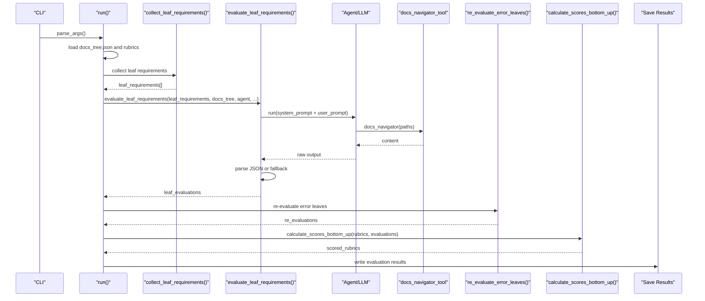
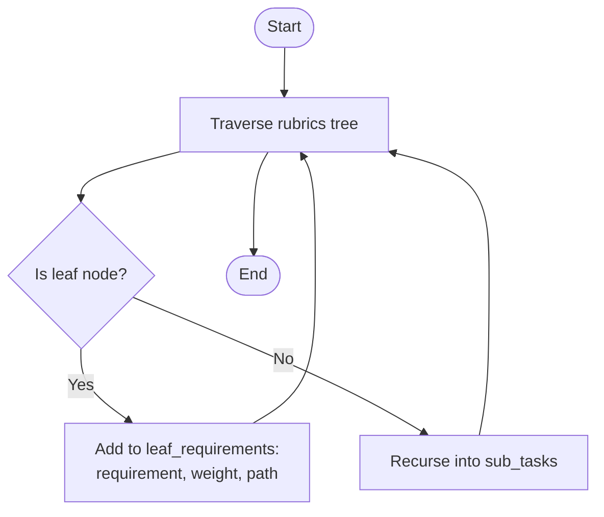
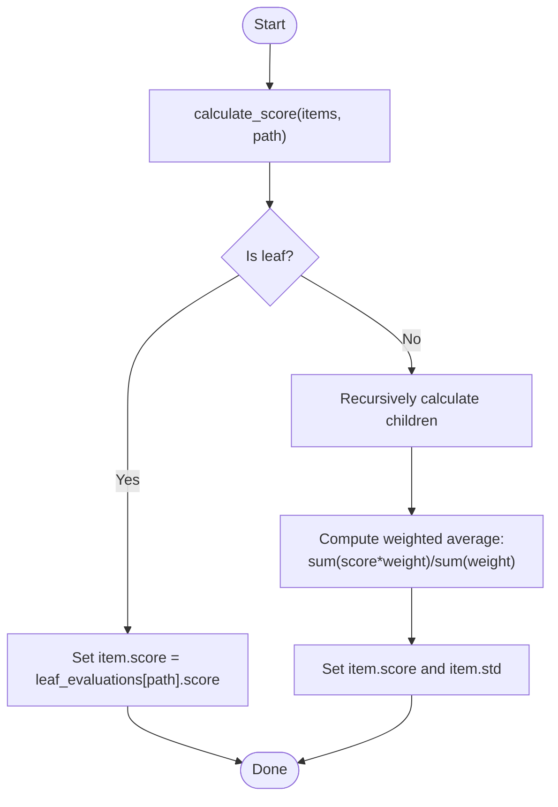
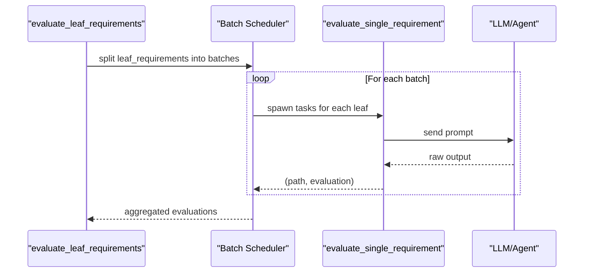
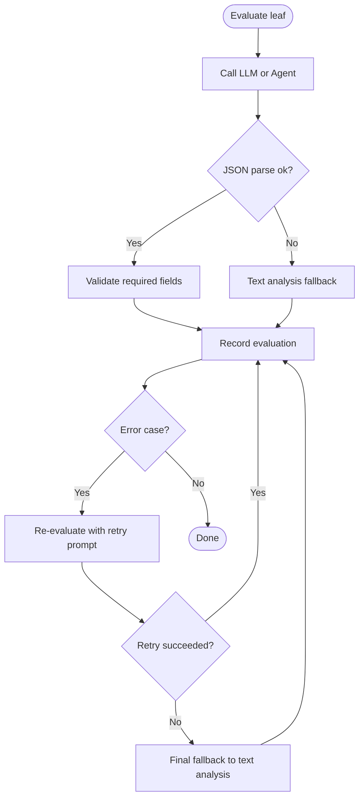
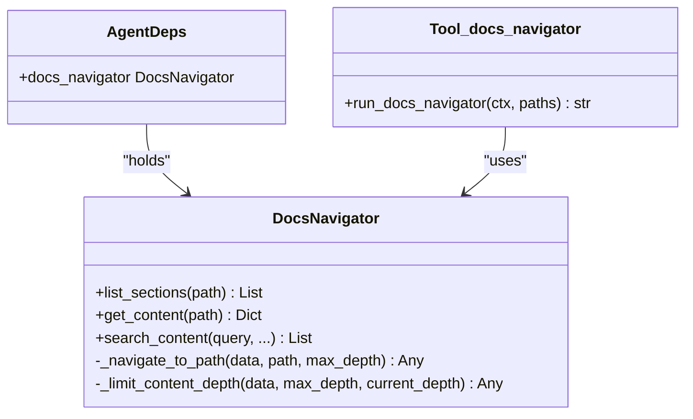
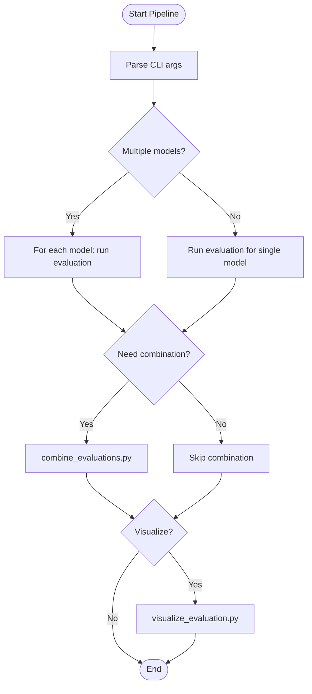
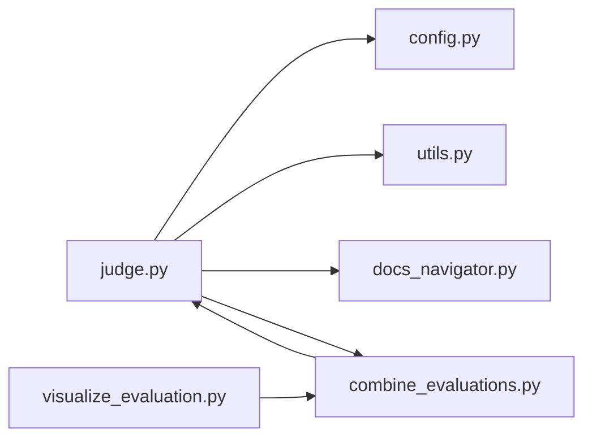

# Evaluation Engine

<cite>
**Referenced Files in This Document**
- [judge.py](file://src/judge/judge.py)
- [docs_navigator.py](file://src/tools/docs_navigator.py)
- [utils.py](file://src/utils.py)
- [config.py](file://src/config.py)
- [combine_evaluations.py](file://src/judge/combine_evaluations.py)
- [visualize_evaluation.py](file://src/judge/visualize_evaluation.py)
- [generate_rubrics.py](file://src/rubrics_generator/generate_rubrics.py)
- [run_evaluation_pipeline.sh](file://src/run_evaluation_pipeline.sh)
- [README.md](file://README.md)
- [combined_rubrics.json](file://examples/OpenHands/rubrics/combined_rubrics.json)
- [combined_evaluation_results.json](file://examples/OpenHands/deepwiki/evaluation_results/combined_evaluation_results.json)
</cite>

## Table of Contents
1. [Introduction](#introduction)
2. [Project Structure](#project-structure)
3. [Core Components](#core-components)
4. [Architecture Overview](#architecture-overview)
5. [Detailed Component Analysis](#detailed-component-analysis)
6. [Dependency Analysis](#dependency-analysis)
7. [Performance Considerations](#performance-considerations)
8. [Troubleshooting Guide](#troubleshooting-guide)
9. [Conclusion](#conclusion)
10. [Appendices](#appendices)

## Introduction
This document explains the evaluation engine that assesses multi-model documentation against hierarchical rubrics. It covers the binary scoring system (0 or 1), leaf requirement collection, bottom-up score calculation, asynchronous batch processing, concurrent evaluation, error handling and retries, evaluation prompts, document navigation integration, JSON parsing fallbacks, practical pipeline execution examples, scoring algorithms, performance optimization, rate limiting, retry logic, cost estimation, and evaluation metrics.

## Project Structure
The evaluation engine is centered in the judge module with supporting tools and utilities:
- Evaluation runner and scoring logic: src/judge/judge.py
- Document navigation tool: src/tools/docs_navigator.py
- LLM utilities and token truncation: src/utils.py
- Configuration and constants: src/config.py
- Result combination: src/judge/combine_evaluations.py
- Visualization: src/judge/visualize_evaluation.py
- Rubrics generation (for context): src/rubrics_generator/generate_rubrics.py
- Pipeline orchestration: src/run_evaluation_pipeline.sh
- Example rubrics and evaluation outputs: examples/OpenHands/rubrics/combined_rubrics.json, examples/OpenHands/deepwiki/evaluation_results/combined_evaluation_results.json

**Diagram sources**
- [judge.py](file://src/judge/judge.py#L1-L551)
- [docs_navigator.py](file://src/tools/docs_navigator.py#L1-L345)
- [utils.py](file://src/utils.py#L1-L86)
- [config.py](file://src/config.py#L1-L32)
- [combine_evaluations.py](file://src/judge/combine_evaluations.py#L1-L375)
- [visualize_evaluation.py](file://src/judge/visualize_evaluation.py#L1-L250)
- [run_evaluation_pipeline.sh](file://src/run_evaluation_pipeline.sh#L1-L331)
- [combined_rubrics.json](file://examples/OpenHands/rubrics/combined_rubrics.json#L1-L494)
- [combined_evaluation_results.json](file://examples/OpenHands/deepwiki/evaluation_results/combined_evaluation_results.json#L1-L782)

**Section sources**
- [README.md](file://README.md#L79-L108)
- [run_evaluation_pipeline.sh](file://src/run_evaluation_pipeline.sh#L1-L331)

## Core Components
- Binary scoring evaluator: Asks the LLM to decide 0 or 1 for each leaf requirement, with robust JSON parsing and fallback strategies.
- Document navigator tool: Provides safe, depth-limited access to documentation nodes and supports keyword search.
- Batched asynchronous evaluation: Processes leaf requirements concurrently with configurable batch sizes and inter-batch delays.
- Bottom-up scoring aggregation: Computes weighted averages from leaf scores up to rubric parents.
- Retry and error handling: Detects rate limits and parsing failures, retries with improved prompts, and falls back to text analysis.
- Result combination: Aggregates multiple model results using averaging, majority vote, weighted average, max, or min.
- Visualization: Summarizes scores, exports CSV/Markdown, and filters by score thresholds.

**Section sources**
- [judge.py](file://src/judge/judge.py#L36-L62)
- [judge.py](file://src/judge/judge.py#L65-L87)
- [judge.py](file://src/judge/judge.py#L242-L384)
- [judge.py](file://src/judge/judge.py#L386-L432)
- [judge.py](file://src/judge/judge.py#L89-L240)
- [combine_evaluations.py](file://src/judge/combine_evaluations.py#L107-L176)
- [visualize_evaluation.py](file://src/judge/visualize_evaluation.py#L198-L248)

## Architecture Overview
The evaluation engine orchestrates a multi-step process:
1. Load rubrics and documentation tree.
2. Collect leaf requirements and compute their paths.
3. Evaluate leaf requirements asynchronously in batches, using either a direct LLM call or a Pydantic AI agent with the document navigator tool.
4. Parse and validate JSON outputs; fall back to text analysis when needed.
5. Re-evaluate error cases with enhanced prompts and retry logic.
6. Aggregate scores bottom-up using weighted averages.
7. Save results and optionally combine outputs from multiple models.

**Diagram sources**
- [judge.py](file://src/judge/judge.py#L435-L544)
- [judge.py](file://src/judge/judge.py#L69-L87)
- [judge.py](file://src/judge/judge.py#L242-L384)
- [judge.py](file://src/judge/judge.py#L89-L240)
- [judge.py](file://src/judge/judge.py#L386-L432)
- [docs_navigator.py](file://src/tools/docs_navigator.py#L261-L285)

## Detailed Component Analysis

### Binary Scoring System and Leaf Requirement Collection
- Leaf identification: A rubric item is a leaf if it has no sub_tasks or sub_tasks is empty.
- Collection: Traverses the rubrics tree to gather leaf requirements with their weights and path indices.
- Output format: Each leaf evaluation yields a JSON object with fields for criteria, score (0 or 1), reasoning, and evidence.

**Diagram sources**
- [judge.py](file://src/judge/judge.py#L65-L87)

**Section sources**
- [judge.py](file://src/judge/judge.py#L65-L87)

### Bottom-Up Score Calculation
- Leaf scores are propagated upward.
- Parent scores are computed as a weighted average of child scores using their weights.
- The algorithm ensures all required fields exist and preserves evaluation metadata.

**Diagram sources**
- [judge.py](file://src/judge/judge.py#L386-L432)

**Section sources**
- [judge.py](file://src/judge/judge.py#L386-L432)

### Asynchronous Evaluation with Batch Processing
- Concurrent evaluation: Each leaf requirement is evaluated in parallel within a batch.
- Batch scheduling: Batches are processed sequentially with a small delay between batches to respect API limits.
- Per-requirement evaluation: Builds a prompt, invokes the LLM or agent, extracts JSON, validates fields, and records tokens.

**Diagram sources**
- [judge.py](file://src/judge/judge.py#L242-L384)

**Section sources**
- [judge.py](file://src/judge/judge.py#L242-L384)

### Concurrent Requirement Evaluation and Error Handling
- Detection: Rate limit errors are detected by inspecting error messages for rate limit indicators.
- Delay: On rate limit detection, the system waits before continuing.
- Parsing fallback: If JSON parsing fails, the system attempts to extract a score from the raw output text.
- Retry logic: Error leaves are re-evaluated with a retry prompt and limited retries, with final fallback to text analysis if all retries fail.

**Diagram sources**
- [judge.py](file://src/judge/judge.py#L89-L240)
- [judge.py](file://src/judge/judge.py#L242-L384)

**Section sources**
- [judge.py](file://src/judge/judge.py#L89-L240)
- [judge.py](file://src/judge/judge.py#L242-L384)

### Evaluation Prompt System and Document Navigation Integration
- System prompt: Defines binary scoring criteria and output format.
- User prompt: Provides the leaf requirement and the documentation tree; instructs the agent to use the document navigator tool to locate relevant content.
- Tool integration: The document navigator tool safely navigates the docs tree and structured docs, returns content with depth-limited context, and truncates long outputs to token limits.

**Diagram sources**
- [docs_navigator.py](file://src/tools/docs_navigator.py#L11-L345)

**Section sources**
- [judge.py](file://src/judge/judge.py#L36-L62)
- [docs_navigator.py](file://src/tools/docs_navigator.py#L261-L285)

### JSON Parsing Fallback Mechanisms
- Robust extraction: Finds the first and last braces to isolate JSON, cleans the string, and parses.
- Validation: Ensures the presence of required fields (e.g., score) and defaults if missing.
- Fallback: If parsing fails, attempts to detect a score in the text and marks the result with a fallback reasoning.

**Section sources**
- [judge.py](file://src/judge/judge.py#L282-L316)
- [judge.py](file://src/judge/judge.py#L162-L203)

### Practical Examples of Evaluation Pipeline Execution
- Single model evaluation: Run the evaluation script with a specific model and reference folder.
- Multi-model evaluation: Use the pipeline script to iterate over multiple models, enabling tools and retries.
- Result combination: Combine outputs from multiple models using averaging, majority vote, weighted average, max, or min.
- Visualization: Summarize results, export CSV/Markdown, or filter by score thresholds.

**Diagram sources**
- [run_evaluation_pipeline.sh](file://src/run_evaluation_pipeline.sh#L195-L302)
- [combine_evaluations.py](file://src/judge/combine_evaluations.py#L244-L374)
- [visualize_evaluation.py](file://src/judge/visualize_evaluation.py#L198-L248)

**Section sources**
- [README.md](file://README.md#L79-L108)
- [run_evaluation_pipeline.sh](file://src/run_evaluation_pipeline.sh#L195-L302)

### Scoring Algorithms and Metrics
- Binary scoring: Each leaf receives a 0 or 1 score.
- Weighted aggregation: Parents compute weighted averages of child scores.
- Combined scores: After combining multiple model results, leaf evaluations include standard deviation and individual scores.
- Overall metrics: Average leaf score, documented leaf percentage, and total requirements.

**Section sources**
- [judge.py](file://src/judge/judge.py#L386-L432)
- [combine_evaluations.py](file://src/judge/combine_evaluations.py#L178-L214)
- [visualize_evaluation.py](file://src/judge/visualize_evaluation.py#L32-L63)

### Cost Estimation and Performance Optimization
- Token accounting: Tracks input and output tokens per evaluation (placeholder values in current implementation).
- Cost estimation: Uses placeholder rates to estimate total cost; can be adapted to actual pricing.
- Optimization techniques:
  - Batch size tuning to balance throughput and rate limits.
  - Inter-batch delays to respect API quotas.
  - Tool response truncation to keep prompt sizes manageable.
  - Retry with backoff and targeted prompts for error cases.

**Section sources**
- [judge.py](file://src/judge/judge.py#L521-L543)
- [utils.py](file://src/utils.py#L12-L26)
- [run_evaluation_pipeline.sh](file://src/run_evaluation_pipeline.sh#L220-L232)

## Dependency Analysis
The evaluation engine depends on:
- LLM configuration and utilities for model selection and token handling.
- Document navigation tool for safe, depth-limited access to documentation.
- Result combination utilities for aggregating multiple model outputs.
- Visualization utilities for reporting and exporting results.

**Diagram sources**
- [judge.py](file://src/judge/judge.py#L1-L19)
- [config.py](file://src/config.py#L1-L32)
- [utils.py](file://src/utils.py#L1-L86)
- [docs_navigator.py](file://src/tools/docs_navigator.py#L1-L345)
- [combine_evaluations.py](file://src/judge/combine_evaluations.py#L1-L375)
- [visualize_evaluation.py](file://src/judge/visualize_evaluation.py#L1-L250)

**Section sources**
- [judge.py](file://src/judge/judge.py#L1-L19)
- [combine_evaluations.py](file://src/judge/combine_evaluations.py#L1-L375)

## Performance Considerations
- Concurrency: Use batch_size to tune concurrency; larger batches increase throughput but risk rate limits.
- Delays: Inter-batch sleep reduces API pressure; adjust based on provider quotas.
- Token limits: Use tool response truncation to prevent oversized prompts.
- Retry strategy: Limit retries and backoff to minimize wasted tokens on persistent failures.
- Cost control: Monitor token usage and consider switching to lower-cost models for bulk runs.

[No sources needed since this section provides general guidance]

## Troubleshooting Guide
Common issues and remedies:
- Rate limit errors: Detected by error message inspection; the system waits before continuing.
- Parsing failures: Falls back to text analysis; review raw outputs to improve prompts.
- Missing evaluation data: Bottom-up aggregation gracefully handles missing leaf evaluations.
- Tool errors: Verify docs_tree.json and structured_docs.json exist and are valid JSON.

**Section sources**
- [judge.py](file://src/judge/judge.py#L322-L332)
- [judge.py](file://src/judge/judge.py#L307-L316)
- [docs_navigator.py](file://src/tools/docs_navigator.py#L31-L43)

## Conclusion
The evaluation engine provides a robust, asynchronous, and extensible framework for multi-model documentation assessment. It enforces a strict binary scoring system, integrates document navigation for precise context retrieval, and applies resilient parsing and retry strategies. Bottom-up aggregation ensures coherent hierarchical scoring, while combination and visualization utilities support comprehensive reporting and analysis.

## Appendices

### Example Rubrics and Evaluation Outputs
- Hierarchical rubrics with weights and leaf requirements: examples/OpenHands/rubrics/combined_rubrics.json
- Combined evaluation results with scores, reasoning, and evidence: examples/OpenHands/deepwiki/evaluation_results/combined_evaluation_results.json

**Section sources**
- [combined_rubrics.json](file://examples/OpenHands/rubrics/combined_rubrics.json#L1-L494)
- [combined_evaluation_results.json](file://examples/OpenHands/deepwiki/evaluation_results/combined_evaluation_results.json#L1-L782)