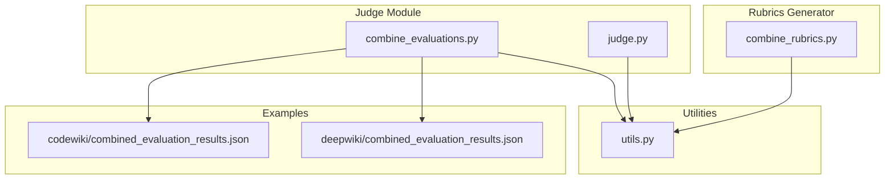
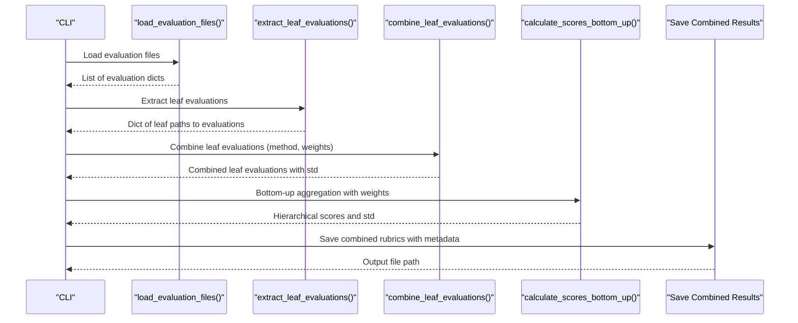
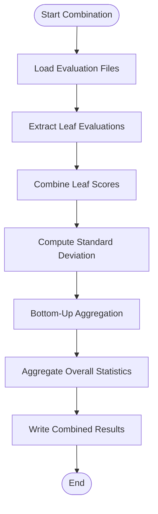
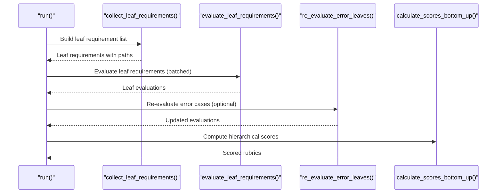
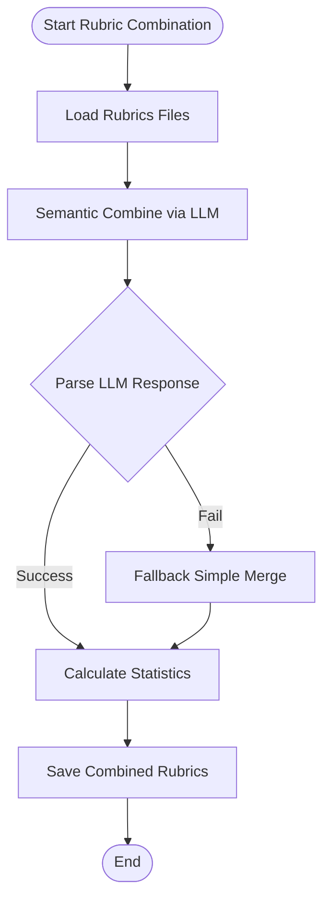
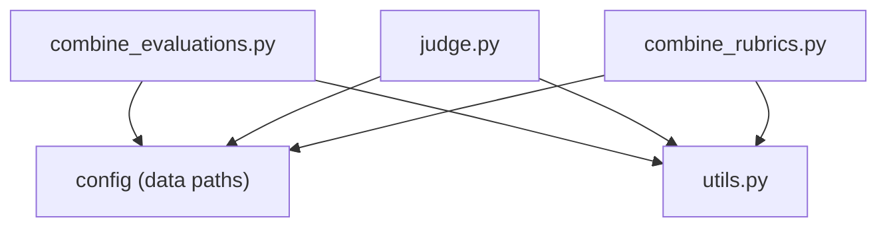

# Evaluation Result Combination

<cite>
**Referenced Files in This Document**
- [combine_evaluations.py](file://src/judge/combine_evaluations.py)
- [judge.py](file://src/judge/judge.py)
- [combine_rubrics.py](file://src/rubrics_generator/combine_rubrics.py)
- [utils.py](file://src/utils.py)
- [combined_evaluation_results.json](file://examples/OpenHands/codewiki/evaluation_results/combined_evaluation_results.json)
- [combined_evaluation_results.json](file://examples/OpenHands/deepwiki/evaluation_results/combined_evaluation_results.json)
</cite>

## Table of Contents
1. [Introduction](#introduction)
2. [Project Structure](#project-structure)
3. [Core Components](#core-components)
4. [Architecture Overview](#architecture-overview)
5. [Detailed Component Analysis](#detailed-component-analysis)
6. [Dependency Analysis](#dependency-analysis)
7. [Performance Considerations](#performance-considerations)
8. [Troubleshooting Guide](#troubleshooting-guide)
9. [Conclusion](#conclusion)
10. [Appendices](#appendices)

## Introduction
This document provides comprehensive documentation for the evaluation result combination system, focusing on multi-model evaluation aggregation and statistical analysis. The system combines evaluation results from multiple LLMs using various combination strategies, calculates uncertainty quantification, and produces standardized reports with metadata. It supports multiple combination methods (simple average, majority vote, weighted average, max, min), standard deviation propagation for uncertainty quantification, and bottom-up hierarchical aggregation according to rubric weights. The pipeline integrates with the evaluation framework to produce combined rubrics with scores, standard deviations, reasoning traces, and evidence summaries.

## Project Structure
The evaluation result combination system is implemented primarily in the judge module and rubrics generator module, with supporting utilities for LLM interactions and configuration. The examples directory contains concrete combined evaluation results demonstrating the system's output format.

**Diagram sources**
- [combine_evaluations.py](file://src/judge/combine_evaluations.py#L1-L375)
- [judge.py](file://src/judge/judge.py#L1-L551)
- [combine_rubrics.py](file://src/rubrics_generator/combine_rubrics.py#L1-L306)
- [utils.py](file://src/utils.py#L1-L86)
- [combined_evaluation_results.json](file://examples/OpenHands/codewiki/evaluation_results/combined_evaluation_results.json#L1-L759)
- [combined_evaluation_results.json](file://examples/OpenHands/deepwiki/evaluation_results/combined_evaluation_results.json#L1-L782)

**Section sources**
- [combine_evaluations.py](file://src/judge/combine_evaluations.py#L1-L375)
- [judge.py](file://src/judge/judge.py#L1-L551)
- [combine_rubrics.py](file://src/rubrics_generator/combine_rubrics.py#L1-L306)
- [utils.py](file://src/utils.py#L1-L86)

## Core Components
- Evaluation result combination engine: Implements multiple combination strategies, standard deviation propagation, and bottom-up hierarchical aggregation.
- Evaluation runner: Generates leaf-level evaluations using LLMs, with retry logic and error handling.
- Rubric combination: Semantically merges rubrics from multiple sources using LLM assistance.
- Utilities: Provides LLM client configuration, token handling, and embedding utilities.

Key capabilities:
- Combination strategies: average, majority vote, weighted average, max, min
- Uncertainty quantification: sample standard deviation for scores; weighted combination of standard deviations for hierarchical aggregation
- Hierarchical aggregation: bottom-up weighted averaging respecting rubric weights
- Metadata: combination method, number of evaluations, weights, confidence thresholds, overall score and standard deviation

**Section sources**
- [combine_evaluations.py](file://src/judge/combine_evaluations.py#L61-L176)
- [combine_evaluations.py](file://src/judge/combine_evaluations.py#L178-L214)
- [judge.py](file://src/judge/judge.py#L242-L384)
- [combine_rubrics.py](file://src/rubrics_generator/combine_rubrics.py#L22-L151)

## Architecture Overview
The evaluation result combination system orchestrates the following workflow:
1. Load evaluation files from a repository and reference documentation.
2. Extract leaf-level evaluations and combine them using the selected method.
3. Propagate uncertainties (standard deviations) bottom-up according to rubric weights.
4. Aggregate overall statistics and attach metadata.
5. Save combined results with rubric hierarchy, scores, standard deviations, reasoning, and evidence.

**Diagram sources**
- [combine_evaluations.py](file://src/judge/combine_evaluations.py#L216-L242)
- [combine_evaluations.py](file://src/judge/combine_evaluations.py#L269-L278)
- [combine_evaluations.py](file://src/judge/combine_evaluations.py#L280-L285)
- [combine_evaluations.py](file://src/judge/combine_evaluations.py#L322-L338)

## Detailed Component Analysis

### Evaluation Result Combination Engine
The combination engine performs:
- Leaf evaluation extraction from rubric structures.
- Score combination using multiple strategies.
- Standard deviation computation and propagation.
- Bottom-up hierarchical aggregation with weighted averages.
- Metadata generation for reporting.

**Diagram sources**
- [combine_evaluations.py](file://src/judge/combine_evaluations.py#L216-L242)
- [combine_evaluations.py](file://src/judge/combine_evaluations.py#L269-L278)
- [combine_evaluations.py](file://src/judge/combine_evaluations.py#L280-L285)
- [combine_evaluations.py](file://src/judge/combine_evaluations.py#L322-L338)

Implementation highlights:
- Combination methods:
  - Average: arithmetic mean of scores.
  - Majority vote: most frequent integer score among evaluators.
  - Weighted average: applies provided weights; falls back to average if insufficient weights.
  - Max/Min: extreme value aggregation.
- Standard deviation propagation:
  - Per-leaf standard deviation computed from sample standard deviation.
  - Hierarchical standard deviation computed using weighted combination formula.
- Bottom-up aggregation:
  - Computes weighted average of child scores and standard deviations.
  - Respects rubric weights for hierarchical totals.

Practical examples:
- Combining results from multiple LLMs for the same rubric item yields a combined score and standard deviation reflecting evaluator disagreement.
- Using weighted average with domain expertise weights can emphasize trusted evaluators.
- Bottom-up aggregation ensures top-level scores reflect rubric weighting.

**Section sources**
- [combine_evaluations.py](file://src/judge/combine_evaluations.py#L61-L84)
- [combine_evaluations.py](file://src/judge/combine_evaluations.py#L86-L105)
- [combine_evaluations.py](file://src/judge/combine_evaluations.py#L107-L176)
- [combine_evaluations.py](file://src/judge/combine_evaluations.py#L178-L214)

### Evaluation Runner and Retry Logic
The evaluation runner:
- Collects leaf requirements from rubric hierarchies.
- Evaluates each requirement using LLMs with batch processing.
- Implements robust retry logic for parsing errors and API issues.
- Aggregates scores bottom-up and saves results.

**Diagram sources**
- [judge.py](file://src/judge/judge.py#L69-L87)
- [judge.py](file://src/judge/judge.py#L242-L384)
- [judge.py](file://src/judge/judge.py#L386-L432)
- [judge.py](file://src/judge/judge.py#L434-L543)

Key features:
- Batch processing to improve throughput.
- Retry logic with exponential backoff for parsing and API errors.
- Token accounting and cost estimation.
- Summary statistics for evaluation quality.

**Section sources**
- [judge.py](file://src/judge/judge.py#L242-L384)
- [judge.py](file://src/judge/judge.py#L386-L432)
- [judge.py](file://src/judge/judge.py#L434-L543)

### Rubric Combination Engine
The rubric combination engine:
- Loads rubrics from multiple sources.
- Uses LLM assistance to semantically merge rubrics.
- Falls back to simple merge if LLM calls fail.
- Calculates rubric statistics and metadata.

**Diagram sources**
- [combine_rubrics.py](file://src/rubrics_generator/combine_rubrics.py#L173-L200)
- [combine_rubrics.py](file://src/rubrics_generator/combine_rubrics.py#L22-L151)
- [combine_rubrics.py](file://src/rubrics_generator/combine_rubrics.py#L232-L303)

**Section sources**
- [combine_rubrics.py](file://src/rubrics_generator/combine_rubrics.py#L22-L151)
- [combine_rubrics.py](file://src/rubrics_generator/combine_rubrics.py#L173-L200)
- [combine_rubrics.py](file://src/rubrics_generator/combine_rubrics.py#L232-L303)

### Utilities and Configuration
Utilities provide:
- LLM client initialization with configurable base URL and API key.
- Token encoding and truncation utilities.
- Asynchronous LLM and embeddings clients.

These utilities support both evaluation and combination workflows by ensuring consistent LLM interactions and token handling.

**Section sources**
- [utils.py](file://src/utils.py#L28-L62)
- [utils.py](file://src/utils.py#L12-L26)
- [utils.py](file://src/utils.py#L72-L82)

## Dependency Analysis
The combination system depends on:
- Configuration utilities for data paths and model settings.
- LLM utilities for client initialization and inference.
- Evaluation outputs in JSON format with rubric hierarchies and leaf evaluations.

**Diagram sources**
- [combine_evaluations.py](file://src/judge/combine_evaluations.py#L10-L10)
- [judge.py](file://src/judge/judge.py#L19-L19)
- [combine_rubrics.py](file://src/rubrics_generator/combine_rubrics.py#L8-L8)
- [utils.py](file://src/utils.py#L1-L86)

**Section sources**
- [combine_evaluations.py](file://src/judge/combine_evaluations.py#L1-L11)
- [judge.py](file://src/judge/judge.py#L1-L20)
- [combine_rubrics.py](file://src/rubrics_generator/combine_rubrics.py#L1-L12)
- [utils.py](file://src/utils.py#L1-L11)

## Performance Considerations
- Combination strategies:
  - Simple average and majority vote are computationally efficient.
  - Weighted average and standard deviation computations scale linearly with the number of evaluators.
- Bottom-up aggregation:
  - Hierarchical aggregation is linear in the number of rubric items.
- I/O and JSON parsing:
  - Loading multiple evaluation files and writing combined results are I/O bound; batching reduces overhead.
- Retry logic:
  - Retry with exponential backoff mitigates transient API failures and improves robustness.

[No sources needed since this section provides general guidance]

## Troubleshooting Guide
Common issues and resolutions:
- Missing evaluation files:
  - Ensure the evaluation results directory contains JSON files without "combined" in the filename.
- Insufficient weights for weighted average:
  - The system falls back to simple average if weights do not match the number of evaluations.
- Parsing errors and fallbacks:
  - The evaluation runner includes automatic parsing fallback and retry mechanisms for error cases.
- Confidence thresholds:
  - The combination script supports a confidence threshold parameter; adjust as needed for filtering low-confidence evaluations.

**Section sources**
- [combine_evaluations.py](file://src/judge/combine_evaluations.py#L225-L227)
- [combine_evaluations.py](file://src/judge/combine_evaluations.py#L263-L267)
- [judge.py](file://src/judge/judge.py#L98-L240)
- [judge.py](file://src/judge/judge.py#L366-L383)

## Conclusion
The evaluation result combination system provides a robust framework for aggregating multi-model evaluation results with uncertainty quantification and hierarchical scoring. It supports multiple combination strategies, propagates standard deviations through rubric hierarchies, and produces standardized reports with metadata for downstream analysis. The system integrates seamlessly with the evaluation pipeline and rubric combination workflow, enabling comprehensive comparative analysis and benchmarking across different models and configurations.

[No sources needed since this section summarizes without analyzing specific files]

## Appendices

### Export Formats and Reporting
- Combined evaluation results are exported as JSON with:
  - Rubric hierarchy with scores and standard deviations.
  - Leaf evaluation metadata including reasoning and evidence.
  - Combination metadata (method, number of evaluations, weights, confidence threshold, overall score and standard deviation).
- Example outputs are available in the examples directory for both codewiki and deepwiki datasets.

**Section sources**
- [combine_evaluations.py](file://src/judge/combine_evaluations.py#L328-L336)
- [combined_evaluation_results.json](file://examples/OpenHands/codewiki/evaluation_results/combined_evaluation_results.json#L1-L759)
- [combined_evaluation_results.json](file://examples/OpenHands/deepwiki/evaluation_results/combined_evaluation_results.json#L1-L782)

### Statistical Methods and Metrics
- Aggregation metrics:
  - Per-leaf: average, majority vote, weighted average, max, min.
  - Hierarchical: weighted average of children scores and standard deviations.
- Uncertainty quantification:
  - Sample standard deviation for per-leaf scores.
  - Weighted combination formula for hierarchical standard deviations.
- Comparative analysis:
  - Overall score and standard deviation computed from top-level rubric weights.
  - Comparison across different combination methods and weights.

**Section sources**
- [combine_evaluations.py](file://src/judge/combine_evaluations.py#L61-L105)
- [combine_evaluations.py](file://src/judge/combine_evaluations.py#L178-L214)