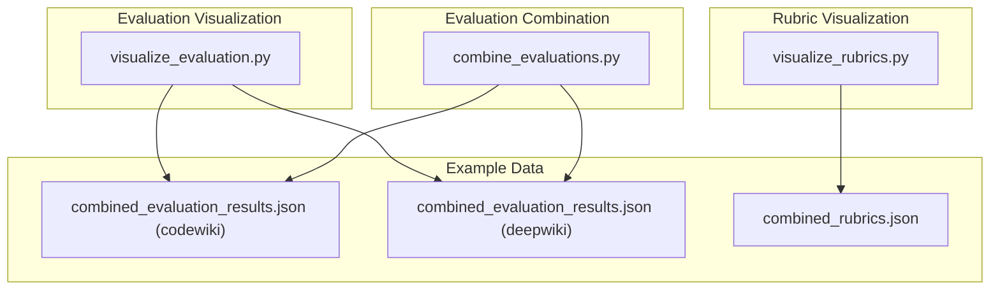
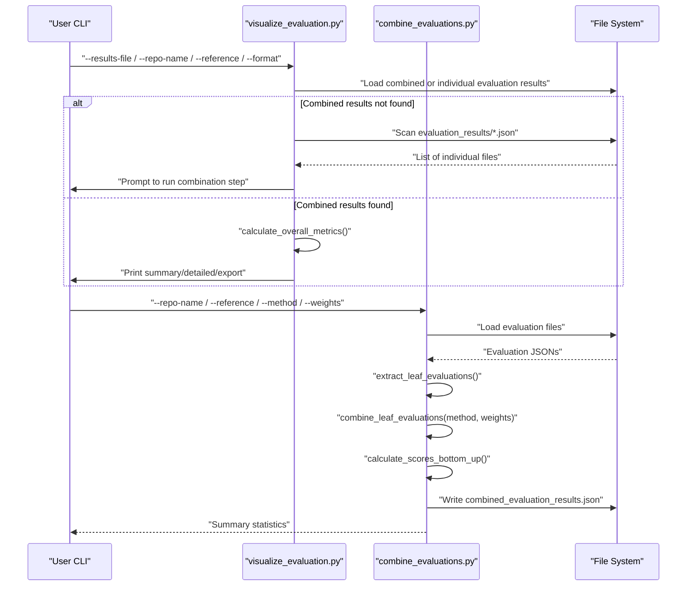
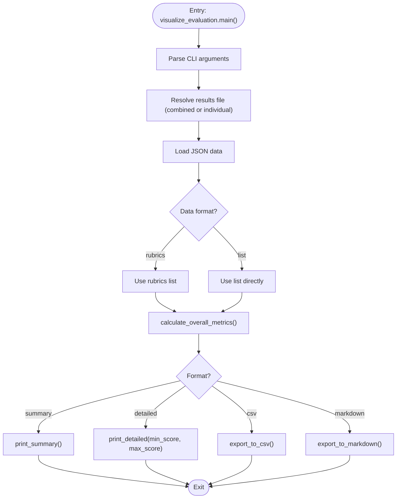
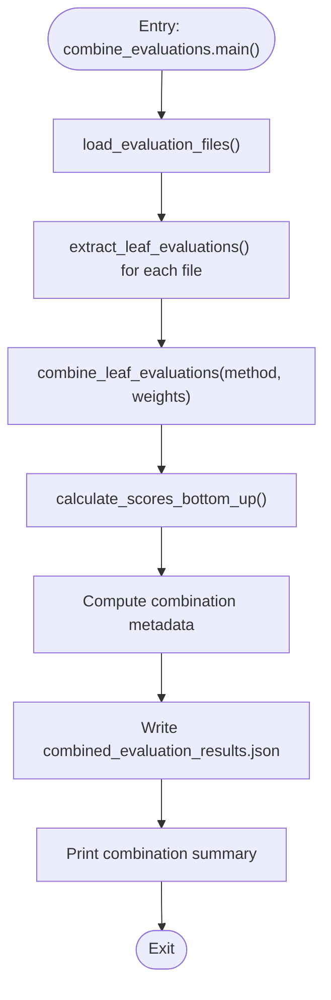
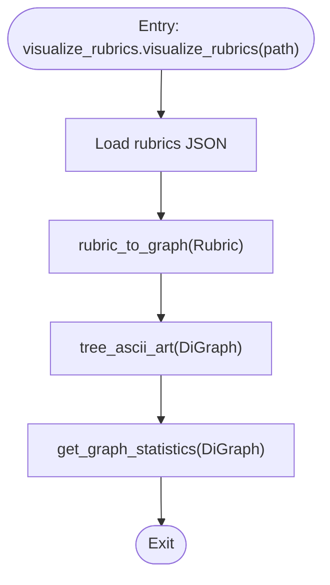
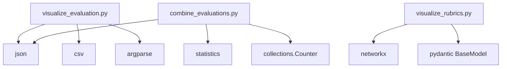

# Evaluation Visualization and Reporting

<cite>
**Referenced Files in This Document**
- [visualize_evaluation.py](file://src/judge/visualize_evaluation.py)
- [combine_evaluations.py](file://src/judge/combine_evaluations.py)
- [visualize_rubrics.py](file://src/rubrics_generator/visualize_rubrics.py)
- [combined_evaluation_results.json (codewiki)](file://examples/OpenHands/codewiki/evaluation_results/combined_evaluation_results.json)
- [combined_evaluation_results.json (deepwiki)](file://examples/OpenHands/deepwiki/evaluation_results/combined_evaluation_results.json)
- [combined_rubrics.json](file://examples/OpenHands/rubrics/combined_rubrics.json)
</cite>

## Table of Contents
1. [Introduction](#introduction)
2. [Project Structure](#project-structure)
3. [Core Components](#core-components)
4. [Architecture Overview](#architecture-overview)
5. [Detailed Component Analysis](#detailed-component-analysis)
6. [Dependency Analysis](#dependency-analysis)
7. [Performance Considerations](#performance-considerations)
8. [Troubleshooting Guide](#troubleshooting-guide)
9. [Conclusion](#conclusion)
10. [Appendices](#appendices)

## Introduction
This document describes the evaluation visualization and reporting system that presents rubric-based evaluation results in an interactive and comparative manner. It explains how to generate summaries, export results to multiple formats, and analyze trends across models and datasets. The system supports:
- Overall score and leaf coverage metrics
- Category-level breakdowns
- Low-scoring requirement identification
- Export to CSV and Markdown
- Comparative analysis across multiple evaluation runs
- Rubric hierarchy visualization

## Project Structure
The evaluation visualization and reporting system is organized around three primary modules:
- Evaluation visualization: prints summaries, detailed breakdowns, and exports results
- Evaluation combination: merges multiple LLM evaluation runs into a combined dataset
- Rubric visualization: renders rubric hierarchies as ASCII trees

**Diagram sources**
- [visualize_evaluation.py](file://src/judge/visualize_evaluation.py#L198-L250)
- [combine_evaluations.py](file://src/judge/combine_evaluations.py#L244-L375)
- [visualize_rubrics.py](file://src/rubrics_generator/visualize_rubrics.py#L129-L168)
- [combined_evaluation_results.json (codewiki)](file://examples/OpenHands/codewiki/evaluation_results/combined_evaluation_results.json#L1-L120)
- [combined_evaluation_results.json (deepwiki)](file://examples/OpenHands/deepwiki/evaluation_results/combined_evaluation_results.json#L1-L120)
- [combined_rubrics.json](file://examples/OpenHands/rubrics/combined_rubrics.json#L1-L60)

**Section sources**
- [visualize_evaluation.py](file://src/judge/visualize_evaluation.py#L1-L250)
- [combine_evaluations.py](file://src/judge/combine_evaluations.py#L1-L375)
- [visualize_rubrics.py](file://src/rubrics_generator/visualize_rubrics.py#L1-L168)

## Core Components
- Evaluation visualization module
  - Computes overall and leaf-level metrics
  - Prints summary and detailed breakdowns
  - Filters results by score thresholds
  - Exports to CSV and Markdown
  - Loads combined or individual evaluation results
- Evaluation combination module
  - Extracts leaf-level evaluations from multiple runs
  - Combines scores using configurable methods (average, majority vote, weighted average, max, min)
  - Propagates scores bottom-up to compute parent rubric scores and standard deviations
  - Adds combination metadata (method, counts, overall score and standard deviation)
- Rubric visualization module
  - Converts rubric JSON into a NetworkX graph
  - Renders rubric hierarchy as ASCII art
  - Computes graph statistics (nodes, edges, leaf nodes, root nodes, weight distribution, max depth)

**Section sources**
- [visualize_evaluation.py](file://src/judge/visualize_evaluation.py#L32-L196)
- [combine_evaluations.py](file://src/judge/combine_evaluations.py#L28-L372)
- [visualize_rubrics.py](file://src/rubrics_generator/visualize_rubrics.py#L53-L127)

## Architecture Overview
The system orchestrates evaluation results across multiple models and datasets, enabling comparative analysis and automated reporting.

**Diagram sources**
- [visualize_evaluation.py](file://src/judge/visualize_evaluation.py#L198-L250)
- [combine_evaluations.py](file://src/judge/combine_evaluations.py#L244-L375)

## Detailed Component Analysis

### Evaluation Visualization Module
This module provides:
- Overall metrics computation (overall score, average leaf score, documented leaves, coverage percentage)
- Summary printing with top-level category scores
- Detailed breakdown with optional score filters
- Export to CSV and Markdown
- Automatic fallback to individual results if combined results are unavailable

**Diagram sources**
- [visualize_evaluation.py](file://src/judge/visualize_evaluation.py#L198-L250)
- [visualize_evaluation.py](file://src/judge/visualize_evaluation.py#L32-L196)

**Section sources**
- [visualize_evaluation.py](file://src/judge/visualize_evaluation.py#L19-L30)
- [visualize_evaluation.py](file://src/judge/visualize_evaluation.py#L32-L63)
- [visualize_evaluation.py](file://src/judge/visualize_evaluation.py#L65-L85)
- [visualize_evaluation.py](file://src/judge/visualize_evaluation.py#L86-L121)
- [visualize_evaluation.py](file://src/judge/visualize_evaluation.py#L122-L163)
- [visualize_evaluation.py](file://src/judge/visualize_evaluation.py#L164-L196)
- [visualize_evaluation.py](file://src/judge/visualize_evaluation.py#L198-L250)

### Evaluation Combination Module
This module:
- Loads multiple evaluation files
- Extracts leaf-level evaluations and paths
- Combines scores using configurable methods
- Calculates standard deviations and propagates them bottom-up
- Writes combined results with metadata

**Diagram sources**
- [combine_evaluations.py](file://src/judge/combine_evaluations.py#L244-L375)
- [combine_evaluations.py](file://src/judge/combine_evaluations.py#L107-L176)
- [combine_evaluations.py](file://src/judge/combine_evaluations.py#L178-L214)

**Section sources**
- [combine_evaluations.py](file://src/judge/combine_evaluations.py#L12-L22)
- [combine_evaluations.py](file://src/judge/combine_evaluations.py#L216-L242)
- [combine_evaluations.py](file://src/judge/combine_evaluations.py#L269-L286)
- [combine_evaluations.py](file://src/judge/combine_evaluations.py#L287-L321)
- [combine_evaluations.py](file://src/judge/combine_evaluations.py#L322-L341)
- [combine_evaluations.py](file://src/judge/combine_evaluations.py#L342-L372)

### Rubric Visualization Module
This module:
- Converts rubric JSON into a NetworkX DiGraph
- Builds ASCII art representation of the rubric hierarchy
- Computes graph statistics (nodes, edges, leaf/root counts, weight distribution, max depth)

**Diagram sources**
- [visualize_rubrics.py](file://src/rubrics_generator/visualize_rubrics.py#L129-L168)
- [visualize_rubrics.py](file://src/rubrics_generator/visualize_rubrics.py#L53-L91)
- [visualize_rubrics.py](file://src/rubrics_generator/visualize_rubrics.py#L93-L127)

**Section sources**
- [visualize_rubrics.py](file://src/rubrics_generator/visualize_rubrics.py#L53-L91)
- [visualize_rubrics.py](file://src/rubrics_generator/visualize_rubrics.py#L93-L127)
- [visualize_rubrics.py](file://src/rubrics_generator/visualize_rubrics.py#L129-L168)

## Dependency Analysis
The visualization and reporting system depends on:
- Evaluation result JSONs (combined or individual)
- CLI argument parsing for visualization and combination
- JSON and CSV/Markdown export libraries
- NetworkX for rubric graph construction

**Diagram sources**
- [visualize_evaluation.py](file://src/judge/visualize_evaluation.py#L12-L17)
- [combine_evaluations.py](file://src/judge/combine_evaluations.py#L1-L10)
- [visualize_rubrics.py](file://src/rubrics_generator/visualize_rubrics.py#L1-L6)

**Section sources**
- [visualize_evaluation.py](file://src/judge/visualize_evaluation.py#L12-L17)
- [combine_evaluations.py](file://src/judge/combine_evaluations.py#L1-L10)
- [visualize_rubrics.py](file://src/rubrics_generator/visualize_rubrics.py#L1-L6)

## Performance Considerations
- Visualization and export operations are linear in the number of leaf items and rubric nodes.
- Combination operations scale with the number of evaluation files and leaf items.
- Graph construction for rubric visualization scales with the number of rubric nodes.
- Recommendations:
  - Prefer combined results for large-scale comparisons to minimize repeated parsing.
  - Use score filters to reduce output verbosity for detailed views.
  - Cache combined results to avoid recomputation across runs.

[No sources needed since this section provides general guidance]

## Troubleshooting Guide
Common issues and resolutions:
- Missing combined results file
  - The visualization module falls back to individual evaluation files; if multiple files are found, it prompts to run the combination step first.
- Unexpected JSON structure
  - The visualization module validates the structure and prints an error if the JSON does not contain expected fields.
- No evaluation result files found
  - The visualization module checks the evaluation results directory and exits with a message if no JSON files are present.
- Insufficient evaluation files for combination
  - The combination module requires at least two evaluation files; otherwise, it exits with an error.

**Section sources**
- [visualize_evaluation.py](file://src/judge/visualize_evaluation.py#L198-L250)
- [visualize_evaluation.py](file://src/judge/visualize_evaluation.py#L201-L218)
- [combine_evaluations.py](file://src/judge/combine_evaluations.py#L244-L254)

## Conclusion
The evaluation visualization and reporting system provides a robust foundation for interactive result presentation and comparative analysis. It computes meaningful metrics, supports multiple export formats, and enables rubric hierarchy exploration. By combining results across models and datasets, stakeholders can generate automated reports and identify areas for improvement efficiently.

[No sources needed since this section summarizes without analyzing specific files]

## Appendices

### Practical Examples

- Creating a visual report
  - Use the visualization module to print a summary or detailed breakdown of evaluation results.
  - Filter results by score thresholds to focus on low-performing requirements.
  - Export to CSV or Markdown for stakeholder review.

- Generating comparative charts across models
  - Combine evaluation results from multiple LLMs using the combination module with a chosen method (average, majority vote, weighted average, max, min).
  - Use the visualization module to compare overall scores and leaf coverage across models.

- Exporting evaluation results
  - Export to CSV for spreadsheet analysis.
  - Export to Markdown for readable documentation and sharing.

- Rubric hierarchy displays
  - Render rubric hierarchies as ASCII trees for quick understanding of structure and weighting.

**Section sources**
- [visualize_evaluation.py](file://src/judge/visualize_evaluation.py#L19-L30)
- [visualize_evaluation.py](file://src/judge/visualize_evaluation.py#L122-L196)
- [combine_evaluations.py](file://src/judge/combine_evaluations.py#L12-L22)
- [combine_evaluations.py](file://src/judge/combine_evaluations.py#L269-L286)
- [visualize_rubrics.py](file://src/rubrics_generator/visualize_rubrics.py#L129-L168)

### Example Data References
- Combined evaluation results (codewiki)
  - Demonstrates scored rubrics with leaf-level evaluations, scores, and standard deviations.
- Combined evaluation results (deepwiki)
  - Mirrors the structure for comparative analysis across datasets.
- Combined rubrics
  - Provides the rubric hierarchy used to interpret evaluation results.

**Section sources**
- [combined_evaluation_results.json (codewiki)](file://examples/OpenHands/codewiki/evaluation_results/combined_evaluation_results.json#L1-L120)
- [combined_evaluation_results.json (deepwiki)](file://examples/OpenHands/deepwiki/evaluation_results/combined_evaluation_results.json#L1-L120)
- [combined_rubrics.json](file://examples/OpenHands/rubrics/combined_rubrics.json#L1-L60)