# DeepWiki Documentation Crawler

<cite>
**Referenced Files in This Document**
- [crawl_deepwiki_docs.py](file://src/docs_parser/crawl_deepwiki_docs.py)
- [parse_generated_docs.py](file://src/docs_parser/parse_generated_docs.py)
- [config.py](file://src/config.py)
- [utils.py](file://src/utils.py)
- [docs_navigator.py](file://src/tools/docs_navigator.py)
- [parse_official_docs.py](file://src/docs_parser/parse_official_docs.py)
- [README.md](file://README.md)
- [requirements.txt](file://requirements.txt)
- [content_0.md](file://examples/OpenHands/deepwiki/docs/content_0.md)
- [docs_tree.json](file://examples/OpenHands/deepwiki/docs_tree.json)
- [structured_docs.json](file://examples/OpenHands/deepwiki/structured_docs.json)
</cite>

## Table of Contents
1. [Introduction](#introduction)
2. [Project Structure](#project-structure)
3. [Core Components](#core-components)
4. [Architecture Overview](#architecture-overview)
5. [Detailed Component Analysis](#detailed-component-analysis)
6. [Dependency Analysis](#dependency-analysis)
7. [Performance Considerations](#performance-considerations)
8. [Troubleshooting Guide](#troubleshooting-guide)
9. [Conclusion](#conclusion)
10. [Appendices](#appendices)

## Introduction
This document provides comprehensive documentation for the DeepWiki documentation crawler, focusing on Model Context Protocol (MCP) integration and AI-generated content processing. The crawler enables automated acquisition of documentation from DeepWiki, transforms raw markdown content into structured data, and integrates with the broader parsing ecosystem for evaluation and analysis.

The system consists of two primary pipelines:
- **MCP Integration Pipeline**: Connects to DeepWiki's MCP server, retrieves repository structure and content, and saves markdown files
- **Content Processing Pipeline**: Parses markdown files, extracts structured content, generates documentation trees, and produces standardized JSON outputs

## Project Structure
The codebase follows a modular architecture with clear separation of concerns:

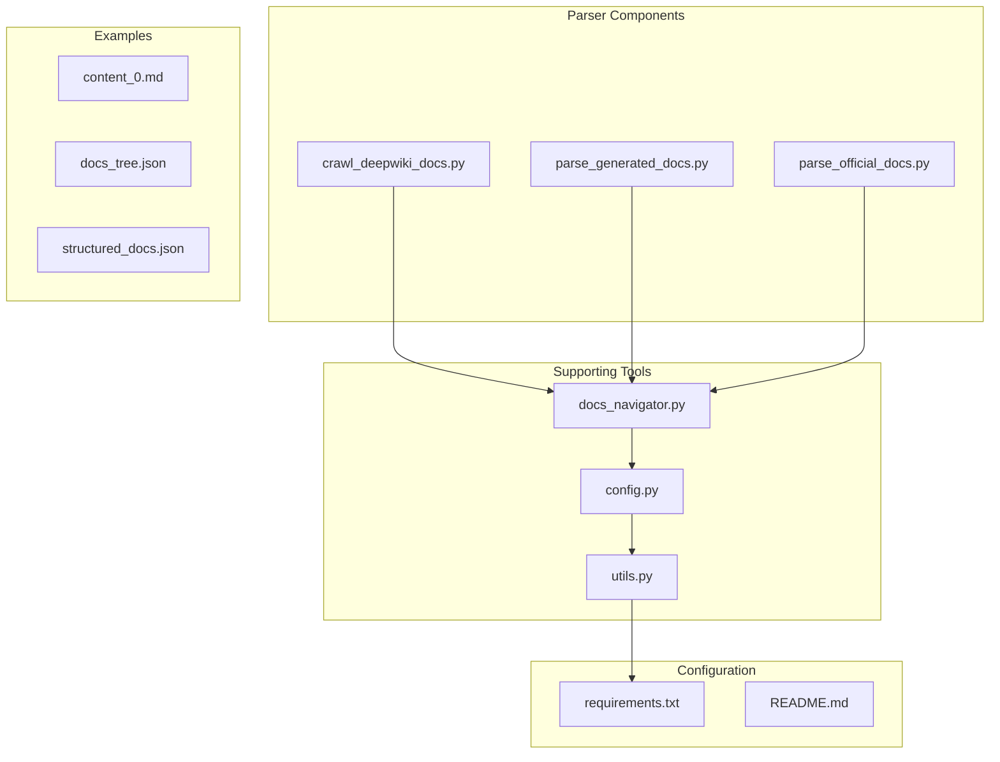

**Diagram sources**
- [crawl_deepwiki_docs.py](file://src/docs_parser/crawl_deepwiki_docs.py#L1-L335)
- [parse_generated_docs.py](file://src/docs_parser/parse_generated_docs.py#L1-L323)
- [docs_navigator.py](file://src/tools/docs_navigator.py#L1-L345)

**Section sources**
- [README.md](file://README.md#L1-L136)
- [requirements.txt](file://requirements.txt#L1-L107)

## Core Components

### MCP Client Implementation
The MCP client provides the foundation for DeepWiki integration through the Model Context Protocol:

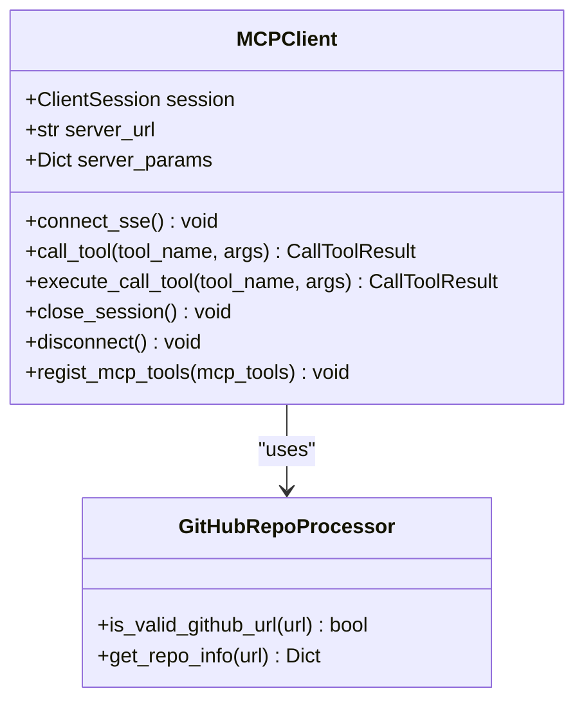

**Diagram sources**
- [crawl_deepwiki_docs.py](file://src/docs_parser/crawl_deepwiki_docs.py#L13-L150)

The MCP client implements:
- **Connection Management**: Secure Server-Sent Events (SSE) connection establishment
- **Tool Registration**: Dynamic tool discovery and registration from MCP server
- **Error Handling**: Automatic reconnection and graceful error recovery
- **Resource Cleanup**: Proper session termination and resource deallocation

**Section sources**
- [crawl_deepwiki_docs.py](file://src/docs_parser/crawl_deepwiki_docs.py#L13-L150)

### Content Extraction and Processing
The content processing pipeline transforms raw markdown into structured documentation:

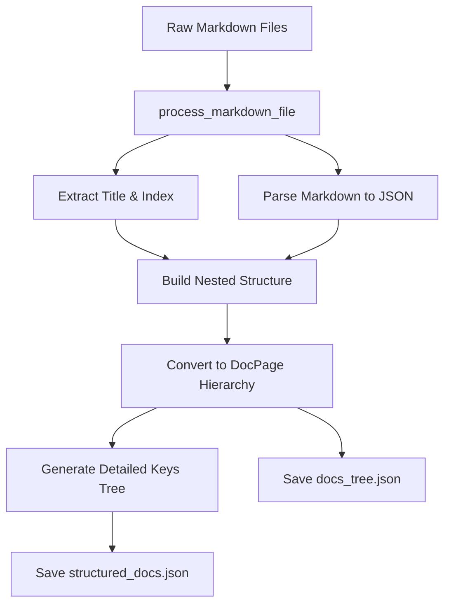

**Diagram sources**
- [parse_generated_docs.py](file://src/docs_parser/parse_generated_docs.py#L89-L152)
- [parse_generated_docs.py](file://src/docs_parser/parse_generated_docs.py#L227-L270)

**Section sources**
- [parse_generated_docs.py](file://src/docs_parser/parse_generated_docs.py#L89-L152)
- [parse_generated_docs.py](file://src/docs_parser/parse_generated_docs.py#L227-L270)

### Documentation Navigation System
The DocsNavigator provides intelligent content access and querying capabilities:

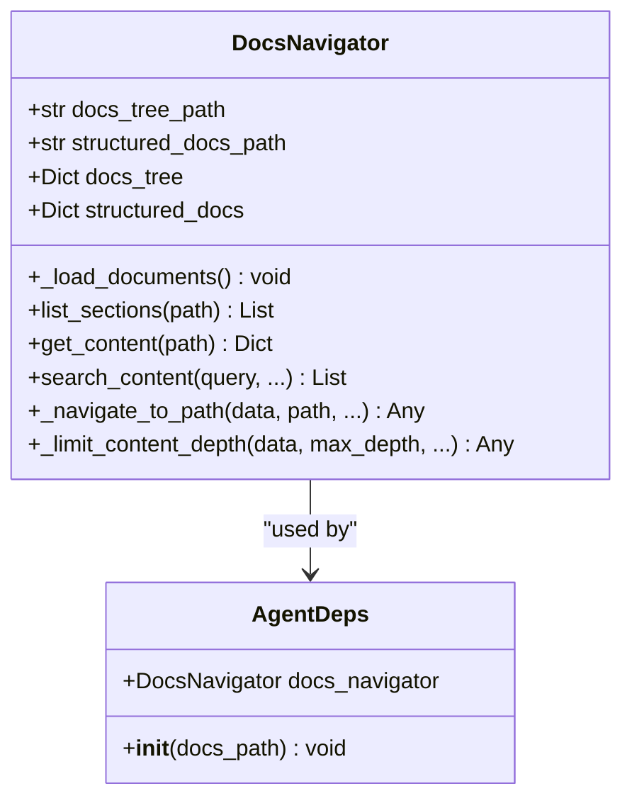

**Diagram sources**
- [docs_navigator.py](file://src/tools/docs_navigator.py#L11-L30)
- [docs_navigator.py](file://src/tools/docs_navigator.py#L244-L258)

**Section sources**
- [docs_navigator.py](file://src/tools/docs_navigator.py#L11-L30)
- [docs_navigator.py](file://src/tools/docs_navigator.py#L244-L258)

## Architecture Overview

### MCP Protocol Integration Architecture
The DeepWiki crawler implements a comprehensive MCP protocol integration:

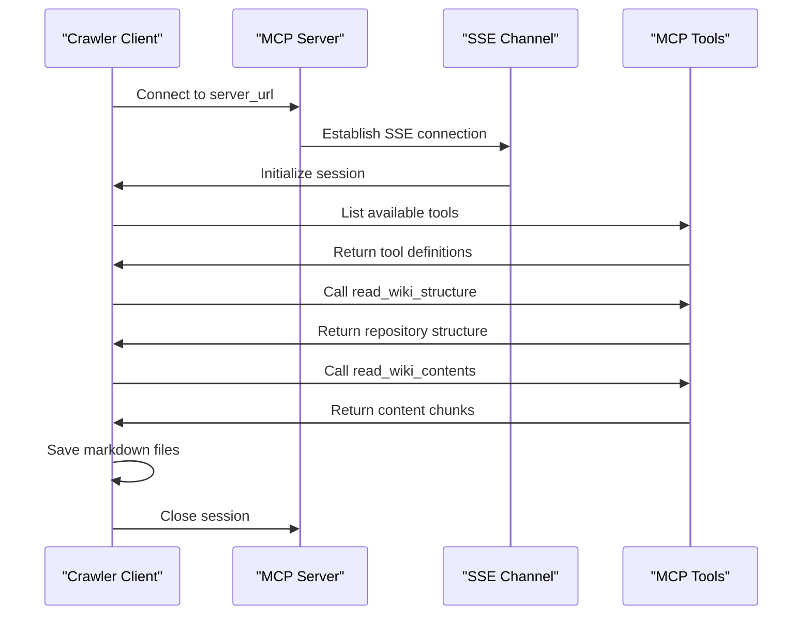

**Diagram sources**
- [crawl_deepwiki_docs.py](file://src/docs_parser/crawl_deepwiki_docs.py#L53-L83)
- [crawl_deepwiki_docs.py](file://src/docs_parser/crawl_deepwiki_docs.py#L291-L316)

### Content Processing Pipeline
The content processing pipeline follows a structured approach:

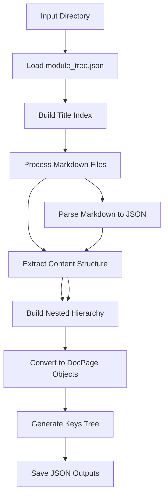

**Diagram sources**
- [parse_generated_docs.py](file://src/docs_parser/parse_generated_docs.py#L155-L312)

**Section sources**
- [crawl_deepwiki_docs.py](file://src/docs_parser/crawl_deepwiki_docs.py#L291-L316)
- [parse_generated_docs.py](file://src/docs_parser/parse_generated_docs.py#L155-L312)

## Detailed Component Analysis

### MCP Client Connection Management
The MCP client implements robust connection handling with automatic reconnection:

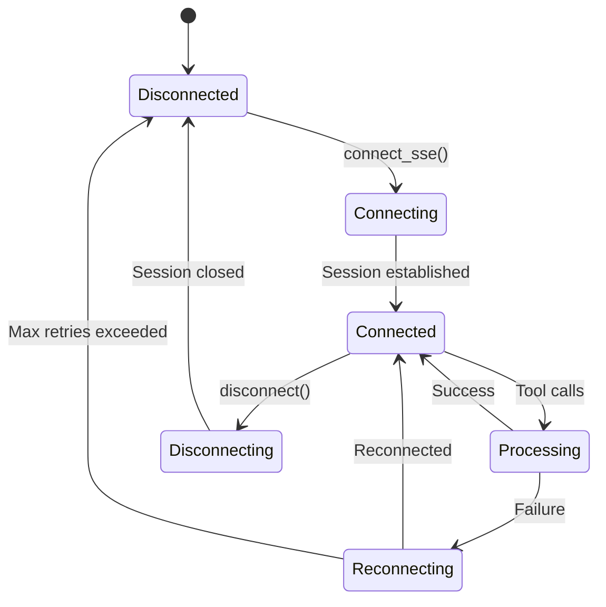

**Diagram sources**
- [crawl_deepwiki_docs.py](file://src/docs_parser/crawl_deepwiki_docs.py#L53-L120)

Key connection features:
- **Timeout Configuration**: Configurable connection and read timeouts
- **Automatic Reconnection**: Graceful recovery from connection failures
- **Tool Discovery**: Dynamic tool registration from server capabilities
- **Resource Management**: Proper cleanup of sessions and connections

**Section sources**
- [crawl_deepwiki_docs.py](file://src/docs_parser/crawl_deepwiki_docs.py#L53-L120)

### Content Extraction Algorithm
The content extraction algorithm processes markdown files with sophisticated parsing:

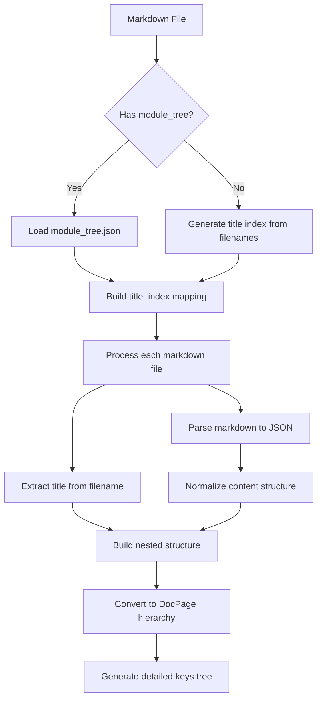

**Diagram sources**
- [parse_generated_docs.py](file://src/docs_parser/parse_generated_docs.py#L155-L270)

**Section sources**
- [parse_generated_docs.py](file://src/docs_parser/parse_generated_docs.py#L155-L270)

### Structured Data Transformation
The transformation process converts unstructured content into standardized formats:

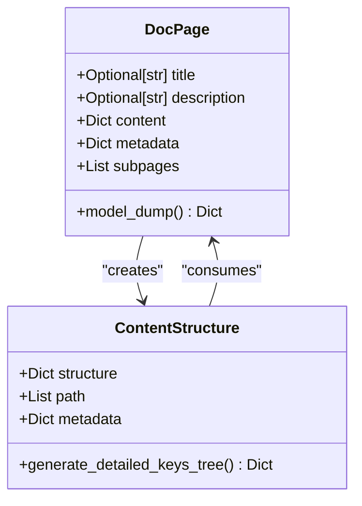

**Diagram sources**
- [parse_generated_docs.py](file://src/docs_parser/parse_generated_docs.py#L8-L14)
- [parse_generated_docs.py](file://src/docs_parser/parse_generated_docs.py#L26-L87)

**Section sources**
- [parse_generated_docs.py](file://src/docs_parser/parse_generated_docs.py#L8-L14)
- [parse_generated_docs.py](file://src/docs_parser/parse_generated_docs.py#L26-L87)

### Configuration and Environment Management
The system uses a centralized configuration approach:

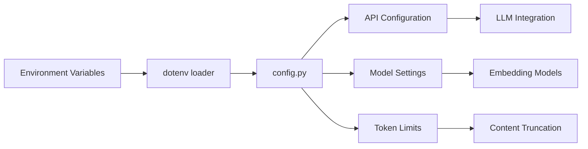

**Diagram sources**
- [config.py](file://src/config.py#L1-L32)
- [utils.py](file://src/utils.py#L28-L46)

**Section sources**
- [config.py](file://src/config.py#L1-L32)
- [utils.py](file://src/utils.py#L28-L46)

## Dependency Analysis

### External Dependencies
The project relies on several key external libraries:

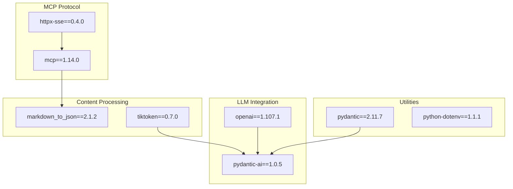

**Diagram sources**
- [requirements.txt](file://requirements.txt#L1-L107)

### Internal Component Dependencies
The components interact through well-defined interfaces:

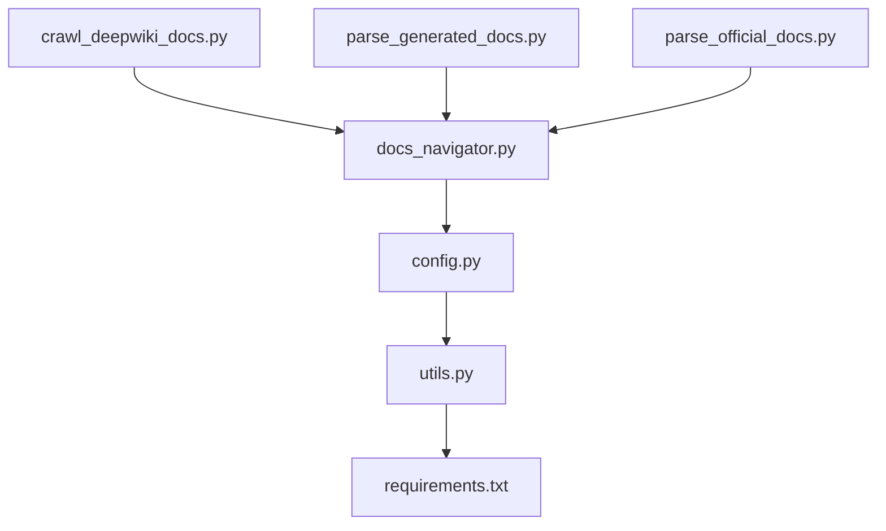

**Diagram sources**
- [crawl_deepwiki_docs.py](file://src/docs_parser/crawl_deepwiki_docs.py#L1-L11)
- [docs_navigator.py](file://src/tools/docs_navigator.py#L1-L9)
- [parse_generated_docs.py](file://src/docs_parser/parse_generated_docs.py#L1-L7)

**Section sources**
- [requirements.txt](file://requirements.txt#L1-L107)

## Performance Considerations

### Token Management and Content Limits
The system implements intelligent content truncation to manage token limits:

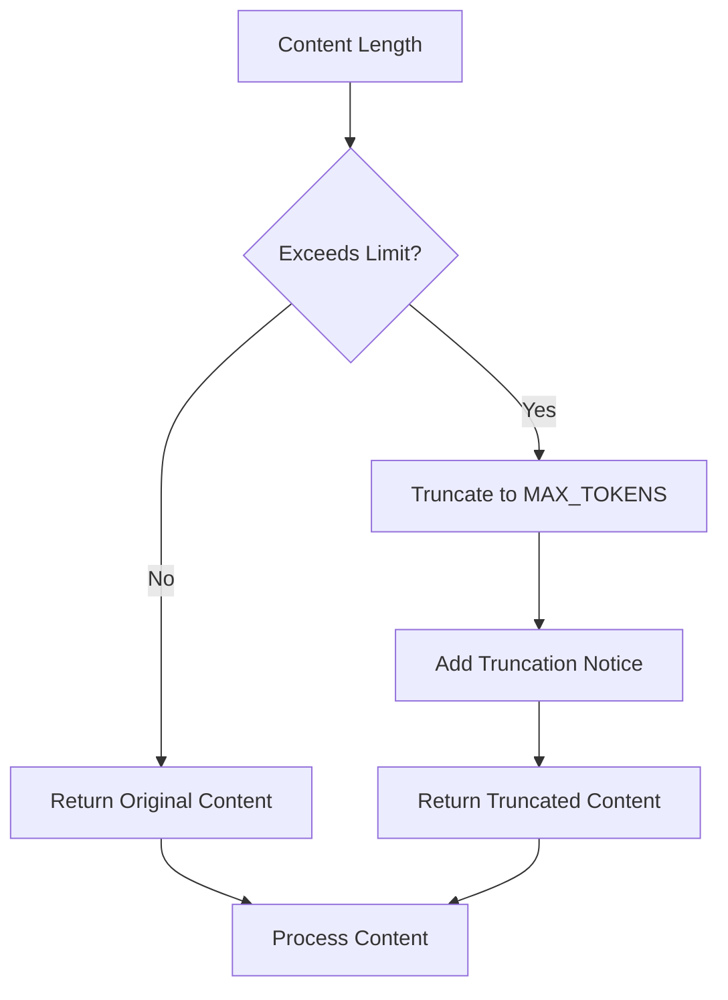

**Diagram sources**
- [utils.py](file://src/utils.py#L12-L26)

Performance optimization strategies:
- **Token-based Truncation**: Automatic content length management
- **Parallel Processing**: Asynchronous tool calls for improved throughput
- **Memory Management**: Efficient content loading and cleanup
- **Connection Pooling**: Reuse of MCP connections where possible

**Section sources**
- [utils.py](file://src/utils.py#L12-L26)

### Scalability Considerations
For large-scale documentation crawling:

1. **Batch Processing**: Process multiple repositories concurrently
2. **Rate Limiting**: Respect MCP server rate limits and quotas
3. **Error Recovery**: Implement exponential backoff for transient failures
4. **Resource Monitoring**: Track memory and CPU usage during processing

## Troubleshooting Guide

### Common Connection Issues
**Problem**: MCP server connection failures
**Solution**: 
- Verify server URL and network connectivity
- Check timeout configurations
- Review server logs for authentication issues

**Problem**: Tool call failures
**Solution**:
- Validate tool names and parameters
- Check server-side tool availability
- Implement retry logic with exponential backoff

**Problem**: Content parsing errors
**Solution**:
- Validate markdown file formats
- Check encoding issues
- Review JSON parsing exceptions

### Configuration Issues
**Problem**: Missing environment variables
**Solution**:
- Create `.env` file with required credentials
- Verify API keys and model configurations
- Check BASE_URL settings for local deployments

**Problem**: File path issues
**Solution**:
- Verify output directory permissions
- Check file system quotas
- Ensure proper path separators

**Section sources**
- [crawl_deepwiki_docs.py](file://src/docs_parser/crawl_deepwiki_docs.py#L65-L67)
- [config.py](file://src/config.py#L14-L17)

### Performance Issues
**Problem**: Slow processing times
**Solution**:
- Increase timeout values for large repositories
- Optimize markdown parsing algorithms
- Implement parallel processing where safe

**Problem**: Memory exhaustion
**Solution**:
- Monitor memory usage during processing
- Implement chunked processing for large files
- Add garbage collection calls

## Conclusion
The DeepWiki documentation crawler provides a robust solution for automated documentation acquisition and processing. Through its MCP protocol integration and sophisticated content processing pipeline, it enables comprehensive documentation analysis and evaluation. The modular architecture ensures maintainability and extensibility, while performance optimizations support large-scale operations.

Key strengths include:
- **Reliable MCP Integration**: Robust connection management and error handling
- **Structured Content Processing**: Sophisticated parsing and transformation algorithms
- **Flexible Configuration**: Environment-based configuration management
- **Extensible Architecture**: Modular design supporting additional parsers and processors

Future enhancements could include support for additional documentation formats, enhanced caching mechanisms, and distributed processing capabilities.

## Appendices

### Practical Usage Examples

#### Basic DeepWiki Integration Setup
```bash
# Crawl DeepWiki documentation
python docs_parser/crawl_deepwiki_docs.py \
    --url https://github.com/All-Hands-AI/OpenHands \
    --output-dir ../data/OpenHands/deepwiki/docs

# Parse generated documentation
python docs_parser/parse_generated_docs.py \
    --input-dir ../data/OpenHands/deepwiki/docs \
    --output-dir ../data/OpenHands/deepwiki
```

#### Configuration Requirements
Required environment variables:
- `API_KEY`: LLM provider API key
- `MODEL`: Default language model identifier
- `BASE_URL`: LLM provider base URL
- `EMBEDDING_MODEL`: Embedding model identifier

#### Authentication Methods
The system supports multiple authentication approaches:
- **API Key Authentication**: Standard API key-based authentication
- **Environment-based Configuration**: Automatic credential loading from `.env` files
- **Provider-specific Settings**: Model-specific configuration options

### Integration with Evaluation Pipeline
The processed documentation integrates seamlessly with the evaluation system:

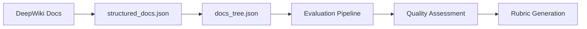

**Diagram sources**
- [README.md](file://README.md#L56-L69)

**Section sources**
- [README.md](file://README.md#L56-L69)