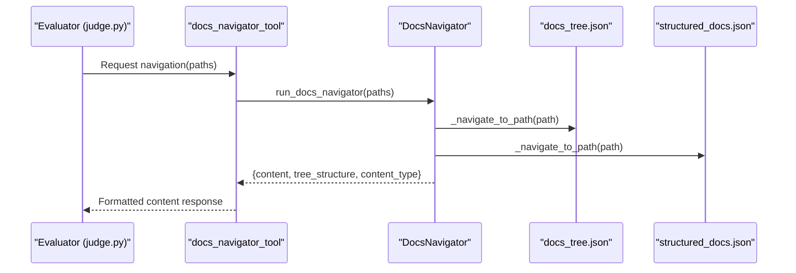
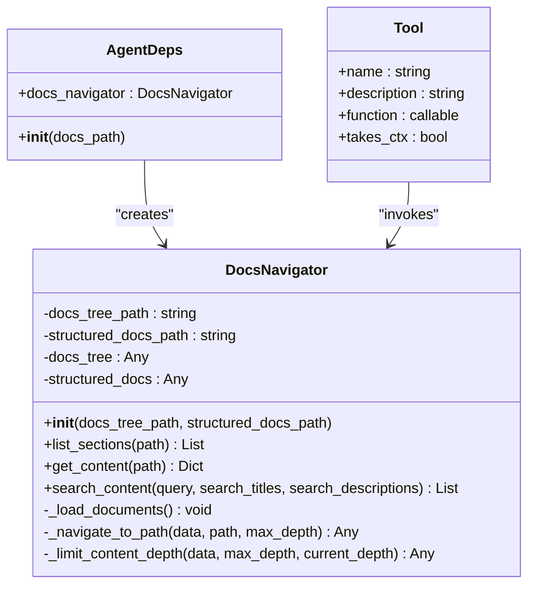
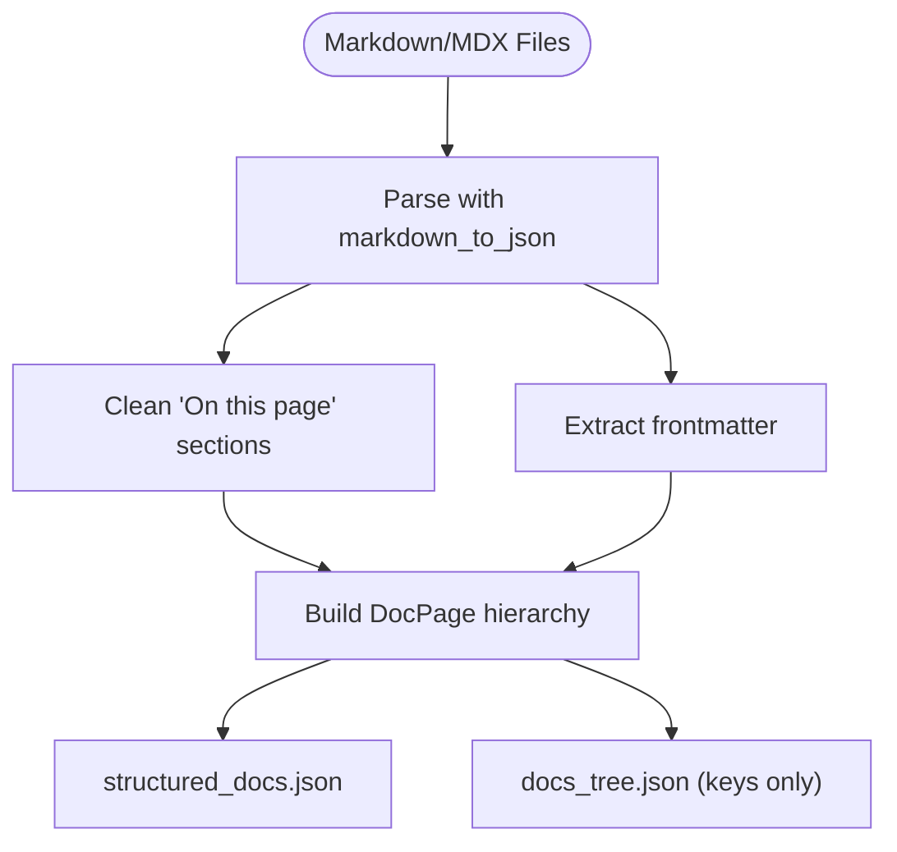
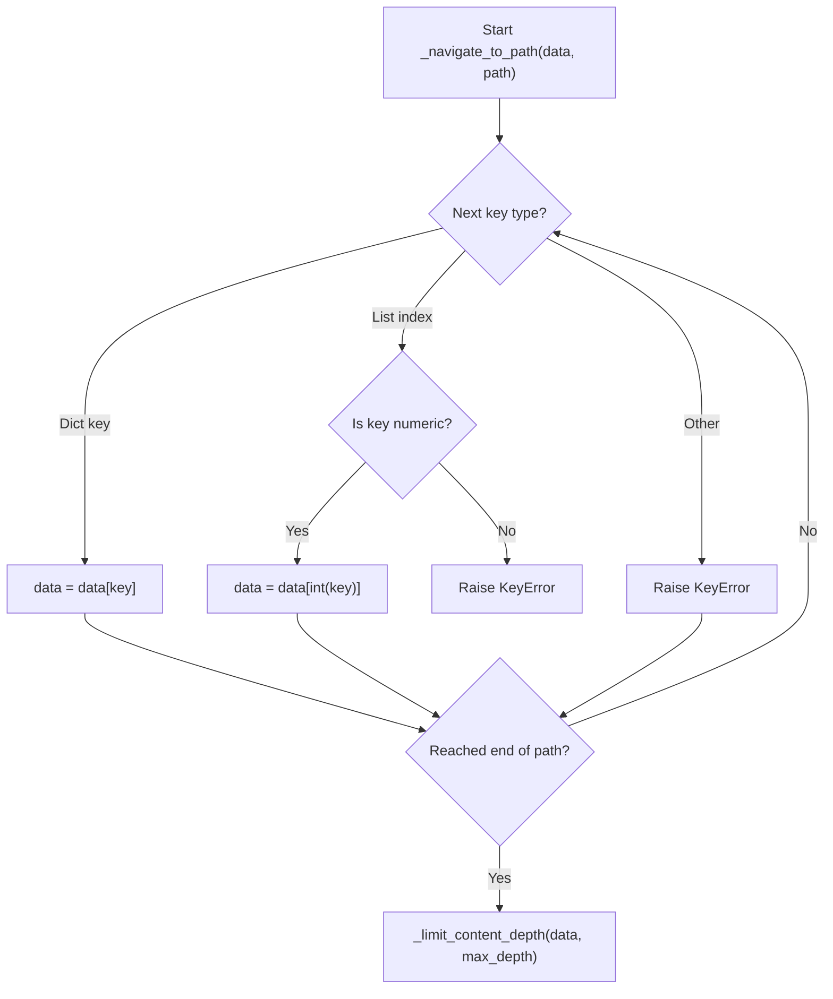
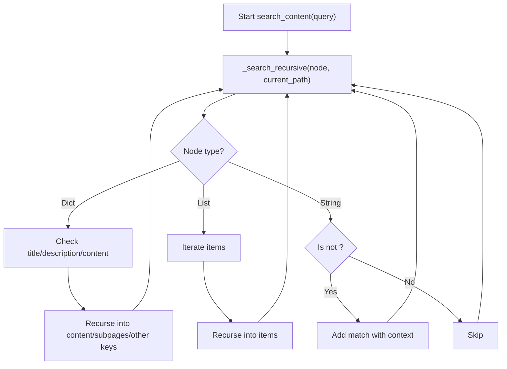
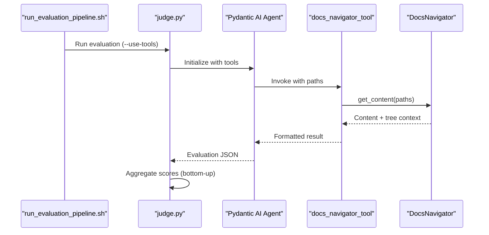
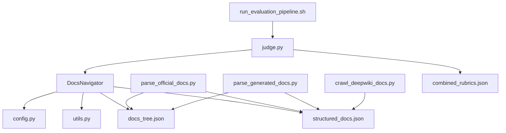

# Document Navigation Tools

<cite>
**Referenced Files in This Document**
- [docs_navigator.py](file://src/tools/docs_navigator.py)
- [parse_official_docs.py](file://src/docs_parser/parse_official_docs.py)
- [parse_generated_docs.py](file://src/docs_parser/parse_generated_docs.py)
- [crawl_deepwiki_docs.py](file://src/docs_parser/crawl_deepwiki_docs.py)
- [judge.py](file://src/judge/judge.py)
- [run_evaluation_pipeline.sh](file://src/run_evaluation_pipeline.sh)
- [config.py](file://src/config.py)
- [utils.py](file://src/utils.py)
- [docs_tree.json (codewiki)](file://examples/OpenHands/codewiki/docs_tree.json)
- [structured_docs.json (codewiki)](file://examples/OpenHands/codewiki/structured_docs.json)
- [docs_tree.json (deepwiki)](file://examples/OpenHands/deepwiki/docs_tree.json)
- [structured_docs.json (deepwiki)](file://examples/OpenHands/deepwiki/structured_docs.json)
- [combined_rubrics.json](file://examples/OpenHands/rubrics/combined_rubrics.json)
</cite>

## Table of Contents
1. [Introduction](#introduction)
2. [Project Structure](#project-structure)
3. [Core Components](#core-components)
4. [Architecture Overview](#architecture-overview)
5. [Detailed Component Analysis](#detailed-component-analysis)
6. [Dependency Analysis](#dependency-analysis)
7. [Performance Considerations](#performance-considerations)
8. [Troubleshooting Guide](#troubleshooting-guide)
9. [Conclusion](#conclusion)
10. [Appendices](#appendices)

## Introduction
This document explains the intelligent document navigation tools that power hierarchical traversal and content retrieval across structured documentation trees. It focuses on the DocsNavigator class, the DocPage model used to represent parsed documentation, and the integrated evaluation pipeline that leverages navigation for automated documentation assessment. The documentation covers navigation algorithms, search capabilities, content filtering, integration with the parsing system, path resolution strategies, and document tree traversal techniques. Practical workflows, performance considerations, and extension guidance are included for large-scale document trees.

## Project Structure
The navigation tools reside in the tools module and integrate with the parsing system, evaluation pipeline, and configuration utilities. The repository provides example structured documentation trees and evaluation rubrics to demonstrate end-to-end usage.

```mermaid
graph TB
subgraph "Tools"
DN[DocsNavigator]
AD[AgentDeps]
RT[docs_navigator_tool]
end
subgraph "Parsers"
P1[parse_official_docs.py]
P2[parse_generated_docs.py]
P3[crawl_deepwiki_docs.py]
end
subgraph "Evaluation"
J[judge.py]
SH[run_evaluation_pipeline.sh]
end
subgraph "Data"
DT1[docs_tree.json (codewiki)]
SD1[structured_docs.json (codewiki)]
DT2[docs_tree.json (deepwiki)]
SD2[structured_docs.json (deepwiki)]
RB[combined_rubrics.json]
end
subgraph "Config"
CFG[config.py]
U[utils.py]
end
P1 --> DT1
P1 --> SD1
P2 --> DT2
P2 --> SD2
P3 --> DT2
P3 --> SD2
DN --> DT1
DN --> SD1
DN --> DT2
DN --> SD2
J --> DN
SH --> J
J --> RB
AD --> DN
RT --> DN
U --> DN
CFG --> DN
```

**Diagram sources**
- [docs_navigator.py](file://src/tools/docs_navigator.py#L11-L345)
- [parse_official_docs.py](file://src/docs_parser/parse_official_docs.py#L9-L327)
- [parse_generated_docs.py](file://src/docs_parser/parse_generated_docs.py#L8-L312)
- [crawl_deepwiki_docs.py](file://src/docs_parser/crawl_deepwiki_docs.py#L1-L335)
- [judge.py](file://src/judge/judge.py#L1-L551)
- [run_evaluation_pipeline.sh](file://src/run_evaluation_pipeline.sh#L1-L331)
- [config.py](file://src/config.py#L1-L32)
- [utils.py](file://src/utils.py#L1-L86)

**Section sources**
- [docs_navigator.py](file://src/tools/docs_navigator.py#L11-L345)
- [parse_official_docs.py](file://src/docs_parser/parse_official_docs.py#L9-L327)
- [parse_generated_docs.py](file://src/docs_parser/parse_generated_docs.py#L8-L312)
- [crawl_deepwiki_docs.py](file://src/docs_parser/crawl_deepwiki_docs.py#L1-L335)
- [judge.py](file://src/judge/judge.py#L1-L551)
- [run_evaluation_pipeline.sh](file://src/run_evaluation_pipeline.sh#L1-L331)
- [config.py](file://src/config.py#L1-L32)
- [utils.py](file://src/utils.py#L1-L86)

## Core Components
- DocsNavigator: Loads and navigates hierarchical documentation trees, retrieves content by path, lists sections, and performs text-based searches across content.
- DocPage: Pydantic model representing parsed documentation pages with title, description, content, metadata, and subpages.
- AgentDeps: Dependency container that locates and initializes DocsNavigator with correct file paths.
- docs_navigator_tool: Pydantic AI Tool wrapper enabling DocsNavigator to be invoked by the evaluation agent.
- Parsing modules: Convert markdown/MDX content into structured trees and key-only trees for navigation and search.
- Evaluation pipeline: Orchestrates multi-model evaluation using DocsNavigator for targeted content retrieval.

Key responsibilities:
- Hierarchical navigation via path arrays (strings for dict keys, integers for list indices).
- Depth-limited content retrieval to prevent oversized responses.
- Text search across titles, descriptions, and content nodes.
- Integration with evaluation rubrics for automated documentation scoring.

**Section sources**
- [docs_navigator.py](file://src/tools/docs_navigator.py#L11-L345)
- [parse_official_docs.py](file://src/docs_parser/parse_official_docs.py#L9-L327)
- [parse_generated_docs.py](file://src/docs_parser/parse_generated_docs.py#L8-L312)
- [judge.py](file://src/judge/judge.py#L1-L551)

## Architecture Overview
The navigation system is composed of:
- Data ingestion: Markdown/MDX files parsed into DocPage trees and simplified key-only trees.
- Navigation service: DocsNavigator reads both trees to provide accurate navigation and content retrieval.
- Tool integration: docs_navigator_tool exposes navigation as a Pydantic AI tool.
- Evaluation integration: judge.py uses the tool to fetch relevant content for rubric-based scoring.



**Diagram sources**
- [judge.py](file://src/judge/judge.py#L17-L551)
- [docs_navigator.py](file://src/tools/docs_navigator.py#L261-L285)

**Section sources**
- [judge.py](file://src/judge/judge.py#L1-L551)
- [docs_navigator.py](file://src/tools/docs_navigator.py#L261-L285)

## Detailed Component Analysis

### DocsNavigator Class
Responsibilities:
- Load documentation trees from JSON files.
- Navigate to a specific path in either the key-only tree or the structured content tree.
- Retrieve content with depth-limited expansion to control token usage.
- List sections at a given path with metadata (title, type, has_content, has_subpages).
- Perform recursive text search across titles, descriptions, and content nodes.

Key methods:
- __init__: Initializes file paths and loads both trees.
- _load_documents: Reads and parses JSON files with error handling.
- list_sections: Builds a list of child sections with metadata.
- get_content: Returns structured content and tree context for a path.
- search_content: Searches recursively across nodes for matches.
- _navigate_to_path: Traverses a path safely, supporting dict keys and list indices.
- _limit_content_depth: Recursively truncates content beyond a configured depth.



**Diagram sources**
- [docs_navigator.py](file://src/tools/docs_navigator.py#L11-L345)

**Section sources**
- [docs_navigator.py](file://src/tools/docs_navigator.py#L11-L345)

### DocPage Model and Parsing System
DocPage represents parsed documentation with:
- title: Page title.
- description: Optional description.
- content: Nested dictionary or list of content.
- metadata: Arbitrary metadata.
- subpages: List of child DocPage nodes.

Parsing modules:
- parse_official_docs.py: Converts markdown/MDX to DocPage trees and generates key-only trees for navigation.
- parse_generated_docs.py: Processes deepwiki-style markdown files with module trees to reconstruct hierarchical structure.
- crawl_deepwiki_docs.py: Pulls content from DeepWiki via MCP and writes markdown files for subsequent parsing.



**Diagram sources**
- [parse_official_docs.py](file://src/docs_parser/parse_official_docs.py#L169-L327)
- [parse_generated_docs.py](file://src/docs_parser/parse_generated_docs.py#L155-L312)
- [crawl_deepwiki_docs.py](file://src/docs_parser/crawl_deepwiki_docs.py#L291-L335)

**Section sources**
- [parse_official_docs.py](file://src/docs_parser/parse_official_docs.py#L9-L327)
- [parse_generated_docs.py](file://src/docs_parser/parse_generated_docs.py#L8-L312)
- [crawl_deepwiki_docs.py](file://src/docs_parser/crawl_deepwiki_docs.py#L1-L335)

### Navigation Algorithms and Path Resolution
- Path traversal: Supports mixed paths with string keys for dictionaries and integer indices for lists.
- Safe navigation: Validates key types and raises meaningful errors for invalid indices or types.
- Depth control: Limits returned content depth to keep responses concise and within token limits.



**Diagram sources**
- [docs_navigator.py](file://src/tools/docs_navigator.py#L182-L241)

**Section sources**
- [docs_navigator.py](file://src/tools/docs_navigator.py#L182-L241)

### Search Capabilities and Content Filtering
- Recursive search: Traverses nodes, checking titles, descriptions, and content strings.
- Matching context: Captures match type (title, description, content) and provides context snippets.
- Content filtering: Skips leaf nodes marked as <detail_content> during content search to focus on textual content.



**Diagram sources**
- [docs_navigator.py](file://src/tools/docs_navigator.py#L114-L180)

**Section sources**
- [docs_navigator.py](file://src/tools/docs_navigator.py#L114-L180)

### Integration with Evaluation System
- Tool registration: docs_navigator_tool integrates with Pydantic AI Agent.
- AgentDeps: Resolves correct paths for docs_tree.json and structured_docs.json.
- Evaluation workflow: judge.py collects leaf rubric requirements, invokes DocsNavigator to retrieve relevant content, and aggregates scores bottom-up.



**Diagram sources**
- [run_evaluation_pipeline.sh](file://src/run_evaluation_pipeline.sh#L195-L331)
- [judge.py](file://src/judge/judge.py#L477-L551)
- [docs_navigator.py](file://src/tools/docs_navigator.py#L261-L285)

**Section sources**
- [run_evaluation_pipeline.sh](file://src/run_evaluation_pipeline.sh#L1-L331)
- [judge.py](file://src/judge/judge.py#L1-L551)
- [docs_navigator.py](file://src/tools/docs_navigator.py#L261-L285)

## Dependency Analysis
- DocsNavigator depends on:
  - JSON files (docs_tree.json, structured_docs.json) for navigation and content.
  - utils.truncate_tokens for response token limiting.
  - config constants for token limits and model settings.
- Parsing modules depend on:
  - markdown_to_json for converting markdown to JSON.
  - YAML frontmatter parsing for metadata.
  - File system IO for reading/writing.
- Evaluation pipeline depends on:
  - Rubrics JSON for hierarchical requirements.
  - AgentDeps to resolve data paths.
  - Pydantic AI for tool invocation.



**Diagram sources**
- [docs_navigator.py](file://src/tools/docs_navigator.py#L1-L345)
- [parse_official_docs.py](file://src/docs_parser/parse_official_docs.py#L1-L327)
- [parse_generated_docs.py](file://src/docs_parser/parse_generated_docs.py#L1-L312)
- [crawl_deepwiki_docs.py](file://src/docs_parser/crawl_deepwiki_docs.py#L1-L335)
- [judge.py](file://src/judge/judge.py#L1-L551)
- [run_evaluation_pipeline.sh](file://src/run_evaluation_pipeline.sh#L1-L331)
- [config.py](file://src/config.py#L1-L32)
- [utils.py](file://src/utils.py#L1-L86)

**Section sources**
- [docs_navigator.py](file://src/tools/docs_navigator.py#L1-L345)
- [parse_official_docs.py](file://src/docs_parser/parse_official_docs.py#L1-L327)
- [parse_generated_docs.py](file://src/docs_parser/parse_generated_docs.py#L1-L312)
- [crawl_deepwiki_docs.py](file://src/docs_parser/crawl_deepwiki_docs.py#L1-L335)
- [judge.py](file://src/judge/judge.py#L1-L551)
- [run_evaluation_pipeline.sh](file://src/run_evaluation_pipeline.sh#L1-L331)
- [config.py](file://src/config.py#L1-L32)
- [utils.py](file://src/utils.py#L1-L86)

## Performance Considerations
- Token limits: Response truncation prevents oversized outputs; tune MAX_TOKENS_PER_TOOL_RESPONSE in config and utils accordingly.
- Depth control: _limit_content_depth reduces payload size for large nested structures.
- Search pruning: Titles and descriptions are checked first; content search is performed only when needed.
- Batch processing: Evaluation pipeline processes rubric leaf requirements in batches to balance throughput and rate limits.
- File I/O: Keep docs_tree.json and structured_docs.json on fast storage; avoid repeated reloads by reusing DocsNavigator instances.

[No sources needed since this section provides general guidance]

## Troubleshooting Guide
Common issues and resolutions:
- JSON decode errors: Ensure docs_tree.json and structured_docs.json are valid JSON.
- Missing files: AgentDeps raises FileNotFoundError if required files are absent.
- Invalid path traversal: _navigate_to_path raises KeyError for invalid list indices or incompatible types.
- Search yields no results: Confirm query terms appear in titles, descriptions, or textual content nodes.
- Tool invocation failures: Verify docs_navigator_tool is registered and AgentDeps resolves correct paths.

**Section sources**
- [docs_navigator.py](file://src/tools/docs_navigator.py#L31-L42)
- [docs_navigator.py](file://src/tools/docs_navigator.py#L182-L207)
- [judge.py](file://src/judge/judge.py#L477-L491)

## Conclusion
The document navigation tools provide a robust, extensible framework for hierarchical document traversal, content retrieval, and intelligent search. By leveraging structured trees and a depth-controlled navigation mechanism, the system scales to large documentation sets while integrating seamlessly with evaluation pipelines. The modular design allows easy extension for custom traversal algorithms, search filters, and integration points.

[No sources needed since this section summarizes without analyzing specific files]

## Appendices

### Practical Navigation Workflows
- Retrieve specific content: Build a path array and call get_content to obtain structured content and tree context.
- List sections: Use list_sections to enumerate child nodes with metadata for interactive navigation.
- Search content: Use search_content to locate relevant sections by text, then navigate to the resulting paths.

**Section sources**
- [docs_navigator.py](file://src/tools/docs_navigator.py#L44-L113)
- [docs_navigator.py](file://src/tools/docs_navigator.py#L114-L180)
- [docs_navigator.py](file://src/tools/docs_navigator.py#L83-L113)

### Integration with Evaluation System
- Prepare rubrics: Use combined_rubrics.json to define hierarchical evaluation criteria.
- Run evaluation: Execute run_evaluation_pipeline.sh with --use-tools to enable DocsNavigator.
- Inspect results: Find evaluation_results_<model>.json in the output directory.

**Section sources**
- [run_evaluation_pipeline.sh](file://src/run_evaluation_pipeline.sh#L195-L331)
- [judge.py](file://src/judge/judge.py#L434-L551)
- [combined_rubrics.json](file://examples/OpenHands/rubrics/combined_rubrics.json#L1-L200)

### Example Data Structures
- docs_tree.json: Key-only representation of the document hierarchy with path metadata.
- structured_docs.json: Full content with parsed markdown/MDX structures.

**Section sources**
- [docs_tree.json (codewiki)](file://examples/OpenHands/codewiki/docs_tree.json#L1-L200)
- [structured_docs.json (codewiki)](file://examples/OpenHands/codewiki/structured_docs.json#L1-L200)
- [docs_tree.json (deepwiki)](file://examples/OpenHands/deepwiki/docs_tree.json#L1-L200)
- [structured_docs.json (deepwiki)](file://examples/OpenHands/deepwiki/structured_docs.json#L1-L200)