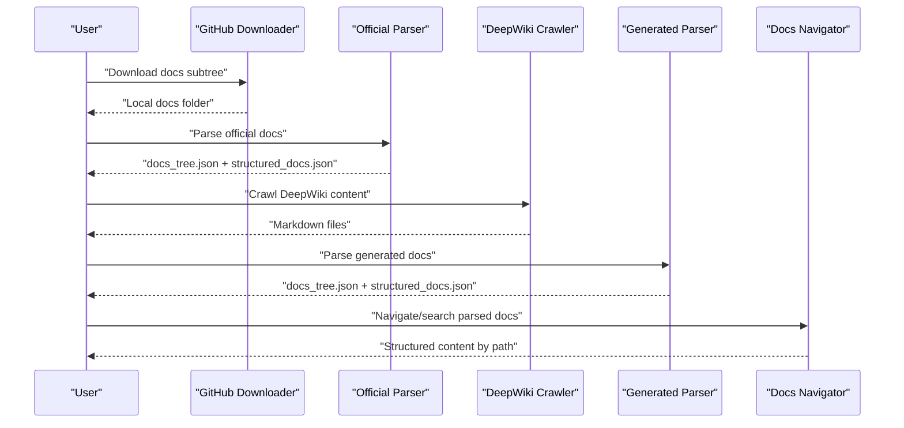
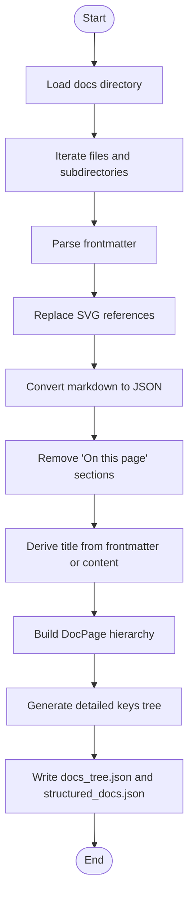
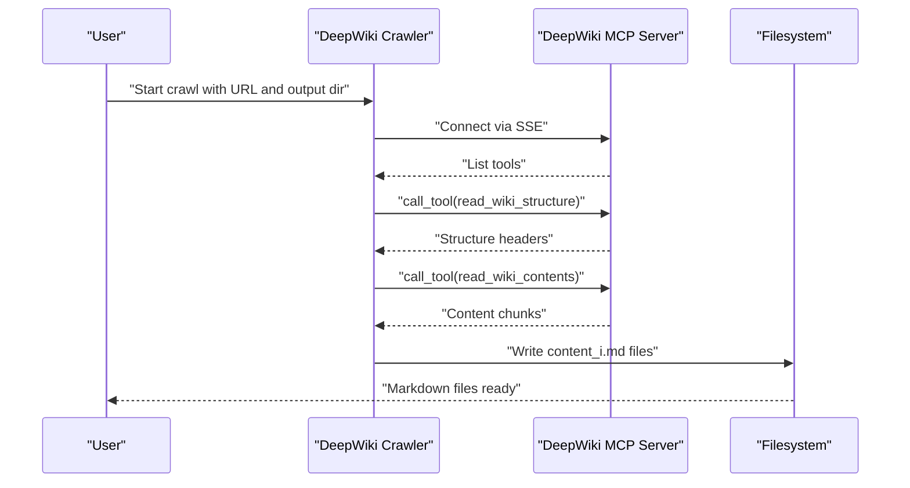
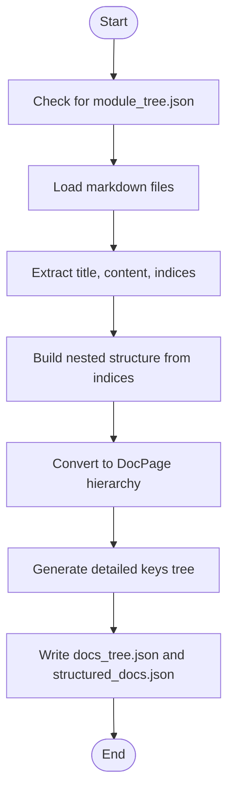
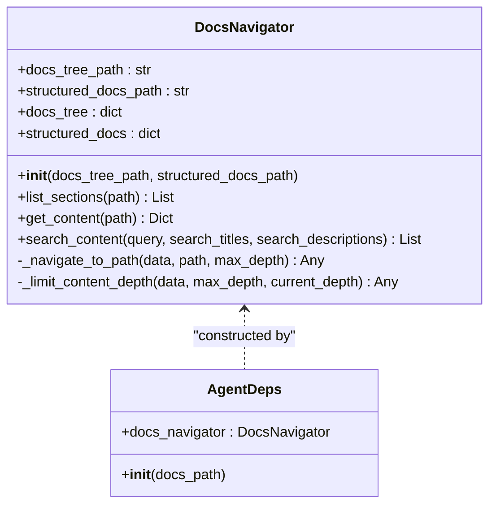
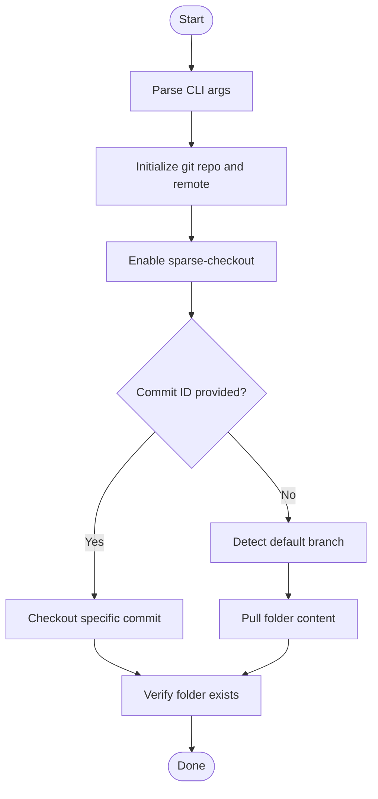
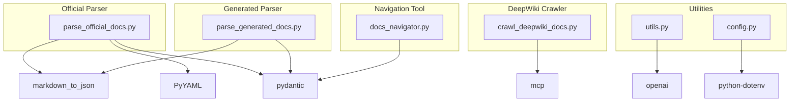

# Documentation Parsing System

<cite>
**Referenced Files in This Document**
- [README.md](file://README.md)
- [requirements.txt](file://requirements.txt)
- [src/config.py](file://src/config.py)
- [src/utils.py](file://src/utils.py)
- [src/download_github_folder.sh](file://src/download_github_folder.sh)
- [src/docs_parser/parse_official_docs.py](file://src/docs_parser/parse_official_docs.py)
- [src/docs_parser/crawl_deepwiki_docs.py](file://src/docs_parser/crawl_deepwiki_docs.py)
- [src/docs_parser/parse_generated_docs.py](file://src/docs_parser/parse_generated_docs.py)
- [src/tools/docs_navigator.py](file://src/tools/docs_navigator.py)
- [src/run_evaluation_pipeline.sh](file://src/run_evaluation_pipeline.sh)
- [examples/OpenHands/deepwiki/docs/content_0.md](file://examples/OpenHands/deepwiki/docs/content_0.md)
</cite>

## Table of Contents
1. [Introduction](#introduction)
2. [Project Structure](#project-structure)
3. [Core Components](#core-components)
4. [Architecture Overview](#architecture-overview)
5. [Detailed Component Analysis](#detailed-component-analysis)
6. [Dependency Analysis](#dependency-analysis)
7. [Performance Considerations](#performance-considerations)
8. [Troubleshooting Guide](#troubleshooting-guide)
9. [Conclusion](#conclusion)
10. [Appendices](#appendices)

## Introduction
This document explains the CodeWikiBench documentation parsing system that extracts, processes, and structures documentation from multiple sources. It covers three primary pipelines:
- Official documentation parsing from GitHub repositories
- DeepWiki crawling and parsing
- Generated documentation processing

It also documents GitHub integration via a shell script, markdown processing, frontmatter extraction, SVG content handling, DeepWiki integration using the Model Context Protocol (MCP), content extraction algorithms, structured data transformation, navigation tools, and configuration options. Practical examples, output formats (docs_tree.json and structured_docs.json), and troubleshooting guidance are included.

## Project Structure
The repository organizes parsing logic, tools, configuration, and example outputs under a clear layout:
- src/docs_parser: Contains the three parsing scripts for official, DeepWiki, and generated docs
- src/tools: Navigation tool for accessing parsed documentation
- src: Configuration, utilities, and shell scripts for GitHub downloads and evaluation pipelines
- examples: Sample outputs demonstrating the expected structure of docs_tree.json and structured_docs.json

```mermaid
graph TB
subgraph "Root"
R["CodeWikiBench"]
end
subgraph "src"
S1["docs_parser/parse_official_docs.py"]
S2["docs_parser/crawl_deepwiki_docs.py"]
S3["docs_parser/parse_generated_docs.py"]
T1["tools/docs_navigator.py"]
U1["utils.py"]
C1["config.py"]
SH1["download_github_folder.sh"]
P1["run_evaluation_pipeline.sh"]
end
subgraph "examples"
E1["OpenHands/deepwiki/docs_tree.json"]
E2["OpenHands/deepwiki/structured_docs.json"]
E3["OpenHands/codewiki/docs_tree.json"]
E4["OpenHands/codewiki/structured_docs.json"]
E5["OpenHands/deepwiki/docs/content_0.md"]
end
R --> S1
R --> S2
R --> S3
R --> T1
R --> U1
R --> C1
R --> SH1
R --> P1
R --> E1
R --> E2
R --> E3
R --> E4
R --> E5
```

**Diagram sources**
- [src/docs_parser/parse_official_docs.py](file://src/docs_parser/parse_official_docs.py#L1-L367)
- [src/docs_parser/crawl_deepwiki_docs.py](file://src/docs_parser/crawl_deepwiki_docs.py#L1-L335)
- [src/docs_parser/parse_generated_docs.py](file://src/docs_parser/parse_generated_docs.py#L1-L323)
- [src/tools/docs_navigator.py](file://src/tools/docs_navigator.py#L1-L345)
- [src/utils.py](file://src/utils.py#L1-L86)
- [src/config.py](file://src/config.py#L1-L32)
- [src/download_github_folder.sh](file://src/download_github_folder.sh#L1-L155)
- [src/run_evaluation_pipeline.sh](file://src/run_evaluation_pipeline.sh#L1-L331)
- [examples/OpenHands/deepwiki/docs/content_0.md](file://examples/OpenHands/deepwiki/docs/content_0.md#L1-L342)

**Section sources**
- [README.md](file://README.md#L1-L136)
- [src/config.py](file://src/config.py#L1-L32)

## Core Components
- Official documentation parser: Downloads a repository’s docs subtree and converts markdown to structured JSON with a detailed keys tree and a full content tree.
- DeepWiki crawler: Connects to a DeepWiki MCP endpoint, pulls wiki structure and content, and writes markdown files for downstream parsing.
- Generated documentation parser: Converts DeepWiki or other generated markdown outputs into a normalized DocPage hierarchy with a detailed keys tree and structured_docs.json.
- Navigation tool: Provides programmatic access to parsed docs via a tool interface, enabling agents to retrieve content by path and search within content.
- Utilities and configuration: Centralized configuration for API keys, models, and token limits; LLM and embeddings helpers; and project path utilities.
- GitHub downloader: A shell script to fetch a specific folder from a GitHub repository using sparse-checkout and optional commit selection.

**Section sources**
- [src/docs_parser/parse_official_docs.py](file://src/docs_parser/parse_official_docs.py#L1-L367)
- [src/docs_parser/crawl_deepwiki_docs.py](file://src/docs_parser/crawl_deepwiki_docs.py#L1-L335)
- [src/docs_parser/parse_generated_docs.py](file://src/docs_parser/parse_generated_docs.py#L1-L323)
- [src/tools/docs_navigator.py](file://src/tools/docs_navigator.py#L1-L345)
- [src/utils.py](file://src/utils.py#L1-L86)
- [src/config.py](file://src/config.py#L1-L32)
- [src/download_github_folder.sh](file://src/download_github_folder.sh#L1-L155)

## Architecture Overview
The parsing system is composed of three pipelines orchestrated by shell commands and Python scripts. The official pipeline uses a GitHub downloader followed by a markdown-to-JSON conversion with frontmatter and SVG handling. The DeepWiki pipeline uses an MCP client to fetch structured content and then parses it into the same output format. The generated pipeline normalizes various markdown formats into a consistent DocPage hierarchy.

**Diagram sources**
- [src/download_github_folder.sh](file://src/download_github_folder.sh#L1-L155)
- [src/docs_parser/parse_official_docs.py](file://src/docs_parser/parse_official_docs.py#L1-L367)
- [src/docs_parser/crawl_deepwiki_docs.py](file://src/docs_parser/crawl_deepwiki_docs.py#L1-L335)
- [src/docs_parser/parse_generated_docs.py](file://src/docs_parser/parse_generated_docs.py#L1-L323)
- [src/tools/docs_navigator.py](file://src/tools/docs_navigator.py#L1-L345)

## Detailed Component Analysis

### Official Documentation Parsing Pipeline
This pipeline downloads a repository’s docs subtree and converts markdown files into structured JSON with two outputs:
- docs_tree.json: A detailed keys tree showing only key hierarchies and leaf markers
- structured_docs.json: The full DocPage hierarchy with content, metadata, and subpages

Key processing steps:
- Frontmatter parsing: Extracts YAML frontmatter and separates it from markdown content
- SVG handling: Replaces markdown image references to local SVG files with inline SVG content
- Markdown-to-JSON conversion: Uses a markdown-to-JSON library to transform content into a structured dictionary
- Directory traversal: Recursively processes files and subdirectories, preserving hierarchy
- Output generation: Writes both docs_tree.json and structured_docs.json

**Diagram sources**
- [src/docs_parser/parse_official_docs.py](file://src/docs_parser/parse_official_docs.py#L169-L228)

Practical example:
- Download a docs subtree from a GitHub repository using the provided script
- Run the official parser to produce structured outputs for the repository

Configuration options:
- Repo name argument drives output paths via configuration utilities
- Paths are resolved relative to the project root and data directory

Output formats:
- docs_tree.json: Hierarchical representation of keys and content markers
- structured_docs.json: Full content tree with metadata and subpages

**Section sources**
- [src/docs_parser/parse_official_docs.py](file://src/docs_parser/parse_official_docs.py#L1-L367)
- [src/download_github_folder.sh](file://src/download_github_folder.sh#L1-L155)
- [src/config.py](file://src/config.py#L19-L26)

### DeepWiki Integration Pipeline
This pipeline integrates with DeepWiki via the Model Context Protocol (MCP). It:
- Establishes an SSE connection to the DeepWiki MCP server
- Lists available tools and registers them
- Calls read_wiki_structure and read_wiki_contents to retrieve the wiki’s structure and content
- Writes each content chunk to a numbered markdown file
- Subsequent parsing uses the generated markdown files with the generated docs parser

**Diagram sources**
- [src/docs_parser/crawl_deepwiki_docs.py](file://src/docs_parser/crawl_deepwiki_docs.py#L291-L316)

Practical example:
- Crawl a DeepWiki repository URL and output markdown files
- Parse the resulting markdown files into structured_docs.json and docs_tree.json

Configuration options:
- Server URL is configured in the crawler
- Output directory is passed as a command-line argument

**Section sources**
- [src/docs_parser/crawl_deepwiki_docs.py](file://src/docs_parser/crawl_deepwiki_docs.py#L1-L335)

### Generated Documentation Processing Pipeline
This pipeline normalizes markdown files produced by automated systems (including DeepWiki) into a consistent DocPage hierarchy. It:
- Optionally loads a module_tree.json to derive hierarchical indices
- Processes each markdown file to extract title, content, and index information
- Builds a nested structure from hierarchical indices
- Converts the temporary structure into DocPage objects
- Generates both docs_tree.json and structured_docs.json

**Diagram sources**
- [src/docs_parser/parse_generated_docs.py](file://src/docs_parser/parse_generated_docs.py#L155-L312)

Practical example:
- Parse a directory of markdown files (e.g., DeepWiki output) into structured_docs.json and docs_tree.json

**Section sources**
- [src/docs_parser/parse_generated_docs.py](file://src/docs_parser/parse_generated_docs.py#L1-L323)

### Navigation and Content Access
The DocsNavigator tool enables programmatic access to parsed documentation:
- Loads docs_tree.json and structured_docs.json
- Lists sections at a given path
- Retrieves content for a specific path
- Searches content by query across titles, descriptions, and content
- Limits content depth to avoid oversized responses

**Diagram sources**
- [src/tools/docs_navigator.py](file://src/tools/docs_navigator.py#L11-L345)

Practical example:
- Use the tool to navigate to specific paths and retrieve content for evaluation or visualization

**Section sources**
- [src/tools/docs_navigator.py](file://src/tools/docs_navigator.py#L1-L345)

### GitHub Integration Workflow
The GitHub integration uses a shell script to download a specific folder from a repository:
- Accepts repository URL, folder path, and optional commit ID
- Initializes a sparse-checkout repository and pulls the specified folder
- Supports default branch detection and commit-specific pulls
- Outputs a success message and lists contents upon completion

**Diagram sources**
- [src/download_github_folder.sh](file://src/download_github_folder.sh#L33-L152)

Practical example:
- Download the docs folder from a repository at a specific commit or default branch

**Section sources**
- [src/download_github_folder.sh](file://src/download_github_folder.sh#L1-L155)

### Markdown Processing, Frontmatter Extraction, and SVG Handling
- Frontmatter parsing: YAML frontmatter is extracted and separated from markdown content
- SVG handling: Image references to local SVG files are replaced with inline SVG content; external SVG references are preserved
- Markdown-to-JSON conversion: Transforms markdown into structured JSON for downstream processing

**Section sources**
- [src/docs_parser/parse_official_docs.py](file://src/docs_parser/parse_official_docs.py#L169-L228)

### Output Formats and Examples
- docs_tree.json: A detailed keys tree showing only key hierarchies and leaf markers
- structured_docs.json: The full DocPage hierarchy with content, metadata, and subpages

Example content demonstrates the structure of DeepWiki markdown files, including hierarchical sections, diagrams, and references.

**Section sources**
- [examples/OpenHands/deepwiki/docs/content_0.md](file://examples/OpenHands/deepwiki/docs/content_0.md#L1-L342)

## Dependency Analysis
External libraries and protocols used by the system:
- MCP client for DeepWiki integration
- markdown_to_json for markdown-to-JSON conversion
- Pydantic for structured data modeling
- YAML for frontmatter parsing
- OpenAI client for LLM and embeddings utilities

**Diagram sources**
- [requirements.txt](file://requirements.txt#L1-L107)
- [src/docs_parser/parse_official_docs.py](file://src/docs_parser/parse_official_docs.py#L1-L10)
- [src/docs_parser/crawl_deepwiki_docs.py](file://src/docs_parser/crawl_deepwiki_docs.py#L1-L10)
- [src/docs_parser/parse_generated_docs.py](file://src/docs_parser/parse_generated_docs.py#L1-L6)
- [src/tools/docs_navigator.py](file://src/tools/docs_navigator.py#L1-L8)
- [src/utils.py](file://src/utils.py#L1-L8)
- [src/config.py](file://src/config.py#L1-L8)

**Section sources**
- [requirements.txt](file://requirements.txt#L1-L107)

## Performance Considerations
- Token limits: Responses are truncated to configured token limits to prevent oversized outputs
- Asynchronous MCP calls: DeepWiki crawler uses asynchronous connections with timeouts to improve throughput
- Depth-limited content retrieval: Navigation tool limits content depth to keep responses concise
- Batched evaluation pipeline: The evaluation pipeline supports batching and retries to optimize resource usage

[No sources needed since this section provides general guidance]

## Troubleshooting Guide
Common issues and resolutions:
- Missing documentation files: Ensure the docs directory exists and contains markdown files
- Invalid GitHub URL or missing folder: Verify repository URL and folder path; confirm the folder exists at the specified commit or default branch
- DeepWiki MCP connection failures: Confirm server URL and network connectivity; check tool availability and timeouts
- Markdown parsing errors: Some markdown may fail to convert; the parser falls back to storing raw content
- SVG replacement failures: Local SVG references must be resolvable; external SVG references are preserved

**Section sources**
- [src/docs_parser/parse_official_docs.py](file://src/docs_parser/parse_official_docs.py#L186-L228)
- [src/docs_parser/crawl_deepwiki_docs.py](file://src/docs_parser/crawl_deepwiki_docs.py#L53-L150)
- [src/download_github_folder.sh](file://src/download_github_folder.sh#L107-L152)

## Conclusion
The CodeWikiBench documentation parsing system provides a robust, multi-source pipeline for extracting, transforming, and structuring documentation. It supports official repositories via GitHub downloads, DeepWiki via MCP, and generated outputs via a normalization parser. The system produces standardized outputs (docs_tree.json and structured_docs.json) and offers navigation tools for programmatic access. With configuration utilities, token limits, and batched evaluation pipelines, it is suitable for large-scale documentation assessment and evaluation.

[No sources needed since this section summarizes without analyzing specific files]

## Appendices

### Practical Usage Examples
- Official documentation parsing:
  - Download a docs subtree from a GitHub repository
  - Parse official docs to produce structured outputs
- DeepWiki crawling and parsing:
  - Crawl DeepWiki content for a repository URL
  - Parse generated markdown files into structured outputs
- Generated documentation parsing:
  - Parse a directory of markdown files (e.g., from CodeWiki or DeepWiki) into structured outputs

**Section sources**
- [README.md](file://README.md#L45-L71)

### Configuration Options
- Environment variables:
  - API_KEY: LLM API key
  - MODEL: Default model name
  - BASE_URL: LLM base URL
  - EMBEDDING_MODEL: Embedding model name
- Project paths:
  - DATA_DIR: Data directory path
  - SRC_DIR: Source directory path
- Token limits:
  - MAX_TOKENS_PER_TOOL_RESPONSE: Maximum tokens per tool response

**Section sources**
- [src/config.py](file://src/config.py#L1-L32)
- [src/utils.py](file://src/utils.py#L12-L26)

### Evaluation Pipeline Integration
- The evaluation pipeline supports multiple models, batch sizes, combination methods, and optional visualization
- It validates the presence of documentation trees and coordinates evaluation, combination, and visualization steps

**Section sources**
- [src/run_evaluation_pipeline.sh](file://src/run_evaluation_pipeline.sh#L1-L331)