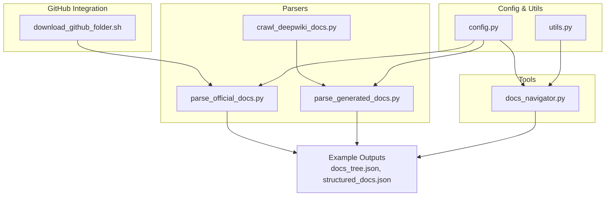
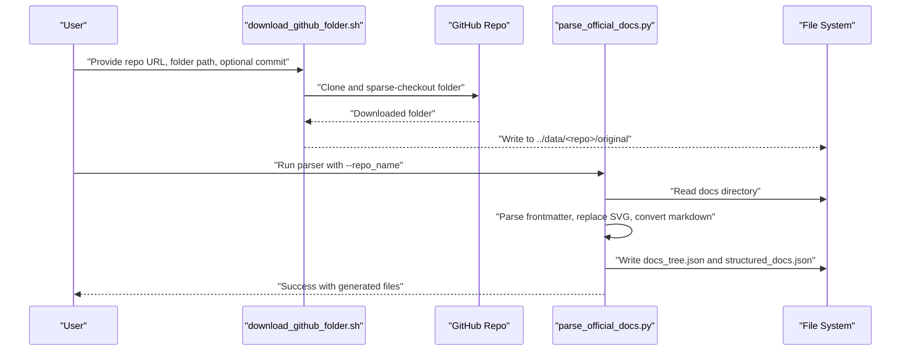
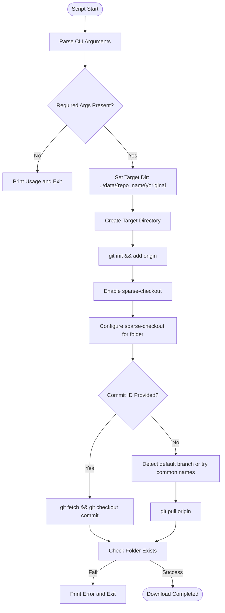
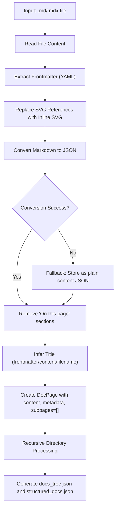
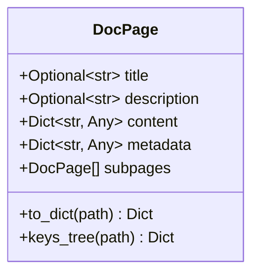
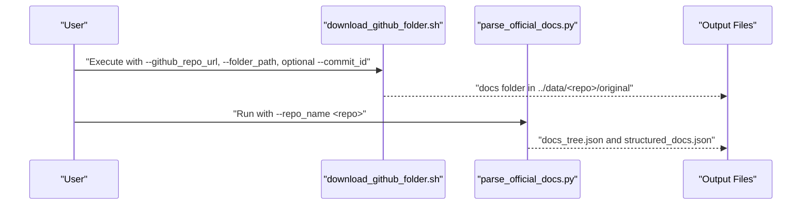
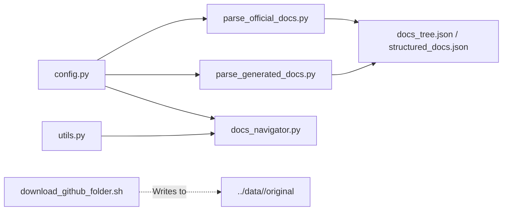

# Official Documentation Parser

<cite>
**Referenced Files in This Document**
- [README.md](file://README.md)
- [download_github_folder.sh](file://src/download_github_folder.sh)
- [parse_official_docs.py](file://src/docs_parser/parse_official_docs.py)
- [parse_generated_docs.py](file://src/docs_parser/parse_generated_docs.py)
- [crawl_deepwiki_docs.py](file://src/docs_parser/crawl_deepwiki_docs.py)
- [config.py](file://src/config.py)
- [docs_navigator.py](file://src/tools/docs_navigator.py)
- [utils.py](file://src/utils.py)
- [docs_tree.json](file://examples/OpenHands/codewiki/docs_tree.json)
- [structured_docs.json](file://examples/OpenHands/codewiki/structured_docs.json)
</cite>

## Table of Contents
1. [Introduction](#introduction)
2. [Project Structure](#project-structure)
3. [Core Components](#core-components)
4. [Architecture Overview](#architecture-overview)
5. [Detailed Component Analysis](#detailed-component-analysis)
6. [Dependency Analysis](#dependency-analysis)
7. [Performance Considerations](#performance-considerations)
8. [Troubleshooting Guide](#troubleshooting-guide)
9. [Conclusion](#conclusion)
10. [Appendices](#appendices)

## Introduction
This document explains the official documentation parser for GitHub repository integration and markdown processing. It covers:
- How to download documentation folders from GitHub repositories using a dedicated script
- How the markdown processing pipeline extracts frontmatter, replaces SVG references, and converts markdown to structured JSON
- The DocPage class design and hierarchical document organization
- Output formats (docs_tree.json and structured_docs.json)
- Practical examples for parsing official documentation, handling MD/MDX and SVG images, and robust error handling
- Configuration options, path resolution, and troubleshooting tips

## Project Structure
The repository provides:
- A GitHub integration script to download a specific folder from a repository
- A markdown parser for official docs that produces two structured outputs
- A parser for generated docs (DeepWiki-style) with hierarchical indexing
- A crawler for DeepWiki content via MCP
- A navigation tool to explore parsed docs
- Shared configuration and utilities

**Diagram sources**
- [download_github_folder.sh](file://src/download_github_folder.sh#L1-L155)
- [parse_official_docs.py](file://src/docs_parser/parse_official_docs.py#L1-L367)
- [parse_generated_docs.py](file://src/docs_parser/parse_generated_docs.py#L1-L323)
- [crawl_deepwiki_docs.py](file://src/docs_parser/crawl_deepwiki_docs.py#L1-L335)
- [docs_navigator.py](file://src/tools/docs_navigator.py#L1-L345)
- [config.py](file://src/config.py#L1-L32)
- [utils.py](file://src/utils.py#L1-L86)
- [docs_tree.json](file://examples/OpenHands/codewiki/docs_tree.json#L1-L200)
- [structured_docs.json](file://examples/OpenHands/codewiki/structured_docs.json#L1-L200)

**Section sources**
- [README.md](file://README.md#L45-L72)
- [download_github_folder.sh](file://src/download_github_folder.sh#L1-L155)
- [parse_official_docs.py](file://src/docs_parser/parse_official_docs.py#L1-L367)
- [parse_generated_docs.py](file://src/docs_parser/parse_generated_docs.py#L1-L323)
- [crawl_deepwiki_docs.py](file://src/docs_parser/crawl_deepwiki_docs.py#L1-L335)
- [docs_navigator.py](file://src/tools/docs_navigator.py#L1-L345)
- [config.py](file://src/config.py#L1-L32)
- [utils.py](file://src/utils.py#L1-L86)
- [docs_tree.json](file://examples/OpenHands/codewiki/docs_tree.json#L1-L200)
- [structured_docs.json](file://examples/OpenHands/codewiki/structured_docs.json#L1-L200)

## Core Components
- GitHub downloader script: Clones a repository, enables sparse-checkout, and downloads a specified folder. Supports commit-specific downloads and default branch detection.
- Official docs parser: Reads MD/MDX files, extracts frontmatter, replaces SVG references with inline SVG content, converts markdown to JSON, and builds a hierarchical DocPage tree. Produces docs_tree.json and structured_docs.json.
- Generated docs parser: Processes DeepWiki-style markdown files with numeric hierarchical indexing and module trees, generating the same output formats.
- Docs navigator: Loads docs_tree.json and structured_docs.json to list sections, retrieve content by path, and search across content.
- Configuration and utilities: Centralized path helpers, environment-based configuration, and token truncation utilities.

**Section sources**
- [download_github_folder.sh](file://src/download_github_folder.sh#L1-L155)
- [parse_official_docs.py](file://src/docs_parser/parse_official_docs.py#L1-L367)
- [parse_generated_docs.py](file://src/docs_parser/parse_generated_docs.py#L1-L323)
- [docs_navigator.py](file://src/tools/docs_navigator.py#L1-L345)
- [config.py](file://src/config.py#L1-L32)
- [utils.py](file://src/utils.py#L1-L86)

## Architecture Overview
The end-to-end workflow integrates GitHub downloads, markdown parsing, and structured output generation.

**Diagram sources**
- [download_github_folder.sh](file://src/download_github_folder.sh#L1-L155)
- [parse_official_docs.py](file://src/docs_parser/parse_official_docs.py#L230-L327)
- [README.md](file://README.md#L45-L54)

## Detailed Component Analysis

### GitHub Integration Workflow
The GitHub downloader script performs:
- Argument parsing for repository URL, folder path, and optional commit ID
- Automatic target directory creation under ../data/<repo_name>/original
- Sparse-checkout to fetch only the specified folder
- Commit-specific checkout or default branch detection with fallbacks
- Validation and success reporting

**Diagram sources**
- [download_github_folder.sh](file://src/download_github_folder.sh#L34-L152)

**Section sources**
- [download_github_folder.sh](file://src/download_github_folder.sh#L1-L155)
- [README.md](file://README.md#L48-L50)

### Markdown Processing Pipeline (Official Docs)
The official docs parser:
- Parses frontmatter (YAML) and separates it from markdown content
- Replaces local SVG image references with inline SVG content, skipping external URLs
- Converts markdown to JSON using a markdown-to-JSON library, with graceful fallback
- Cleans “On this page” sections and infers titles from frontmatter or content
- Builds a hierarchical DocPage tree and writes structured outputs

**Diagram sources**
- [parse_official_docs.py](file://src/docs_parser/parse_official_docs.py#L169-L228)
- [parse_official_docs.py](file://src/docs_parser/parse_official_docs.py#L230-L327)

**Section sources**
- [parse_official_docs.py](file://src/docs_parser/parse_official_docs.py#L1-L367)

### DocPage Class and Hierarchical Organization
DocPage is a Pydantic model representing a documentation node with:
- title and description
- content dictionary
- metadata dictionary
- subpages list
- Path tracking for serialization and navigation

**Diagram sources**
- [parse_official_docs.py](file://src/docs_parser/parse_official_docs.py#L9-L36)
- [parse_generated_docs.py](file://src/docs_parser/parse_generated_docs.py#L8-L24)

**Section sources**
- [parse_official_docs.py](file://src/docs_parser/parse_official_docs.py#L9-L36)
- [parse_generated_docs.py](file://src/docs_parser/parse_generated_docs.py#L8-L24)

### Output Formats
- docs_tree.json: A lightweight, navigable tree showing only keys and primitive values, with path annotations for DocPage objects. Useful for quick exploration and navigation.
- structured_docs.json: The full hierarchical structure with actual content, preserving metadata and subpage relationships.

Example outputs:
- [docs_tree.json](file://examples/OpenHands/codewiki/docs_tree.json#L1-L200)
- [structured_docs.json](file://examples/OpenHands/codewiki/structured_docs.json#L1-L200)

**Section sources**
- [parse_official_docs.py](file://src/docs_parser/parse_official_docs.py#L313-L327)
- [parse_generated_docs.py](file://src/docs_parser/parse_generated_docs.py#L298-L312)
- [docs_tree.json](file://examples/OpenHands/codewiki/docs_tree.json#L1-L200)
- [structured_docs.json](file://examples/OpenHands/codewiki/structured_docs.json#L1-L200)

### Practical Examples

#### Parsing Official GitHub Documentation
- Step 1: Download the docs folder from a repository using the GitHub downloader script
- Step 2: Run the official docs parser with the repository name to produce structured outputs

**Diagram sources**
- [README.md](file://README.md#L48-L54)
- [download_github_folder.sh](file://src/download_github_folder.sh#L1-L155)
- [parse_official_docs.py](file://src/docs_parser/parse_official_docs.py#L329-L367)

#### Handling MD/MDX and SVG Images
- MD/MDX files are supported; frontmatter is extracted and removed from content
- SVG references are replaced with inline SVG content when found locally; external SVGs are skipped with a warning
- Non-parsable markdown falls back to storing content as-is

**Section sources**
- [parse_official_docs.py](file://src/docs_parser/parse_official_docs.py#L169-L228)
- [parse_official_docs.py](file://src/docs_parser/parse_official_docs.py#L101-L167)

#### Generated Docs Parsing (DeepWiki-style)
- Uses numeric hierarchical indexing and optional module_tree.json to reconstruct nested DocPage structures
- Converts markdown content to JSON and cleans “On this page” sections

**Section sources**
- [parse_generated_docs.py](file://src/docs_parser/parse_generated_docs.py#L155-L312)

#### Navigating Parsed Documentation
- Load docs_tree.json and structured_docs.json
- List sections at any path, retrieve content by path, and search across content
- Depth-limited content retrieval prevents oversized responses

**Section sources**
- [docs_navigator.py](file://src/tools/docs_navigator.py#L11-L345)

## Dependency Analysis
- Path resolution: The configuration module provides helpers to compute absolute paths relative to project root and data directory
- Environment configuration: API keys, model names, and base URLs are read from environment variables
- Utilities: Token truncation and LLM initialization are shared across tools

**Diagram sources**
- [config.py](file://src/config.py#L1-L32)
- [utils.py](file://src/utils.py#L1-L86)
- [download_github_folder.sh](file://src/download_github_folder.sh#L70-L86)
- [parse_official_docs.py](file://src/docs_parser/parse_official_docs.py#L317-L327)
- [parse_generated_docs.py](file://src/docs_parser/parse_generated_docs.py#L302-L312)

**Section sources**
- [config.py](file://src/config.py#L1-L32)
- [utils.py](file://src/utils.py#L1-L86)
- [parse_official_docs.py](file://src/docs_parser/parse_official_docs.py#L317-L327)
- [parse_generated_docs.py](file://src/docs_parser/parse_generated_docs.py#L302-L312)

## Performance Considerations
- Token limits: Responses are truncated to configured token limits to avoid oversized outputs
- Depth-limited navigation: Content retrieval is depth-limited to keep responses concise
- Sparse-checkout: Reduces bandwidth and disk usage by fetching only the requested folder

**Section sources**
- [utils.py](file://src/utils.py#L12-L26)
- [docs_navigator.py](file://src/tools/docs_navigator.py#L213-L241)
- [download_github_folder.sh](file://src/download_github_folder.sh#L99-L105)

## Troubleshooting Guide
Common issues and resolutions:
- Missing required arguments in the GitHub downloader script
  - Ensure both --github_repo_url and --folder_path are provided
  - Verify --commit_id is optional and SHA-like when used
- Default branch detection fails
  - The script tries common branch names; if none work, specify --commit_id explicitly
- Folder not found after download
  - Confirm the folder path is correct and exists in the repository
- Permission errors when reading directories
  - The parsers catch permission errors and skip inaccessible items with warnings
- SVG replacement warnings
  - External SVG URLs are skipped; local SVGs must be resolvable from the docs root
- Markdown parsing failures
  - The parser falls back to plain content JSON when conversion fails
- Missing output files
  - Ensure the output directory exists or allow the parser to create it

**Section sources**
- [download_github_folder.sh](file://src/download_github_folder.sh#L58-L67)
- [download_github_folder.sh](file://src/download_github_folder.sh#L114-L131)
- [parse_official_docs.py](file://src/docs_parser/parse_official_docs.py#L250-L282)
- [parse_official_docs.py](file://src/docs_parser/parse_official_docs.py#L137-L167)
- [parse_official_docs.py](file://src/docs_parser/parse_official_docs.py#L198-L202)

## Conclusion
The official documentation parser provides a robust pipeline to integrate GitHub documentation, process MD/MDX content, and produce navigable, structured outputs. With GitHub integration, frontmatter extraction, SVG handling, and hierarchical organization, it supports downstream evaluation and navigation workflows. The included examples and troubleshooting guidance help ensure reliable operation across diverse repositories.

## Appendices

### Configuration Options
- Environment variables:
  - API_KEY: API key for LLM services
  - MODEL: Default model name
  - EMBEDDING_MODEL: Embedding model name
  - BASE_URL: Base URL for LLM provider
- Path helpers:
  - get_project_path(): Resolve paths relative to project root
  - get_data_path(): Resolve paths relative to data directory

**Section sources**
- [config.py](file://src/config.py#L14-L25)

### Authentication Handling
- The GitHub downloader script does not require authentication for public repositories
- Private repositories or rate-limited scenarios may require credentials; adjust git remote or environment as needed outside the script’s scope

**Section sources**
- [download_github_folder.sh](file://src/download_github_folder.sh#L95-L97)

### Practical Usage Examples
- Official docs parsing workflow:
  - Download docs folder from a GitHub repository
  - Run the official docs parser with the repository name
  - Inspect docs_tree.json and structured_docs.json

**Section sources**
- [README.md](file://README.md#L48-L54)
- [parse_official_docs.py](file://src/docs_parser/parse_official_docs.py#L329-L367)