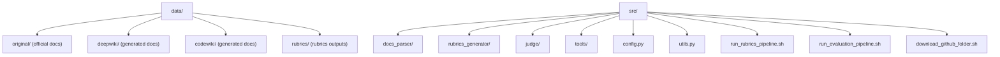
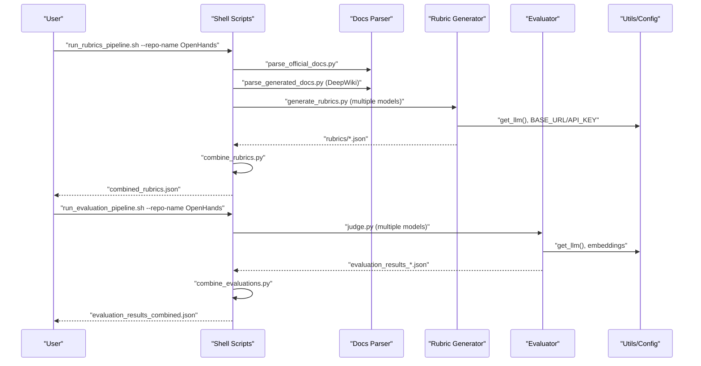
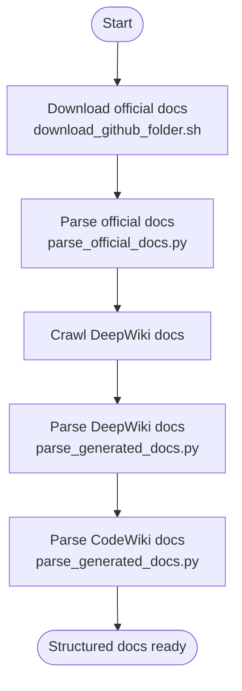
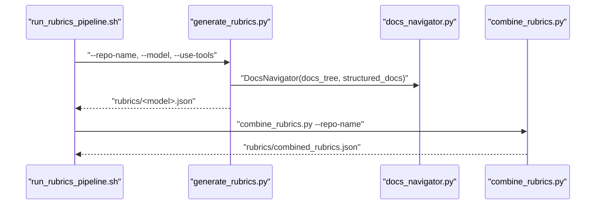
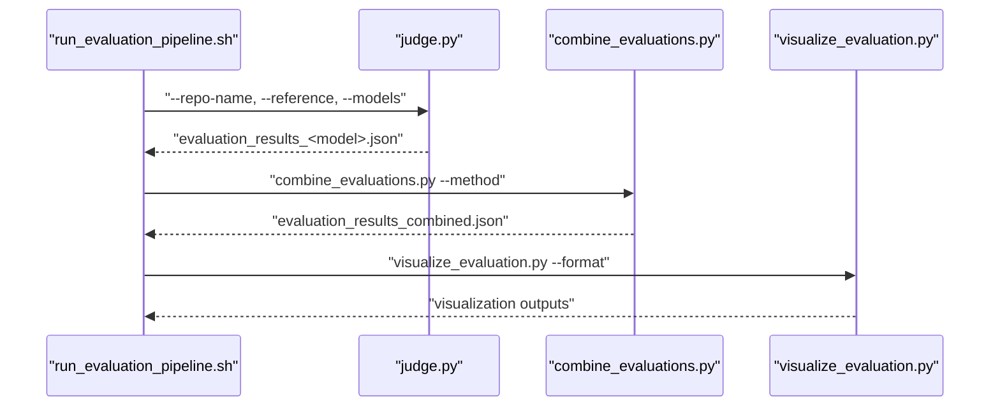
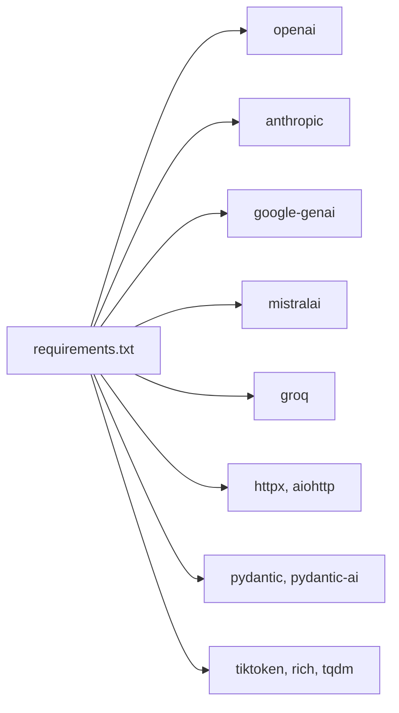

# Getting Started

<cite>
**Referenced Files in This Document**
- [README.md](file://README.md)
- [requirements.txt](file://requirements.txt)
- [src/config.py](file://src/config.py)
- [src/utils.py](file://src/utils.py)
- [src/download_github_folder.sh](file://src/download_github_folder.sh)
- [src/run_rubrics_pipeline.sh](file://src/run_rubrics_pipeline.sh)
- [src/run_evaluation_pipeline.sh](file://src/run_evaluation_pipeline.sh)
- [src/rubrics_generator/generate_rubrics.py](file://src/rubrics_generator/generate_rubrics.py)
- [src/tools/docs_navigator.py](file://src/tools/docs_navigator.py)
- [examples/OpenHands/rubrics/combined_rubrics.json](file://examples/OpenHands/rubrics/combined_rubrics.json)
- [examples/OpenHands/codewiki/evaluation_results/combined_evaluation_results.json](file://examples/OpenHands/codewiki/evaluation_results/combined_evaluation_results.json)
- [count_lines_of_code.py](file://count_lines_of_code.py)
</cite>

## Table of Contents
1. [Introduction](#introduction)
2. [Project Structure](#project-structure)
3. [Core Components](#core-components)
4. [Architecture Overview](#architecture-overview)
5. [Detailed Component Analysis](#detailed-component-analysis)
6. [Dependency Analysis](#dependency-analysis)
7. [Performance Considerations](#performance-considerations)
8. [Troubleshooting Guide](#troubleshooting-guide)
9. [Conclusion](#conclusion)
10. [Appendices](#appendices)

## Introduction
This guide helps you quickly set up CodeWikiBench and run your first evaluation on a repository. You will:
- Prepare your Python environment and install dependencies
- Configure API access for multiple LLM providers
- Download and parse documentation from official, DeepWiki, and CodeWiki sources
- Generate rubrics and run evaluations across multiple models
- Interpret results and troubleshoot common issues

We use the OpenHands repository as a practical case study to demonstrate the entire workflow from dataset preparation to evaluation visualization.

## Project Structure
At a high level, CodeWikiBench organizes data and scripts as follows:
- Data lives under data/<repo_name> with subfolders for original, deepwiki, codewiki, and rubrics
- Scripts under src/ orchestrate parsing, rubric generation, and evaluation
- Examples under examples/<repo> show real outputs for reference

**Diagram sources**
- [README.md](file://README.md#L1-L136)
- [src/config.py](file://src/config.py#L1-L32)

**Section sources**
- [README.md](file://README.md#L1-L136)
- [src/config.py](file://src/config.py#L1-L32)

## Core Components
- Configuration and environment
  - API keys and model selection are read from environment variables and .env files
  - Paths are resolved relative to the project root
- Data parsing
  - Official docs: download a repository’s docs folder via a helper script
  - DeepWiki and CodeWiki: parse generated documentation trees and content
- Rubric generation
  - Hierarchical rubrics produced by multiple LLMs and combined into a single view
- Evaluation
  - Evaluate candidate documentation against a reference using multiple models
  - Combine scores and visualize results

Practical prerequisites:
- Python 3.8+ with virtual environment recommended
- Git installed for downloading repository folders
- API keys for your chosen LLM providers (see Authentication section)

**Section sources**
- [src/config.py](file://src/config.py#L1-L32)
- [src/utils.py](file://src/utils.py#L1-L86)
- [README.md](file://README.md#L1-L136)

## Architecture Overview
The end-to-end workflow consists of three stages: documentation parsing, rubric generation, and evaluation. The shell scripts coordinate Python modules and produce structured outputs for downstream analysis.

**Diagram sources**
- [src/run_rubrics_pipeline.sh](file://src/run_rubrics_pipeline.sh#L1-L320)
- [src/run_evaluation_pipeline.sh](file://src/run_evaluation_pipeline.sh#L1-L331)
- [src/rubrics_generator/generate_rubrics.py](file://src/rubrics_generator/generate_rubrics.py#L1-L257)
- [src/utils.py](file://src/utils.py#L1-L86)

## Detailed Component Analysis

### Environment Setup and Prerequisites
- Python environment
  - Install dependencies from requirements.txt
  - Use a virtual environment to avoid conflicts
- Git
  - Required for downloading repository folders
- LLM provider authentication
  - Configure API keys and base URLs for your chosen providers
  - The system reads API_KEY, MODEL, BASE_URL, and EMBEDDING_MODEL from environment variables

Step-by-step:
1) Create and activate a virtual environment
2) Install dependencies
3) Prepare .env with API keys and model settings
4) Verify paths and permissions

**Section sources**
- [requirements.txt](file://requirements.txt#L1-L107)
- [src/config.py](file://src/config.py#L1-L32)
- [src/utils.py](file://src/utils.py#L1-L86)

### Authentication and Configuration
- Environment variables
  - API_KEY: your provider API key
  - MODEL: default model name
  - BASE_URL: provider endpoint (supports OpenAI-compatible endpoints)
  - EMBEDDING_MODEL: embedding model name
- .env file
  - Place a .env file at the repository root or ensure environment variables are exported
- Provider support
  - The project integrates with OpenAI, Anthropic, Google, Groq, Mistral, and others via the dependencies listed in requirements.txt

Practical tips:
- For OpenAI-compatible endpoints (e.g., Ollama, vLLM), set BASE_URL to the compatible endpoint and API_KEY accordingly
- Keep MODEL aligned with the provider’s model naming

**Section sources**
- [src/config.py](file://src/config.py#L1-L32)
- [src/utils.py](file://src/utils.py#L1-L86)
- [requirements.txt](file://requirements.txt#L1-L107)

### Documentation Parsing Workflow
Goal: Produce docs_tree.json and structured_docs.json for a repository.

Steps:
1) Download official docs
- Use the helper script to fetch a specific folder from a GitHub repository at a commit
- Outputs to data/<repo_name>/original

2) Parse official docs
- Run the official docs parser to generate docs_tree.json and structured_docs.json

3) Crawl and parse DeepWiki docs
- Crawl DeepWiki content for the repository
- Parse into structured format

4) Parse CodeWiki docs
- Parse generated CodeWiki documentation into structured format

Outputs:
- data/<repo_name>/original/docs_tree.json
- data/<repo_name>/deepwiki/docs_tree.json and structured_docs.json
- data/<repo_name>/codewiki/docs_tree.json and structured_docs.json

**Diagram sources**
- [src/download_github_folder.sh](file://src/download_github_folder.sh#L1-L155)
- [README.md](file://README.md#L45-L72)

**Section sources**
- [README.md](file://README.md#L45-L72)
- [src/download_github_folder.sh](file://src/download_github_folder.sh#L1-L155)

### Rubric Generation Pipeline
Goal: Generate hierarchical rubrics from documentation using multiple models and combine them into a single rubric.

Steps:
1) Generate rubrics
- Run the rubric generator for each model
- Optionally enable tools for document navigation

2) Combine rubrics
- Combine outputs from multiple models into a single rubric

3) Visualize rubrics (optional)
- Generate visual summaries of the rubric structure

Outputs:
- data/<repo_name>/rubrics/<model>.json
- data/<repo_name>/rubrics/combined_rubrics.json

**Diagram sources**
- [src/run_rubrics_pipeline.sh](file://src/run_rubrics_pipeline.sh#L1-L320)
- [src/rubrics_generator/generate_rubrics.py](file://src/rubrics_generator/generate_rubrics.py#L1-L257)
- [src/tools/docs_navigator.py](file://src/tools/docs_navigator.py#L1-L345)

**Section sources**
- [src/run_rubrics_pipeline.sh](file://src/run_rubrics_pipeline.sh#L1-L320)
- [src/rubrics_generator/generate_rubrics.py](file://src/rubrics_generator/generate_rubrics.py#L1-L257)
- [src/tools/docs_navigator.py](file://src/tools/docs_navigator.py#L1-L345)

### Evaluation Pipeline
Goal: Evaluate candidate documentation against a reference using multiple models, combine scores, and visualize results.

Steps:
1) Run evaluations
- For each model, evaluate candidate documentation against the selected reference

2) Combine results
- Combine scores using the specified method (average, majority vote, weighted average, etc.)

3) Visualize results (optional)
- Summaries, detailed views, or export to CSV/Markdown

Outputs:
- data/<repo_name>/evaluation_results_<model>.json
- data/<repo_name>/evaluation_results_combined.json

**Diagram sources**
- [src/run_evaluation_pipeline.sh](file://src/run_evaluation_pipeline.sh#L1-L331)
- [README.md](file://README.md#L79-L108)

**Section sources**
- [src/run_evaluation_pipeline.sh](file://src/run_evaluation_pipeline.sh#L1-L331)
- [README.md](file://README.md#L79-L108)

### Practical Case Study: OpenHands
- Data sources
  - Official docs: examples/OpenHands/original
  - DeepWiki docs: examples/OpenHands/deepwiki
  - CodeWiki docs: examples/OpenHands/codewiki
- Rubrics
  - examples/OpenHands/rubrics/combined_rubrics.json
- Evaluation results
  - examples/OpenHands/codewiki/evaluation_results/combined_evaluation_results.json

Interpretation tips:
- Rubrics: review top-level categories and weights; leaf rubrics include reference paths to documentation
- Evaluation results: each requirement includes score, reasoning, and evidence; use filters to highlight low-scoring items

**Section sources**
- [examples/OpenHands/rubrics/combined_rubrics.json](file://examples/OpenHands/rubrics/combined_rubrics.json#L1-L494)
- [examples/OpenHands/codewiki/evaluation_results/combined_evaluation_results.json](file://examples/OpenHands/codewiki/evaluation_results/combined_evaluation_results.json#L1-L759)

## Dependency Analysis
The project relies on a set of Python packages for LLM integration, HTTP clients, embeddings, and utilities. The most relevant ones for authentication and model access include:
- openai: OpenAI-compatible chat and embeddings
- anthropic: Anthropic models
- google-genai: Google Gemini models
- mistralai: Mistral models
- groq: Groq models

**Diagram sources**
- [requirements.txt](file://requirements.txt#L1-L107)

**Section sources**
- [requirements.txt](file://requirements.txt#L1-L107)

## Performance Considerations
- Token limits
  - Responses are truncated to protect against oversized outputs
- Batch sizes
  - Adjust batch size in evaluation to balance throughput and cost
- Model selection
  - Choose models aligned with cost/quality trade-offs; use routing strategies where applicable
- Embeddings
  - Embedding model selection affects latency and quality of semantic operations

[No sources needed since this section provides general guidance]

## Troubleshooting Guide
Common issues and resolutions:
- Missing data directory
  - Ensure data/<repo_name> exists and contains docs_tree.json for the selected reference
- API key or base URL misconfiguration
  - Verify API_KEY, MODEL, and BASE_URL in environment or .env
- Model not found or incompatible
  - Confirm model name matches provider expectations; for OpenAI-compatible endpoints, set BASE_URL appropriately
- Permission denied or path errors
  - Check file permissions and absolute paths; run from repository root
- Tool navigation failures
  - Ensure docs_tree.json and structured_docs.json exist; verify paths passed to DocsNavigator
- Pipeline step failures
  - Review script logs and exit codes; rerun with --visualize to inspect intermediate outputs

**Section sources**
- [src/run_rubrics_pipeline.sh](file://src/run_rubrics_pipeline.sh#L140-L158)
- [src/run_evaluation_pipeline.sh](file://src/run_evaluation_pipeline.sh#L169-L185)
- [src/tools/docs_navigator.py](file://src/tools/docs_navigator.py#L31-L43)

## Conclusion
You now have a complete roadmap to onboard CodeWikiBench, prepare data, generate rubrics, and evaluate documentation quality across multiple models. Use the OpenHands case study as a reference for expected outputs and interpretation. Iterate on model selection, batch sizes, and combination methods to optimize cost and quality for your use case.

[No sources needed since this section summarizes without analyzing specific files]

## Appendices

### Quick Start Commands
- Install dependencies
  - pip install -r requirements.txt
- Configure environment
  - Create .env with API_KEY, MODEL, BASE_URL, EMBEDDING_MODEL
- Download official docs
  - bash src/download_github_folder.sh --github_repo_url <URL> --folder_path docs --commit_id <COMMIT>
- Parse official docs
  - python docs_parser/parse_official_docs.py --repo_name <REPO>
- Crawl and parse DeepWiki docs
  - python docs_parser/crawl_deepwiki_docs.py --url <DEEPWIKI_URL> --output-dir ../data/<REPO>/deepwiki/docs
  - python docs_parser/parse_generated_docs.py --input-dir ../data/<REPO>/deepwiki/docs --output-dir ../data/<REPO>/deepwiki
- Parse CodeWiki docs
  - python docs_parser/parse_generated_docs.py --input-dir <CODEWIKI_OUTPUT> --output-dir ../data/<REPO>/codewiki
- Generate rubrics
  - bash src/run_rubrics_pipeline.sh --repo-name <REPO> --models <MODEL_LIST> --visualize
- Evaluate documentation
  - bash src/run_evaluation_pipeline.sh --repo-name <REPO> --reference <REFERENCE> --models <MODEL_LIST> --visualize --batch-size <N>
- Visualize results
  - python judge/visualize_evaluation.py --repo-name <REPO> --reference <REFERENCE> --format summary|detailed|csv|markdown

**Section sources**
- [README.md](file://README.md#L45-L108)
- [src/download_github_folder.sh](file://src/download_github_folder.sh#L1-L155)
- [src/run_rubrics_pipeline.sh](file://src/run_rubrics_pipeline.sh#L1-L320)
- [src/run_evaluation_pipeline.sh](file://src/run_evaluation_pipeline.sh#L1-L331)

### Repository Structure Reference
- data/<repo_name>/
  - original/ (official docs)
  - deepwiki/ (generated docs)
  - codewiki/ (generated docs)
  - rubrics/ (rubrics outputs)
- src/
  - docs_parser/, rubrics_generator/, judge/, tools/
  - config.py, utils.py
  - run_rubrics_pipeline.sh, run_evaluation_pipeline.sh, download_github_folder.sh
- examples/<repo>/
  - rubrics/combined_rubrics.json
  - codewiki/evaluation_results/combined_evaluation_results.json

**Section sources**
- [README.md](file://README.md#L1-L136)