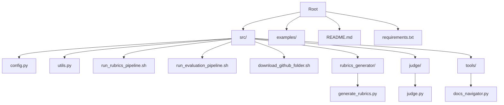
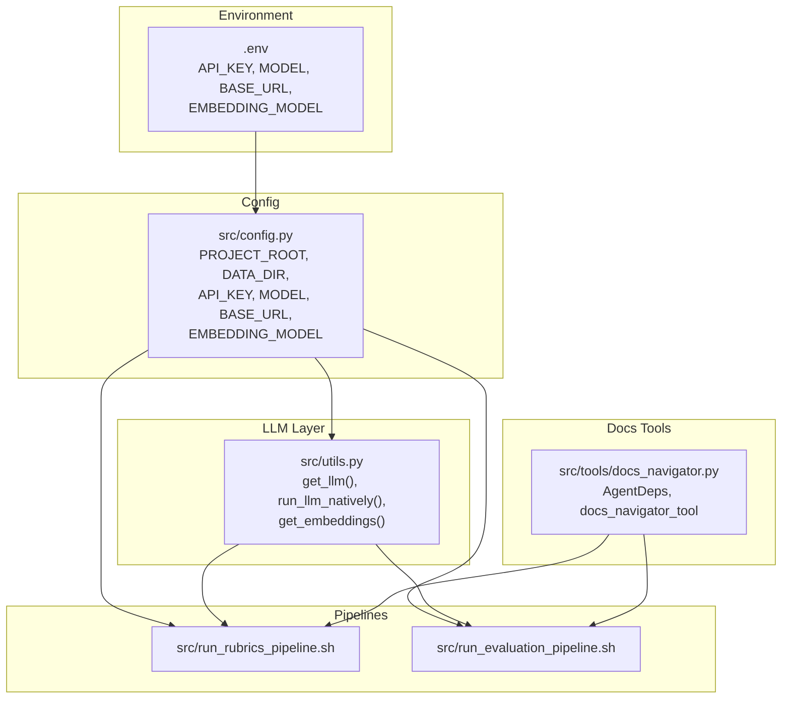
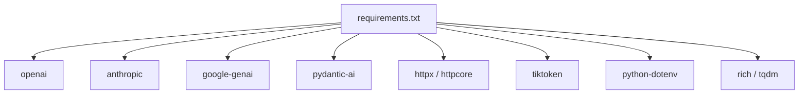

# Installation and Setup

<cite>
**Referenced Files in This Document**
- [README.md](file://README.md)
- [requirements.txt](file://requirements.txt)
- [src/config.py](file://src/config.py)
- [src/utils.py](file://src/utils.py)
- [src/run_rubrics_pipeline.sh](file://src/run_rubrics_pipeline.sh)
- [src/run_evaluation_pipeline.sh](file://src/run_evaluation_pipeline.sh)
- [src/download_github_folder.sh](file://src/download_github_folder.sh)
- [src/rubrics_generator/generate_rubrics.py](file://src/rubrics_generator/generate_rubrics.py)
- [src/judge/judge.py](file://src/judge/judge.py)
- [src/tools/docs_navigator.py](file://src/tools/docs_navigator.py)
</cite>

## Table of Contents
1. [Introduction](#introduction)
2. [Project Structure](#project-structure)
3. [Core Components](#core-components)
4. [Architecture Overview](#architecture-overview)
5. [Detailed Component Analysis](#detailed-component-analysis)
6. [Dependency Analysis](#dependency-analysis)
7. [Performance Considerations](#performance-considerations)
8. [Troubleshooting Guide](#troubleshooting-guide)
9. [Conclusion](#conclusion)
10. [Appendices](#appendices)

## Introduction
This guide provides a complete installation and setup walkthrough for CodeWikiBench. It focuses on environment configuration, dependency management, API key configuration for multiple LLM providers, environment variable setup, configuration file management, path configuration for data storage, platform-specific notes, common installation issues and solutions, verification steps, proxy configuration, rate limiting considerations, and cost estimation for API usage.

## Project Structure
CodeWikiBench is organized around a Python package layout with:
- A src/ package containing Python modules for parsing, rubrics generation, evaluation, tools, and shared configuration.
- Shell scripts for orchestrating rubrics and evaluation pipelines.
- A requirements.txt listing all Python dependencies.
- A README with usage examples and pipeline commands.

**Diagram sources**
- [README.md](file://README.md#L1-L136)
- [requirements.txt](file://requirements.txt#L1-L107)
- [src/config.py](file://src/config.py#L1-L32)
- [src/utils.py](file://src/utils.py#L1-L86)
- [src/run_rubrics_pipeline.sh](file://src/run_rubrics_pipeline.sh#L1-L320)
- [src/run_evaluation_pipeline.sh](file://src/run_evaluation_pipeline.sh#L1-L331)
- [src/download_github_folder.sh](file://src/download_github_folder.sh#L1-L155)
- [src/rubrics_generator/generate_rubrics.py](file://src/rubrics_generator/generate_rubrics.py#L1-L257)
- [src/judge/judge.py](file://src/judge/judge.py#L1-L551)
- [src/tools/docs_navigator.py](file://src/tools/docs_navigator.py#L1-L345)

**Section sources**
- [README.md](file://README.md#L1-L136)
- [requirements.txt](file://requirements.txt#L1-L107)

## Core Components
- Environment configuration and paths are centralized in src/config.py, which loads environment variables via python-dotenv and defines project root, data, and source directories. It also exposes API_KEY, MODEL, EMBEDDING_MODEL, BASE_URL, and token limits.
- LLM initialization and embeddings are handled in src/utils.py, which reads configuration values and constructs clients for chat completions and embeddings.
- Pipelines are orchestrated by shell scripts:
  - src/run_rubrics_pipeline.sh for rubrics generation and combination.
  - src/run_evaluation_pipeline.sh for evaluation and optional visualization.
- Data download automation is provided by src/download_github_folder.sh.
- Tools for documentation navigation are in src/tools/docs_navigator.py, integrated into agents for rubrics generation and evaluation.

**Section sources**
- [src/config.py](file://src/config.py#L1-L32)
- [src/utils.py](file://src/utils.py#L1-L86)
- [src/run_rubrics_pipeline.sh](file://src/run_rubrics_pipeline.sh#L1-L320)
- [src/run_evaluation_pipeline.sh](file://src/run_evaluation_pipeline.sh#L1-L331)
- [src/download_github_folder.sh](file://src/download_github_folder.sh#L1-L155)
- [src/tools/docs_navigator.py](file://src/tools/docs_navigator.py#L1-L345)

## Architecture Overview
The system relies on environment-driven configuration and modular Python components. The shell scripts coordinate data preparation and model execution, while Python modules encapsulate LLM interactions and tooling.

**Diagram sources**
- [src/config.py](file://src/config.py#L1-L32)
- [src/utils.py](file://src/utils.py#L1-L86)
- [src/run_rubrics_pipeline.sh](file://src/run_rubrics_pipeline.sh#L1-L320)
- [src/run_evaluation_pipeline.sh](file://src/run_evaluation_pipeline.sh#L1-L331)
- [src/tools/docs_navigator.py](file://src/tools/docs_navigator.py#L1-L345)

## Detailed Component Analysis

### Environment Configuration and Virtual Environment Setup
- Use a modern Python version compatible with the pinned dependencies in requirements.txt. The lockfile indicates packages from recent ecosystem versions; ensure your interpreter matches the supported range.
- Create and activate a dedicated virtual environment to isolate dependencies.
- Install dependencies from requirements.txt to satisfy all runtime requirements.

Verification steps:
- Confirm Python interpreter path and version.
- Verify pip install succeeded without conflicts.
- Confirm PYTHONPATH includes src/ so modules resolve correctly.

**Section sources**
- [requirements.txt](file://requirements.txt#L1-L107)

### API Key Configuration for Multiple LLM Providers
The system reads credentials and base URLs from environment variables. Supported providers are configured through the LLM client initialization in utils.py, which respects BASE_URL and API_KEY.

Credential storage best practices:
- Store API keys in a .env file located at the project root. The config loader will pick it up automatically.
- Never commit secrets to version control. Add .env to .gitignore.
- Restrict file permissions to owner-only where applicable.

Environment variables:
- API_KEY: Provider API key or token.
- MODEL: Default model name for chat completions.
- EMBEDDING_MODEL: Default model for embeddings.
- BASE_URL: Provider base URL (supports local and hosted providers).

Notes:
- The code initializes clients using BASE_URL and API_KEY, enabling compatibility with multiple providers that expose compatible APIs.
- For provider-specific SDKs (e.g., OpenAI), ensure the BASE_URL aligns with the provider’s endpoint and that API_KEY matches the provider’s expectations.

**Section sources**
- [src/config.py](file://src/config.py#L1-L32)
- [src/utils.py](file://src/utils.py#L1-L86)

### Configuration File Management via config.py
- src/config.py loads environment variables from .env and sets project root, data, and source directories.
- It exposes constants for API_KEY, MODEL, EMBEDDING_MODEL, and BASE_URL.
- Utility functions get_project_path and get_data_path compute absolute paths relative to project root and data directory respectively.

Recommendations:
- Keep configuration centralized in config.py and avoid hardcoding values in scripts.
- Use get_data_path for consistent output locations across pipelines.

**Section sources**
- [src/config.py](file://src/config.py#L1-L32)

### Path Configuration for Data Storage
- Data is stored under a data/ directory relative to the project root.
- Scripts and modules expect repository-specific subdirectories under data/<repo_name>.
- The rubrics and evaluation outputs are written under the repository’s data directory.

Verification steps:
- Ensure data/<repo_name> exists and contains expected JSON files (e.g., docs_tree.json).
- Confirm write permissions to the data directory.

**Section sources**
- [src/run_rubrics_pipeline.sh](file://src/run_rubrics_pipeline.sh#L142-L158)
- [src/run_evaluation_pipeline.sh](file://src/run_evaluation_pipeline.sh#L169-L185)
- [src/config.py](file://src/config.py#L11-L25)

### Platform-Specific Installation Notes
- The project uses standard Python packaging and shell scripting. Ensure your platform supports:
  - bash for shell scripts.
  - Python 3.x with pip.
  - Git for the download script’s sparse-checkout workflow.
- On Windows, prefer using a POSIX-compatible shell (e.g., Git Bash) or WSL to run the shell scripts reliably.

**Section sources**
- [src/download_github_folder.sh](file://src/download_github_folder.sh#L1-L155)
- [src/run_rubrics_pipeline.sh](file://src/run_rubrics_pipeline.sh#L1-L320)
- [src/run_evaluation_pipeline.sh](file://src/run_evaluation_pipeline.sh#L1-L331)

### Common Installation Issues and Solutions
- Missing dependencies:
  - Symptom: ImportError or ModuleNotFoundError.
  - Solution: Reinstall from requirements.txt.
- Permission denied writing to data directory:
  - Symptom: Write failures when generating rubrics or evaluations.
  - Solution: Adjust directory permissions or run as a user with appropriate rights.
- .env not loaded:
  - Symptom: Empty or default values for API_KEY/MODEL/BASE_URL.
  - Solution: Place .env at the project root and confirm python-dotenv is installed.
- Missing data directory or docs_tree.json:
  - Symptom: Pipeline exits early due to missing inputs.
  - Solution: Run the documentation parsing steps first and ensure the expected JSON files exist.

**Section sources**
- [requirements.txt](file://requirements.txt#L1-L107)
- [src/config.py](file://src/config.py#L1-L32)
- [src/run_rubrics_pipeline.sh](file://src/run_rubrics_pipeline.sh#L142-L158)
- [src/run_evaluation_pipeline.sh](file://src/run_evaluation_pipeline.sh#L169-L185)

### Verification Steps
- After installing dependencies, run a quick smoke test using the native LLM runner to validate configuration:
  - Invoke the script entry point from utils.py to ensure BASE_URL and API_KEY are accepted and a response is returned.
- Confirm that data directories are created and populated by the rubrics and evaluation pipelines.

**Section sources**
- [src/utils.py](file://src/utils.py#L64-L66)
- [src/run_rubrics_pipeline.sh](file://src/run_rubrics_pipeline.sh#L267-L285)
- [src/run_evaluation_pipeline.sh](file://src/run_evaluation_pipeline.sh#L304-L330)

### Proxy Configuration
- If operating behind a corporate proxy, configure environment variables recognized by HTTP clients:
  - HTTP_PROXY/HTTPS_PROXY
  - NO_PROXY for exceptions
- Some libraries may require additional configuration (e.g., certifi trust stores). Validate connectivity by testing a simple HTTP request to the BASE_URL endpoint.

[No sources needed since this section provides general guidance]

### Rate Limiting Considerations
- The evaluation module includes built-in handling for rate-limit scenarios:
  - Detection of rate-limit indicators in error messages.
  - Automatic delay to respect provider quotas.
  - Optional retry logic for transient failures.
- Tune batch sizes and max retries according to provider quotas and latency.

**Section sources**
- [src/judge/judge.py](file://src/judge/judge.py#L322-L332)
- [src/judge/judge.py](file://src/judge/judge.py#L366-L383)

### Cost Estimation for API Usage
- The evaluation module computes approximate costs based on input and output token counts:
  - Total tokens are summed across all evaluations.
  - An estimated cost is derived from token usage and typical pricing assumptions.
- Use this estimate to budget usage and monitor spending.

**Section sources**
- [src/judge/judge.py](file://src/judge/judge.py#L521-L543)

## Dependency Analysis
The project depends on a curated set of Python packages for HTTP, LLM integrations, embeddings, CLI, and data processing. The shell scripts orchestrate Python modules that rely on these dependencies.

**Diagram sources**
- [requirements.txt](file://requirements.txt#L1-L107)

**Section sources**
- [requirements.txt](file://requirements.txt#L1-L107)

## Performance Considerations
- Token limits: The system truncates tool responses to a configured maximum to prevent oversized payloads.
- Batch processing: The evaluation pipeline supports configurable batch sizes to balance throughput and resource usage.
- Retries: Built-in retry logic reduces failure impact from transient network issues.

**Section sources**
- [src/utils.py](file://src/utils.py#L12-L26)
- [src/run_evaluation_pipeline.sh](file://src/run_evaluation_pipeline.sh#L28-L31)
- [src/judge/judge.py](file://src/judge/judge.py#L248-L251)

## Troubleshooting Guide
- Authentication failures:
  - Verify API_KEY and BASE_URL correctness.
  - Confirm provider endpoint compatibility.
- Network errors:
  - Check proxy settings and firewall rules.
  - Test connectivity to BASE_URL.
- JSON parsing errors:
  - Ensure rubrics and evaluation outputs are valid JSON.
  - Review raw outputs when JSON extraction fails.
- Tool navigation errors:
  - Confirm docs_tree.json and structured_docs.json exist in the expected paths.
  - Validate path structures used by the navigator tool.

**Section sources**
- [src/utils.py](file://src/utils.py#L48-L62)
- [src/judge/judge.py](file://src/judge/judge.py#L107-L110)
- [src/tools/docs_navigator.py](file://src/tools/docs_navigator.py#L250-L258)

## Conclusion
By following this guide, you will have installed dependencies, configured environment variables, validated paths, and prepared the system for rubrics generation and evaluation. Use the provided scripts to orchestrate workflows, adhere to rate-limiting and cost estimation guidance, and apply the troubleshooting tips for common issues.

## Appendices

### Environment Variable Reference
- API_KEY: LLM provider API key or token.
- MODEL: Default model for chat completions.
- EMBEDDING_MODEL: Default model for embeddings.
- BASE_URL: Provider base URL.

**Section sources**
- [src/config.py](file://src/config.py#L14-L17)

### Pipeline Invocation Examples
- Rubrics pipeline:
  - Use src/run_rubrics_pipeline.sh with --repo-name and optional --models, --temperature, --max-retries, --no-tools, --visualize.
- Evaluation pipeline:
  - Use src/run_evaluation_pipeline.sh with --repo-name, --reference, --models, --batch-size, --combination-method, --weights, --max-retries, --no-tools, --visualize.

**Section sources**
- [src/run_rubrics_pipeline.sh](file://src/run_rubrics_pipeline.sh#L42-L75)
- [src/run_evaluation_pipeline.sh](file://src/run_evaluation_pipeline.sh#L45-L81)

### Data Preparation Workflow
- Download repository docs using src/download_github_folder.sh.
- Parse official and generated docs as outlined in README.
- Ensure docs_tree.json and structured_docs.json exist for the target repository.

**Section sources**
- [README.md](file://README.md#L46-L71)
- [src/download_github_folder.sh](file://src/download_github_folder.sh#L1-L155)