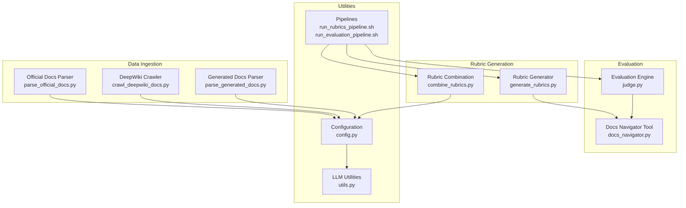
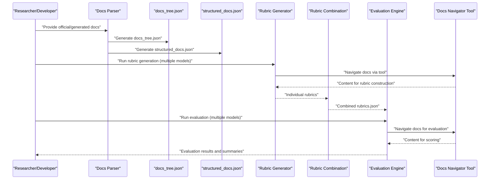
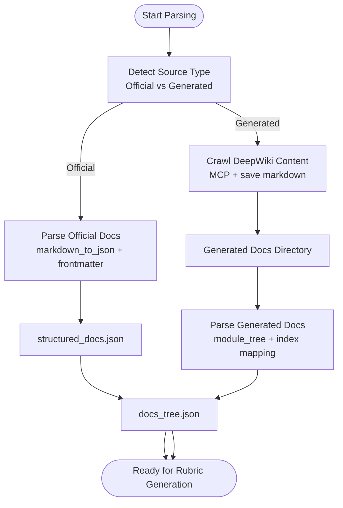
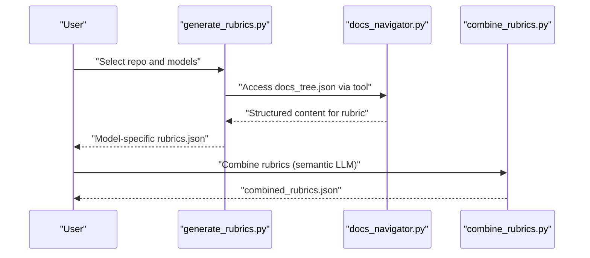
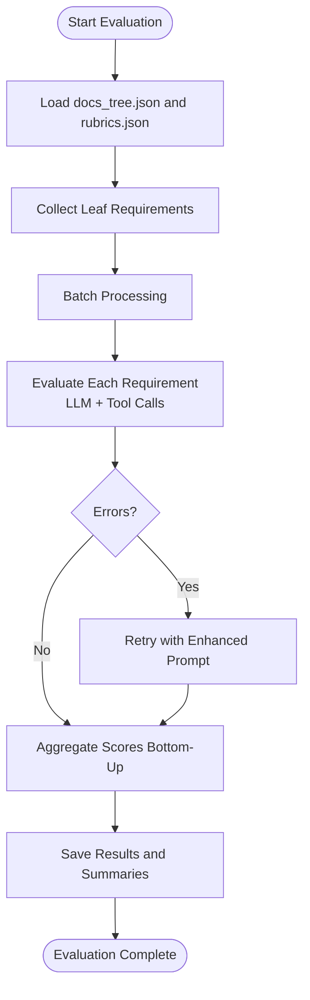
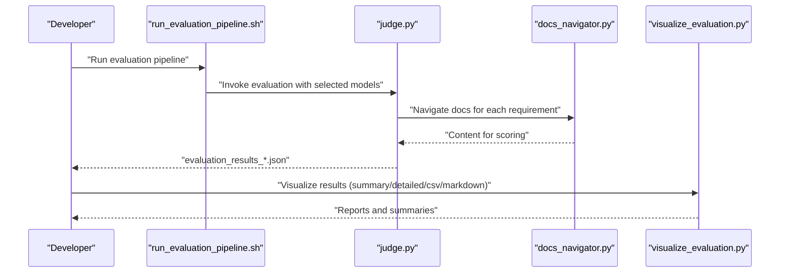
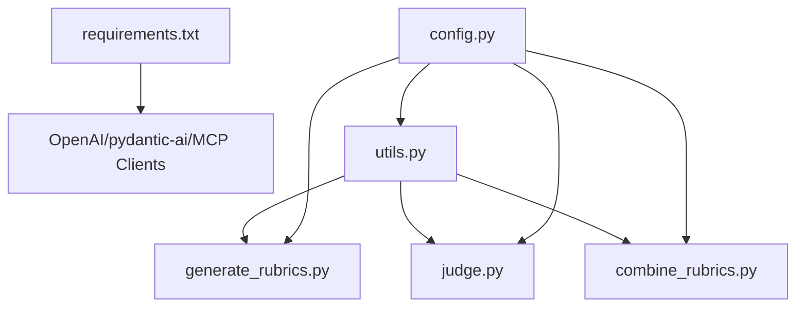

# Project Overview

<cite>
**Referenced Files in This Document**
- [README.md](file://README.md)
- [requirements.txt](file://requirements.txt)
- [config.py](file://src/config.py)
- [utils.py](file://src/utils.py)
- [run_rubrics_pipeline.sh](file://src/run_rubrics_pipeline.sh)
- [run_evaluation_pipeline.sh](file://src/run_evaluation_pipeline.sh)
- [generate_rubrics.py](file://src/rubrics_generator/generate_rubrics.py)
- [combine_rubrics.py](file://src/rubrics_generator/combine_rubrics.py)
- [judge.py](file://src/judge/judge.py)
- [docs_navigator.py](file://src/tools/docs_navigator.py)
- [parse_official_docs.py](file://src/docs_parser/parse_official_docs.py)
- [parse_generated_docs.py](file://src/docs_parser/parse_generated_docs.py)
- [crawl_deepwiki_docs.py](file://src/docs_parser/crawl_deepwiki_docs.py)
- [combined_rubrics.json](file://examples/OpenHands/rubrics/combined_rubrics.json)
- [docs_tree.json](file://examples/OpenHands/deepwiki/docs_tree.json)
</cite>

## Table of Contents
1. [Introduction](#introduction)
2. [Project Structure](#project-structure)
3. [Core Components](#core-components)
4. [Architecture Overview](#architecture-overview)
5. [Detailed Component Analysis](#detailed-component-analysis)
6. [Dependency Analysis](#dependency-analysis)
7. [Performance Considerations](#performance-considerations)
8. [Troubleshooting Guide](#troubleshooting-guide)
9. [Conclusion](#conclusion)
10. [Appendices](#appendices)

## Introduction
CodeWikiBench is an AI-powered research framework designed to evaluate the quality of AI-generated documentation across diverse open-source projects. It provides a standardized methodology for constructing evaluation rubrics, parsing documentation into structured forms (documentation trees and structured documents), and running multi-model evaluation pipelines. The platform integrates with GitHub repositories and supports both official documentation and AI-generated documentation sources (e.g., DeepWiki), enabling comparative assessments of documentation completeness and clarity.

The project serves dual audiences:
- Researchers: A reproducible benchmark dataset and evaluation protocols for studying AI documentation quality.
- Developers: Practical tooling for generating rubrics, parsing documentation, and evaluating documentation against rubrics using multiple LLMs.

Key terminology used consistently in the codebase:
- Rubrics: Hierarchical evaluation criteria derived from documentation trees.
- Documentation trees (docs_tree.json): Structured, navigable representations of documentation layout.
- Structured documents (structured_docs.json): Parsed, machine-readable content extracted from documentation.
- Evaluation pipelines: Automated workflows for rubric generation, rubric combination, and documentation evaluation.

## Project Structure
The repository is organized around a modular pipeline:
- src/docs_parser: Documentation ingestion and parsing for official and AI-generated sources.
- src/rubrics_generator: Rubric generation and combination using multiple LLMs.
- src/judge: Multi-model evaluation of documentation against rubrics.
- src/tools: Navigation and search utilities for documentation trees.
- src/config.py and src/utils.py: Shared configuration and utilities.
- examples: Sample datasets and outputs demonstrating the workflow.

**Diagram sources**
- [parse_official_docs.py](file://src/docs_parser/parse_official_docs.py#L230-L327)
- [crawl_deepwiki_docs.py](file://src/docs_parser/crawl_deepwiki_docs.py#L291-L334)
- [parse_generated_docs.py](file://src/docs_parser/parse_generated_docs.py#L155-L312)
- [generate_rubrics.py](file://src/rubrics_generator/generate_rubrics.py#L170-L256)
- [combine_rubrics.py](file://src/rubrics_generator/combine_rubrics.py#L232-L303)
- [judge.py](file://src/judge/judge.py#L435-L548)
- [docs_navigator.py](file://src/tools/docs_navigator.py#L11-L345)
- [config.py](file://src/config.py#L1-L32)
- [utils.py](file://src/utils.py#L1-L86)
- [run_rubrics_pipeline.sh](file://src/run_rubrics_pipeline.sh#L1-L320)
- [run_evaluation_pipeline.sh](file://src/run_evaluation_pipeline.sh#L1-L331)

**Section sources**
- [README.md](file://README.md#L1-L136)
- [config.py](file://src/config.py#L1-L32)
- [utils.py](file://src/utils.py#L1-L86)

## Core Components
- Dataset and Benchmark: The benchmark dataset includes 22 open-source repositories across multiple programming languages, each with metadata, docs_tree.json, structured_docs.json, and rubrics. See [README.md](file://README.md#L9-L43).
- Documentation Parsing: Official documentation is parsed into structured_docs.json and docs_tree.json; AI-generated documentation (e.g., DeepWiki) is crawled and parsed similarly. See [README.md](file://README.md#L45-L71).
- Rubric Generation: Hierarchical rubrics are generated using multiple LLMs and combined via semantic analysis. See [README.md](file://README.md#L73-L77) and [README.md](file://README.md#L87-L88).
- Evaluation Pipelines: Multi-model evaluation of documentation against rubrics with batch processing, retry logic, and optional visualization. See [README.md](file://README.md#L79-L108).

**Section sources**
- [README.md](file://README.md#L9-L43)
- [README.md](file://README.md#L45-L71)
- [README.md](file://README.md#L73-L77)
- [README.md](file://README.md#L79-L108)

## Architecture Overview
The system follows a three-stage architecture:
1. Documentation Ingestion: Parse official and AI-generated documentation into structured forms.
2. Rubric Construction: Generate rubrics from documentation trees and combine them across models.
3. Evaluation: Evaluate documentation against rubrics using multiple LLMs with navigation tools and batch processing.

**Diagram sources**
- [parse_official_docs.py](file://src/docs_parser/parse_official_docs.py#L230-L327)
- [parse_generated_docs.py](file://src/docs_parser/parse_generated_docs.py#L155-L312)
- [generate_rubrics.py](file://src/rubrics_generator/generate_rubrics.py#L170-L256)
- [combine_rubrics.py](file://src/rubrics_generator/combine_rubrics.py#L232-L303)
- [judge.py](file://src/judge/judge.py#L435-L548)
- [docs_navigator.py](file://src/tools/docs_navigator.py#L261-L285)

## Detailed Component Analysis

### Documentation Parsing Pipeline
- Official Documentation Parser: Converts markdown files into structured_docs.json and generates a navigable docs_tree.json. Handles frontmatter, SVG replacement, and recursive directory traversal. See [parse_official_docs.py](file://src/docs_parser/parse_official_docs.py#L186-L228) and [parse_official_docs.py](file://src/docs_parser/parse_official_docs.py#L230-L327).
- DeepWiki Crawler: Uses MCP to fetch repository wiki structure and content, saving markdown files for downstream parsing. See [crawl_deepwiki_docs.py](file://src/docs_parser/crawl_deepwiki_docs.py#L291-L334).
- Generated Docs Parser: Parses AI-generated documentation from markdown files, leveraging module trees when available to reconstruct hierarchical structure. See [parse_generated_docs.py](file://src/docs_parser/parse_generated_docs.py#L155-L312).

**Diagram sources**
- [parse_official_docs.py](file://src/docs_parser/parse_official_docs.py#L186-L228)
- [parse_official_docs.py](file://src/docs_parser/parse_official_docs.py#L230-L327)
- [crawl_deepwiki_docs.py](file://src/docs_parser/crawl_deepwiki_docs.py#L291-L334)
- [parse_generated_docs.py](file://src/docs_parser/parse_generated_docs.py#L155-L312)

**Section sources**
- [parse_official_docs.py](file://src/docs_parser/parse_official_docs.py#L186-L228)
- [parse_official_docs.py](file://src/docs_parser/parse_official_docs.py#L230-L327)
- [crawl_deepwiki_docs.py](file://src/docs_parser/crawl_deepwiki_docs.py#L291-L334)
- [parse_generated_docs.py](file://src/docs_parser/parse_generated_docs.py#L155-L312)

### Rubric Generation and Combination
- Rubric Generation: Uses an LLM agent to construct hierarchical rubrics from docs_tree.json, optionally leveraging the Docs Navigator tool to explore content. See [generate_rubrics.py](file://src/rubrics_generator/generate_rubrics.py#L170-L256).
- Rubric Combination: Combines rubrics from multiple models using semantic analysis, with fallback merging strategies. See [combine_rubrics.py](file://src/rubrics_generator/combine_rubrics.py#L232-L303).

**Diagram sources**
- [generate_rubrics.py](file://src/rubrics_generator/generate_rubrics.py#L170-L256)
- [combine_rubrics.py](file://src/rubrics_generator/combine_rubrics.py#L232-L303)
- [docs_navigator.py](file://src/tools/docs_navigator.py#L261-L285)

**Section sources**
- [generate_rubrics.py](file://src/rubrics_generator/generate_rubrics.py#L170-L256)
- [combine_rubrics.py](file://src/rubrics_generator/combine_rubrics.py#L232-L303)

### Evaluation Pipeline
- Evaluation Engine: Iterates through leaf rubric requirements, evaluates documentation coverage using LLMs, and aggregates scores bottom-up. Includes batch processing, retry logic, and token accounting. See [judge.py](file://src/judge/judge.py#L435-L548).
- Docs Navigator Tool: Provides navigation and content retrieval from docs_tree.json and structured_docs.json, with search capabilities and depth-limited content extraction. See [docs_navigator.py](file://src/tools/docs_navigator.py#L11-L345).

**Diagram sources**
- [judge.py](file://src/judge/judge.py#L435-L548)
- [docs_navigator.py](file://src/tools/docs_navigator.py#L11-L345)

**Section sources**
- [judge.py](file://src/judge/judge.py#L435-L548)
- [docs_navigator.py](file://src/tools/docs_navigator.py#L11-L345)

### Practical Workflow Examples
- Complete Workflow Example: The README demonstrates end-to-end usage from parsing to evaluation and visualization. See [README.md](file://README.md#L45-L108).
- Example Outputs: The examples directory includes parsed docs_tree.json and combined rubrics.json for OpenHands. See [docs_tree.json](file://examples/OpenHands/deepwiki/docs_tree.json#L1-L200) and [combined_rubrics.json](file://examples/OpenHands/rubrics/combined_rubrics.json#L1-L494).

**Diagram sources**
- [run_evaluation_pipeline.sh](file://src/run_evaluation_pipeline.sh#L1-L331)
- [judge.py](file://src/judge/judge.py#L435-L548)
- [docs_navigator.py](file://src/tools/docs_navigator.py#L261-L285)

**Section sources**
- [README.md](file://README.md#L45-L108)
- [docs_tree.json](file://examples/OpenHands/deepwiki/docs_tree.json#L1-L200)
- [combined_rubrics.json](file://examples/OpenHands/rubrics/combined_rubrics.json#L1-L494)

## Dependency Analysis
- External Libraries: The project relies on OpenAI-compatible clients, pydantic-ai, MCP for DeepWiki integration, and various utilities for tokenization and embeddings. See [requirements.txt](file://requirements.txt#L1-L107).
- Configuration and Utilities: Centralized configuration via config.py and shared LLM utilities via utils.py. See [config.py](file://src/config.py#L1-L32) and [utils.py](file://src/utils.py#L1-L86).

**Diagram sources**
- [requirements.txt](file://requirements.txt#L1-L107)
- [config.py](file://src/config.py#L1-L32)
- [utils.py](file://src/utils.py#L1-L86)
- [generate_rubrics.py](file://src/rubrics_generator/generate_rubrics.py#L1-L257)
- [judge.py](file://src/judge/judge.py#L1-L551)
- [combine_rubrics.py](file://src/rubrics_generator/combine_rubrics.py#L1-L306)

**Section sources**
- [requirements.txt](file://requirements.txt#L1-L107)
- [config.py](file://src/config.py#L1-L32)
- [utils.py](file://src/utils.py#L1-L86)

## Performance Considerations
- Token Limits: Responses are truncated to prevent exceeding configured token limits. See [utils.py](file://src/utils.py#L12-L26).
- Batch Processing: Evaluation uses configurable batch sizes to balance throughput and rate limits. See [run_evaluation_pipeline.sh](file://src/run_evaluation_pipeline.sh#L21-L26).
- Retry Logic: Automatic retries with exponential backoff for error cases and rate-limit handling. See [judge.py](file://src/judge/judge.py#L98-L240).

[No sources needed since this section provides general guidance]

## Troubleshooting Guide
- Missing Dependencies: Ensure all packages in requirements.txt are installed. See [requirements.txt](file://requirements.txt#L1-L107).
- Configuration Issues: Verify API keys, base URLs, and model settings in config.py. See [config.py](file://src/config.py#L1-L32).
- Pipeline Failures: Use verbose logs and retry options in the evaluation pipeline. See [run_evaluation_pipeline.sh](file://src/run_evaluation_pipeline.sh#L1-L331).
- Tool Errors: Confirm docs_tree.json and structured_docs.json exist and are valid. See [docs_navigator.py](file://src/tools/docs_navigator.py#L31-L43).

**Section sources**
- [requirements.txt](file://requirements.txt#L1-L107)
- [config.py](file://src/config.py#L1-L32)
- [run_evaluation_pipeline.sh](file://src/run_evaluation_pipeline.sh#L1-L331)
- [docs_navigator.py](file://src/tools/docs_navigator.py#L31-L43)

## Conclusion
CodeWikiBench offers a comprehensive, reproducible framework for evaluating AI-generated documentation quality. By combining structured documentation parsing, multi-model rubric generation, and robust evaluation pipelines, it enables both researchers and developers to assess documentation comprehensively. The platform’s modular design, integration with GitHub repositories, and standardized dataset make it a valuable resource for advancing documentation research and practice.

[No sources needed since this section summarizes without analyzing specific files]

## Appendices

### Research Background and Academic Contributions
- Dataset Availability: The benchmark dataset is hosted on HuggingFace and includes metadata, docs_tree.json, structured_docs.json, and rubrics for 22 repositories. See [README.md](file://README.md#L5-L23).
- Paper Reference: The project is associated with arXiv paper cited in README. See [README.md](file://README.md#L7).
- Citation Requirements: Researchers should cite the provided BibTeX entry when using the dataset or codebase. See [README.md](file://README.md#L122-L136).

**Section sources**
- [README.md](file://README.md#L5-L23)
- [README.md](file://README.md#L7)
- [README.md](file://README.md#L122-L136)