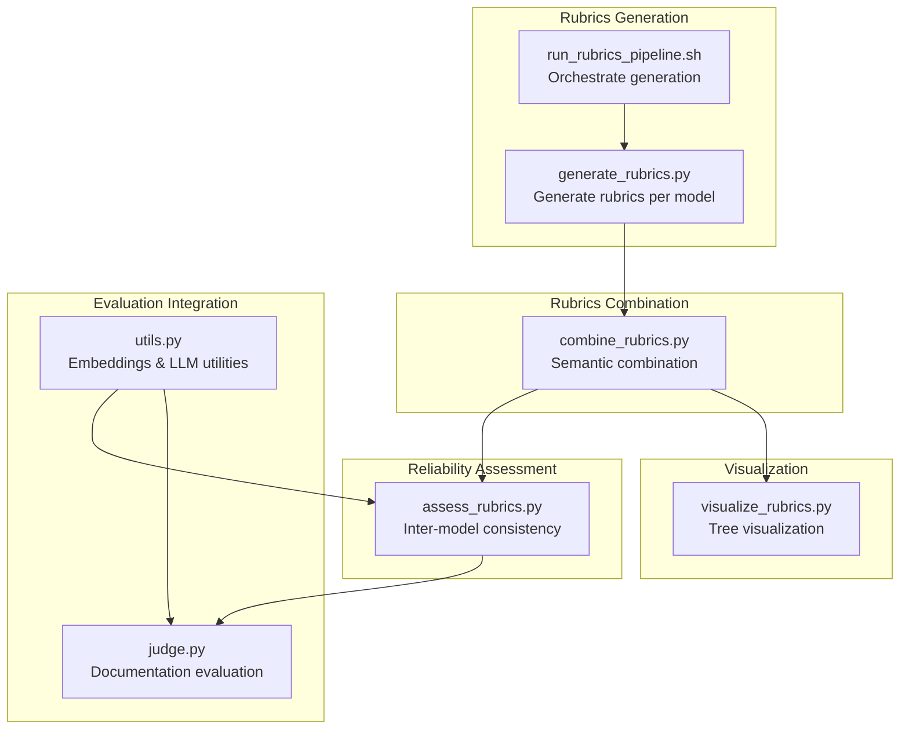
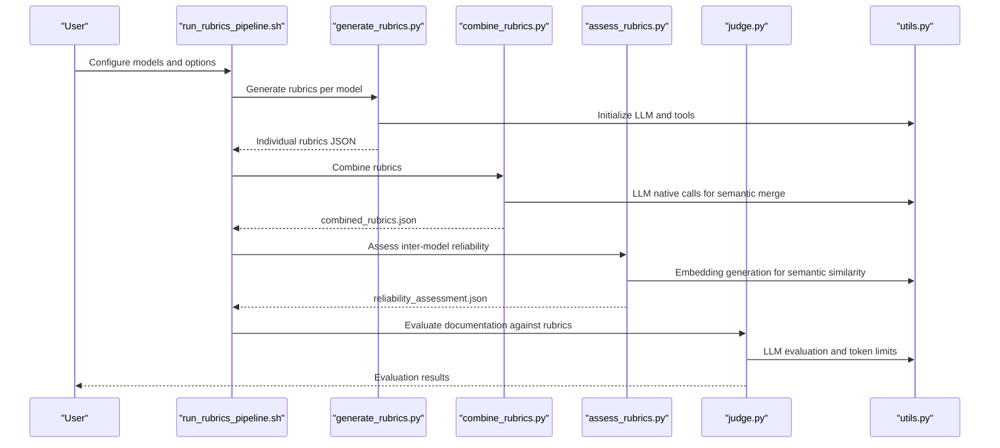
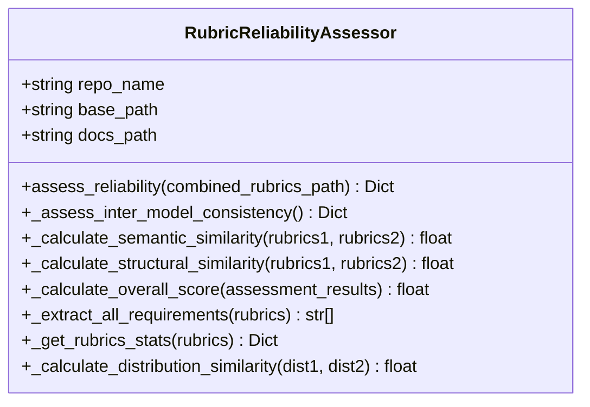
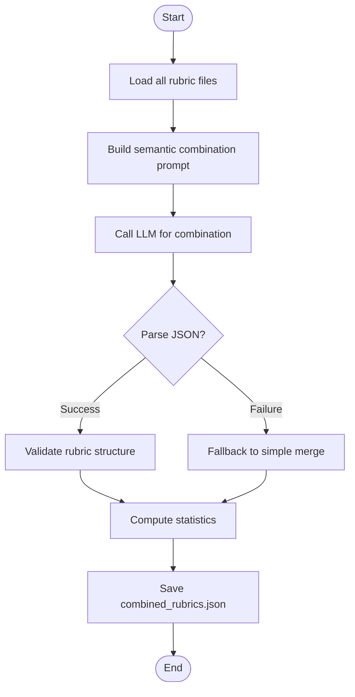
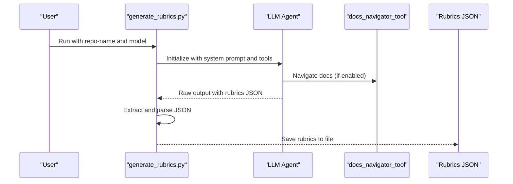
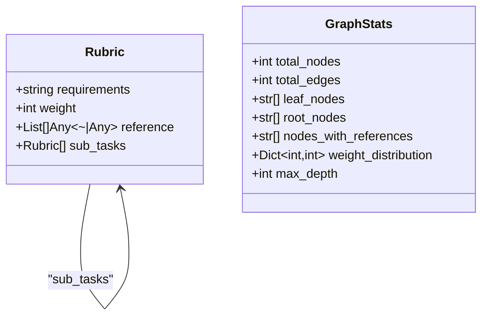
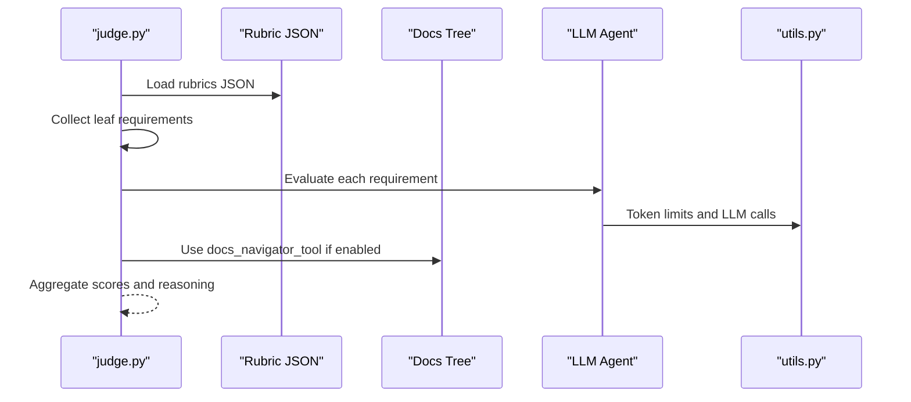
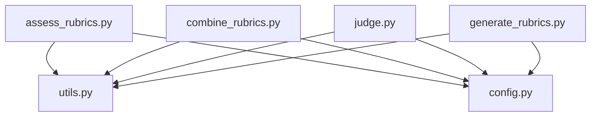

# Rubrics Assessment Methods

<cite>
**Referenced Files in This Document**
- [assess_rubrics.py](file://src/rubrics_generator/assess_rubrics.py)
- [generate_rubrics.py](file://src/rubrics_generator/generate_rubrics.py)
- [combine_rubrics.py](file://src/rubrics_generator/combine_rubrics.py)
- [visualize_rubrics.py](file://src/rubrics_generator/visualize_rubrics.py)
- [run_rubrics_pipeline.sh](file://src/run_rubrics_pipeline.sh)
- [config.py](file://src/config.py)
- [judge.py](file://src/judge/judge.py)
- [utils.py](file://src/utils.py)
- [README.md](file://README.md)
- [reliability_assessment.json](file://examples/OpenHands/rubrics/reliability_assessment.json)
- [combined_rubrics.json](file://examples/OpenHands/rubrics/combined_rubrics.json)
- [claude-sonnet-4.json](file://examples/OpenHands/rubrics/claude-sonnet-4.json)
- [kimi-k2-instruct.json](file://examples/OpenHands/rubrics/kimi-k2-instruct.json)
</cite>

## Table of Contents
1. [Introduction](#introduction)
2. [Project Structure](#project-structure)
3. [Core Components](#core-components)
4. [Architecture Overview](#architecture-overview)
5. [Detailed Component Analysis](#detailed-component-analysis)
6. [Dependency Analysis](#dependency-analysis)
7. [Performance Considerations](#performance-considerations)
8. [Troubleshooting Guide](#troubleshooting-guide)
9. [Conclusion](#conclusion)
10. [Appendices](#appendices)

## Introduction
This document explains the rubrics assessment methods used to evaluate rubric quality, consistency, and reliability across different models and implementations. It covers assessment criteria including rubric completeness, hierarchical coherence, weight distribution reasonableness, and reference path accuracy. It documents statistical analysis techniques for comparing rubric variations, measuring inter-model agreement, and identifying potential biases or inconsistencies. Practical examples demonstrate rubric evaluation workflows, quality scoring mechanisms, and reliability assessment metrics. Finally, it addresses integration with evaluation pipelines and how assessed rubrics improve documentation evaluation accuracy.

## Project Structure
The rubrics assessment workflow spans multiple stages:
- Rubric generation using multiple LLMs
- Semantic combination of rubrics across models
- Reliability assessment across models
- Visualization of rubric structure
- Integration with evaluation pipelines

**Diagram sources**
- [generate_rubrics.py](file://src/rubrics_generator/generate_rubrics.py#L170-L254)
- [combine_rubrics.py](file://src/rubrics_generator/combine_rubrics.py#L22-L151)
- [assess_rubrics.py](file://src/rubrics_generator/assess_rubrics.py#L22-L36)
- [visualize_rubrics.py](file://src/rubrics_generator/visualize_rubrics.py#L129-L167)
- [judge.py](file://src/judge/judge.py#L21-L31)
- [utils.py](file://src/utils.py#L72-L82)

**Section sources**
- [README.md](file://README.md#L73-L77)
- [run_rubrics_pipeline.sh](file://src/run_rubrics_pipeline.sh#L167-L242)

## Core Components
- RubricReliabilityAssessor: Computes inter-model consistency using semantic and structural similarity, and derives an overall reliability score.
- Semantic combiner: Merges rubrics from multiple models using LLM-based semantic analysis with fallbacks.
- Rubric generator: Produces hierarchical rubrics from documentation trees using LLM agents.
- Visualization: Converts rubric JSON to NetworkX graphs and prints ASCII tree views.
- Evaluation integration: Uses rubrics to evaluate documentation coverage and produce scores.

Key assessment criteria:
- Completeness: Total items, top-level items, maximum depth
- Hierarchical coherence: Structural similarity metrics (depth, weight distribution)
- Weight distribution reasonableness: Distribution of weights (3=Essential, 2=Important, 1=Supportive)
- Reference path accuracy: Presence and validity of reference paths for leaf rubrics

**Section sources**
- [assess_rubrics.py](file://src/rubrics_generator/assess_rubrics.py#L14-L36)
- [combine_rubrics.py](file://src/rubrics_generator/combine_rubrics.py#L22-L151)
- [generate_rubrics.py](file://src/rubrics_generator/generate_rubrics.py#L25-L98)
- [visualize_rubrics.py](file://src/rubrics_generator/visualize_rubrics.py#L53-L91)
- [judge.py](file://src/judge/judge.py#L65-L87)

## Architecture Overview
The rubrics assessment architecture integrates generation, combination, reliability assessment, and evaluation:

**Diagram sources**
- [run_rubrics_pipeline.sh](file://src/run_rubrics_pipeline.sh#L167-L242)
- [generate_rubrics.py](file://src/rubrics_generator/generate_rubrics.py#L170-L254)
- [combine_rubrics.py](file://src/rubrics_generator/combine_rubrics.py#L22-L151)
- [assess_rubrics.py](file://src/rubrics_generator/assess_rubrics.py#L22-L36)
- [judge.py](file://src/judge/judge.py#L21-L31)
- [utils.py](file://src/utils.py#L48-L82)

## Detailed Component Analysis

### RubricReliabilityAssessor
Computes inter-model consistency and an overall reliability score:
- Loads combined rubrics and individual rubric files
- Calculates semantic similarity using embeddings and cosine similarity
- Calculates structural similarity using depth, weight distribution, and item counts
- Aggregates scores into an overall reliability score

**Diagram sources**
- [assess_rubrics.py](file://src/rubrics_generator/assess_rubrics.py#L14-L36)
- [assess_rubrics.py](file://src/rubrics_generator/assess_rubrics.py#L79-L159)
- [assess_rubrics.py](file://src/rubrics_generator/assess_rubrics.py#L163-L234)

**Section sources**
- [assess_rubrics.py](file://src/rubrics_generator/assess_rubrics.py#L22-L36)
- [assess_rubrics.py](file://src/rubrics_generator/assess_rubrics.py#L38-L77)
- [assess_rubrics.py](file://src/rubrics_generator/assess_rubrics.py#L140-L160)

### Semantic Rubric Combination
Merges rubrics from multiple models using LLM-based semantic analysis:
- Loads all individual rubric files
- Constructs a prompt for an LLM to combine rubrics
- Parses and validates JSON responses
- Falls back to simple merge if LLM calls fail

**Diagram sources**
- [combine_rubrics.py](file://src/rubrics_generator/combine_rubrics.py#L22-L151)
- [combine_rubrics.py](file://src/rubrics_generator/combine_rubrics.py#L153-L171)
- [combine_rubrics.py](file://src/rubrics_generator/combine_rubrics.py#L232-L303)

**Section sources**
- [combine_rubrics.py](file://src/rubrics_generator/combine_rubrics.py#L22-L151)
- [combine_rubrics.py](file://src/rubrics_generator/combine_rubrics.py#L173-L200)
- [combine_rubrics.py](file://src/rubrics_generator/combine_rubrics.py#L202-L230)

### Rubric Generation
Generates hierarchical rubrics from documentation trees:
- Uses LLM agents with or without tools
- Supports two system prompts: with tools and without tools
- Extracts JSON from LLM output and saves rubrics

**Diagram sources**
- [generate_rubrics.py](file://src/rubrics_generator/generate_rubrics.py#L170-L254)
- [generate_rubrics.py](file://src/rubrics_generator/generate_rubrics.py#L25-L98)

**Section sources**
- [generate_rubrics.py](file://src/rubrics_generator/generate_rubrics.py#L14-L21)
- [generate_rubrics.py](file://src/rubrics_generator/generate_rubrics.py#L170-L254)

### Rubric Visualization
Converts rubric JSON to a NetworkX graph and prints ASCII tree:
- Defines a Pydantic model for rubric structure
- Builds a directed graph from rubric hierarchy
- Computes statistics like total nodes, edges, leaf nodes, weight distribution, and max depth

**Diagram sources**
- [visualize_rubrics.py](file://src/rubrics_generator/visualize_rubrics.py#L7-L11)
- [visualize_rubrics.py](file://src/rubrics_generator/visualize_rubrics.py#L53-L91)
- [visualize_rubrics.py](file://src/rubrics_generator/visualize_rubrics.py#L93-L127)

**Section sources**
- [visualize_rubrics.py](file://src/rubrics_generator/visualize_rubrics.py#L129-L167)

### Evaluation Integration
Uses rubrics to evaluate documentation coverage:
- Collects leaf-level requirements from rubrics
- Evaluates each requirement against documentation using LLM
- Supports retry logic and robust JSON parsing
- Produces evaluation results with scores and reasoning

**Diagram sources**
- [judge.py](file://src/judge/judge.py#L69-L87)
- [judge.py](file://src/judge/judge.py#L89-L200)
- [utils.py](file://src/utils.py#L48-L62)

**Section sources**
- [judge.py](file://src/judge/judge.py#L65-L87)
- [judge.py](file://src/judge/judge.py#L89-L200)

## Dependency Analysis
Key dependencies and relationships:
- assess_rubrics.py depends on utils.get_embeddings for semantic similarity
- combine_rubrics.py depends on utils.run_llm_natively for semantic merging
- judge.py depends on utils.get_llm and utils.run_llm_natively for evaluation
- All components depend on config.get_data_path for file paths

**Diagram sources**
- [assess_rubrics.py](file://src/rubrics_generator/assess_rubrics.py#L10-L11)
- [combine_rubrics.py](file://src/rubrics_generator/combine_rubrics.py#L9-L10)
- [judge.py](file://src/judge/judge.py#L18-L19)
- [config.py](file://src/config.py#L23-L25)

**Section sources**
- [assess_rubrics.py](file://src/rubrics_generator/assess_rubrics.py#L10-L11)
- [combine_rubrics.py](file://src/rubrics_generator/combine_rubrics.py#L9-L10)
- [judge.py](file://src/judge/judge.py#L18-L19)
- [config.py](file://src/config.py#L23-L25)

## Performance Considerations
- Embedding computation: Semantic similarity relies on embedding generation; batching and caching could reduce latency.
- LLM API calls: Retry logic and exponential backoff mitigate transient failures; consider rate limiting and cost optimization.
- Token limits: Truncation ensures prompt fits within model limits; adjust MAX_TOKENS_PER_TOOL_RESPONSE as needed.
- Parallelization: The pipeline processes models sequentially; parallel execution of generation steps could improve throughput.

[No sources needed since this section provides general guidance]

## Troubleshooting Guide
Common issues and resolutions:
- Missing rubrics files: Ensure docs_tree.json exists and rubrics generation completed.
- LLM parsing errors: The semantic combiner includes robust JSON extraction and fallback merging.
- Reliability assessment errors: The inter-model consistency check requires at least two rubric files.
- Evaluation failures: Retry logic and text analysis fallbacks improve robustness.

**Section sources**
- [run_rubrics_pipeline.sh](file://src/run_rubrics_pipeline.sh#L142-L158)
- [combine_rubrics.py](file://src/rubrics_generator/combine_rubrics.py#L121-L148)
- [assess_rubrics.py](file://src/rubrics_generator/assess_rubrics.py#L51-L52)
- [judge.py](file://src/judge/judge.py#L188-L200)

## Conclusion
The rubrics assessment methods provide a comprehensive framework for evaluating rubric quality and reliability. By combining multiple models, measuring inter-model consistency, and integrating with evaluation pipelines, the system ensures that rubrics are complete, coherent, and actionable for documentation evaluation. The provided tools and workflows enable practitioners to assess rubric reliability, visualize structure, and improve evaluation accuracy across diverse documentation sources.

[No sources needed since this section summarizes without analyzing specific files]

## Appendices

### Practical Examples and Workflows
- Rubric generation pipeline: Use the shell script to generate rubrics with multiple models, then combine and assess reliability.
- Reliability assessment: Run the reliability assessor on combined rubrics to compute consistency scores and overall reliability.
- Evaluation workflow: Use rubrics to evaluate documentation coverage and generate evaluation results.

**Section sources**
- [README.md](file://README.md#L73-L77)
- [run_rubrics_pipeline.sh](file://src/run_rubrics_pipeline.sh#L167-L242)
- [assess_rubrics.py](file://src/rubrics_generator/assess_rubrics.py#L244-L307)
- [judge.py](file://src/judge/judge.py#L21-L31)

### Example Rubric Files
- Combined rubrics: Contains hierarchical rubrics with metadata and statistics.
- Individual rubrics: Example rubrics from different models for comparison.
- Reliability assessment: Results of inter-model consistency analysis.

**Section sources**
- [combined_rubrics.json](file://examples/OpenHands/rubrics/combined_rubrics.json#L1-L494)
- [claude-sonnet-4.json](file://examples/OpenHands/rubrics/claude-sonnet-4.json#L1-L200)
- [kimi-k2-instruct.json](file://examples/OpenHands/rubrics/kimi-k2-instruct.json#L1-L142)
- [reliability_assessment.json](file://examples/OpenHands/rubrics/reliability_assessment.json#L1-L19)