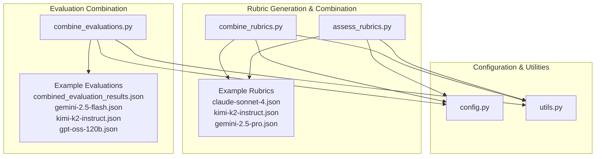
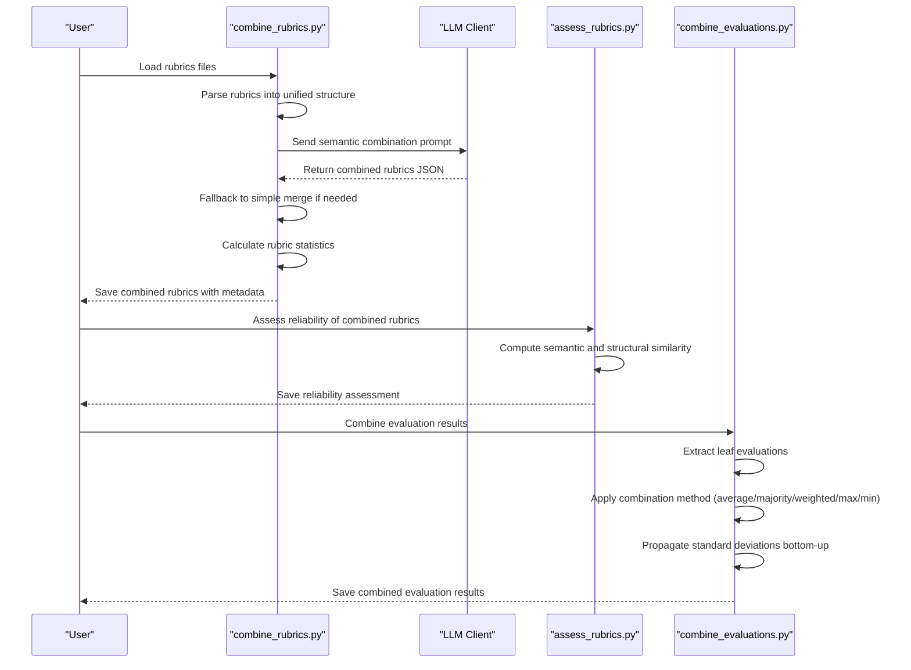
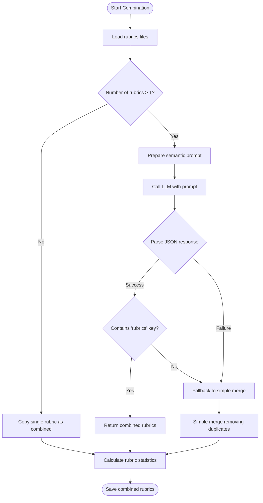
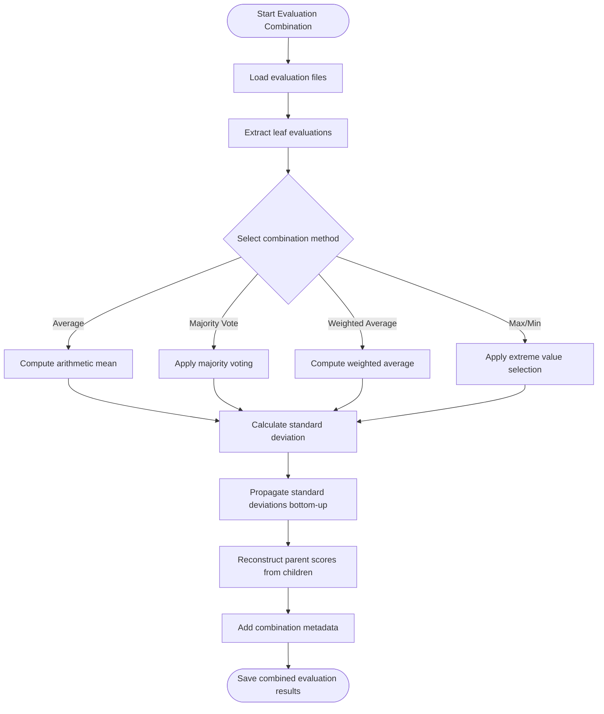
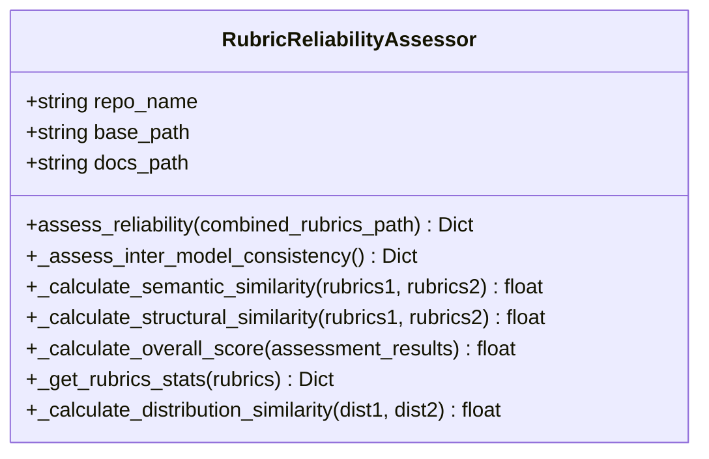
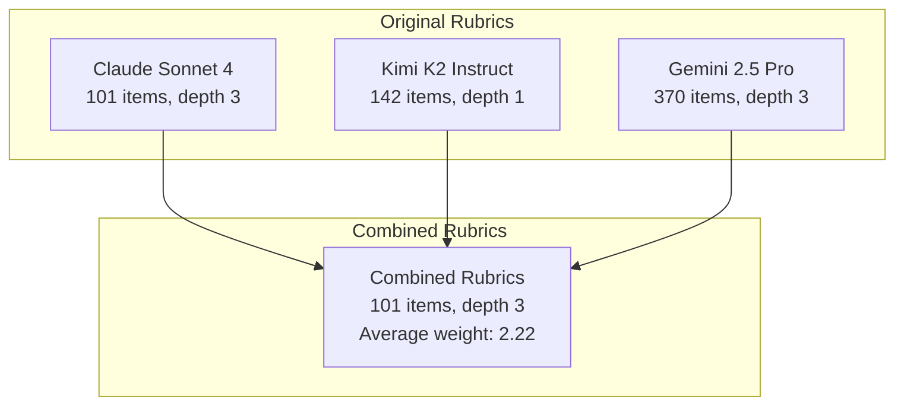
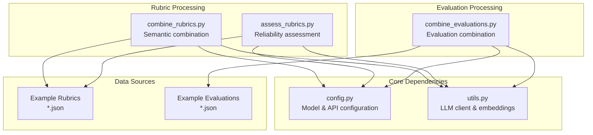

# Rubrics Combination Strategies

<cite>
**Referenced Files in This Document**
- [combine_rubrics.py](file://src/rubrics_generator/combine_rubrics.py)
- [combine_evaluations.py](file://src/judge/combine_evaluations.py)
- [assess_rubrics.py](file://src/rubrics_generator/assess_rubrics.py)
- [config.py](file://src/config.py)
- [utils.py](file://src/utils.py)
- [combined_rubrics.json](file://examples/OpenHands/rubrics/combined_rubrics.json)
- [claude-sonnet-4.json](file://examples/OpenHands/rubrics/claude-sonnet-4.json)
- [kimi-k2-instruct.json](file://examples/OpenHands/rubrics/kimi-k2-instruct.json)
- [gemini-2.5-pro.json](file://examples/OpenHands/rubrics/gemini-2.5-pro.json)
- [reliability_assessment.json](file://examples/OpenHands/rubrics/reliability_assessment.json)
- [combined_evaluation_results.json](file://examples/OpenHands/deepwiki/evaluation_results/combined_evaluation_results.json)
- [gemini-2.5-flash.json](file://examples/OpenHands/deepwiki/evaluation_results/gemini-2.5-flash.json)
- [kimi-k2-instruct.json](file://examples/OpenHands/deepwiki/evaluation_results/kimi-k2-instruct.json)
- [gpt-oss-120b.json](file://examples/OpenHands/deepwiki/evaluation_results/gpt-oss-120b.json)
</cite>

## Table of Contents
1. [Introduction](#introduction)
2. [Project Structure](#project-structure)
3. [Core Components](#core-components)
4. [Architecture Overview](#architecture-overview)
5. [Detailed Component Analysis](#detailed-component-analysis)
6. [Dependency Analysis](#dependency-analysis)
7. [Performance Considerations](#performance-considerations)
8. [Troubleshooting Guide](#troubleshooting-guide)
9. [Conclusion](#conclusion)

## Introduction
This document provides comprehensive guidance for developing rubrics combination strategies that merge multiple model-generated rubrics into unified assessment frameworks. It explains combination methodologies including weighted averaging, consensus building, and conflict resolution techniques. The document covers rubric alignment processes, hierarchical structure preservation, and score normalization approaches. Practical examples demonstrate combining Claude, Kimi, and Gemini rubrics, handling conflicting weights, and maintaining rubric integrity across different model outputs. Statistical analysis of rubric consistency and reliability assessment methods are included, along with quality metrics for combined rubrics.

## Project Structure
The repository organizes rubric generation, combination, evaluation, and reliability assessment into focused modules:

- Rubric generation and combination:
  - `src/rubrics_generator/combine_rubrics.py`: Semantic LLM-based rubric combination with fallback mechanisms
  - `src/rubrics_generator/assess_rubrics.py`: Reliability assessment for rubrics using semantic and structural similarity
  - Example rubrics: `examples/OpenHands/rubrics/*.json`

- Evaluation combination and scoring:
  - `src/judge/combine_evaluations.py`: Methods for combining evaluation results across multiple LLMs
  - Example evaluations: `examples/OpenHands/deepwiki/evaluation_results/*.json`

- Configuration and utilities:
  - `src/config.py`: Project configuration including model and embedding settings
  - `src/utils.py`: LLM client utilities and embedding generation

**Diagram sources**
- [combine_rubrics.py](file://src/rubrics_generator/combine_rubrics.py#L1-L306)
- [combine_evaluations.py](file://src/judge/combine_evaluations.py#L1-L375)
- [assess_rubrics.py](file://src/rubrics_generator/assess_rubrics.py#L1-L308)
- [config.py](file://src/config.py#L1-L32)
- [utils.py](file://src/utils.py#L1-L86)

**Section sources**
- [combine_rubrics.py](file://src/rubrics_generator/combine_rubrics.py#L1-L306)
- [combine_evaluations.py](file://src/judge/combine_evaluations.py#L1-L375)
- [assess_rubrics.py](file://src/rubrics_generator/assess_rubrics.py#L1-L308)
- [config.py](file://src/config.py#L1-L32)
- [utils.py](file://src/utils.py#L1-L86)

## Core Components
This section outlines the primary components responsible for rubric combination and evaluation aggregation.

- Semantic LLM-based rubric combination:
  - Uses an LLM to merge rubrics from multiple sources, eliminating redundancy while preserving distinctions and maintaining hierarchical structure
  - Implements fallback to simple merge when LLM calls fail
  - Calculates rubric statistics including total items, top-level items, maximum depth, weight distribution, and average weight

- Evaluation combination:
  - Supports multiple combination methods: average, majority vote, weighted average, max, min
  - Computes standard deviation propagation and bottom-up weighted scoring
  - Aggregates leaf evaluations and reconstructs parent scores based on child weights

- Reliability assessment:
  - Measures inter-model consistency using semantic and structural similarity
  - Computes reliability scores and standard deviations across models
  - Provides overall reliability metrics for rubric trustworthiness

**Section sources**
- [combine_rubrics.py](file://src/rubrics_generator/combine_rubrics.py#L22-L151)
- [combine_rubrics.py](file://src/rubrics_generator/combine_rubrics.py#L202-L230)
- [combine_evaluations.py](file://src/judge/combine_evaluations.py#L107-L176)
- [combine_evaluations.py](file://src/judge/combine_evaluations.py#L178-L214)
- [assess_rubrics.py](file://src/rubrics_generator/assess_rubrics.py#L22-L77)

## Architecture Overview
The rubric combination architecture integrates semantic analysis, evaluation aggregation, and reliability assessment:

**Diagram sources**
- [combine_rubrics.py](file://src/rubrics_generator/combine_rubrics.py#L22-L151)
- [combine_rubrics.py](file://src/rubrics_generator/combine_rubrics.py#L232-L303)
- [assess_rubrics.py](file://src/rubrics_generator/assess_rubrics.py#L22-L77)
- [combine_evaluations.py](file://src/judge/combine_evaluations.py#L107-L176)
- [combine_evaluations.py](file://src/judge/combine_evaluations.py#L178-L214)

## Detailed Component Analysis

### Semantic LLM-based Rubric Combination
This component merges rubrics from multiple LLMs using semantic analysis, with fallback mechanisms for robustness.

**Diagram sources**
- [combine_rubrics.py](file://src/rubrics_generator/combine_rubrics.py#L22-L151)
- [combine_rubrics.py](file://src/rubrics_generator/combine_rubrics.py#L153-L171)
- [combine_rubrics.py](file://src/rubrics_generator/combine_rubrics.py#L232-L303)

Key implementation characteristics:
- Semantic prompt construction with guidelines for redundancy elimination and hierarchical preservation
- Robust JSON parsing with extraction from wrapped or formatted responses
- Exponential backoff retry strategy for API failures
- Fallback simple merge using name-based deduplication
- Comprehensive rubric statistics computation including weight distribution and average weight

**Section sources**
- [combine_rubrics.py](file://src/rubrics_generator/combine_rubrics.py#L22-L151)
- [combine_rubrics.py](file://src/rubrics_generator/combine_rubrics.py#L153-L171)
- [combine_rubrics.py](file://src/rubrics_generator/combine_rubrics.py#L202-L230)

### Evaluation Combination and Bottom-Up Scoring
This component combines evaluation results from multiple LLMs using various aggregation methods and propagates uncertainty through the rubric hierarchy.

**Diagram sources**
- [combine_evaluations.py](file://src/judge/combine_evaluations.py#L107-L176)
- [combine_evaluations.py](file://src/judge/combine_evaluations.py#L178-L214)
- [combine_evaluations.py](file://src/judge/combine_evaluations.py#L284-L320)

Implementation highlights:
- Leaf evaluation extraction with path tracking for hierarchical reconstruction
- Multiple combination methods with method-specific logic and parameter handling
- Standard deviation propagation using weighted combination formula
- Bottom-up scoring computation respecting child weights and rubric hierarchy
- Comprehensive metadata including overall scores, standard deviations, and combination parameters

**Section sources**
- [combine_evaluations.py](file://src/judge/combine_evaluations.py#L107-L176)
- [combine_evaluations.py](file://src/judge/combine_evaluations.py#L178-L214)
- [combine_evaluations.py](file://src/judge/combine_evaluations.py#L284-L320)

### Reliability Assessment and Consistency Analysis
This component evaluates rubric consistency across multiple models using semantic and structural similarity metrics.

**Diagram sources**
- [assess_rubrics.py](file://src/rubrics_generator/assess_rubrics.py#L14-L36)
- [assess_rubrics.py](file://src/rubrics_generator/assess_rubrics.py#L38-L77)
- [assess_rubrics.py](file://src/rubrics_generator/assess_rubrics.py#L79-L119)
- [assess_rubrics.py](file://src/rubrics_generator/assess_rubrics.py#L121-L138)
- [assess_rubrics.py](file://src/rubrics_generator/assess_rubrics.py#L140-L160)

Reliability assessment methodology:
- Pairwise inter-model consistency computation across all rubric file combinations
- Semantic similarity using cosine similarity of requirement embeddings
- Structural similarity based on depth, weight distribution, and item count comparisons
- Weighted overall reliability score calculation with normalization
- Comprehensive rubric statistics extraction for structural analysis

**Section sources**
- [assess_rubrics.py](file://src/rubrics_generator/assess_rubrics.py#L14-L36)
- [assess_rubrics.py](file://src/rubrics_generator/assess_rubrics.py#L38-L77)
- [assess_rubrics.py](file://src/rubrics_generator/assess_rubrics.py#L178-L234)

### Practical Examples: Combining Claude, Kimi, and Gemini Rubrics
The repository provides concrete examples of rubric combination across three models:

- Claude Sonnet 4 rubrics: Comprehensive hierarchical structure with detailed requirements
- Kimi K2 Instruct rubrics: Concise but comprehensive coverage of core components
- Gemini 2.5 Pro rubrics: Structured approach focusing on essential components

**Diagram sources**
- [combined_rubrics.json](file://examples/OpenHands/rubrics/combined_rubrics.json#L1-L494)
- [claude-sonnet-4.json](file://examples/OpenHands/rubrics/claude-sonnet-4.json#L1-L440)
- [kimi-k2-instruct.json](file://examples/OpenHands/rubrics/kimi-k2-instruct.json#L1-L142)
- [gemini-2.5-pro.json](file://examples/OpenHands/rubrics/gemini-2.5-pro.json#L1-L370)

Example rubric characteristics:
- Claude: Most comprehensive with detailed hierarchical breakdown
- Kimi: Concise single-level structure focusing on core concepts
- Gemini: Balanced approach with moderate depth and breadth
- Combined: Preserved hierarchical structure with optimized granularity

**Section sources**
- [combined_rubrics.json](file://examples/OpenHands/rubrics/combined_rubrics.json#L1-L494)
- [claude-sonnet-4.json](file://examples/OpenHands/rubrics/claude-sonnet-4.json#L1-L440)
- [kimi-k2-instruct.json](file://examples/OpenHands/rubrics/kimi-k2-instruct.json#L1-L142)
- [gemini-2.5-pro.json](file://examples/OpenHands/rubrics/gemini-2.5-pro.json#L1-L370)

### Statistical Analysis and Quality Metrics
The system provides comprehensive statistical analysis for both rubrics and evaluation results:

- Rubric statistics:
  - Total items count and top-level items
  - Maximum depth measurement
  - Weight distribution analysis
  - Average weight calculation

- Reliability assessment:
  - Inter-model consistency scores (semantic and structural)
  - Average consistency and standard deviation
  - Overall reliability score computation

- Evaluation metrics:
  - Combined scores with standard deviations
  - Overall score range calculation
  - Method-specific quality indicators

**Section sources**
- [combine_rubrics.py](file://src/rubrics_generator/combine_rubrics.py#L202-L230)
- [reliability_assessment.json](file://examples/OpenHands/rubrics/reliability_assessment.json#L1-L19)
- [combine_evaluations.py](file://src/judge/combine_evaluations.py#L362-L372)

## Dependency Analysis
The rubric combination system exhibits clear module separation with well-defined dependencies:

**Diagram sources**
- [config.py](file://src/config.py#L1-L32)
- [utils.py](file://src/utils.py#L1-L86)
- [combine_rubrics.py](file://src/rubrics_generator/combine_rubrics.py#L1-L12)
- [assess_rubrics.py](file://src/rubrics_generator/assess_rubrics.py#L1-L12)
- [combine_evaluations.py](file://src/judge/combine_evaluations.py#L1-L12)

Dependency characteristics:
- Configuration module provides centralized model and API settings
- Utility module abstracts LLM client interactions and embedding generation
- All processing modules depend on configuration for model selection and API parameters
- Data modules (rubrics and evaluations) are independent and self-contained

**Section sources**
- [config.py](file://src/config.py#L1-L32)
- [utils.py](file://src/utils.py#L1-L86)
- [combine_rubrics.py](file://src/rubrics_generator/combine_rubrics.py#L1-L12)
- [assess_rubrics.py](file://src/rubrics_generator/assess_rubrics.py#L1-L12)
- [combine_evaluations.py](file://src/judge/combine_evaluations.py#L1-L12)

## Performance Considerations
Several factors impact the performance and reliability of rubric combination:

- LLM API latency and rate limiting:
  - Implement exponential backoff retry strategies
  - Monitor API quotas and implement circuit breaker patterns
  - Cache embeddings and intermediate results where possible

- Computational complexity:
  - Semantic similarity calculations scale with number of requirements
  - Embedding generation is the most computationally intensive operation
  - Consider batching embedding requests and using efficient similarity algorithms

- Memory usage:
  - Large rubrics can consume significant memory during processing
  - Implement streaming or chunked processing for very large datasets
  - Optimize data structures to minimize memory overhead

- Reliability trade-offs:
  - Higher temperatures improve creativity but reduce consistency
  - More aggressive retry strategies improve reliability but increase latency
  - Complex prompts may fail more frequently requiring fallback mechanisms

## Troubleshooting Guide
Common issues and solutions for rubric combination:

- LLM API failures:
  - Implement retry with exponential backoff
  - Monitor error rates and adjust retry parameters
  - Use fallback simple merge when semantic combination fails

- JSON parsing errors:
  - Extract JSON from wrapped or formatted responses
  - Validate response structure before parsing
  - Log raw responses for debugging

- Inconsistent rubric structures:
  - Normalize rubric formats before combination
  - Handle missing fields gracefully
  - Validate weight ranges and hierarchical consistency

- Embedding generation failures:
  - Verify embedding model availability
  - Check API credentials and quotas
  - Implement fallback to simpler similarity measures

**Section sources**
- [combine_rubrics.py](file://src/rubrics_generator/combine_rubrics.py#L97-L151)
- [combine_rubrics.py](file://src/rubrics_generator/combine_rubrics.py#L121-L148)
- [assess_rubrics.py](file://src/rubrics_generator/assess_rubrics.py#L79-L119)

## Conclusion
The rubric combination system provides a robust framework for merging multiple model-generated rubrics into unified assessment frameworks. Through semantic LLM-based combination, comprehensive reliability assessment, and flexible evaluation aggregation methods, the system ensures consistency, transparency, and quality across diverse model outputs. The practical examples demonstrate successful integration of Claude, Kimi, and Gemini rubrics while maintaining hierarchical structure and rubric integrity. Statistical analysis and quality metrics enable informed decision-making about rubric trustworthiness and combination effectiveness.