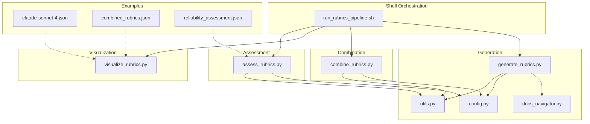
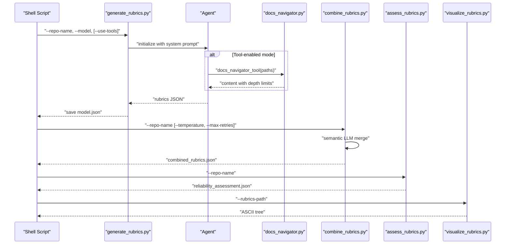
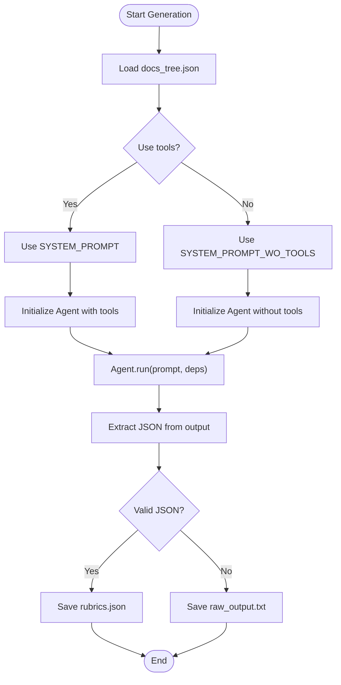
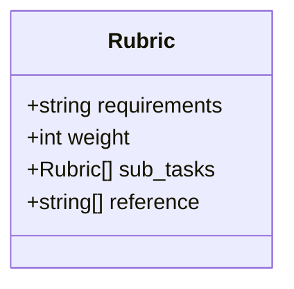
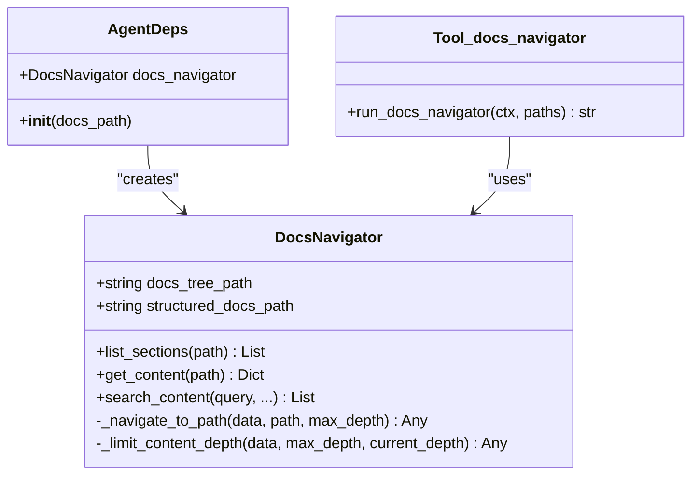
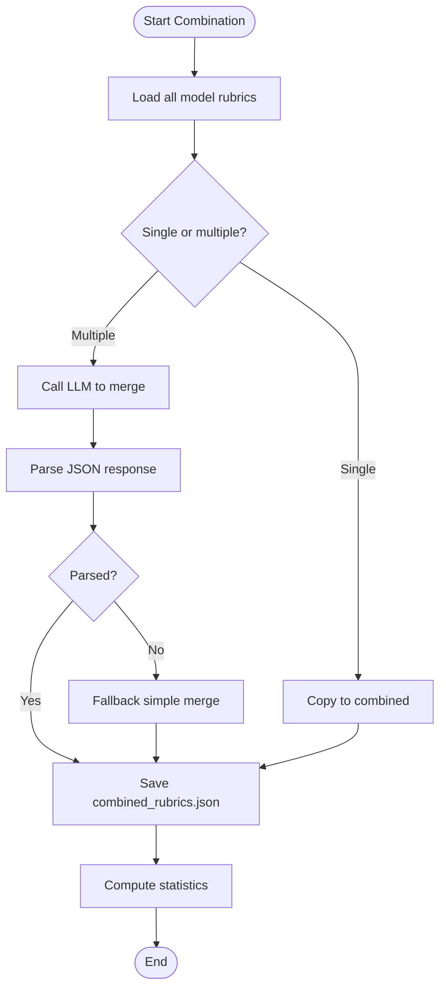
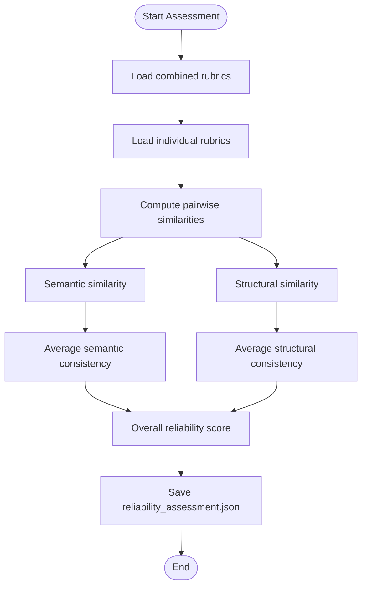
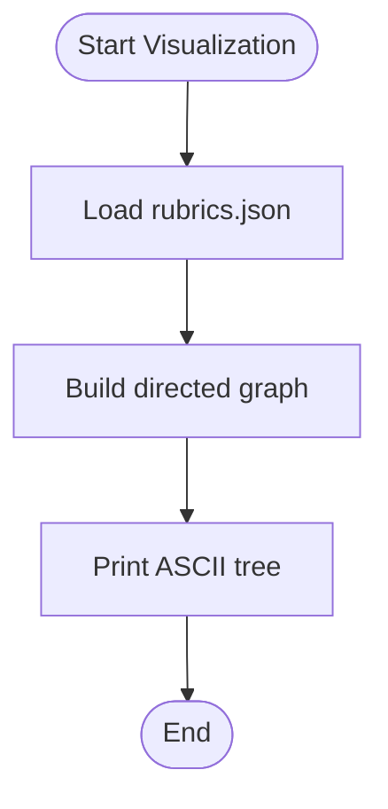
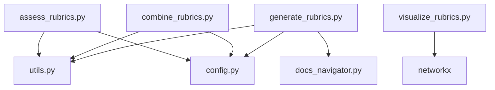

# Rubrics Generation Pipeline

<cite>
**Referenced Files in This Document**
- [README.md](file://README.md)
- [run_rubrics_pipeline.sh](file://src/run_rubrics_pipeline.sh)
- [generate_rubrics.py](file://src/rubrics_generator/generate_rubrics.py)
- [combine_rubrics.py](file://src/rubrics_generator/combine_rubrics.py)
- [assess_rubrics.py](file://src/rubrics_generator/assess_rubrics.py)
- [visualize_rubrics.py](file://src/rubrics_generator/visualize_rubrics.py)
- [docs_navigator.py](file://src/tools/docs_navigator.py)
- [utils.py](file://src/utils.py)
- [config.py](file://src/config.py)
- [claude-sonnet-4.json](file://examples/OpenHands/rubrics/claude-sonnet-4.json)
- [combined_rubrics.json](file://examples/OpenHands/rubrics/combined_rubrics.json)
- [reliability_assessment.json](file://examples/OpenHands/rubrics/reliability_assessment.json)
- [requirements.txt](file://requirements.txt)
</cite>

## Table of Contents
1. [Introduction](#introduction)
2. [Project Structure](#project-structure)
3. [Core Components](#core-components)
4. [Architecture Overview](#architecture-overview)
5. [Detailed Component Analysis](#detailed-component-analysis)
6. [Dependency Analysis](#dependency-analysis)
7. [Performance Considerations](#performance-considerations)
8. [Troubleshooting Guide](#troubleshooting-guide)
9. [Conclusion](#conclusion)
10. [Appendices](#appendices)

## Introduction
This document explains the AI-powered hierarchical rubric generation pipeline that transforms parsed documentation into structured evaluation rubrics. The system supports multiple LLM providers (Claude, Kimi, Gemini) and uses an agent-based architecture with optional tool-enabled navigation to iteratively refine rubrics. It documents the workflow from ingestion to final combined rubrics, including hierarchical structure semantics, weight assignments, reference path collection, leaf rubric requirements, and output formats. Practical examples, model selection criteria, and debugging strategies are included.

## Project Structure
The rubrics pipeline is organized around a shell orchestration script and Python modules that implement generation, combination, visualization, and reliability assessment. The repository also includes example outputs demonstrating rubric formats and evaluation results.

**Diagram sources**
- [run_rubrics_pipeline.sh](file://src/run_rubrics_pipeline.sh#L1-L320)
- [generate_rubrics.py](file://src/rubrics_generator/generate_rubrics.py#L1-L257)
- [combine_rubrics.py](file://src/rubrics_generator/combine_rubrics.py#L1-L306)
- [assess_rubrics.py](file://src/rubrics_generator/assess_rubrics.py#L1-L308)
- [visualize_rubrics.py](file://src/rubrics_generator/visualize_rubrics.py#L1-L168)
- [docs_navigator.py](file://src/tools/docs_navigator.py#L1-L345)
- [config.py](file://src/config.py#L1-L32)
- [utils.py](file://src/utils.py#L1-L86)
- [claude-sonnet-4.json](file://examples/OpenHands/rubrics/claude-sonnet-4.json#L1-L440)
- [combined_rubrics.json](file://examples/OpenHands/rubrics/combined_rubrics.json#L1-L494)
- [reliability_assessment.json](file://examples/OpenHands/rubrics/reliability_assessment.json#L1-L19)

**Section sources**
- [README.md](file://README.md#L73-L77)
- [run_rubrics_pipeline.sh](file://src/run_rubrics_pipeline.sh#L1-L320)

## Core Components
- Shell orchestration script: Orchestrates generation, combination, and optional visualization for multiple models, with flags for tool usage, temperature, and retries.
- Generation module: Builds an agent with system prompts, optionally enables a documentation navigator tool, and extracts rubrics from LLM outputs.
- Combination module: Uses an LLM to semantically merge rubrics from multiple models, with fallback merging and robust JSON parsing.
- Assessment module: Computes inter-model consistency and an overall reliability score using semantic and structural similarity.
- Visualization module: Converts rubrics to a graph and prints an ASCII tree for quick inspection.
- Tools: A documentation navigator tool that safely retrieves content from structured docs and limits depth to manage token limits.
- Utilities and configuration: LLM initialization, native LLM calls, token truncation, and environment-based configuration.

**Section sources**
- [run_rubrics_pipeline.sh](file://src/run_rubrics_pipeline.sh#L167-L265)
- [generate_rubrics.py](file://src/rubrics_generator/generate_rubrics.py#L14-L257)
- [combine_rubrics.py](file://src/rubrics_generator/combine_rubrics.py#L22-L306)
- [assess_rubrics.py](file://src/rubrics_generator/assess_rubrics.py#L14-L308)
- [visualize_rubrics.py](file://src/rubrics_generator/visualize_rubrics.py#L1-L168)
- [docs_navigator.py](file://src/tools/docs_navigator.py#L11-L345)
- [utils.py](file://src/utils.py#L12-L86)
- [config.py](file://src/config.py#L14-L32)

## Architecture Overview
The pipeline follows a multi-stage workflow:
1. Documentation ingestion: Parsed docs and docs tree are prepared in the data directory.
2. Rubric generation: For each model, an agent constructs hierarchical rubrics either with or without tool-enabled navigation.
3. Rubric combination: A semantic LLM merges rubrics from multiple models into a consolidated set.
4. Reliability assessment: Consistency metrics and an overall score quantify rubric trustworthiness.
5. Visualization: Optional ASCII tree rendering for quick inspection.

**Diagram sources**
- [run_rubrics_pipeline.sh](file://src/run_rubrics_pipeline.sh#L167-L265)
- [generate_rubrics.py](file://src/rubrics_generator/generate_rubrics.py#L170-L257)
- [docs_navigator.py](file://src/tools/docs_navigator.py#L261-L285)
- [combine_rubrics.py](file://src/rubrics_generator/combine_rubrics.py#L22-L306)
- [assess_rubrics.py](file://src/rubrics_generator/assess_rubrics.py#L22-L308)
- [visualize_rubrics.py](file://src/rubrics_generator/visualize_rubrics.py#L129-L168)

## Detailed Component Analysis

### Agent-Based Rubric Generation
The generation module defines two system prompts:
- Tool-enabled mode: Guides constructing hierarchical rubrics with explicit weights and reference paths for leaf rubrics.
- Tool-disabled mode: Focuses on reverse-engineering internal architecture from usage-oriented documentation.

Key behaviors:
- Iterative refinement: The agent updates rubrics progressively as it accesses documentation.
- Output extraction: Parses JSON from LLM output, saving raw output if JSON parsing fails.
- Visualization: Automatically renders rubrics after generation.

**Diagram sources**
- [generate_rubrics.py](file://src/rubrics_generator/generate_rubrics.py#L25-L167)
- [generate_rubrics.py](file://src/rubrics_generator/generate_rubrics.py#L170-L257)

**Section sources**
- [generate_rubrics.py](file://src/rubrics_generator/generate_rubrics.py#L25-L167)
- [generate_rubrics.py](file://src/rubrics_generator/generate_rubrics.py#L170-L257)

### Tool-Enabled vs Tool-Disabled Modes
- Tool-enabled mode: Uses the documentation navigator to retrieve specific content nodes, enabling precise, iterative refinement guided by the docs tree.
- Tool-disabled mode: Requires the LLM to synthesize rubrics from the docs tree alone, focusing on inferring internal structure from usage-oriented content.

Mode differences:
- Tool-enabled: Prompts emphasize hierarchical construction with weights and leaf rubric reference paths.
- Tool-disabled: Prompts emphasize transforming usage instructions into architectural insights.

**Section sources**
- [generate_rubrics.py](file://src/rubrics_generator/generate_rubrics.py#L25-L98)
- [generate_rubrics.py](file://src/rubrics_generator/generate_rubrics.py#L100-L167)

### Hierarchical Rubric Structure and Weights
The rubric format uses a nested structure with weights:
- Essential: 3
- Important: 2
- Supportive: 1

Leaf rubrics include reference paths pointing to documentation sources. The structure supports recursive sub_tasks to arbitrary depth.

**Diagram sources**
- [visualize_rubrics.py](file://src/rubrics_generator/visualize_rubrics.py#L7-L12)
- [claude-sonnet-4.json](file://examples/OpenHands/rubrics/claude-sonnet-4.json#L1-L440)
- [combined_rubrics.json](file://examples/OpenHands/rubrics/combined_rubrics.json#L1-L494)

**Section sources**
- [visualize_rubrics.py](file://src/rubrics_generator/visualize_rubrics.py#L7-L12)
- [claude-sonnet-4.json](file://examples/OpenHands/rubrics/claude-sonnet-4.json#L1-L440)
- [combined_rubrics.json](file://examples/OpenHands/rubrics/combined_rubrics.json#L1-L494)

### Documentation Navigator Tool
The tool safely navigates the docs tree and structured docs, retrieving content with depth-limited truncation to respect token limits. It supports:
- Listing sections at a given path
- Retrieving content for specific paths
- Searching content across the docs structure

**Diagram sources**
- [docs_navigator.py](file://src/tools/docs_navigator.py#L11-L345)

**Section sources**
- [docs_navigator.py](file://src/tools/docs_navigator.py#L11-L345)
- [utils.py](file://src/utils.py#L12-L27)

### Semantic Combination of Rubrics
The combination module:
- Loads rubrics from multiple models
- Calls an LLM to merge rubrics into a single, coherent structure
- Implements robust JSON extraction with multiple fallbacks
- Calculates statistics and metadata for the combined rubrics

**Diagram sources**
- [combine_rubrics.py](file://src/rubrics_generator/combine_rubrics.py#L22-L306)

**Section sources**
- [combine_rubrics.py](file://src/rubrics_generator/combine_rubrics.py#L22-L306)

### Reliability Assessment
The assessment module computes:
- Inter-model consistency using semantic similarity and structural similarity
- An overall reliability score as a weighted average
- Detailed metrics including average semantic consistency, structural consistency, and standard deviation

**Diagram sources**
- [assess_rubrics.py](file://src/rubrics_generator/assess_rubrics.py#L22-L308)

**Section sources**
- [assess_rubrics.py](file://src/rubrics_generator/assess_rubrics.py#L22-L308)
- [reliability_assessment.json](file://examples/OpenHands/rubrics/reliability_assessment.json#L1-L19)

### Visualization
The visualization module converts rubrics into a directed graph and prints an ASCII tree representation, highlighting weights and leaf nodes.

**Diagram sources**
- [visualize_rubrics.py](file://src/rubrics_generator/visualize_rubrics.py#L129-L168)

**Section sources**
- [visualize_rubrics.py](file://src/rubrics_generator/visualize_rubrics.py#L129-L168)

## Dependency Analysis
The pipeline relies on:
- LLM providers (Anthropic, OpenAI-compatible endpoints) configured via environment variables
- Tokenization utilities for safe tool responses
- NetworkX for graph visualization
- Scikit-learn and NumPy for similarity computations

**Diagram sources**
- [generate_rubrics.py](file://src/rubrics_generator/generate_rubrics.py#L1-L20)
- [combine_rubrics.py](file://src/rubrics_generator/combine_rubrics.py#L1-L12)
- [assess_rubrics.py](file://src/rubrics_generator/assess_rubrics.py#L1-L12)
- [visualize_rubrics.py](file://src/rubrics_generator/visualize_rubrics.py#L1-L6)
- [utils.py](file://src/utils.py#L1-L11)
- [config.py](file://src/config.py#L1-L32)

**Section sources**
- [requirements.txt](file://requirements.txt#L1-L107)
- [config.py](file://src/config.py#L14-L32)
- [utils.py](file://src/utils.py#L12-L86)

## Performance Considerations
- Token limits: The documentation navigator truncates content to respect maximum tokens per tool response, preventing oversized tool outputs.
- Retry strategy: The combination module retries LLM calls with exponential backoff and falls back to simple merging when API calls fail.
- Depth control: Content depth is limited during navigation to reduce token consumption and improve response speed.
- Parallel model execution: The shell script processes models sequentially; parallelization could be introduced at the cost of increased resource usage.

[No sources needed since this section provides general guidance]

## Troubleshooting Guide
Common issues and resolutions:
- Missing data directory: Ensure the repository name corresponds to a data directory with docs_tree.json and structured_docs.json.
- LLM API failures: Increase max retries or adjust temperature; verify BASE_URL and API_KEY in environment variables.
- JSON parsing errors: The generator saves raw output for debugging; inspect the raw output file to identify formatting issues.
- Tool navigation errors: Verify paths in the docs tree; the navigator raises descriptive errors for invalid indices or missing content.
- Reliability assessment failures: Ensure multiple rubrics are present for comparison; otherwise, the assessment returns an error indicating insufficient rubrics.

**Section sources**
- [run_rubrics_pipeline.sh](file://src/run_rubrics_pipeline.sh#L142-L158)
- [generate_rubrics.py](file://src/rubrics_generator/generate_rubrics.py#L244-L251)
- [docs_navigator.py](file://src/tools/docs_navigator.py#L39-L43)
- [combine_rubrics.py](file://src/rubrics_generator/combine_rubrics.py#L141-L151)
- [assess_rubrics.py](file://src/rubrics_generator/assess_rubrics.py#L51-L52)

## Conclusion
The rubrics generation pipeline provides a robust, agent-based approach to constructing hierarchical rubrics from documentation. By supporting multiple LLMs, optional tool-enabled navigation, semantic combination, and reliability assessment, it delivers trustworthy, interpretable rubrics suitable for evaluating documentation quality. The modular design allows easy extension and debugging, while the visualization and assessment tools facilitate quick inspection and validation.

[No sources needed since this section summarizes without analyzing specific files]

## Appendices

### Practical Examples
- Generate rubrics with multiple models:
  - bash ./run_rubrics_pipeline.sh --repo-name OpenHands --models claude-sonnet-4,kimi-k2-instruct --visualize
- Generate rubrics with tools disabled:
  - bash ./run_rubrics_pipeline.sh --repo-name OpenHands --no-tools
- Combine rubrics with custom temperature and retries:
  - python rubrics_generator/combine_rubrics.py --repo-name OpenHands --temperature 0.1 --max-retries 3

**Section sources**
- [README.md](file://README.md#L73-L77)
- [run_rubrics_pipeline.sh](file://src/run_rubrics_pipeline.sh#L61-L74)

### Output File Formats
- Individual model rubrics: {model}.json (e.g., claude-sonnet-4.json)
- Combined rubrics: combined_rubrics.json (includes rubrics and combination_metadata)
- Reliability assessment: reliability_assessment.json (inter-model consistency and overall score)
- Visualization: ASCII tree printed to console

**Section sources**
- [claude-sonnet-4.json](file://examples/OpenHands/rubrics/claude-sonnet-4.json#L1-L440)
- [combined_rubrics.json](file://examples/OpenHands/rubrics/combined_rubrics.json#L1-L494)
- [reliability_assessment.json](file://examples/OpenHands/rubrics/reliability_assessment.json#L1-L19)
- [visualize_rubrics.py](file://src/rubrics_generator/visualize_rubrics.py#L129-L168)

### Model Selection Criteria
- Claude models: Strong performance on structured reasoning and hierarchical tasks.
- Kimi models: Good balance of reasoning and code understanding.
- Gemini models: Effective for multimodal and structured outputs.
- Selection depends on availability, cost, latency, and quality trade-offs.

[No sources needed since this section provides general guidance]