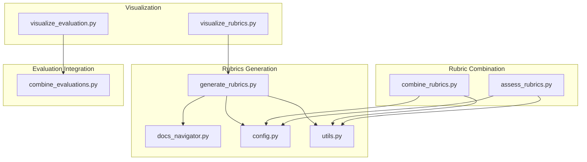
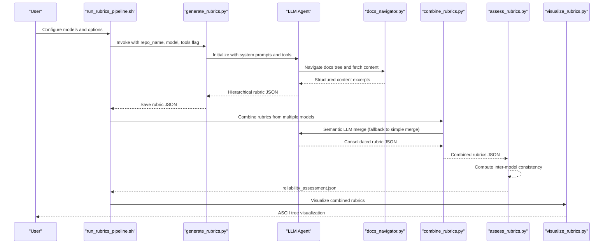
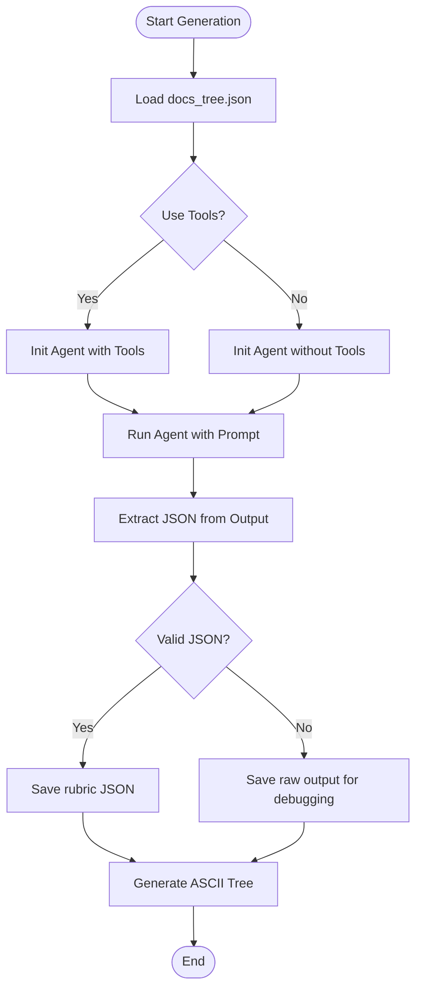
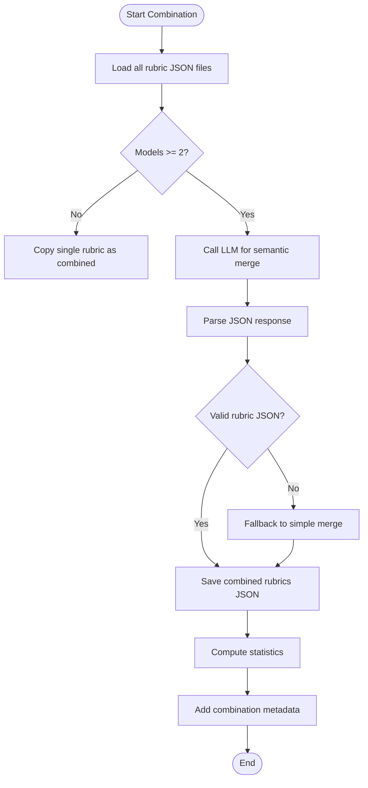
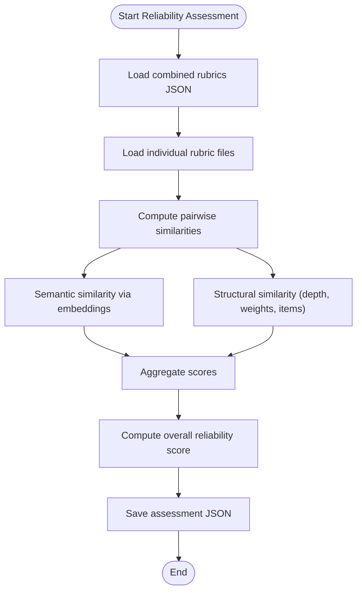
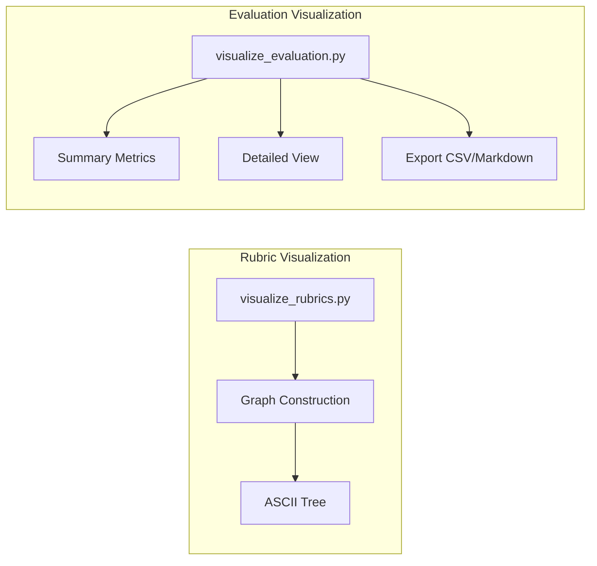
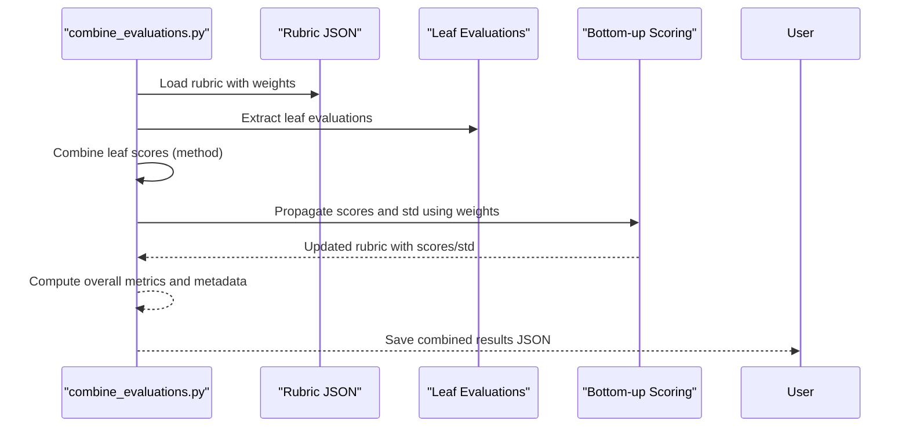
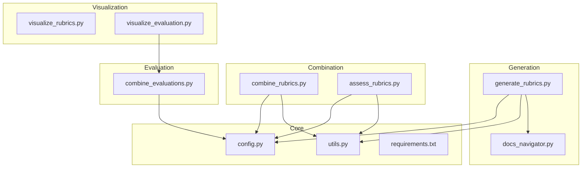

# Rubrics Generation System

<cite>
**Referenced Files in This Document**
- [generate_rubrics.py](file://src/rubrics_generator/generate_rubrics.py)
- [combine_rubrics.py](file://src/rubrics_generator/combine_rubrics.py)
- [assess_rubrics.py](file://src/rubrics_generator/assess_rubrics.py)
- [visualize_rubrics.py](file://src/rubrics_generator/visualize_rubrics.py)
- [combine_evaluations.py](file://src/judge/combine_evaluations.py)
- [visualize_evaluation.py](file://src/judge/visualize_evaluation.py)
- [config.py](file://src/config.py)
- [utils.py](file://src/utils.py)
- [docs_navigator.py](file://src/tools/docs_navigator.py)
- [run_rubrics_pipeline.sh](file://src/run_rubrics_pipeline.sh)
- [README.md](file://README.md)
- [requirements.txt](file://requirements.txt)
- [combined_rubrics.json](file://examples/OpenHands/rubrics/combined_rubrics.json)
</cite>

## Table of Contents
1. [Introduction](#introduction)
2. [Project Structure](#project-structure)
3. [Core Components](#core-components)
4. [Architecture Overview](#architecture-overview)
5. [Detailed Component Analysis](#detailed-component-analysis)
6. [Dependency Analysis](#dependency-analysis)
7. [Performance Considerations](#performance-considerations)
8. [Troubleshooting Guide](#troubleshooting-guide)
9. [Conclusion](#conclusion)

## Introduction
This document describes the CodeWikiBench rubrics generation system, focusing on AI-powered rubric creation and evaluation. The system generates hierarchical rubrics from repository documentation using multiple LLM models, combines results for improved reliability, and provides robust assessment and visualization capabilities. It supports both tool-assisted and tool-free generation modes, integrates with evaluation pipelines, and offers customizable weight assignment and combination strategies.

## Project Structure
The rubrics generation system is organized around three main stages:
- Rubric generation: Creates hierarchical rubrics using one or more LLMs
- Rubric combination: Merges rubrics from multiple models into a consolidated set
- Reliability assessment: Evaluates consistency and trustworthiness across models
- Visualization: Provides tree and evaluation result visualizations
- Integration: Connects rubrics to evaluation pipelines for scoring and reporting

**Diagram sources**
- [generate_rubrics.py](file://src/rubrics_generator/generate_rubrics.py#L1-L257)
- [combine_rubrics.py](file://src/rubrics_generator/combine_rubrics.py#L1-L306)
- [assess_rubrics.py](file://src/rubrics_generator/assess_rubrics.py#L1-L308)
- [visualize_rubrics.py](file://src/rubrics_generator/visualize_rubrics.py#L1-L168)
- [combine_evaluations.py](file://src/judge/combine_evaluations.py#L1-L375)
- [visualize_evaluation.py](file://src/judge/visualize_evaluation.py#L1-L250)
- [config.py](file://src/config.py#L1-L32)
- [utils.py](file://src/utils.py#L1-L86)
- [docs_navigator.py](file://src/tools/docs_navigator.py#L1-L345)

**Section sources**
- [README.md](file://README.md#L73-L108)
- [run_rubrics_pipeline.sh](file://src/run_rubrics_pipeline.sh#L1-L320)

## Core Components
- Hierarchical rubric generation with LLM agents
- Semantic combination of rubrics from multiple models
- Reliability assessment using semantic and structural similarity
- Visualization of rubric trees and evaluation results
- Integration with evaluation pipelines for weighted scoring

**Section sources**
- [generate_rubrics.py](file://src/rubrics_generator/generate_rubrics.py#L14-L257)
- [combine_rubrics.py](file://src/rubrics_generator/combine_rubrics.py#L22-L306)
- [assess_rubrics.py](file://src/rubrics_generator/assess_rubrics.py#L14-L308)
- [visualize_rubrics.py](file://src/rubrics_generator/visualize_rubrics.py#L1-L168)
- [combine_evaluations.py](file://src/judge/combine_evaluations.py#L1-L375)

## Architecture Overview
The system orchestrates rubric generation across multiple LLMs, merges results using semantic analysis, and evaluates reliability. It supports tool-assisted navigation for richer context extraction and provides visualization and export capabilities.

**Diagram sources**
- [run_rubrics_pipeline.sh](file://src/run_rubrics_pipeline.sh#L167-L265)
- [generate_rubrics.py](file://src/rubrics_generator/generate_rubrics.py#L170-L257)
- [combine_rubrics.py](file://src/rubrics_generator/combine_rubrics.py#L22-L306)
- [assess_rubrics.py](file://src/rubrics_generator/assess_rubrics.py#L22-L308)
- [visualize_rubrics.py](file://src/rubrics_generator/visualize_rubrics.py#L129-L168)
- [docs_navigator.py](file://src/tools/docs_navigator.py#L261-L285)

## Detailed Component Analysis

### Hierarchical Rubric Generation
The generation component builds a hierarchical rubric from documentation trees using LLM agents. It supports:
- Tool-assisted mode: Uses a documentation navigator tool to fetch structured content excerpts
- Tool-free mode: Infers architecture from HOW-TO-USE documentation
- Weight assignment: Assigns weights (3=Essential, 2=Important, 1=Supportive)
- Output: Saves rubric JSON and generates an ASCII tree visualization

**Diagram sources**
- [generate_rubrics.py](file://src/rubrics_generator/generate_rubrics.py#L170-L257)
- [docs_navigator.py](file://src/tools/docs_navigator.py#L261-L285)

**Section sources**
- [generate_rubrics.py](file://src/rubrics_generator/generate_rubrics.py#L14-L257)
- [docs_navigator.py](file://src/tools/docs_navigator.py#L11-L345)
- [visualize_rubrics.py](file://src/rubrics_generator/visualize_rubrics.py#L129-L168)

### Rubric Combination Strategies
The combination component merges rubrics from multiple models using:
- Semantic LLM analysis: Uses an LLM to intelligently merge rubrics, eliminate redundancy, and preserve structure
- Fallback simple merge: When LLM calls fail, merges rubrics by deduplicating based on names
- Statistics calculation: Computes total items, top-level items, maximum depth, weight distribution, and average weight

**Diagram sources**
- [combine_rubrics.py](file://src/rubrics_generator/combine_rubrics.py#L22-L306)

**Section sources**
- [combine_rubrics.py](file://src/rubrics_generator/combine_rubrics.py#L13-L306)

### Reliability Assessment Methods
The reliability component evaluates rubric consistency across models:
- Inter-model consistency: Computes semantic and structural similarity between rubrics
- Semantic similarity: Uses embeddings to compare requirement texts and finds best matches
- Structural similarity: Compares depth, weight distributions, and item counts
- Overall reliability score: Weighted aggregation of consistency metrics

**Diagram sources**
- [assess_rubrics.py](file://src/rubrics_generator/assess_rubrics.py#L22-L308)

**Section sources**
- [assess_rubrics.py](file://src/rubrics_generator/assess_rubrics.py#L14-L308)

### Visualization Options
Two visualization pathways are provided:
- Rubric tree visualization: Converts rubric JSON to a NetworkX graph and prints an ASCII tree
- Evaluation result visualization: Summarizes, filters, and exports evaluation results to CSV or Markdown

**Diagram sources**
- [visualize_rubrics.py](file://src/rubrics_generator/visualize_rubrics.py#L53-L168)
- [visualize_evaluation.py](file://src/judge/visualize_evaluation.py#L32-L250)

**Section sources**
- [visualize_rubrics.py](file://src/rubrics_generator/visualize_rubrics.py#L1-L168)
- [visualize_evaluation.py](file://src/judge/visualize_evaluation.py#L1-L250)

### Integration with Evaluation Pipelines
The rubrics integrate with evaluation pipelines for scoring:
- Bottom-up weighted scoring: Leaf scores propagate upward using child weights
- Standard deviation propagation: Combines child standard deviations using weighted formulas
- Combination methods: Average, majority vote, weighted average, max, min
- Export formats: CSV and Markdown reports with reasoning and evidence

**Diagram sources**
- [combine_evaluations.py](file://src/judge/combine_evaluations.py#L107-L214)

**Section sources**
- [combine_evaluations.py](file://src/judge/combine_evaluations.py#L1-L375)

## Dependency Analysis
The system relies on configuration, utilities, and external libraries for LLM and embedding access.

**Diagram sources**
- [config.py](file://src/config.py#L1-L32)
- [utils.py](file://src/utils.py#L1-L86)
- [generate_rubrics.py](file://src/rubrics_generator/generate_rubrics.py#L1-L12)
- [combine_rubrics.py](file://src/rubrics_generator/combine_rubrics.py#L1-L11)
- [assess_rubrics.py](file://src/rubrics_generator/assess_rubrics.py#L1-L12)
- [visualize_rubrics.py](file://src/rubrics_generator/visualize_rubrics.py#L1-L6)
- [combine_evaluations.py](file://src/judge/combine_evaluations.py#L1-L11)
- [visualize_evaluation.py](file://src/judge/visualize_evaluation.py#L1-L17)

**Section sources**
- [requirements.txt](file://requirements.txt#L1-L107)
- [config.py](file://src/config.py#L1-L32)

## Performance Considerations
- Token limits: Content is truncated to prevent excessive token usage during tool responses
- Retry and timeout settings: LLM calls include retry logic and timeouts for resilience
- Embedding computation: Semantic similarity uses efficient vector operations and cosine similarity
- Parallel execution: The pipeline script iterates through models sequentially; concurrent execution could improve throughput

[No sources needed since this section provides general guidance]

## Troubleshooting Guide
Common issues and resolutions:
- Missing documentation tree: Ensure docs_tree.json exists in the data directory before generation
- API failures during combination: The system falls back to simple merge when LLM calls fail
- JSON parsing errors: Raw outputs are saved for debugging when rubric JSON cannot be extracted
- No rubrics files found: Verify that rubric generation was completed and files exist in the rubrics directory

**Section sources**
- [run_rubrics_pipeline.sh](file://src/run_rubrics_pipeline.sh#L142-L158)
- [combine_rubrics.py](file://src/rubrics_generator/combine_rubrics.py#L141-L151)
- [generate_rubrics.py](file://src/rubrics_generator/generate_rubrics.py#L244-L250)

## Conclusion
The CodeWikiBench rubrics generation system provides a robust, multi-model approach to creating hierarchical rubrics from repository documentation. It combines semantic analysis, reliability assessment, and visualization to produce trustworthy evaluation frameworks. The modular design enables customization of models, combination strategies, and export formats, integrating seamlessly with evaluation pipelines for comprehensive documentation quality assessment.