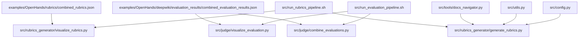
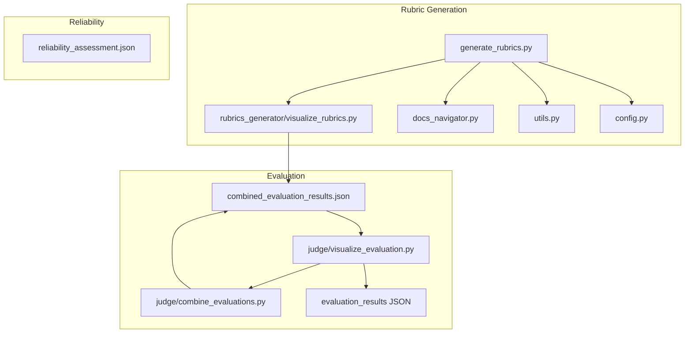
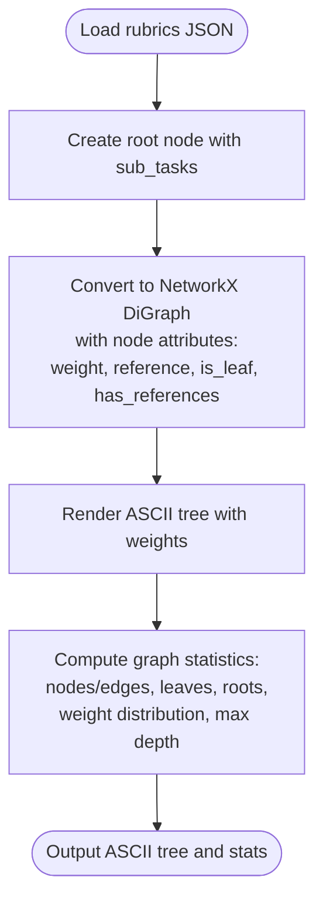
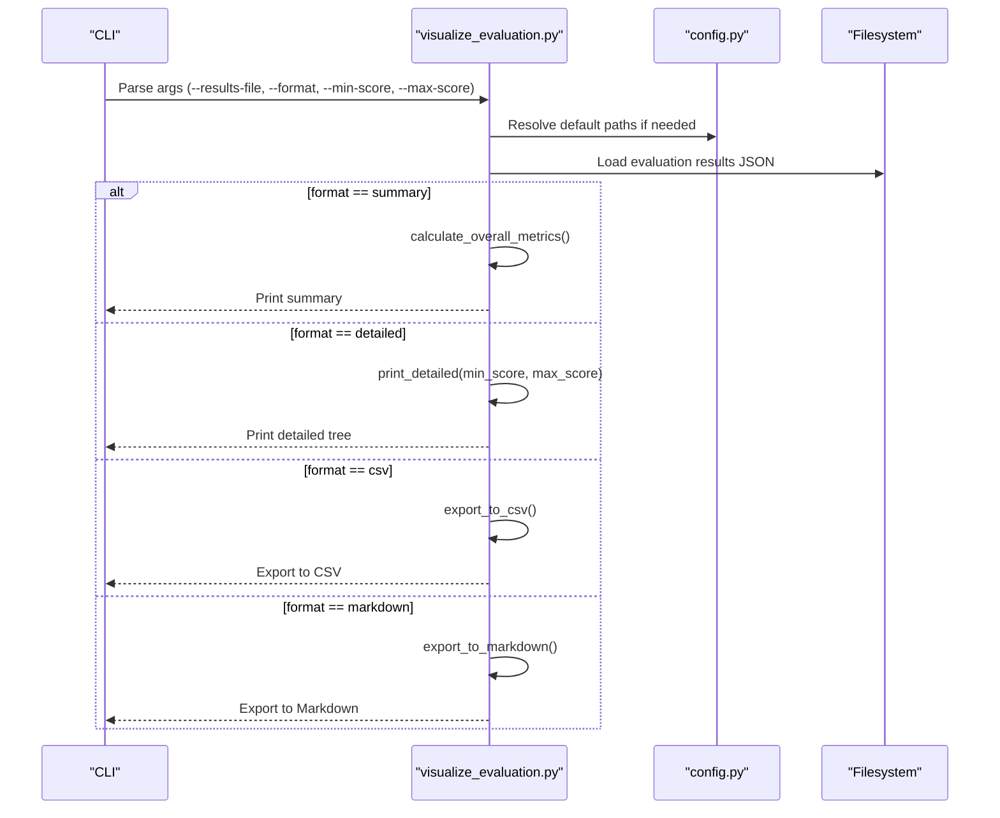
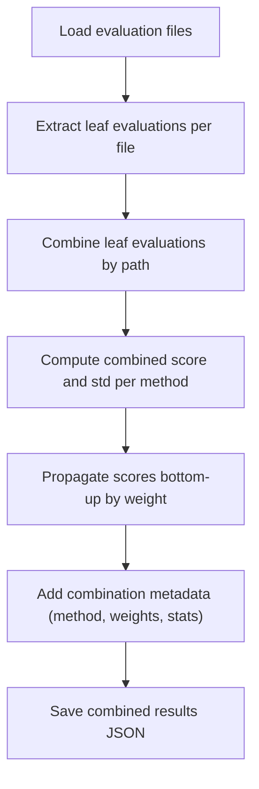
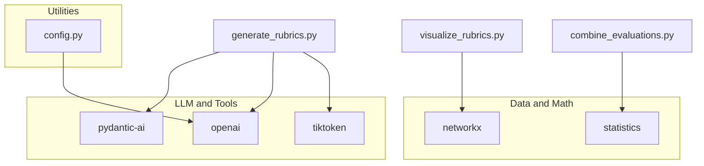

# Rubrics Visualization and Reporting

<cite>
**Referenced Files in This Document**
- [README.md](file://README.md)
- [requirements.txt](file://requirements.txt)
- [src/config.py](file://src/config.py)
- [src/utils.py](file://src/utils.py)
- [src/tools/docs_navigator.py](file://src/tools/docs_navigator.py)
- [src/rubrics_generator/visualize_rubrics.py](file://src/rubrics_generator/visualize_rubrics.py)
- [src/rubrics_generator/generate_rubrics.py](file://src/rubrics_generator/generate_rubrics.py)
- [src/judge/visualize_evaluation.py](file://src/judge/visualize_evaluation.py)
- [src/judge/combine_evaluations.py](file://src/judge/combine_evaluations.py)
- [src/run_rubrics_pipeline.sh](file://src/run_rubrics_pipeline.sh)
- [src/run_evaluation_pipeline.sh](file://src/run_evaluation_pipeline.sh)
- [examples/OpenHands/rubrics/combined_rubrics.json](file://examples/OpenHands/rubrics/combined_rubrics.json)
- [examples/OpenHands/rubrics/reliability_assessment.json](file://examples/OpenHands/rubrics/reliability_assessment.json)
- [examples/OpenHands/deepwiki/evaluation_results/combined_evaluation_results.json](file://examples/OpenHands/deepwiki/evaluation_results/combined_evaluation_results.json)
</cite>

## Table of Contents
1. [Introduction](#introduction)
2. [Project Structure](#project-structure)
3. [Core Components](#core-components)
4. [Architecture Overview](#architecture-overview)
5. [Detailed Component Analysis](#detailed-component-analysis)
6. [Dependency Analysis](#dependency-analysis)
7. [Performance Considerations](#performance-considerations)
8. [Troubleshooting Guide](#troubleshooting-guide)
9. [Conclusion](#conclusion)
10. [Appendices](#appendices)

## Introduction
This document explains the rubrics visualization and reporting systems used to interpret and communicate evaluation outcomes for documentation quality. It covers:
- Hierarchical rubric display via ASCII tree views
- Weight distribution analytics derived from rubric graphs
- Comparative analysis across multiple LLM evaluations
- Export formats (CSV, Markdown) and combined evaluation reports
- Practical examples and customization options for different stakeholder needs
- Integration with evaluation reporting systems for decision-making

The system is built around structured rubrics (JSON) and evaluation results (JSON), with scripts to generate, combine, and visualize outcomes.

## Project Structure
The repository organizes rubrics and evaluation artifacts under a data hierarchy, with scripts and tools supporting generation, combination, and visualization.

**Diagram sources**
- [examples/OpenHands/rubrics/combined_rubrics.json](file://examples/OpenHands/rubrics/combined_rubrics.json#L1-L494)
- [src/rubrics_generator/visualize_rubrics.py](file://src/rubrics_generator/visualize_rubrics.py#L1-L168)
- [examples/OpenHands/deepwiki/evaluation_results/combined_evaluation_results.json](file://examples/OpenHands/deepwiki/evaluation_results/combined_evaluation_results.json#L1-L782)
- [src/judge/visualize_evaluation.py](file://src/judge/visualize_evaluation.py#L1-L250)
- [src/judge/combine_evaluations.py](file://src/judge/combine_evaluations.py#L1-L375)
- [src/run_rubrics_pipeline.sh](file://src/run_rubrics_pipeline.sh#L1-L320)
- [src/run_evaluation_pipeline.sh](file://src/run_evaluation_pipeline.sh#L1-L331)
- [src/tools/docs_navigator.py](file://src/tools/docs_navigator.py#L1-L345)
- [src/utils.py](file://src/utils.py#L1-L86)
- [src/config.py](file://src/config.py#L1-L32)

**Section sources**
- [README.md](file://README.md#L1-L136)
- [src/run_rubrics_pipeline.sh](file://src/run_rubrics_pipeline.sh#L1-L320)
- [src/run_evaluation_pipeline.sh](file://src/run_evaluation_pipeline.sh#L1-L331)

## Core Components
- Rubric visualization and graph conversion: Converts hierarchical rubrics into NetworkX graphs and prints ASCII tree views.
- Evaluation visualization and export: Summarizes evaluation results, filters by score ranges, and exports to CSV and Markdown.
- Evaluation combination: Aggregates multiple LLM evaluations using configurable methods and computes weighted scores and standard deviations.
- Pipeline orchestration: Bash scripts to run generation, combination, and visualization steps.

Key responsibilities:
- Hierarchical tree display: ASCII art tree with weights and leaf indicators
- Weight distribution analytics: Counts of rubrics per weight level
- Comparative analysis: Filters and highlights low-scoring requirements
- Export formats: CSV and Markdown for downstream analysis and reporting
- Reliability assessment: Inter-model consistency metrics for rubric stability

**Section sources**
- [src/rubrics_generator/visualize_rubrics.py](file://src/rubrics_generator/visualize_rubrics.py#L1-L168)
- [src/judge/visualize_evaluation.py](file://src/judge/visualize_evaluation.py#L1-L250)
- [src/judge/combine_evaluations.py](file://src/judge/combine_evaluations.py#L1-L375)
- [examples/OpenHands/rubrics/combined_rubrics.json](file://examples/OpenHands/rubrics/combined_rubrics.json#L1-L494)
- [examples/OpenHands/deepwiki/evaluation_results/combined_evaluation_results.json](file://examples/OpenHands/deepwiki/evaluation_results/combined_evaluation_results.json#L1-L782)
- [examples/OpenHands/rubrics/reliability_assessment.json](file://examples/OpenHands/rubrics/reliability_assessment.json#L1-L19)

## Architecture Overview
The system comprises three main workflows:
- Rubric generation and visualization: LLM-driven rubrics generation, optional tool-assisted navigation, and ASCII tree visualization.
- Evaluation and reporting: Individual LLM evaluations, combination with statistical aggregation, and export to CSV/Markdown.
- Reliability assessment: Inter-model consistency metrics computed from multiple rubric generations.

**Diagram sources**
- [src/rubrics_generator/generate_rubrics.py](file://src/rubrics_generator/generate_rubrics.py#L1-L257)
- [src/rubrics_generator/visualize_rubrics.py](file://src/rubrics_generator/visualize_rubrics.py#L1-L168)
- [src/tools/docs_navigator.py](file://src/tools/docs_navigator.py#L1-L345)
- [src/utils.py](file://src/utils.py#L1-L86)
- [src/config.py](file://src/config.py#L1-L32)
- [src/judge/visualize_evaluation.py](file://src/judge/visualize_evaluation.py#L1-L250)
- [src/judge/combine_evaluations.py](file://src/judge/combine_evaluations.py#L1-L375)
- [examples/OpenHands/deepwiki/evaluation_results/combined_evaluation_results.json](file://examples/OpenHands/deepwiki/evaluation_results/combined_evaluation_results.json#L1-L782)
- [examples/OpenHands/rubrics/reliability_assessment.json](file://examples/OpenHands/rubrics/reliability_assessment.json#L1-L19)

## Detailed Component Analysis

### Hierarchical Tree Display and Weight Distribution Analytics
The rubric visualization component transforms a hierarchical rubric structure into a NetworkX directed graph and prints an ASCII tree. It also computes:
- Total nodes and edges
- Leaf nodes and root nodes
- Nodes with references
- Weight distribution counts
- Maximum depth per root

**Diagram sources**
- [src/rubrics_generator/visualize_rubrics.py](file://src/rubrics_generator/visualize_rubrics.py#L53-L127)

Practical example outputs:
- ASCII tree view with weights and indentation
- Weight distribution counts across rubrics
- Root and leaf node identification

Customization options:
- Adjust filtering by weight or leaf-only display
- Modify tree rendering style or export to richer formats

**Section sources**
- [src/rubrics_generator/visualize_rubrics.py](file://src/rubrics_generator/visualize_rubrics.py#L1-L168)
- [examples/OpenHands/rubrics/combined_rubrics.json](file://examples/OpenHands/rubrics/combined_rubrics.json#L1-L494)

### Evaluation Visualization and Export
The evaluation visualization component provides:
- Summary view: overall score, average leaf score, coverage percentage, and top-level category scores
- Detailed view: recursive traversal of rubric items with score thresholds
- Export to CSV and Markdown for external analysis

**Diagram sources**
- [src/judge/visualize_evaluation.py](file://src/judge/visualize_evaluation.py#L198-L248)
- [src/config.py](file://src/config.py#L19-L32)

Export formats:
- CSV: Flat representation of rubric items with path, requirement, score, weight, leaf indicator, and evaluation fields
- Markdown: Hierarchical report with emoji indicators and evaluation reasoning/evidence

Filtering and thresholds:
- Min/max score bounds to focus on underperforming areas
- Coverage metrics to highlight documentation gaps

**Section sources**
- [src/judge/visualize_evaluation.py](file://src/judge/visualize_evaluation.py#L1-L250)
- [examples/OpenHands/deepwiki/evaluation_results/combined_evaluation_results.json](file://examples/OpenHands/deepwiki/evaluation_results/combined_evaluation_results.json#L1-L782)

### Evaluation Combination and Statistical Reporting
The evaluation combination component aggregates multiple LLM evaluations:
- Extract leaf-level evaluations and paths
- Combine scores using average, majority vote, weighted average, max, or min
- Compute standard deviations and combined reasoning/evidence
- Bottom-up propagation of weighted scores and standard deviations

**Diagram sources**
- [src/judge/combine_evaluations.py](file://src/judge/combine_evaluations.py#L216-L375)

Metadata included:
- Combination method and weights
- Overall score and standard deviation
- Score range estimates
- Statistics from the rubric structure (items, depth, weight distribution)

**Section sources**
- [src/judge/combine_evaluations.py](file://src/judge/combine_evaluations.py#L1-L375)
- [examples/OpenHands/deepwiki/evaluation_results/combined_evaluation_results.json](file://examples/OpenHands/deepwiki/evaluation_results/combined_evaluation_results.json#L1-L782)

### Reliability Assessment
Inter-model consistency metrics quantify rubric stability across multiple LLMs:
- Semantic consistency scores
- Structural consistency scores
- Average and standard deviation across models
- Overall reliability score

These metrics guide stakeholders in interpreting rubric variability and trustworthiness.

**Section sources**
- [examples/OpenHands/rubrics/reliability_assessment.json](file://examples/OpenHands/rubrics/reliability_assessment.json#L1-L19)

### Pipeline Orchestration
Two orchestration scripts coordinate end-to-end workflows:
- Rubrics pipeline: generate rubrics per model, optionally combine, and visualize
- Evaluation pipeline: run evaluations per model, combine results, and visualize

Both scripts support:
- Model selection and batch sizes
- Tool usage toggles
- Retry and error handling
- Optional visualization post-processing

**Section sources**
- [src/run_rubrics_pipeline.sh](file://src/run_rubrics_pipeline.sh#L1-L320)
- [src/run_evaluation_pipeline.sh](file://src/run_evaluation_pipeline.sh#L1-L331)

## Dependency Analysis
External libraries and their roles:
- LLM integration and tooling: pydantic-ai, openai
- Data structures and math: networkx, statistics
- Utilities: tiktoken, python-dotenv

**Diagram sources**
- [requirements.txt](file://requirements.txt#L1-L107)
- [src/rubrics_generator/generate_rubrics.py](file://src/rubrics_generator/generate_rubrics.py#L1-L257)
- [src/rubrics_generator/visualize_rubrics.py](file://src/rubrics_generator/visualize_rubrics.py#L1-L168)
- [src/judge/combine_evaluations.py](file://src/judge/combine_evaluations.py#L1-L375)
- [src/config.py](file://src/config.py#L1-L32)

**Section sources**
- [requirements.txt](file://requirements.txt#L1-L107)

## Performance Considerations
- Token truncation: Responses are truncated to configured limits to prevent oversized tool outputs.
- Graph traversal: Tree rendering and statistics computation scale with rubric depth and breadth; consider pruning or sampling for very large rubrics.
- CSV export: Flattening nested rubrics can produce large files; filter by score ranges to reduce size.
- Standard deviation propagation: Bottom-up computation is linear in the number of leaf nodes plus internal nodes.

[No sources needed since this section provides general guidance]

## Troubleshooting Guide
Common issues and resolutions:
- Missing evaluation results: The visualization script falls back to individual model results or reports missing files.
- Unexpected JSON structure: The visualization script validates structure and reports errors.
- No combined results: The evaluation combination script requires at least two evaluation files to combine.
- Tool availability: Ensure docs tree and structured docs exist for tool-assisted generation.

Operational tips:
- Use the pipelines to automate generation, combination, and visualization.
- Narrow score ranges to focus on underperforming requirements.
- Verify environment variables for API keys and base URLs.

**Section sources**
- [src/judge/visualize_evaluation.py](file://src/judge/visualize_evaluation.py#L198-L248)
- [src/judge/combine_evaluations.py](file://src/judge/combine_evaluations.py#L216-L242)

## Conclusion
The rubrics visualization and reporting system provides a structured, repeatable workflow for:
- Understanding rubric hierarchies through ASCII tree displays and weight distributions
- Comparing evaluation outcomes across multiple LLMs with statistical aggregation
- Producing actionable reports in CSV and Markdown formats
- Quantifying inter-model reliability for rubric stability

These capabilities support informed decision-making by different stakeholders, from technical leads reviewing documentation quality to product managers evaluating system completeness.

[No sources needed since this section summarizes without analyzing specific files]

## Appendices

### Practical Examples and Customization Options
- ASCII tree view: Inspect rubric structure and weight distribution
- Summary view: Quick overview of overall performance and coverage
- Detailed view: Drill down into underperforming requirements with reasoning and evidence
- Export to CSV/Markdown: Shareable artifacts for stakeholder review
- Reliability metrics: Assess rubric stability across models

Integration points:
- Pipelines integrate with evaluation results and rubric generation outputs
- Configuration module centralizes API keys and model settings

**Section sources**
- [README.md](file://README.md#L88-L108)
- [src/run_rubrics_pipeline.sh](file://src/run_rubrics_pipeline.sh#L244-L265)
- [src/run_evaluation_pipeline.sh](file://src/run_evaluation_pipeline.sh#L287-L302)