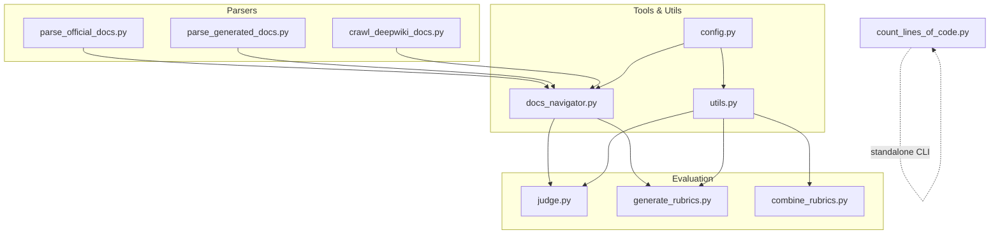
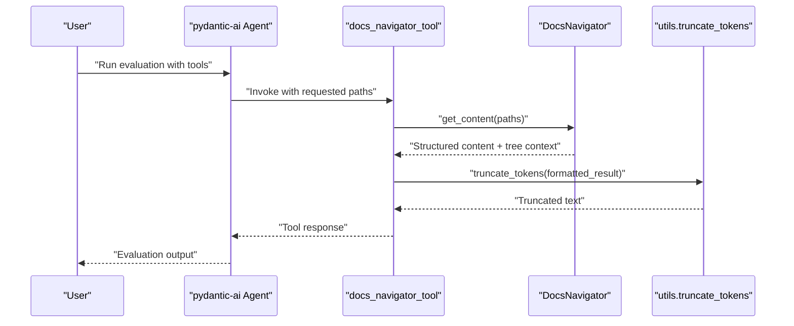
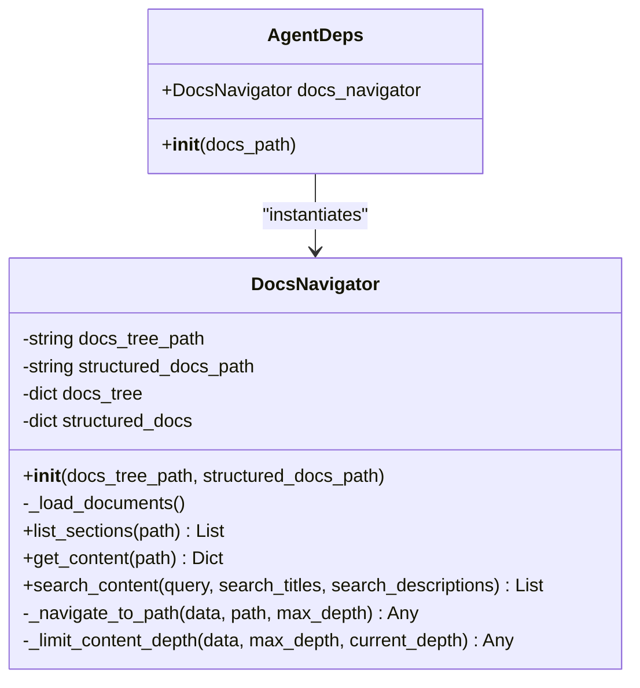
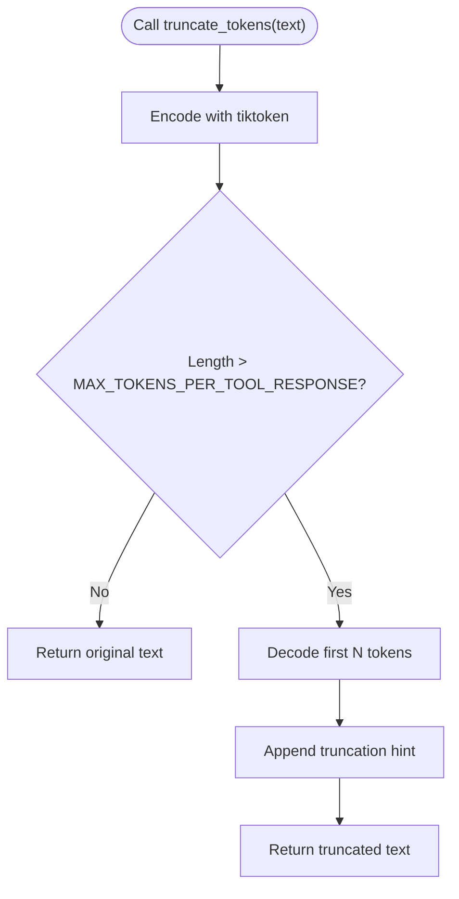
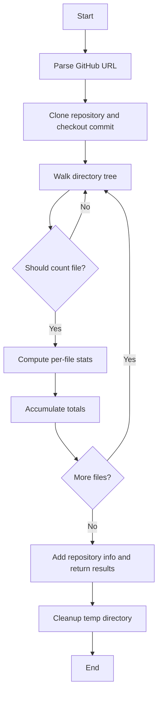
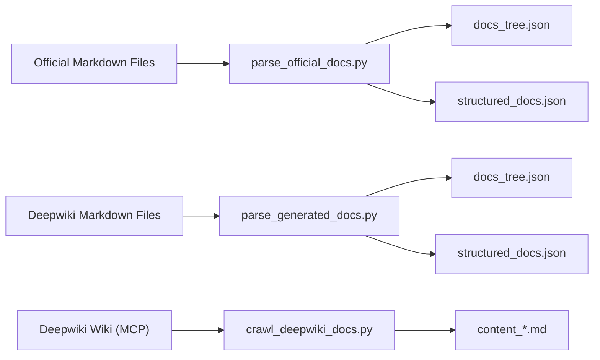
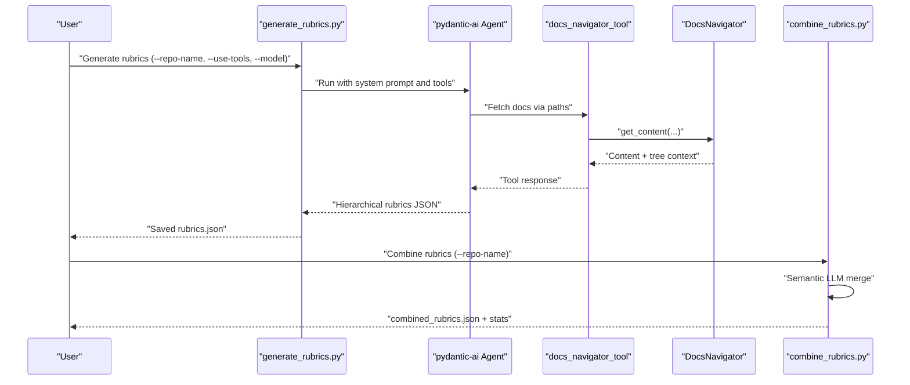
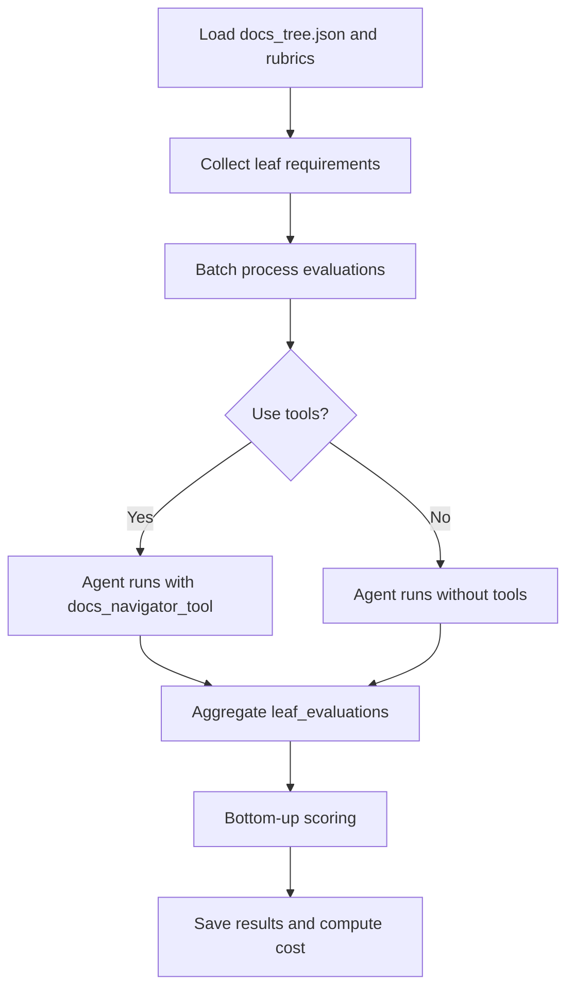
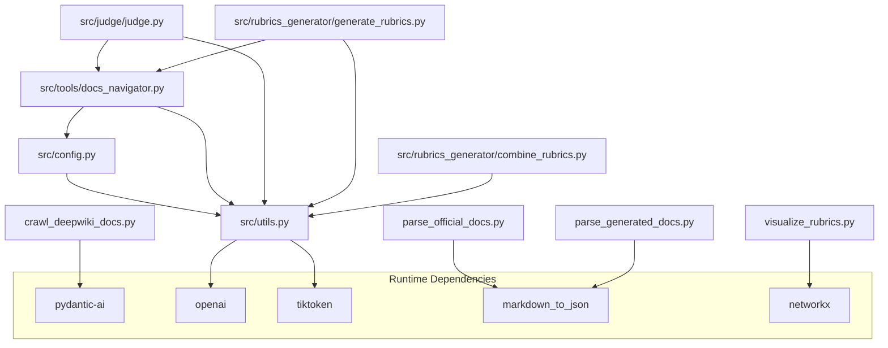

# Tools and Utilities

<cite>
**Referenced Files in This Document**
- [README.md](file://README.md)
- [count_lines_of_code.py](file://count_lines_of_code.py)
- [src/tools/docs_navigator.py](file://src/tools/docs_navigator.py)
- [src/utils.py](file://src/utils.py)
- [src/config.py](file://src/config.py)
- [src/docs_parser/parse_official_docs.py](file://src/docs_parser/parse_official_docs.py)
- [src/docs_parser/parse_generated_docs.py](file://src/docs_parser/parse_generated_docs.py)
- [src/docs_parser/crawl_deepwiki_docs.py](file://src/docs_parser/crawl_deepwiki_docs.py)
- [src/judge/judge.py](file://src/judge/judge.py)
- [src/rubrics_generator/generate_rubrics.py](file://src/rubrics_generator/generate_rubrics.py)
- [src/rubrics_generator/combine_rubrics.py](file://src/rubrics_generator/combine_rubrics.py)
- [requirements.txt](file://requirements.txt)
</cite>

## Table of Contents
1. [Introduction](#introduction)
2. [Project Structure](#project-structure)
3. [Core Components](#core-components)
4. [Architecture Overview](#architecture-overview)
5. [Detailed Component Analysis](#detailed-component-analysis)
6. [Dependency Analysis](#dependency-analysis)
7. [Performance Considerations](#performance-considerations)
8. [Troubleshooting Guide](#troubleshooting-guide)
9. [Conclusion](#conclusion)
10. [Appendices](#appendices)

## Introduction
This document explains the tools and utilities that power CodeWikiBench’s evaluation workflows. It focuses on:
- Intelligent document traversal and content retrieval via the DocsNavigator tool
- Utility functions for async LLM processing, token management, embeddings, and cost estimation
- Line-of-code counting for repository analysis and statistical reporting
- Practical usage patterns, configuration, and extension points

These utilities integrate tightly with the evaluation and rubrics-generation pipelines to support scalable, reproducible, and efficient benchmarking.

## Project Structure
The repository organizes functionality into:
- Tools and utilities for agent-driven document navigation and LLM orchestration
- Parser modules for transforming official and generated documentation into structured forms
- Judge and rubrics generator modules for evaluation and rubric synthesis
- A standalone CLI for counting lines of code across repositories

**Diagram sources**
- [src/tools/docs_navigator.py](file://src/tools/docs_navigator.py#L1-L345)
- [src/utils.py](file://src/utils.py#L1-L86)
- [src/config.py](file://src/config.py#L1-L32)
- [src/docs_parser/parse_official_docs.py](file://src/docs_parser/parse_official_docs.py#L1-L367)
- [src/docs_parser/parse_generated_docs.py](file://src/docs_parser/parse_generated_docs.py#L1-L323)
- [src/docs_parser/crawl_deepwiki_docs.py](file://src/docs_parser/crawl_deepwiki_docs.py#L1-L335)
- [src/judge/judge.py](file://src/judge/judge.py#L1-L551)
- [src/rubrics_generator/generate_rubrics.py](file://src/rubrics_generator/generate_rubrics.py#L1-L257)
- [src/rubrics_generator/combine_rubrics.py](file://src/rubrics_generator/combine_rubrics.py#L1-L306)
- [count_lines_of_code.py](file://count_lines_of_code.py#L1-L331)

**Section sources**
- [README.md](file://README.md#L1-L136)

## Core Components
- DocsNavigator: Loads and navigates structured documentation trees, retrieves content along specified paths, and supports search across titles, descriptions, and content.
- Utility functions: Async LLM invocation, token truncation, embeddings, and configuration-driven model selection.
- Line-of-code counter: Clones repositories, filters files by type and exclusion rules, and computes totals, code, comments, and blank lines.
- Parser modules: Transform official and generated documentation into docs_tree.json and structured_docs.json for downstream evaluation.

**Section sources**
- [src/tools/docs_navigator.py](file://src/tools/docs_navigator.py#L11-L345)
- [src/utils.py](file://src/utils.py#L10-L86)
- [count_lines_of_code.py](file://count_lines_of_code.py#L18-L331)
- [src/docs_parser/parse_official_docs.py](file://src/docs_parser/parse_official_docs.py#L16-L327)
- [src/docs_parser/parse_generated_docs.py](file://src/docs_parser/parse_generated_docs.py#L15-L312)
- [src/docs_parser/crawl_deepwiki_docs.py](file://src/docs_parser/crawl_deepwiki_docs.py#L291-L334)

## Architecture Overview
The evaluation pipeline integrates parsers, tools, and LLM agents to produce rubrics and evaluation results. The DocsNavigator tool is registered as a pydantic-ai Tool and invoked by agents to fetch targeted documentation segments.

**Diagram sources**
- [src/judge/judge.py](file://src/judge/judge.py#L476-L491)
- [src/tools/docs_navigator.py](file://src/tools/docs_navigator.py#L261-L285)
- [src/utils.py](file://src/utils.py#L12-L26)

## Detailed Component Analysis

### DocsNavigator: Intelligent Document Traversal and Retrieval
- Responsibilities:
  - Load docs_tree.json and structured_docs.json
  - List sections at a given path (including subpages and content sections)
  - Retrieve content for a path and return both content and tree context
  - Search across titles, descriptions, and content with configurable matching
  - Navigate and limit content depth to control token usage
- Key APIs:
  - list_sections(path): returns section metadata for UI or navigation
  - get_content(path): returns content and tree structure for the path
  - search_content(query, search_titles, search_descriptions): returns matches with previews
  - Internal helpers: _navigate_to_path, _limit_content_depth
- Tool registration:
  - run_docs_navigator: async tool wrapper for pydantic-ai
  - docs_navigator_tool: Tool definition with description and function
  - AgentDeps: resolves paths and instantiates DocsNavigator

**Diagram sources**
- [src/tools/docs_navigator.py](file://src/tools/docs_navigator.py#L11-L345)

**Section sources**
- [src/tools/docs_navigator.py](file://src/tools/docs_navigator.py#L17-L345)

### Utility Functions: Async LLM Processing, Token Management, Embeddings
- truncate_tokens(text): Encodes with tiktoken, checks against MAX_TOKENS_PER_TOOL_RESPONSE, truncates and appends a hint
- get_llm(model): Builds an OpenAIChatModel with provider settings from config
- run_llm_natively(model, prompt/messages): Async native chat completion via openai.AsyncOpenAI
- get_embeddings(texts): Async embeddings via openai.AsyncOpenAI
- Configuration:
  - API_KEY, MODEL, BASE_URL, EMBEDDING_MODEL, MAX_TOKENS_PER_TOOL_RESPONSE
  - get_project_path, get_data_path helpers

**Diagram sources**
- [src/utils.py](file://src/utils.py#L12-L26)
- [src/config.py](file://src/config.py#L27-L28)

**Section sources**
- [src/utils.py](file://src/utils.py#L10-L86)
- [src/config.py](file://src/config.py#L14-L28)

### Line-of-Code Counter: Repository Analysis and Statistics
- Capabilities:
  - Parse GitHub URL (HTTPS/SSH), clone repository, checkout commit
  - Filter files by known source extensions, exclude binary/media, and common directories
  - Compute per-file stats: total, code, comments, blank lines
  - Aggregate totals and file breakdown
  - Cleanup temporary directories
- CLI usage:
  - python3 count_lines_of_code.py <github_url> <commit_id> [--verbose]

**Diagram sources**
- [count_lines_of_code.py](file://count_lines_of_code.py#L249-L282)

**Section sources**
- [count_lines_of_code.py](file://count_lines_of_code.py#L18-L331)

### Parser Modules: Structuring Documentation Trees
- Official docs parser:
  - Converts markdown to structured JSON, replaces SVG references, cleans “On this page” sections
  - Generates docs_tree.json (key-only tree) and structured_docs.json
- Generated docs parser:
  - Parses deepwiki markdown files, builds nested structure from indices, writes docs_tree.json and structured_docs.json
- Deepwiki crawler:
  - Connects to MCP server, pulls wiki structure and content, saves as markdown files

**Diagram sources**
- [src/docs_parser/parse_official_docs.py](file://src/docs_parser/parse_official_docs.py#L230-L327)
- [src/docs_parser/parse_generated_docs.py](file://src/docs_parser/parse_generated_docs.py#L155-L312)
- [src/docs_parser/crawl_deepwiki_docs.py](file://src/docs_parser/crawl_deepwiki_docs.py#L291-L334)

**Section sources**
- [src/docs_parser/parse_official_docs.py](file://src/docs_parser/parse_official_docs.py#L16-L327)
- [src/docs_parser/parse_generated_docs.py](file://src/docs_parser/parse_generated_docs.py#L15-L312)
- [src/docs_parser/crawl_deepwiki_docs.py](file://src/docs_parser/crawl_deepwiki_docs.py#L291-L334)

### Rubrics Generation and Combination
- generate_rubrics.py:
  - Builds hierarchical rubrics from docs_tree.json using an agent with or without DocsNavigator tool
  - Saves model-specific rubrics and visualizes structure
- combine_rubrics.py:
  - Loads multiple rubrics, merges them using semantic LLM analysis, and produces combined_rubrics.json with statistics

**Diagram sources**
- [src/rubrics_generator/generate_rubrics.py](file://src/rubrics_generator/generate_rubrics.py#L169-L254)
- [src/rubrics_generator/combine_rubrics.py](file://src/rubrics_generator/combine_rubrics.py#L22-L303)
- [src/tools/docs_navigator.py](file://src/tools/docs_navigator.py#L261-L285)

**Section sources**
- [src/rubrics_generator/generate_rubrics.py](file://src/rubrics_generator/generate_rubrics.py#L169-L257)
- [src/rubrics_generator/combine_rubrics.py](file://src/rubrics_generator/combine_rubrics.py#L173-L303)

### Evaluation Workflow Integration
- judge.py:
  - Loads docs_tree.json and rubrics, collects leaf requirements, evaluates in batches
  - Optionally uses DocsNavigator tool to retrieve relevant content
  - Calculates retry statistics and estimated cost based on tokens

**Diagram sources**
- [src/judge/judge.py](file://src/judge/judge.py#L434-L544)

**Section sources**
- [src/judge/judge.py](file://src/judge/judge.py#L434-L544)

## Dependency Analysis
- Runtime dependencies include pydantic-ai, openai, tiktoken, and markdown-to-json among others.
- Tools depend on utils for tokenization and LLM configuration, and on config for environment variables.
- Parser outputs feed into DocsNavigator and evaluation components.

**Diagram sources**
- [requirements.txt](file://requirements.txt#L1-L107)
- [src/utils.py](file://src/utils.py#L1-L86)
- [src/config.py](file://src/config.py#L1-L32)
- [src/tools/docs_navigator.py](file://src/tools/docs_navigator.py#L1-L9)
- [src/judge/judge.py](file://src/judge/judge.py#L16-L19)
- [src/rubrics_generator/generate_rubrics.py](file://src/rubrics_generator/generate_rubrics.py#L7-L12)
- [src/rubrics_generator/combine_rubrics.py](file://src/rubrics_generator/combine_rubrics.py#L9-L11)
- [src/docs_parser/parse_official_docs.py](file://src/docs_parser/parse_official_docs.py#L4-L7)
- [src/docs_parser/parse_generated_docs.py](file://src/docs_parser/parse_generated_docs.py#L3-L6)
- [src/docs_parser/crawl_deepwiki_docs.py](file://src/docs_parser/crawl_deepwiki_docs.py#L8-L10)
- [src/rubrics_generator/visualize_rubrics.py](file://src/rubrics_generator/visualize_rubrics.py#L1-L6)

**Section sources**
- [requirements.txt](file://requirements.txt#L1-L107)

## Performance Considerations
- Token management:
  - Use truncate_tokens to cap tool responses and prevent oversized payloads
  - Tune MAX_TOKENS_PER_TOOL_RESPONSE in config to balance content depth vs. cost
- Batch processing:
  - Adjust batch_size in evaluation to respect rate limits and reduce latency
- Content depth limiting:
  - DocsNavigator limits returned content depth to control token usage; adjust max_depth as needed
- File filtering:
  - Line counter excludes binaries and common directories to reduce I/O overhead
- Embeddings:
  - Use get_embeddings for semantic tasks; cache results where feasible to reduce repeated calls

[No sources needed since this section provides general guidance]

## Troubleshooting Guide
- DocsNavigator errors:
  - FileNotFoundError for missing docs_tree.json or structured_docs.json
  - JSONDecodeError for malformed JSON files
  - KeyError/IndexError for invalid navigation paths
- Tool response truncation:
  - If content is truncated, try narrower paths or increase MAX_TOKENS_PER_TOOL_RESPONSE cautiously
- LLM rate limits:
  - Evaluation handles 429 and rate-limit indicators with delays; consider reducing batch_size or adding backoff
- Parser failures:
  - SVG replacement warnings and markdown-to-JSON fallbacks; verify input markdown validity
- Line counter failures:
  - Git clone/checkout errors; verify URL format and commit ID

**Section sources**
- [src/tools/docs_navigator.py](file://src/tools/docs_navigator.py#L39-L42)
- [src/judge/judge.py](file://src/judge/judge.py#L322-L332)
- [src/docs_parser/parse_official_docs.py](file://src/docs_parser/parse_official_docs.py#L133-L135)
- [count_lines_of_code.py](file://count_lines_of_code.py#L110-L113)

## Conclusion
The tools and utilities in CodeWikiBench provide a cohesive foundation for documentation parsing, intelligent traversal, rubrics generation, and evaluation. By leveraging DocsNavigator, utility functions, and the line-of-code counter, the system achieves scalability, reproducibility, and efficiency across diverse repositories and documentation sources.

[No sources needed since this section summarizes without analyzing specific files]

## Appendices

### Practical Usage Examples and Integration Patterns
- Use DocsNavigator to retrieve targeted documentation segments for evaluation prompts
- Integrate run_llm_natively for lightweight synchronous completions when not using pydantic-ai agents
- Employ get_embeddings for semantic tasks such as clustering or similarity analysis
- Run count_lines_of_code to gather repository metrics prior to evaluation

**Section sources**
- [src/tools/docs_navigator.py](file://src/tools/docs_navigator.py#L261-L285)
- [src/utils.py](file://src/utils.py#L48-L82)
- [README.md](file://README.md#L110-L120)

### Configuration and Parameter Tuning
- Environment variables:
  - API_KEY, MODEL, BASE_URL, EMBEDDING_MODEL
  - MAX_TOKENS_PER_TOOL_RESPONSE controls truncation threshold
- Paths:
  - get_project_path and get_data_path resolve project-relative paths for data and artifacts

**Section sources**
- [src/config.py](file://src/config.py#L14-L28)
- [src/config.py](file://src/config.py#L19-L25)

### Extension Possibilities
- Extend DocsNavigator with richer search filters (regex, metadata fields)
- Add caching layers for parsed docs_tree.json and structured_docs.json
- Introduce cost estimation hooks around tool usage and LLM calls
- Expand parsers to support additional documentation formats (e.g., reStructuredText)

[No sources needed since this section provides general guidance]