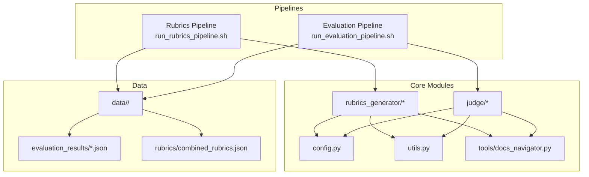
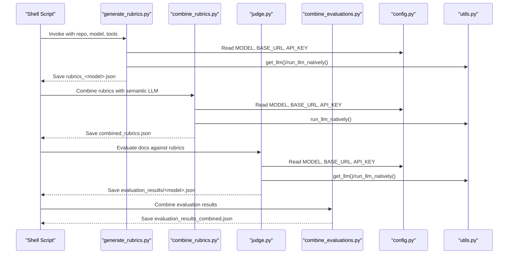
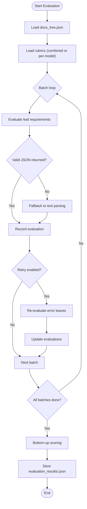
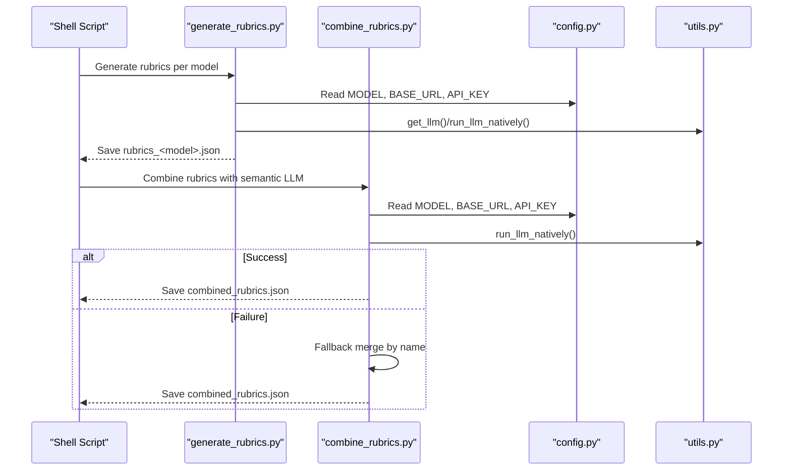
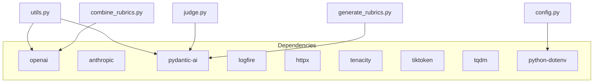

# Troubleshooting and FAQ

<cite>
**Referenced Files in This Document**
- [README.md](file://README.md)
- [requirements.txt](file://requirements.txt)
- [src/config.py](file://src/config.py)
- [src/utils.py](file://src/utils.py)
- [src/run_evaluation_pipeline.sh](file://src/run_evaluation_pipeline.sh)
- [src/run_rubrics_pipeline.sh](file://src/run_rubrics_pipeline.sh)
- [src/judge/judge.py](file://src/judge/judge.py)
- [src/judge/combine_evaluations.py](file://src/judge/combine_evaluations.py)
- [src/rubrics_generator/generate_rubrics.py](file://src/rubrics_generator/generate_rubrics.py)
- [src/rubrics_generator/combine_rubrics.py](file://src/rubrics_generator/combine_rubrics.py)
- [src/tools/docs_navigator.py](file://src/tools/docs_navigator.py)
- [count_lines_of_code.py](file://count_lines_of_code.py)
- [examples/OpenHands/codewiki/evaluation_results/gemini-2.5-flash.json](file://examples/OpenHands/codewiki/evaluation_results/gemini-2.5-flash.json)
</cite>

## Table of Contents
1. [Introduction](#introduction)
2. [Project Structure](#project-structure)
3. [Core Components](#core-components)
4. [Architecture Overview](#architecture-overview)
5. [Detailed Component Analysis](#detailed-component-analysis)
6. [Dependency Analysis](#dependency-analysis)
7. [Performance Considerations](#performance-considerations)
8. [Troubleshooting Guide](#troubleshooting-guide)
9. [Conclusion](#conclusion)
10. [Appendices](#appendices)

## Introduction
This document provides a comprehensive troubleshooting and FAQ guide for CodeWikiBench. It focuses on diagnosing and resolving common issues encountered during evaluation and rubrics generation, including API authentication failures, rate limiting, memory constraints, and pipeline errors. It also explains debugging techniques, log analysis, optimization strategies for batch sizing and model selection, and cost-aware error recovery mechanisms. Practical solutions are provided for network connectivity, file permissions, and configuration errors, with a strong emphasis on how configuration parameters relate to failure modes.

## Project Structure
CodeWikiBench is organized around two primary pipelines:
- Rubrics generation pipeline: Generates hierarchical rubrics from documentation using multiple LLMs, then combines them.
- Evaluation pipeline: Evaluates documentation against rubrics using multiple LLMs, aggregates results, and visualizes outcomes.

Key directories and files:
- src/config.py: Central configuration for API keys, model names, base URLs, and token limits.
- src/utils.py: LLM client initialization, async completions, embeddings, and token truncation utilities.
- src/run_rubrics_pipeline.sh: Orchestrates rubrics generation and combination.
- src/run_evaluation_pipeline.sh: Orchestrates evaluation, result combination, and visualization.
- src/rubrics_generator/*: Rubrics generation and combination logic.
- src/judge/*: Evaluation engine, batching, retry logic, and result aggregation.
- src/tools/docs_navigator.py: Tool for navigating and extracting content from parsed documentation.
- examples/.../evaluation_results/*.json: Sample evaluation outputs demonstrating structure and scoring.

**Diagram sources**
- [src/run_rubrics_pipeline.sh](file://src/run_rubrics_pipeline.sh#L1-L320)
- [src/run_evaluation_pipeline.sh](file://src/run_evaluation_pipeline.sh#L1-L331)
- [src/config.py](file://src/config.py#L1-L32)
- [src/utils.py](file://src/utils.py#L1-L86)
- [src/tools/docs_navigator.py](file://src/tools/docs_navigator.py#L1-L345)
- [src/rubrics_generator/generate_rubrics.py](file://src/rubrics_generator/generate_rubrics.py#L1-L257)
- [src/rubrics_generator/combine_rubrics.py](file://src/rubrics_generator/combine_rubrics.py#L1-L306)
- [src/judge/judge.py](file://src/judge/judge.py#L1-L551)
- [src/judge/combine_evaluations.py](file://src/judge/combine_evaluations.py#L1-L375)

**Section sources**
- [README.md](file://README.md#L1-L136)
- [src/run_rubrics_pipeline.sh](file://src/run_rubrics_pipeline.sh#L1-L320)
- [src/run_evaluation_pipeline.sh](file://src/run_evaluation_pipeline.sh#L1-L331)

## Core Components
- Configuration and environment:
  - API keys, base URLs, model names, and token limits are centralized in config.py and consumed by utilities and pipelines.
- LLM utilities:
  - Async clients, chat completions, embeddings, and token truncation ensure safe payload sizes.
- Tools:
  - docs_navigator provides navigation and content extraction from structured docs and tree.
- Pipelines:
  - Rubrics pipeline generates rubrics per model, then combines them.
  - Evaluation pipeline evaluates docs against rubrics, supports batching and retries, and combines results.

**Section sources**
- [src/config.py](file://src/config.py#L1-L32)
- [src/utils.py](file://src/utils.py#L1-L86)
- [src/tools/docs_navigator.py](file://src/tools/docs_navigator.py#L1-L345)
- [src/run_rubrics_pipeline.sh](file://src/run_rubrics_pipeline.sh#L1-L320)
- [src/run_evaluation_pipeline.sh](file://src/run_evaluation_pipeline.sh#L1-L331)

## Architecture Overview
The system integrates shell orchestration, Python modules, and LLM providers. The rubrics pipeline produces rubrics that feed the evaluation pipeline. Both pipelines rely on configuration and utilities for LLM access and token handling.

**Diagram sources**
- [src/run_rubrics_pipeline.sh](file://src/run_rubrics_pipeline.sh#L168-L242)
- [src/rubrics_generator/generate_rubrics.py](file://src/rubrics_generator/generate_rubrics.py#L170-L254)
- [src/rubrics_generator/combine_rubrics.py](file://src/rubrics_generator/combine_rubrics.py#L232-L306)
- [src/run_evaluation_pipeline.sh](file://src/run_evaluation_pipeline.sh#L196-L242)
- [src/judge/judge.py](file://src/judge/judge.py#L435-L548)
- [src/judge/combine_evaluations.py](file://src/judge/combine_evaluations.py#L244-L375)
- [src/config.py](file://src/config.py#L14-L17)
- [src/utils.py](file://src/utils.py#L28-L82)

## Detailed Component Analysis

### Evaluation Pipeline: Troubleshooting and Optimization
Common issues and resolutions:
- API authentication failures:
  - Symptoms: 401/403 responses, generic provider errors, or immediate rejection.
  - Causes: Incorrect API_KEY, wrong BASE_URL/provider mismatch, or missing environment variables.
  - Resolution: Verify environment variables and ensure BASE_URL matches the provider endpoint. Confirm MODEL is supported by the provider.
- Rate limiting:
  - Symptoms: 429 responses, throttled requests, or long delays.
  - Causes: Provider rate limits exceeded.
  - Resolution: The evaluator detects rate-limit indicators and adds a delay; reduce batch size or increase delays between batches.
- JSON parsing and output formatting:
  - Symptoms: "[AUTOMATIC PARSING FALLBACK]" or "[PARSING ERROR]" in reasoning.
  - Causes: LLM output not in expected JSON format.
  - Resolution: Increase max retries, adjust system prompts, or enable tools to guide the model to return structured JSON.
- Batch size and concurrency:
  - Symptoms: Out-of-memory errors, timeouts, or degraded throughput.
  - Causes: Too many concurrent evaluations per batch.
  - Resolution: Lower batch size; the pipeline supports dynamic batching and staggered delays between batches.
- Retry and error recovery:
  - The pipeline identifies error leaves and retries with stricter prompts; after max retries, falls back to text analysis.

**Diagram sources**
- [src/judge/judge.py](file://src/judge/judge.py#L242-L384)
- [src/judge/judge.py](file://src/judge/judge.py#L386-L432)
- [src/judge/judge.py](file://src/judge/judge.py#L435-L548)

**Section sources**
- [src/judge/judge.py](file://src/judge/judge.py#L1-L551)
- [src/run_evaluation_pipeline.sh](file://src/run_evaluation_pipeline.sh#L196-L242)

### Rubrics Generation Pipeline: Troubleshooting and Optimization
Common issues and resolutions:
- LLM response parsing:
  - Symptoms: "No valid JSON rubrics found in output".
  - Causes: Model did not return structured JSON; tool usage may be required.
  - Resolution: Enable tools (--use-tools) and adjust system prompts; save raw output for inspection.
- Semantic combination failures:
  - Symptoms: API call failures or malformed JSON.
  - Causes: Provider API instability or response format mismatches.
  - Resolution: Retries with exponential backoff; on failure, falls back to simple merge by deduplicating rubric names.
- Cost and latency:
  - Resolution: Adjust temperature and model; reduce number of models or combine fewer sets.

**Diagram sources**
- [src/run_rubrics_pipeline.sh](file://src/run_rubrics_pipeline.sh#L168-L242)
- [src/rubrics_generator/generate_rubrics.py](file://src/rubrics_generator/generate_rubrics.py#L170-L254)
- [src/rubrics_generator/combine_rubrics.py](file://src/rubrics_generator/combine_rubrics.py#L22-L151)
- [src/config.py](file://src/config.py#L14-L17)
- [src/utils.py](file://src/utils.py#L48-L82)

**Section sources**
- [src/rubrics_generator/generate_rubrics.py](file://src/rubrics_generator/generate_rubrics.py#L1-L257)
- [src/rubrics_generator/combine_rubrics.py](file://src/rubrics_generator/combine_rubrics.py#L1-L306)
- [src/run_rubrics_pipeline.sh](file://src/run_rubrics_pipeline.sh#L1-L320)

### Tools: Documentation Navigation
Common issues and resolutions:
- Missing docs_tree.json or structured_docs.json:
  - Symptoms: FileNotFoundError for docs_tree.json or structured_docs.json.
  - Causes: Parsing step not executed or incorrect paths.
  - Resolution: Run parsing steps first; ensure data directories exist and contain required files.
- Content depth and truncation:
  - The navigator limits content depth; if results seem truncated, increase allowed depth or adjust truncation logic.

**Section sources**
- [src/tools/docs_navigator.py](file://src/tools/docs_navigator.py#L250-L258)
- [src/tools/docs_navigator.py](file://src/tools/docs_navigator.py#L182-L241)

### Utilities: LLM Clients and Token Limits
Common issues and resolutions:
- Token limit exceeded:
  - Symptoms: Responses truncated with a note indicating truncation.
  - Causes: Tool response exceeds MAX_TOKENS_PER_TOOL_RESPONSE.
  - Resolution: Reduce input size or increase truncation tolerance; consider adjusting MAX_TOKENS_PER_TOOL_RESPONSE.
- Timeout and provider errors:
  - Symptoms: Timeouts or provider exceptions.
  - Resolution: Adjust timeout settings in utils; ensure BASE_URL and API_KEY are correct.

**Section sources**
- [src/utils.py](file://src/utils.py#L12-L26)
- [src/utils.py](file://src/utils.py#L28-L62)
- [src/utils.py](file://src/utils.py#L72-L82)
- [src/config.py](file://src/config.py#L27-L28)

## Dependency Analysis
External dependencies relevant to troubleshooting:
- openai, anthropic, pydantic-ai, logfire, httpx, tenacity, tiktoken, tqdm, python-dotenv.
- Issues often arise from misconfigured environment variables or incompatible provider endpoints.

**Diagram sources**
- [requirements.txt](file://requirements.txt#L1-L107)
- [src/utils.py](file://src/utils.py#L1-L8)
- [src/judge/judge.py](file://src/judge/judge.py#L16-L19)
- [src/rubrics_generator/generate_rubrics.py](file://src/rubrics_generator/generate_rubrics.py#L7-L12)
- [src/rubrics_generator/combine_rubrics.py](file://src/rubrics_generator/combine_rubrics.py#L9-L11)
- [src/config.py](file://src/config.py#L1-L8)

**Section sources**
- [requirements.txt](file://requirements.txt#L1-L107)

## Performance Considerations
- Batch size tuning:
  - Reduce batch size to mitigate memory pressure and improve stability; the evaluation pipeline already staggers batches with small delays.
- Model selection:
  - Prefer smaller models for initial passes; use larger models for final rubrics generation or targeted tasks.
- Resource allocation:
  - Ensure sufficient CPU/RAM for concurrent LLM calls; monitor provider quotas and throttle accordingly.
- Cost optimization:
  - Use lower temperature for deterministic outputs; reuse rubrics where possible; combine fewer models initially.
- Timeout handling:
  - Increase timeouts for long-running operations; implement retry with exponential backoff.
- Error recovery:
  - Enable retries and re-evaluation of error leaves; leverage combination methods to smooth out variability.

[No sources needed since this section provides general guidance]

## Troubleshooting Guide

### API Authentication Failures
Symptoms:
- Immediate provider errors or 401/403 responses.
Causes:
- Incorrect API_KEY, wrong BASE_URL, or unsupported MODEL.
Resolutions:
- Verify environment variables and ensure BASE_URL matches the provider endpoint.
- Confirm MODEL is available and compatible with the selected provider.
- Check provider console for quota and billing status.

**Section sources**
- [src/config.py](file://src/config.py#L14-L17)
- [src/utils.py](file://src/utils.py#L28-L46)

### Rate Limiting Issues
Symptoms:
- 429 responses or long delays between requests.
Causes:
- Provider rate limits exceeded.
Resolutions:
- Reduce batch size and increase inter-request delays.
- The evaluator detects rate-limit indicators and adds a delay; consider lowering concurrency.

**Section sources**
- [src/judge/judge.py](file://src/judge/judge.py#L322-L332)
- [src/run_evaluation_pipeline.sh](file://src/run_evaluation_pipeline.sh#L219-L232)

### Memory Constraints
Symptoms:
- Out-of-memory errors or slow performance.
Causes:
- High batch size or large tool responses.
Resolutions:
- Decrease batch size; ensure token limits are respected; truncate long tool outputs.

**Section sources**
- [src/judge/judge.py](file://src/judge/judge.py#L334-L363)
- [src/utils.py](file://src/utils.py#L12-L26)

### Evaluation Pipeline Errors
Symptoms:
- "[AUTOMATIC PARSING FALLBACK]", "[PARSING ERROR]", or "[EVALUATION ERROR]".
Causes:
- LLM output not in expected JSON format.
Resolutions:
- Increase max retries; enable tools to guide structured output; inspect raw outputs for debugging.

**Section sources**
- [src/judge/judge.py](file://src/judge/judge.py#L97-L240)
- [src/judge/judge.py](file://src/judge/judge.py#L282-L332)

### Rubrics Generation Failures
Symptoms:
- "No valid JSON rubrics found in output" or semantic combination failures.
Causes:
- Model did not return structured JSON or provider API issues.
Resolutions:
- Enable tools; adjust prompts; on failure, fallback merge is automatic.

**Section sources**
- [src/rubrics_generator/generate_rubrics.py](file://src/rubrics_generator/generate_rubrics.py#L218-L250)
- [src/rubrics_generator/combine_rubrics.py](file://src/rubrics_generator/combine_rubrics.py#L97-L151)

### Network Connectivity Issues
Symptoms:
- Timeouts, DNS failures, or intermittent connectivity.
Causes:
- Unstable internet or blocked endpoints.
Resolutions:
- Verify BASE_URL accessibility; test connectivity; retry with exponential backoff.

**Section sources**
- [src/utils.py](file://src/utils.py#L48-L62)
- [src/rubrics_generator/combine_rubrics.py](file://src/rubrics_generator/combine_rubrics.py#L141-L148)

### File Permission Problems
Symptoms:
- "FileNotFoundError" for docs_tree.json or structured_docs.json.
Causes:
- Missing or inaccessible data directories.
Resolutions:
- Ensure parsing steps ran successfully; confirm file paths and permissions.

**Section sources**
- [src/tools/docs_navigator.py](file://src/tools/docs_navigator.py#L250-L258)

### Configuration Errors
Symptoms:
- Unexpected behavior or missing environment variables.
Causes:
- Missing or incorrect API_KEY, MODEL, BASE_URL, or EMBEDDING_MODEL.
Resolutions:
- Set environment variables; verify .env file presence; reload configuration.

**Section sources**
- [src/config.py](file://src/config.py#L1-L32)

### Timeout Handling and Error Recovery
Mechanisms:
- Retries with exponential backoff for rubrics generation.
- Rate-limit detection and delay in evaluation.
- Re-evaluation of error leaves with stricter prompts.

**Section sources**
- [src/rubrics_generator/combine_rubrics.py](file://src/rubrics_generator/combine_rubrics.py#L97-L148)
- [src/judge/judge.py](file://src/judge/judge.py#L322-L332)
- [src/judge/judge.py](file://src/judge/judge.py#L97-L240)

### Relationship Between Configuration Parameters and Failure Modes
- API_KEY and BASE_URL:
  - Incorrect values lead to authentication and connectivity failures.
- MODEL:
  - Unsupported or incompatible model causes provider errors.
- MAX_TOKENS_PER_TOOL_RESPONSE:
  - Exceeding this limit results in truncated tool outputs.
- Batch size:
  - Larger batches increase memory usage and risk timeouts.
- Temperature:
  - Higher values may produce less structured outputs, affecting rubrics generation.

**Section sources**
- [src/config.py](file://src/config.py#L14-L28)
- [src/utils.py](file://src/utils.py#L12-L26)
- [src/judge/judge.py](file://src/judge/judge.py#L28-L46)

## Conclusion
By aligning configuration parameters with provider capabilities, tuning batch sizes, leveraging retries and error recovery, and monitoring token usage, most issues in CodeWikiBench can be resolved efficiently. Use the provided diagnostics and optimization strategies to maintain stable pipelines and accurate evaluations.

[No sources needed since this section summarizes without analyzing specific files]

## Appendices

### Quick Reference: Common Commands and Outputs
- Rubrics pipeline:
  - bash ./run_rubrics_pipeline.sh --repo-name <name> --models <model1,model2> --visualize
- Evaluation pipeline:
  - bash ./run_evaluation_pipeline.sh --repo-name <name> --reference <ref> --models <model1> --batch-size <N> --visualize
- Example evaluation result structure:
  - See examples/OpenHands/codewiki/evaluation_results/gemini-2.5-flash.json for scoring and evaluation metadata.

**Section sources**
- [README.md](file://README.md#L73-L108)
- [examples/OpenHands/codewiki/evaluation_results/gemini-2.5-flash.json](file://examples/OpenHands/codewiki/evaluation_results/gemini-2.5-flash.json#L1-L120)